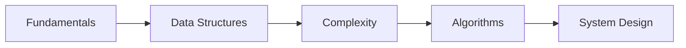
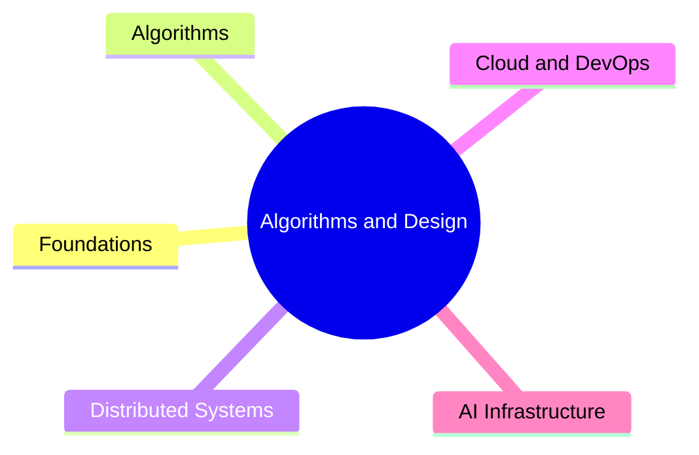

Intuitively learn algorithms and system design for your interviews and sanity.


  
  
  
  
  


### Disclaimer

This book contains condensed compilations, summaries, notes, and illustrations that the author used, created, or referenced from various sources to aid you—and the author primarily—in learning algorithms and system design.
