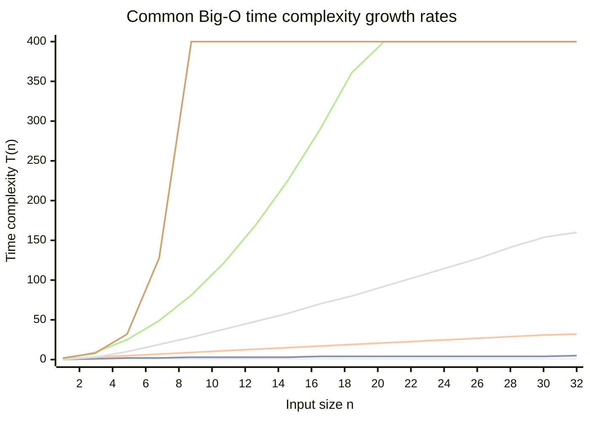
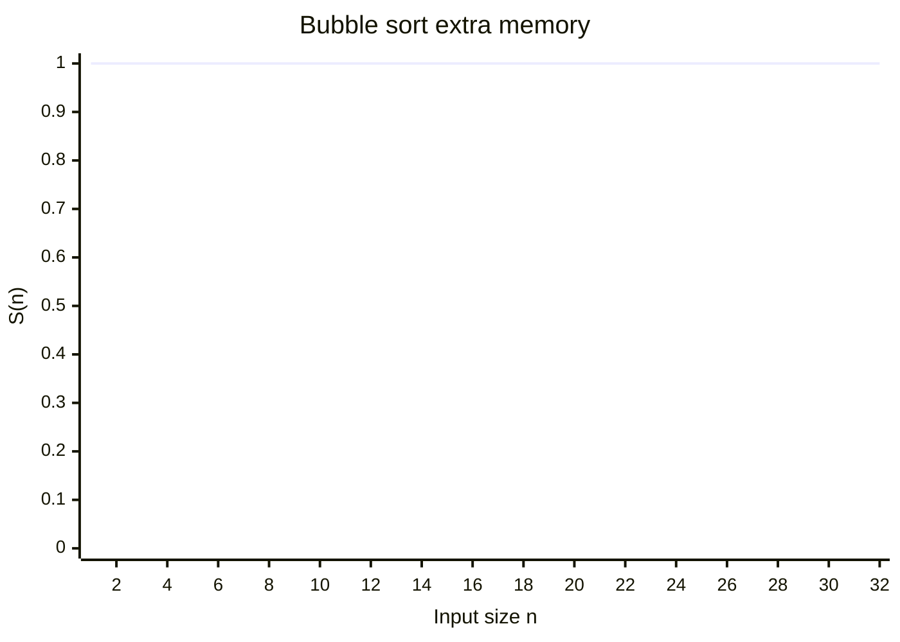

Algorithm growth describes how work and extra memory change as the input size \(n\) increases. The
goal is to compare growth rates, not to predict an exact runtime on every machine.

## Asymptotic notation

Asymptotic notation describes bounds while ignoring constant factors and lower-order terms:

- \(O(f(n))\) is an asymptotic upper bound.
- \(\Omega(f(n))\) is an asymptotic lower bound.
- \(\Theta(f(n))\) is a tight bound when both the upper and lower bounds grow as \(f(n)\).

Worst-case analysis asks for the maximum work over inputs of size \(n\); best-case analysis asks for
the minimum. Average-case analysis requires a stated input distribution, so it should not be
claimed without that assumption.

## Bubble sort example

Bubble sort repeatedly compares adjacent elements and swaps them when they are out of order:

```java
for (int j=0; j<array.length-1; j++) {
    for (int i = 0; i < array.length - j - 1; i++) {
        if (array[i] > array[i + 1]) {
            int tmp = array[i];
            array[i] = array[i + 1];
            array[i + 1] = tmp;
        }
    }
}
```
```c
#include <stddef.h>

void bubble_sort(int array[], size_t length) {
    for (size_t j = 0; j + 1 < length; j++) {
        for (size_t i = 0; i < length - j - 1; i++) {
            if (array[i] > array[i + 1]) {
                int tmp = array[i];
                array[i] = array[i + 1];
                array[i + 1] = tmp;
            }
        }
    }
}
```
```python
def bubble_sort(array):
    for j in range(len(array) - 1):
        for i in range(len(array) - j - 1):
            if array[i] > array[i + 1]:
                array[i], array[i + 1] = array[i + 1], array[i]
```
```rust
fn bubble_sort(array: &mut [i32]) {
    for j in 0..array.len().saturating_sub(1) {
        for i in 0..array.len() - j - 1 {
            if array[i] > array[i + 1] {
                let tmp = array[i];
                array[i] = array[i + 1];
                array[i + 1] = tmp;
            }
        }
    }
}
```
```typescript
function bubbleSort(array: number[]): void {
    for (let j = 0; j < array.length - 1; j++) {
        for (let i = 0; i < array.length - j - 1; i++) {
            if (array[i] > array[i + 1]) {
                const tmp = array[i];
                array[i] = array[i + 1];
                array[i + 1] = tmp;
            }
        }
    }
}
```
```go
func BubbleSort(array []int) {
	for j := 0; j < len(array)-1; j++ {
		for i := 0; i < len(array)-j-1; i++ {
			if array[i] > array[i+1] {
				tmp := array[i]
				array[i] = array[i+1]
				array[i+1] = tmp
			}
		}
	}
}
```

With an early-exit flag, an already sorted array is the best case: the algorithm makes one pass and
performs no swaps, so it takes \(O(n)\) time. Without that optimization, the best case is still
\(O(n^2)\) because every pass is performed.

With or without early exit, a reverse-sorted array is a worst case and takes \(O(n^2)\) time. Bubble
sort uses \(O(1)\) extra space because it sorts in place.


### Compute time growth

Bubble sort's compute time is `T(n) = O(n^2)` relative to others. The plotted values are representative because Big-O describes growth, not exact operation counts.



### Memory growth

Bubble sort's memory use is `S(n) = O(1)`. Bubble sort uses only a small fixed amount of working space.



## Related chapters

- [Divide-and-Conquer & Advanced Sorting](../01-algorithms/03-paradigms/01-divide-and-conquer-sorting.md)
- [Amortized Analysis Techniques](../01-algorithms/03-paradigms/05-amortized-analysis.md)
- [Computational Complexity Theory](../01-algorithms/04a-computational-theory/01-complexity-theory.md)
