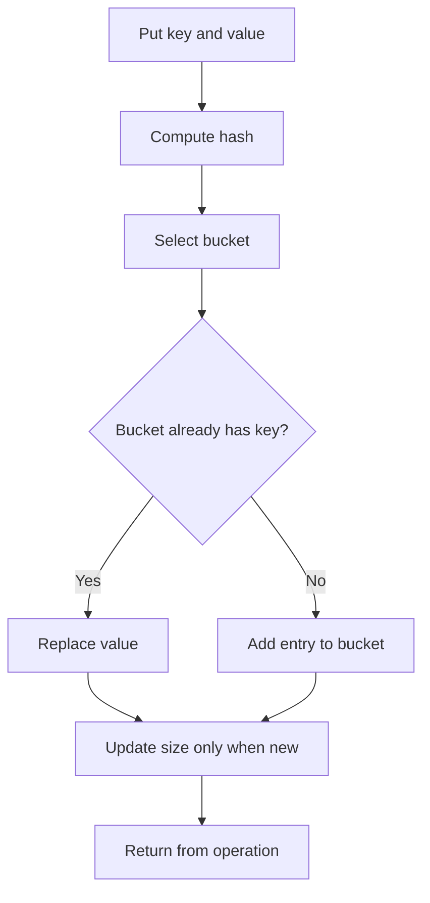

## What it is

A hash table maps keys to values by applying a **hash function** that selects a bucket in an underlying array. A hash set uses the same structure to answer whether a key is present. With a good hash function and a controlled load factor, put, get, remove, and membership run in O(1) average time; collisions can make an individual operation O(n).

## How it works

The hash function spreads keys across buckets. When two keys select the same bucket, the table resolves the collision with **separate chaining** by storing a small collection of entries in that bucket. The implementation below uses the same operation set in all six languages: put, get, remove, contains, and size, with a fixed bucket capacity so each operation is independent.

A hash function should be deterministic during a table's lifetime, inexpensive to compute, and stable across processes when a hash is persisted. A universal hash family makes the choice of hash function less predictable. For integer keys, a common family is \(h_{a,b}(x) = ((ax+b) \bmod p) \bmod m\), where \(p\) is a prime larger than the key domain, \(m\) is the number of buckets, and the random multiplier \(a\) is selected from the nonzero residues modulo \(p\); selecting random \(a\) and \(b\) gives a collision bound in expectation for a fixed pair of keys.

Separate chaining keeps entries in a bucket collection. Open addressing is the other common strategy: it stores entries directly in the array and probes another slot after a collision. Chaining makes deletion straightforward; open addressing needs a tombstone or backward-shift policy for deletion. Either strategy requires resizing when the load factor becomes too high.



```java
import java.util.ArrayList;
import java.util.List;

class HashTable {
    private static class Entry {
        String key;
        int value;

        Entry(String key, int value) {
            this.key = key;
            this.value = value;
        }
    }

    private final List<Entry>[] buckets;
    private int size;

    HashTable(int capacity) {
        buckets = new List[capacity];
        for (int index = 0; index < capacity; index++) {
            buckets[index] = new ArrayList<>();
        }
    }

    private int hash(String key) {
        return Math.floorMod(key.hashCode(), buckets.length);
    }

    void put(String key, int value) {
        int index = hash(key);
        for (Entry entry : buckets[index]) {
            if (entry.key.equals(key)) {
                entry.value = value;
                return;
            }
        }
        buckets[index].add(new Entry(key, value));
        size++;
    }

    Integer get(String key) {
        int index = hash(key);
        for (Entry entry : buckets[index]) {
            if (entry.key.equals(key)) return entry.value;
        }
        return null;
    }

    boolean remove(String key) {
        int index = hash(key);
        for (int position = 0; position < buckets[index].size(); position++) {
            Entry entry = buckets[index].get(position);
            if (entry.key.equals(key)) {
                buckets[index].remove(position);
                size--;
                return true;
            }
        }
        return false;
    }

    boolean contains(String key) {
        return get(key) != null;
    }

    int size() {
        return size;
    }
}
```

```c
#include <stdbool.h>
#include <stdlib.h>
#include <string.h>

typedef struct Entry {
    char *key;
    int value;
    struct Entry *next;
} Entry;

typedef struct {
    Entry **buckets;
    int capacity;
    int size;
} HashTable;

void ht_init(HashTable *table, int capacity) {
    if (capacity <= 0) abort();
    table->buckets = calloc((size_t)capacity, sizeof(*table->buckets));
    if (table->buckets == NULL) abort();
    table->capacity = capacity;
    table->size = 0;
}

unsigned long ht_hash(const char *key, int capacity) {
    unsigned long value = 5381;
    while (*key) {
        value = ((value << 5) + value) + (unsigned char)*key++;
    }
    return value % (unsigned long)capacity;
}

void ht_put(HashTable *table, const char *key, int value) {
    unsigned long index = ht_hash(key, table->capacity);
    for (Entry *entry = table->buckets[index]; entry; entry = entry->next) {
        if (strcmp(entry->key, key) == 0) {
            entry->value = value;
            return;
        }
    }
    Entry *entry = malloc(sizeof(Entry));
    if (entry == NULL) abort();
    size_t key_length = strlen(key) + 1;
    entry->key = malloc(key_length);
    if (entry->key == NULL) abort();
    memcpy(entry->key, key, key_length);
    entry->value = value;
    entry->next = table->buckets[index];
    table->buckets[index] = entry;
    table->size++;
}

bool ht_get(const HashTable *table, const char *key, int *value) {
    unsigned long index = ht_hash(key, table->capacity);
    for (Entry *entry = table->buckets[index]; entry; entry = entry->next) {
        if (strcmp(entry->key, key) == 0) {
            *value = entry->value;
            return true;
        }
    }
    return false;
}

bool ht_remove(HashTable *table, const char *key) {
    unsigned long index = ht_hash(key, table->capacity);
    Entry **link = &table->buckets[index];
    while (*link) {
        if (strcmp((*link)->key, key) == 0) {
            Entry *removed = *link;
            *link = removed->next;
            free(removed->key);
            free(removed);
            table->size--;
            return true;
        }
        link = &(*link)->next;
    }
    return false;
}

bool ht_contains(const HashTable *table, const char *key) {
    int value;
    return ht_get(table, key, &value);
}

int ht_size(const HashTable *table) {
    return table->size;
}

void ht_free(HashTable *table) {
    for (int index = 0; index < table->capacity; index++) {
        Entry *entry = table->buckets[index];
        while (entry) {
            Entry *next = entry->next;
            free(entry->key);
            free(entry);
            entry = next;
        }
    }
    free(table->buckets);
    table->buckets = NULL;
    table->capacity = 0;
    table->size = 0;
}
```

```python
class HashTable:
    def __init__(self, capacity=16):
        if capacity <= 0:
            raise ValueError("capacity must be positive")
        self.buckets = [[] for _ in range(capacity)]
        self.size = 0

    def _hash(self, key):
        return hash(key) % len(self.buckets)

    def put(self, key, value):
        bucket = self.buckets[self._hash(key)]
        for pair in bucket:
            if pair[0] == key:
                pair[1] = value
                return
        bucket.append([key, value])
        self.size += 1

    def get(self, key):
        for stored_key, value in self.buckets[self._hash(key)]:
            if stored_key == key:
                return value
        return None

    def remove(self, key):
        bucket = self.buckets[self._hash(key)]
        for position, (stored_key, _) in enumerate(bucket):
            if stored_key == key:
                del bucket[position]
                self.size -= 1
                return True
        return False

    def contains(self, key):
        return any(stored_key == key for stored_key, _ in self.buckets[self._hash(key)])

    def size(self):
        return self.size
```

```rust
use std::hash::{Hash, Hasher};

pub struct HashTable {
    buckets: Vec<Vec<(String, i32)>>,
    size: usize,
}

impl HashTable {
    pub fn new(capacity: usize) -> Self {
        assert!(capacity > 0);
        HashTable {
            buckets: vec![Vec::new(); capacity],
            size: 0,
        }
    }

    fn hash(&self, key: &str) -> usize {
        let mut hasher = std::collections::hash_map::DefaultHasher::new();
        key.hash(&mut hasher);
        hasher.finish() as usize % self.buckets.len()
    }

    pub fn put(&mut self, key: String, value: i32) {
        let index = self.hash(&key);
        for pair in &mut self.buckets[index] {
            if pair.0 == key {
                pair.1 = value;
                return;
            }
        }
        self.buckets[index].push((key, value));
        self.size += 1;
    }

    pub fn get(&self, key: &str) -> Option<i32> {
        self.buckets[self.hash(key)]
            .iter()
            .find(|(stored_key, _)| stored_key == key)
            .map(|(_, value)| *value)
    }

    pub fn remove(&mut self, key: &str) -> bool {
        let index = self.hash(key);
        let bucket = &mut self.buckets[index];
        if let Some(position) = bucket.iter().position(|(stored_key, _)| stored_key == key) {
            bucket.remove(position);
            self.size -= 1;
            true
        } else {
            false
        }
    }

    pub fn contains(&self, key: &str) -> bool {
        self.get(key).is_some()
    }

    pub fn size(&self) -> usize {
        self.size
    }
}
```

```typescript
class HashTable {
  private buckets: Array<Array<[string, number]>>;
  private size = 0;

  constructor(capacity: number) {
    if (capacity <= 0) throw new Error("capacity must be positive");
    this.buckets = new Array(capacity).fill(null).map(() => []);
  }

  private hash(key: string): number {
    let value = 0;
    for (let index = 0; index < key.length; index++) {
      value = (value * 31 + key.charCodeAt(index)) >>> 0;
    }
    return value % this.buckets.length;
  }

  put(key: string, value: number): void {
    const bucket = this.buckets[this.hash(key)];
    const pair = bucket.find(([storedKey]) => storedKey === key);
    if (pair) {
      pair[1] = value;
      return;
    }
    bucket.push([key, value]);
    this.size++;
  }

  get(key: string): number | undefined {
    const pair = this.buckets[this.hash(key)].find(([storedKey]) => storedKey === key);
    return pair?.[1];
  }

  remove(key: string): boolean {
    const bucket = this.buckets[this.hash(key)];
    const position = bucket.findIndex(([storedKey]) => storedKey === key);
    if (position < 0) return false;
    bucket.splice(position, 1);
    this.size--;
    return true;
  }

  contains(key: string): boolean {
    return this.get(key) !== undefined;
  }

  size(): number {
    return this.size;
  }
}
```

```go
package main
type Entry struct {
	Key   string
	Value int
}

type HashTable struct {
	buckets  [][]Entry
	capacity int
	size     int
}

func NewHashTable(capacity int) *HashTable {
	if capacity <= 0 {
		return nil
	}
	return &HashTable{
		buckets:  make([][]Entry, capacity),
		capacity: capacity,
	}
}

func (table *HashTable) hash(key string) int {
	value := 0
	for index := 0; index < len(key); index++ {
		value = (value*31 + int(key[index])) & 0x7fffffff
	}
	return value % table.capacity
}

func (table *HashTable) Put(key string, value int) {
	index := table.hash(key)
	for position := range table.buckets[index] {
		if table.buckets[index][position].Key == key {
			table.buckets[index][position].Value = value
			return
		}
	}
	table.buckets[index] = append(table.buckets[index], Entry{Key: key, Value: value})
	table.size++
}

func (table *HashTable) Get(key string) (int, bool) {
	for _, entry := range table.buckets[table.hash(key)] {
		if entry.Key == key {
			return entry.Value, true
		}
	}
	return 0, false
}

func (table *HashTable) Remove(key string) bool {
	index := table.hash(key)
	for position, entry := range table.buckets[index] {
		if entry.Key == key {
			table.buckets[index] = append(table.buckets[index][:position], table.buckets[index][position+1:]...)
			table.size--
			return true
		}
	}
	return false
}

func (table *HashTable) Contains(key string) bool {
	_, found := table.Get(key)
	return found
}

func (table *HashTable) Size() int {
    return table.size
}
```

## Complexity

| Operation | Average time | Worst-case time | Space |
| --- | --- | --- | --- |
| Put | O(1) | O(n) | O(n) total, O(1) auxiliary |
| Get | O(1) | O(n) | O(1) auxiliary |
| Remove | O(1) | O(n) | O(1) auxiliary |
| Contains (hash set) | O(1) | O(n) | O(1) auxiliary |

The load factor is the number of entries divided by the number of buckets. Choosing capacity for the expected number of entries keeps bucket lengths short in these fixed-capacity examples. A universal hash family gives an expected collision bound for any fixed pair of distinct keys, but it does not make every individual operation constant time.

## When to use

- You need average O(1) lookup, insertion, removal, or membership tests.
- Keys do not need to be traversed in sorted order.
- You are deduplicating values, counting frequencies, caching lookups, or memoizing results.

## Alternatives

- **Balanced binary search tree** — provides O(log n) worst-case operations and ordered traversal, at the cost of pointer or node overhead.
- **Array or linear scan** — simple and cache-friendly for small data, but lookup grows linearly.
- **Bloom filter** — uses O(k) memory for membership tests with no false negatives, but allows false positives and cannot retrieve values.

## Related

- [Dynamic Arrays, Memory Allocation, and Amortized Analysis](01-dynamic-arrays.md)
- [Bitwise Operations and Bloom Filters](05-bitwise-bloom-filters.md)
- [Binary Search Trees & Self-Balancing Trees (AVL, Red-Black Trees)](../02-search-trees/01-binary-search-trees.md)
