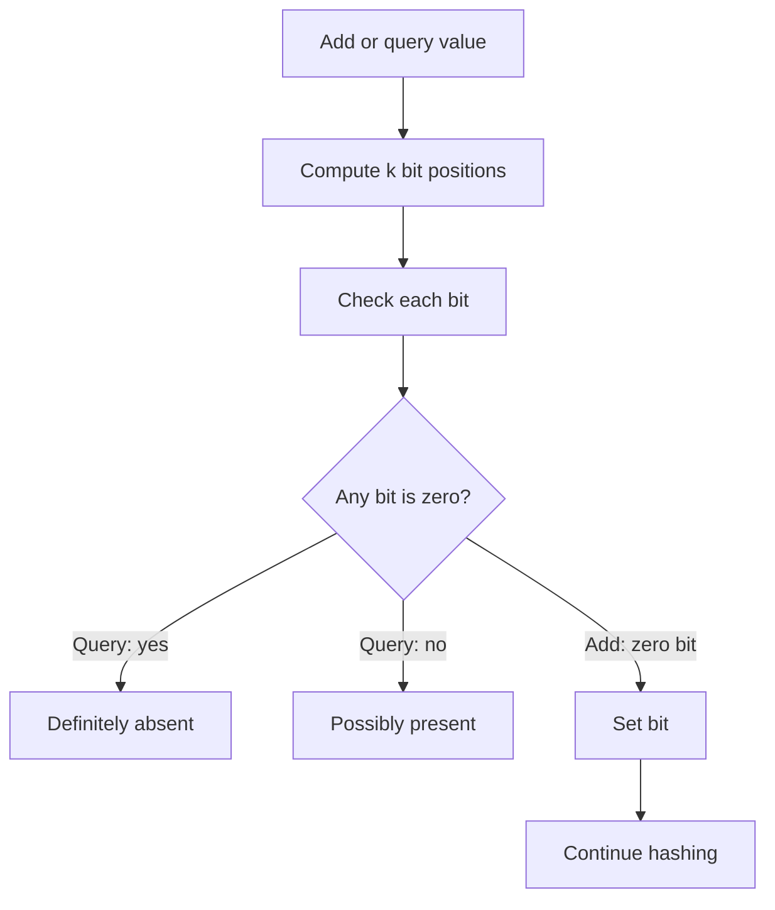

## What it is

Bitwise algorithms manipulate individual bits, a **bitset** stores a collection of bits in a fixed-size array, and a **Bloom filter** is a probabilistic membership structure built from a bitset and a fixed number of hash functions, written as `k`. A Bloom filter answers that an element is definitely absent or possibly present: it never produces a false negative, but it can produce a false positive. Bitsets and Bloom filters trade exact storage and deletion for compact, cache-friendly membership checks.

## How it works

A bitset represents each position with one bit. Setting a bit uses an OR operation, clearing it uses an AND operation with a mask, and reading it uses a shift followed by a mask. The index is divided by eight to locate the byte, and the index modulo eight selects the bit within that byte.

A Bloom filter starts with a bitset containing `m` zero bits. Adding a value computes `k` seeded hashes and sets each resulting bit. A membership query computes the same hashes and returns false when any bit is zero; it returns true only when every bit is set. The implementation below uses a 32-bit FNV-style polynomial hash over the value's UTF-8 bytes. It exposes the same `Bitset` operations and `BloomFilter` operations in all six languages.

The code below uses `k` seeded hashes. A production Bloom filter selects `m` and `k` for its target false-positive rate and uses a hash implementation appropriate for its input distribution. Java's `BitSet`, Python's byte arrays, C byte arrays, Rust byte vectors, TypeScript typed arrays, and Go byte slices can all provide the same bit-level operations.



```java
import java.nio.charset.StandardCharsets;

class Bitset {
    private final byte[] bytes;
    private final int size;

    Bitset(int size) {
        if (size <= 0) throw new IllegalArgumentException("size must be positive");
        this.size = size;
        this.bytes = new byte[(size + 7) / 8];
    }

    private void checkIndex(int index) {
        if (index < 0 || index >= size) throw new IndexOutOfBoundsException();
    }

    void set(int index) {
        checkIndex(index);
        bytes[index >>> 3] |= (byte) (1 << (index & 7));
    }

    void clear(int index) {
        checkIndex(index);
        bytes[index >>> 3] &= (byte) ~(1 << (index & 7));
    }

    boolean get(int index) {
        checkIndex(index);
        return ((bytes[index >>> 3] >>> (index & 7)) & 1) != 0;
    }
}

class BloomFilter {
    private final Bitset bits;
    private final int size;
    private final int hashCount;

    BloomFilter(int size, int hashCount) {
        if (hashCount <= 0) throw new IllegalArgumentException("hashCount must be positive");
        this.bits = new Bitset(size);
        this.size = size;
        this.hashCount = hashCount;
    }

    private int hash(String value, int seed) {
        int h = 0x811c9dc5 ^ seed;
        for (byte valueByte : value.getBytes(StandardCharsets.UTF_8)) {
            h ^= valueByte & 0xff;
            h *= 0x01000193;
        }
        return Math.floorMod(h, size);
    }

    void add(String value) {
        for (int index = 0; index < hashCount; index++) {
            bits.set(hash(value, 31 + index));
        }
    }

    boolean mightContain(String value) {
        for (int index = 0; index < hashCount; index++) {
            if (!bits.get(hash(value, 31 + index))) return false;
        }
        return true;
    }
}
```

```c
#include <stdbool.h>
#include <stdint.h>
#include <stdlib.h>

typedef struct {
    unsigned char *bytes;
    int size;
} Bitset;

void bitset_init(Bitset *bits, int size) {
    if (size <= 0) abort();
    bits->bytes = calloc((size_t)((size + 7) / 8), sizeof(bits->bytes[0]));
    if (bits->bytes == NULL) abort();
    bits->size = size;
}

void bitset_set(Bitset *bits, int index) {
    if (index < 0 || index >= bits->size) abort();
    bits->bytes[index / 8] |= (unsigned char)(1u << (index % 8));
}

void bitset_clear(Bitset *bits, int index) {
    if (index < 0 || index >= bits->size) abort();
    bits->bytes[index / 8] &= (unsigned char)~(1u << (index % 8));
}

bool bitset_get(const Bitset *bits, int index) {
    if (index < 0 || index >= bits->size) abort();
    return ((bits->bytes[index / 8] >> (index % 8)) & 1u) != 0;
}

typedef struct {
    Bitset bits;
    int hash_count;
} BloomFilter;

void bf_init(BloomFilter *filter, int size, int hash_count) {
    if (hash_count <= 0) abort();
    bitset_init(&filter->bits, size);
    filter->hash_count = hash_count;
}

static int bf_hash(const char *value, int seed, int size) {
    uint32_t h = UINT32_C(2166136261) ^ (uint32_t)seed;
    for (; *value != '\0'; value++) {
        h ^= (unsigned char)*value;
        h *= UINT32_C(16777619);
    }
    return (int)(h % (uint32_t)size);
}

void bf_add(BloomFilter *filter, const char *value) {
    for (int index = 0; index < filter->hash_count; index++) {
        bitset_set(&filter->bits, bf_hash(value, 31 + index, filter->bits.size));
    }
}

bool bf_might_contain(const BloomFilter *filter, const char *value) {
    for (int index = 0; index < filter->hash_count; index++) {
        if (!bitset_get(&filter->bits, bf_hash(value, 31 + index, filter->bits.size))) return false;
    }
    return true;
}
```

```python
class Bitset:
    def __init__(self, size):
        if size <= 0:
            raise ValueError("size must be positive")
        self.bytes = bytearray((size + 7) // 8)
        self.size = size

    def _check_index(self, index):
        if index < 0 or index >= self.size:
            raise IndexError("bit index out of range")

    def set(self, index):
        self._check_index(index)
        self.bytes[index // 8] |= 1 << (index % 8)

    def clear(self, index):
        self._check_index(index)
        self.bytes[index // 8] &= ~(1 << (index % 8))

    def get(self, index):
        self._check_index(index)
        return bool(self.bytes[index // 8] & (1 << (index % 8)))


class BloomFilter:
    def __init__(self, size, hash_count):
        if hash_count <= 0:
            raise ValueError("hash_count must be positive")
        self.bits = Bitset(size)
        self.size = size
        self.hash_count = hash_count

    def _hash(self, value, seed):
        h = (2166136261 ^ seed) & 0xffffffff
        for value_byte in value.encode("utf-8"):
            h = ((h ^ value_byte) * 16777619) & 0xffffffff
        return h % self.size

    def add(self, value):
        for index in range(self.hash_count):
            self.bits.set(self._hash(value, 31 + index))

    def might_contain(self, value):
        for index in range(self.hash_count):
            if not self.bits.get(self._hash(value, 31 + index)):
                return False
        return True
```

```rust
pub struct Bitset {
    bytes: Vec<u8>,
    size: usize,
}

impl Bitset {
    pub fn new(size: usize) -> Self {
        assert!(size > 0);
        Bitset {
            bytes: vec![0; (size + 7) / 8],
            size,
        }
    }

    fn check_index(&self, index: usize) {
        assert!(index < self.size);
    }

    pub fn set(&mut self, index: usize) {
        self.check_index(index);
        self.bytes[index / 8] |= 1 << (index % 8);
    }

    pub fn clear(&mut self, index: usize) {
        self.check_index(index);
        self.bytes[index / 8] &= !(1 << (index % 8));
    }

    pub fn get(&self, index: usize) -> bool {
        self.check_index(index);
        self.bytes[index / 8] & (1 << (index % 8)) != 0
    }
}

pub struct BloomFilter {
    bits: Bitset,
    hash_count: usize,
}

impl BloomFilter {
    pub fn new(size: usize, hash_count: usize) -> Self {
        assert!(hash_count > 0);
        BloomFilter {
            bits: Bitset::new(size),
            hash_count,
        }
    }

    fn hash(&self, value: &str, seed: usize) -> usize {
        let mut hash = 0x811c9dc5_u32 ^ seed as u32;
        for value_byte in value.as_bytes() {
            hash ^= *value_byte as u32;
            hash = hash.wrapping_mul(0x01000193);
        }
        hash as usize % self.bits.size
    }

    pub fn add(&mut self, value: &str) {
        for index in 0..self.hash_count {
            self.bits.set(self.hash(value, 31 + index));
        }
    }

    pub fn might_contain(&self, value: &str) -> bool {
        (0..self.hash_count)
            .all(|index| self.bits.get(self.hash(value, 31 + index)))
    }
}
```

```typescript
class Bitset {
    private bytes: Uint8Array;
    private size: number;

    constructor(size: number) {
        if (size <= 0) throw new Error("size must be positive");
        this.size = size;
        this.bytes = new Uint8Array(Math.ceil(size / 8));
    }

    private checkIndex(index: number): void {
        if (!Number.isInteger(index) || index < 0 || index >= this.size) {
            throw new RangeError("bit index out of range");
        }
    }

    set(index: number): void {
        this.checkIndex(index);
        this.bytes[index >>> 3] |= 1 << (index & 7);
    }

    clear(index: number): void {
        this.checkIndex(index);
        this.bytes[index >>> 3] &= ~(1 << (index & 7));
    }

    get(index: number): boolean {
        this.checkIndex(index);
        return ((this.bytes[index >>> 3] >>> (index & 7)) & 1) !== 0;
    }
}

class BloomFilter {
    private bits: Bitset;
    private size: number;
    private hashCount: number;
    private encoder: TextEncoder;

    constructor(size: number, hashCount: number) {
        if (hashCount <= 0) throw new Error("hashCount must be positive");
        this.bits = new Bitset(size);
        this.size = size;
        this.hashCount = hashCount;
        this.encoder = new TextEncoder();
    }

    private hash(value: string, seed: number): number {
        let hash = (0x811c9dc5 ^ seed) >>> 0;
        for (const valueByte of this.encoder.encode(value)) {
            hash = Math.imul(hash ^ valueByte, 0x01000193) >>> 0;
        }
        return hash % this.size;
    }

    add(value: string): void {
        for (let index = 0; index < this.hashCount; index++) {
            this.bits.set(this.hash(value, 31 + index));
        }
    }

    mightContain(value: string): boolean {
        for (let index = 0; index < this.hashCount; index++) {
            if (!this.bits.get(this.hash(value, 31 + index))) return false;
        }
        return true;
    }
}
```

```go
package main
type Bitset struct {
	bytes []byte
	size  int
}

func NewBitset(size int) *Bitset {
	if size <= 0 {
		panic("size must be positive")
	}
	return &Bitset{bytes: make([]byte, (size+7)/8), size: size}
}

func (b *Bitset) Set(index int) {
	if index < 0 || index >= b.size {
		panic("bit index out of range")
	}
	b.bytes[index>>3] |= byte(1 << uint(index&7))
}

func (b *Bitset) Clear(index int) {
	if index < 0 || index >= b.size {
		panic("bit index out of range")
	}
	b.bytes[index>>3] &^= byte(1 << uint(index&7))
}

func (b *Bitset) Get(index int) bool {
	if index < 0 || index >= b.size {
		panic("bit index out of range")
	}
	return b.bytes[index>>3]&(byte(1)<<uint(index&7)) != 0
}

type BloomFilter struct {
	bits      *Bitset
	hashCount int
}

func NewBloomFilter(size, hashCount int) *BloomFilter {
	if hashCount <= 0 {
		panic("hashCount must be positive")
	}
	return &BloomFilter{bits: NewBitset(size), hashCount: hashCount}
}

func (f *BloomFilter) hash(value string, seed int) int {
	hash := uint32(2166136261) ^ uint32(seed)
	for index := 0; index < len(value); index++ {
		hash = (hash ^ uint32(value[index])) * 16777619
	}
	return int(hash % uint32(f.bits.size))
}

func (f *BloomFilter) Add(value string) {
	for index := 0; index < f.hashCount; index++ {
		f.bits.Set(f.hash(value, 31+index))
	}
}

func (f *BloomFilter) MightContain(value string) bool {
    for index := 0; index < f.hashCount; index++ {
        if !f.bits.Get(f.hash(value, 31+index)) {
            return false
        }
    }
    return true
}
```

### Probabilistic counting

**Probabilistic counting** estimates quantities that are too large to count exactly in a small fixed structure. **HyperLogLog** hashes stream elements into many small registers, records the largest leading-zero position observed, and combines those registers with a harmonic mean to estimate the number of distinct values. It never reports fewer distinct values than it observed, but its estimate has a small configurable error and does not identify the values.

A **Count-Min Sketch** maintains a table of counters indexed by several independent hashes. An update increments one counter per row; a query returns the minimum of the counters selected for the queried value. Collisions can only make a returned frequency too high, so the result is an upper-bound estimate. Increasing the number of rows reduces collision probability, while increasing the width increases memory use.

## Complexity

| Operation | Time | Space |
| --- | --- | --- |
| Bitset set, clear, or get | O(1) | O(1) |
| Bloom filter add | O(kL) | O(1) additional |
| Bloom filter query | O(kL) | O(1) additional |
| Bloom filter initialization | O(m) | O(m) bits |
| HyperLogLog update | O(1) expected | O(1) per register |
| HyperLogLog estimate | O(1) expected | O(1) additional |
| Count-Min Sketch update | O(k) | O(1) additional |
| Count-Min Sketch query | O(k) | O(1) additional |
| False-positive probability with independent hashes | ≈ \( (1-e^{-kn/m})^k \) | — |

Here, `L` is the length of the value's UTF-8 representation, `k` is the number of hashes, `m` is the number of bits, and `n` is the number of inserted elements. When input length is treated as a bounded constant, add and query are O(k).

## When to use

- You need a compact approximate-membership test and can tolerate false positives before an exact lookup.
- You need constant-time flag reads, writes, and clears for a fixed-size set of bits.
- You want a Bloom filter to avoid most database, disk, or network reads for values that are not present.
- You need a probabilistic filter that supports only insertion and lookup, not exact counting.
- You need to serialize or transmit a Bloom filter, provided every process uses the same `m`, `k`, and hash algorithm.

## Alternatives

- **Hash set** — wins when membership must be exact and values are small enough to store; costs more memory per element and returns false positives never.
- **Sorted array or vector** — wins for small, immutable collections that benefit from binary search; costs O(log n) membership and ordered storage.
- **Counting Bloom filter** — adds deletion by replacing each bit with a counter; costs more memory and requires careful counter overflow handling.
- **Cuckoo filter** — supports deletion with compact fingerprints and bounded probe sequences; costs more complex construction and membership logic.
- **HyperLogLog** — estimates distinct-value cardinality in fixed small space, but loses the exact count and cannot enumerate the values.
- **Count-Min Sketch** — estimates stream frequencies with sublinear space, but collisions can overestimate a value and deletion is not supported by the basic structure.

## Related

- [Hash Tables: Hash Functions, Collision Resolution, and Universal Hashing](04-hash-tables.md)
- [Dynamic Arrays, Memory Allocation, and Amortized Analysis](01-dynamic-arrays.md)
- [In-Memory Caching](../../02-system-design/02-caching/01-in-memory-caching.md)
