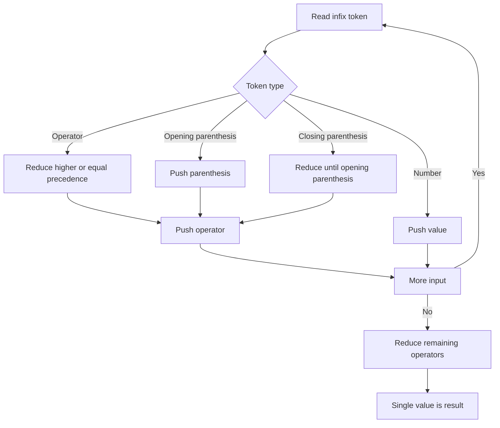

## What it is

Expression evaluation converts tokens into a numeric result while respecting operator precedence and parentheses. Reverse Polish notation (RPN), also called postfix notation, places each operator after its operands; the **shunting-yard algorithm** converts infix notation such as `2 + 3 * 4` into RPN using two stacks. Both approaches make a calculator's control flow explicit and use stacks to remember pending work.

## How it works

An infix calculator first reads numbers, operators, and parentheses from left to right. An operator stack delays an operator until the calculator knows which operands precede it. Higher-precedence operators remain on the stack, while equal or lower-precedence operators are reduced first. A left parenthesis prevents reduction across an expression boundary, and a right parenthesis reduces everything inside its matching boundary.

RPN evaluation needs only a value stack. A number is pushed. An operator pops the right operand first and then the left operand, applies the operator, and pushes the result. The final stack value is the expression result. A malformed RPN expression is rejected when an operator lacks two operands or the input ends with more than one value.

The examples below expose the same `Calculator` operations in all six languages: `evaluateRpn` evaluates postfix input, `evaluateInfix` evaluates infix input with parentheses, and `isOperator` identifies the four supported binary operators. The operation set intentionally excludes unary operators, variable references, and operator overloading so the execution model stays the same across languages.



The calculator uses integer-valued floating-point storage because it is the simplest common representation across the six languages. A production calculator would also define division-by-zero behavior, overflow handling, localization, and the precedence of unary operators.

```java
import java.util.ArrayDeque;
import java.util.Deque;

class Calculator {
    boolean isOperator(String token) {
        return token.equals("+") || token.equals("-") || token.equals("*") || token.equals("/");
    }

    private int precedence(String operator) {
        return operator.equals("+") || operator.equals("-") ? 1 : 2;
    }

    private double apply(double left, String operator, double right) {
        return switch (operator) {
            case "+" -> left + right;
            case "-" -> left - right;
            case "*" -> left * right;
            case "/" -> left / right;
            default -> throw new IllegalArgumentException("invalid operator");
        };
    }

    double evaluateRpn(String expression) {
        Deque<Double> values = new ArrayDeque<>();
        for (String token : expression.trim().split("\\s+")) {
            if (isOperator(token)) {
                if (values.size() < 2) throw new IllegalArgumentException("invalid RPN");
                double right = values.removeLast();
                double left = values.removeLast();
                values.addLast(apply(left, token, right));
            } else {
                values.addLast(Double.parseDouble(token));
            }
        }
        if (values.size() != 1) throw new IllegalArgumentException("invalid RPN");
        return values.removeLast();
    }

    double evaluateInfix(String expression) {
        Deque<Double> values = new ArrayDeque<>();
        Deque<String> operators = new ArrayDeque<>();
        boolean expectOperand = true;
        for (String token : expression.trim().split("\\s+")) {
            if (token.equals("(")) {
                if (!expectOperand) throw new IllegalArgumentException("invalid infix");
                operators.addLast(token);
            } else if (token.equals(")")) {
                if (expectOperand) throw new IllegalArgumentException("invalid infix");
                while (!operators.isEmpty() && !operators.peekLast().equals("(")) {
                    reduce(values, operators);
                }
                if (operators.isEmpty()) throw new IllegalArgumentException("invalid infix");
                operators.removeLast();
                expectOperand = false;
            } else if (isOperator(token)) {
                if (expectOperand) throw new IllegalArgumentException("invalid infix");
                while (!operators.isEmpty() && !operators.peekLast().equals("(") &&
                        precedence(operators.peekLast()) >= precedence(token)) {
                    reduce(values, operators);
                }
                operators.addLast(token);
                expectOperand = true;
            } else {
                if (!expectOperand) throw new IllegalArgumentException("invalid infix");
                values.addLast(Double.parseDouble(token));
                expectOperand = false;
            }
        }
        if (expectOperand || operators.contains("(")) throw new IllegalArgumentException("invalid infix");
        while (!operators.isEmpty()) reduce(values, operators);
        if (values.size() != 1) throw new IllegalArgumentException("invalid infix");
        return values.removeLast();
    }

    private void reduce(Deque<Double> values, Deque<String> operators) {
        String operator = operators.removeLast();
        if (values.size() < 2) throw new IllegalArgumentException("invalid infix");
        double right = values.removeLast();
        double left = values.removeLast();
        values.addLast(apply(left, operator, right));
    }
}
```

```c
#include <math.h>
#include <stdlib.h>
#include <string.h>

#define CALCULATOR_STACK_SIZE 256

typedef struct {
    int unused;
} Calculator;

static int calculator_is_operator(const char *token) {
    return strcmp(token, "+") == 0 || strcmp(token, "-") == 0 ||
           strcmp(token, "*") == 0 || strcmp(token, "/") == 0;
}

static int calculator_precedence(const char *operator) {
    return operator[0] == '+' || operator[0] == '-' ? 1 : 2;
}

static int calculator_apply(double left, char operator, double right, double *result) {
    switch (operator) {
        case '+': *result = left + right; return 1;
        case '-': *result = left - right; return 1;
        case '*': *result = left * right; return 1;
        case '/':
            if (right == 0.0) return 0;
            *result = left / right;
            return 1;
        default: return 0;
    }
}

static int calculator_reduce(double *values, int *value_count, char *operators, int *operator_count) {
    if (*value_count < 2 || *operator_count == 0) return 0;
    char operator = operators[--*operator_count];
    double right = values[--*value_count];
    double left = values[--*value_count];
    if (!calculator_apply(left, operator, right, &values[(*value_count)++])) return 0;
    return 1;
}

double calculator_evaluate_rpn(Calculator *calculator, const char *expression) {
    char copy[1024];
    double values[CALCULATOR_STACK_SIZE];
    int value_count = 0;
    char *token;
    if (calculator == NULL || expression == NULL || strlen(expression) >= sizeof(copy)) return NAN;
    strcpy(copy, expression);
    token = strtok(copy, " \t\n");
    while (token != NULL) {
        if (calculator_is_operator(token)) {
            if (value_count < 2) return NAN;
            char operator = token[0];
            double right = values[--value_count];
            double left = values[--value_count];
            if (!calculator_apply(left, operator, right, &values[value_count++])) return NAN;
        } else {
            if (value_count == CALCULATOR_STACK_SIZE) return NAN;
            values[value_count++] = strtod(token, NULL);
        }
        token = strtok(NULL, " \t\n");
    }
    return value_count == 1 ? values[0] : NAN;
}

double calculator_evaluate_infix(Calculator *calculator, const char *expression) {
    char copy[1024];
    double values[CALCULATOR_STACK_SIZE];
    char operators[CALCULATOR_STACK_SIZE];
    int value_count = 0;
    int operator_count = 0;
    int expect_operand = 1;
    char *token;
    if (calculator == NULL || expression == NULL || strlen(expression) >= sizeof(copy)) return NAN;
    strcpy(copy, expression);
    token = strtok(copy, " \t\n");
    while (token != NULL) {
        if (strcmp(token, "(") == 0) {
            if (!expect_operand) return NAN;
            if (operator_count == CALCULATOR_STACK_SIZE) return NAN;
            operators[operator_count++] = '(';
        } else if (strcmp(token, ")") == 0) {
            if (expect_operand) return NAN;
            while (operator_count > 0 && operators[operator_count - 1] != '(' &&
                   !calculator_reduce(values, &value_count, operators, &operator_count)) return NAN;
            if (operator_count == 0) return NAN;
            operator_count--;
            expect_operand = 0;
        } else if (calculator_is_operator(token)) {
            if (expect_operand) return NAN;
            while (operator_count > 0 && operators[operator_count - 1] != '(' &&
                   calculator_precedence(&operators[operator_count - 1]) >= calculator_precedence(token)) {
                if (!calculator_reduce(values, &value_count, operators, &operator_count)) return NAN;
            }
            if (operator_count == CALCULATOR_STACK_SIZE) return NAN;
            operators[operator_count++] = token[0];
            expect_operand = 1;
        } else {
            if (!expect_operand || value_count == CALCULATOR_STACK_SIZE) return NAN;
            values[value_count++] = strtod(token, NULL);
            expect_operand = 0;
        }
        token = strtok(NULL, " \t\n");
    }
    if (expect_operand || operator_count > 0) return NAN;
    while (operator_count > 0) {
        if (!calculator_reduce(values, &value_count, operators, &operator_count)) return NAN;
    }
    return value_count == 1 ? values[0] : NAN;
}
```

```python
import math


class Calculator:
    def is_operator(self, token):
        return token in {"+", "-", "*", "/"}

    def _precedence(self, operator):
        return 1 if operator in {"+", "-"} else 2

    def _apply(self, left, operator, right):
        if operator == "+":
            return left + right
        if operator == "-":
            return left - right
        if operator == "*":
            return left * right
        if right == 0:
            raise ValueError("division by zero")
        return left / right

    def evaluate_rpn(self, expression):
        values = []
        for token in expression.split():
            if self.is_operator(token):
                if len(values) < 2:
                    raise ValueError("invalid RPN")
                right = values.pop()
                left = values.pop()
                values.append(self._apply(left, token, right))
            else:
                values.append(float(token))
        if len(values) != 1:
            raise ValueError("invalid RPN")
        return values[0]

    def evaluate_infix(self, expression):
        values = []
        operators = []
        expect_operand = True
        for token in expression.split():
            if token == "(":
                if not expect_operand:
                    raise ValueError("invalid infix")
                operators.append(token)
            elif token == ")":
                if expect_operand:
                    raise ValueError("invalid infix")
                while operators and operators[-1] != "(":
                    self._reduce(values, operators)
                if not operators:
                    raise ValueError("invalid infix")
                operators.pop()
                expect_operand = False
            elif self.is_operator(token):
                if expect_operand:
                    raise ValueError("invalid infix")
                while (operators and operators[-1] != "(" and
                       self._precedence(operators[-1]) >= self._precedence(token)):
                    self._reduce(values, operators)
                operators.append(token)
                expect_operand = True
            else:
                if not expect_operand:
                    raise ValueError("invalid infix")
                values.append(float(token))
                expect_operand = False
        if expect_operand or "(" in operators:
            raise ValueError("invalid infix")
        while operators:
            self._reduce(values, operators)
        if len(values) != 1:
            raise ValueError("invalid infix")
        return values[0]

    def _reduce(self, values, operators):
        if len(values) < 2 or not operators:
            raise ValueError("invalid infix")
        operator = operators.pop()
        right = values.pop()
        left = values.pop()
        values.append(self._apply(left, operator, right))
```

```rust
struct Calculator;

impl Calculator {
    fn is_operator(&self, token: &str) -> bool {
        matches!(token, "+" | "-" | "*" | "/")
    }

    fn precedence(&self, operator: &str) -> i32 {
        if operator == "+" || operator == "-" { 1 } else { 2 }
    }

    fn apply(&self, left: f64, operator: &str, right: f64) -> Result<f64, String> {
        match operator {
            "+" => Ok(left + right),
            "-" => Ok(left - right),
            "*" => Ok(left * right),
            "/" if right == 0.0 => Err("division by zero".to_string()),
            "/" => Ok(left / right),
            _ => Err("invalid operator".to_string()),
        }
    }

    fn evaluate_rpn(&self, expression: &str) -> Result<f64, String> {
        let mut values = Vec::new();
        for token in expression.split_whitespace() {
            if self.is_operator(token) {
                if values.len() < 2 { return Err("invalid RPN".to_string()); }
                let right = values.pop().unwrap();
                let left = values.pop().unwrap();
                values.push(self.apply(left, token, right)?);
            } else {
                values.push(token.parse::<f64>().map_err(|_| "invalid number".to_string())?);
            }
        }
        if values.len() == 1 { Ok(values.pop().unwrap()) } else { Err("invalid RPN".to_string()) }
    }

    fn evaluate_infix(&self, expression: &str) -> Result<f64, String> {
        let mut values = Vec::new();
        let mut operators: Vec<String> = Vec::new();
        let mut expect_operand = true;
        for token in expression.split_whitespace() {
            if token == "(" {
                if !expect_operand { return Err("invalid infix".to_string()); }
                operators.push(token.to_string());
            } else if token == ")" {
                if expect_operand { return Err("invalid infix".to_string()); }
                while operators.last().map(|value| value != "(").unwrap_or(false) {
                    self.reduce(&mut values, &mut operators)?;
                }
                if operators.pop().is_none() { return Err("invalid infix".to_string()); }
                expect_operand = false;
            } else if self.is_operator(token) {
                if expect_operand { return Err("invalid infix".to_string()); }
                while operators.last().map(|value| value != "(" &&
                    self.precedence(value) >= self.precedence(token)).unwrap_or(false) {
                    self.reduce(&mut values, &mut operators)?;
                }
                operators.push(token.to_string());
                expect_operand = true;
            } else {
                if !expect_operand { return Err("invalid infix".to_string()); }
                values.push(token.parse::<f64>().map_err(|_| "invalid number".to_string())?);
                expect_operand = false;
            }
        }
        if expect_operand || operators.iter().any(|value| value == "(") {
            return Err("invalid infix".to_string());
        }
        while !operators.is_empty() { self.reduce(&mut values, &mut operators)?; }
        if values.len() == 1 { Ok(values.pop().unwrap()) } else { Err("invalid infix".to_string()) }
    }

    fn reduce(&self, values: &mut Vec<f64>, operators: &mut Vec<String>) -> Result<(), String> {
        if values.len() < 2 { return Err("invalid infix".to_string()); }
        let operator = operators.pop().ok_or_else(|| "invalid infix".to_string())?;
        let right = values.pop().unwrap();
        let left = values.pop().unwrap();
        values.push(self.apply(left, &operator, right)?);
        Ok(())
    }
}
```

```typescript
class Calculator {
    private isOperator(token: string): boolean {
        return token === "+" || token === "-" || token === "*" || token === "/";
    }

    private precedence(operator: string): number {
        return operator === "+" || operator === "-" ? 1 : 2;
    }

    private apply(left: number, operator: string, right: number): number {
        if (operator === "+") return left + right;
        if (operator === "-") return left - right;
        if (operator === "*") return left * right;
        if (right === 0) throw new Error("division by zero");
        return left / right;
    }

    evaluateRpn(expression: string): number {
        const values: number[] = [];
        for (const token of expression.trim().split(/\s+/)) {
            if (this.isOperator(token)) {
                if (values.length < 2) throw new Error("invalid RPN");
                const right = values.pop()!;
                const left = values.pop()!;
                values.push(this.apply(left, token, right));
            } else {
                values.push(Number(token));
            }
        }
        if (values.length !== 1) throw new Error("invalid RPN");
        return values[0];
    }

    evaluateInfix(expression: string): number {
        const values: number[] = [];
        const operators: string[] = [];
        let expectOperand = true;
        for (const token of expression.trim().split(/\s+/)) {
            if (token === "(") {
                if (!expectOperand) throw new Error("invalid infix");
                operators.push(token);
            } else if (token === ")") {
                if (expectOperand) throw new Error("invalid infix");
                while (operators.length > 0 && operators[operators.length - 1] !== "(") {
                    this.reduce(values, operators);
                }
                if (operators.pop() === undefined) throw new Error("invalid infix");
                expectOperand = false;
            } else if (this.isOperator(token)) {
                if (expectOperand) throw new Error("invalid infix");
                while (operators.length > 0 && operators[operators.length - 1] !== "(" &&
                    this.precedence(operators[operators.length - 1]) >= this.precedence(token)) {
                    this.reduce(values, operators);
                }
                operators.push(token);
                expectOperand = true;
            } else {
                if (!expectOperand) throw new Error("invalid infix");
                values.push(Number(token));
                expectOperand = false;
            }
        }
        if (expectOperand || operators.includes("(")) throw new Error("invalid infix");
        while (operators.length > 0) this.reduce(values, operators);
        if (values.length !== 1) throw new Error("invalid infix");
        return values[0];
    }

    private reduce(values: number[], operators: string[]): void {
        if (values.length < 2 || operators.length === 0) throw new Error("invalid infix");
        const operator = operators.pop()!;
        const right = values.pop()!;
        const left = values.pop()!;
        values.push(this.apply(left, operator, right));
    }
}
```

```go
package main

import (
    "fmt"
    "strconv"
    "strings"
)

type Calculator struct{}

func (calculator *Calculator) IsOperator(token string) bool {
    return token == "+" || token == "-" || token == "*" || token == "/"
}

func (calculator *Calculator) precedence(operator string) int {
    if operator == "+" || operator == "-" { return 1 }
    return 2
}

func (calculator *Calculator) apply(left float64, operator string, right float64) (float64, error) {
    switch operator {
    case "+": return left + right, nil
    case "-": return left - right, nil
    case "*": return left * right, nil
    case "/":
        if right == 0 { return 0, fmt.Errorf("division by zero") }
        return left / right, nil
    default: return 0, fmt.Errorf("invalid operator")
    }
}

func (calculator *Calculator) EvaluateRpn(expression string) (float64, error) {
    values := make([]float64, 0)
    for _, token := range strings.Fields(expression) {
        if calculator.IsOperator(token) {
            if len(values) < 2 { return 0, fmt.Errorf("invalid RPN") }
            right := values[len(values)-1]
            left := values[len(values)-2]
            values = values[:len(values)-2]
            result, err := calculator.apply(left, token, right)
            if err != nil { return 0, err }
            values = append(values, result)
        } else {
            value, err := strconv.ParseFloat(token, 64)
            if err != nil { return 0, fmt.Errorf("invalid number") }
            values = append(values, value)
        }
    }
    if len(values) != 1 { return 0, fmt.Errorf("invalid RPN") }
    return values[0], nil
}

func (calculator *Calculator) EvaluateInfix(expression string) (float64, error) {
    values := make([]float64, 0)
    operators := make([]string, 0)
    expectOperand := true
    for _, token := range strings.Fields(expression) {
        if token == "(" {
            if !expectOperand { return 0, fmt.Errorf("invalid infix") }
            operators = append(operators, token)
        } else if token == ")" {
            if expectOperand { return 0, fmt.Errorf("invalid infix") }
            for len(operators) > 0 && operators[len(operators)-1] != "(" {
                if err := calculator.reduce(&values, &operators); err != nil { return 0, err }
            }
            if len(operators) == 0 { return 0, fmt.Errorf("invalid infix") }
            operators = operators[:len(operators)-1]
            expectOperand = false
        } else if calculator.IsOperator(token) {
            if expectOperand { return 0, fmt.Errorf("invalid infix") }
            for len(operators) > 0 && operators[len(operators)-1] != "(" &&
                calculator.precedence(operators[len(operators)-1]) >= calculator.precedence(token) {
                if err := calculator.reduce(&values, &operators); err != nil { return 0, err }
            }
            operators = append(operators, token)
            expectOperand = true
        } else {
            if !expectOperand { return 0, fmt.Errorf("invalid infix") }
            value, err := strconv.ParseFloat(token, 64)
            if err != nil { return 0, fmt.Errorf("invalid number") }
            values = append(values, value)
            expectOperand = false
        }
    }
    if expectOperand || len(operators) > 0 { return 0, fmt.Errorf("invalid infix") }
    for len(operators) > 0 {
        if err := calculator.reduce(&values, &operators); err != nil { return 0, err }
    }
    if len(values) != 1 { return 0, fmt.Errorf("invalid infix") }
    return values[0], nil
}

func (calculator *Calculator) reduce(values *[]float64, operators *[]string) error {
    if len(*values) < 2 || len(*operators) == 0 { return fmt.Errorf("invalid infix") }
    operator := (*operators)[len(*operators)-1]
    *operators = (*operators)[:len(*operators)-1]
    right := (*values)[len(*values)-1]
    left := (*values)[len(*values)-2]
    *values = (*values)[:len(*values)-2]
    result, err := calculator.apply(left, operator, right)
    if err != nil { return err }
    *values = append(*values, result)
    return nil
}
```

## Complexity

| Operation | Time | Space |
| --- | --- | --- |
| RPN evaluation | O(n) | O(n) |
| Infix evaluation with shunting-yard | O(n) | O(n) |
| Operator lookup | O(1) | O(1) |

Here, `n` is the number of whitespace-separated tokens. Each token is processed once, and each operator is pushed and popped once.

## When to use

- You need to evaluate arithmetic supplied as postfix tokens by a calculator, compiler, or virtual machine.
- You need to evaluate infix input while preserving precedence and nested parentheses.
- You are implementing a parser that needs a deterministic stack-based execution model.
- You want to separate expression syntax from later evaluation stages.

## Alternatives

- **Recursive descent parsing** — expresses grammar rules directly and gives useful error locations, but requires recursive control flow and a more elaborate parser.
- **Pratt parsing** — handles operator precedence compactly through binding powers, but is less mechanical than a two-stack conversion.
- **Build an expression tree** — keeps the parsed structure for repeated evaluation, but stores more data and performs additional allocation.
- **Use a language runtime** — avoids implementing tokenization and arithmetic, but does not expose the parsing mechanics.

## Related

- [Stacks, Queues, Deques, Ring/Circular Buffers, and Call Stack Mechanics](03-stacks-queues-deques.md)
- [Dynamic Arrays, Memory Allocation, Custom Allocators, Cache Locality, and Amortized Analysis](01-dynamic-arrays.md)

