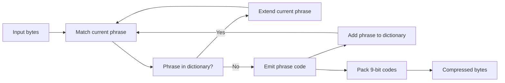

## What it is

**Data compression** reduces the number of bits needed to represent data, while **lossless compression** preserves every bit so decompression reproduces the original exactly. An **archive format** packages files, metadata, and often compressed entry streams into a container; the container and the compression algorithm are separate layers.

## How it works

Huffman coding builds a prefix-free code from symbol frequencies. Frequent symbols receive short codes, while less frequent symbols receive long codes. LZW replaces repeated byte sequences with dictionary indexes. LZ77 records a distance and length for a match found earlier in the input, whereas LZ78 replaces each phrase with a dictionary index and adds new phrases to a tree of prefixes. Deflate, the algorithm behind PKZIP's usual compression method, combines an LZ77 match stream with Huffman coding for literals, lengths, and distances.

The examples implement one operation, LZW encoding, and its inverse operation, LZW decoding, in all six languages. Codes 0 through 255 represent bytes; later codes represent discovered phrases. Each code occupies nine bits, so this compact teaching format supports 256 literal codes and 256 dictionary phrases. Production formats use headers, control codes, dictionary resets, and their own bit layouts, but the encoder and decoder here apply the same fixed rule.



Container formats decide how entries and metadata are stored. ZIP commonly stores entries with Deflate but can also store them unchanged. RAR and 7Z use their own archive structures and compression methods; 7Z commonly uses LZMA or LZMA2. LZH, commonly distributed as LHA, uses LZSS with Huffman coding in its classic form. A reader must identify the actual codec from the format and entry metadata rather than infer it from the extension.

This chapter defines the **compression ratio** as original size divided by compressed size. A ratio of 2 means that the compressed stream uses half as many bytes; a ratio below 1 indicates expansion. Container metadata and padding are included when reporting whole-archive ratios, but may be excluded when reporting an individual codec's payload ratio.

```java
import java.io.ByteArrayOutputStream;
import java.util.ArrayList;
import java.util.HashMap;
import java.util.List;
import java.util.Map;

class Lzw {
    private static final int CODE_BITS = 9;
    private static final int MAX_CODES = 1 << CODE_BITS;

    static byte[] encode(byte[] input) {
        if (input.length == 0) return new byte[0];
        Map<String, Integer> dictionary = new HashMap<>();
        for (int value = 0; value < 256; value++) {
            dictionary.put(String.valueOf((char) value), value);
        }

        List<Integer> codes = new ArrayList<>();
        int current = input[0] & 0xff;
        String phrase = String.valueOf((char) current);
        for (int index = 1; index < input.length; index++) {
            int value = input[index] & 0xff;
            String candidate = phrase + (char) value;
            if (dictionary.containsKey(candidate)) {
                phrase = candidate;
                continue;
            }
            codes.add(dictionary.get(phrase));
            if (dictionary.size() < MAX_CODES) {
                dictionary.put(candidate, dictionary.size());
            }
            phrase = String.valueOf((char) value);
        }
        codes.add(dictionary.get(phrase));

        byte[] output = new byte[(codes.size() * CODE_BITS + 7) / 8];
        for (int index = 0; index < codes.size(); index++) {
            for (int bit = 0; bit < CODE_BITS; bit++) {
                if (((codes.get(index) >>> bit) & 1) != 0) {
                    int position = index * CODE_BITS + bit;
                    output[position / 8] |= (byte) (1 << (position % 8));
                }
            }
        }
        return output;
    }

    static byte[] decode(byte[] input) {
        List<String> dictionary = new ArrayList<>();
        for (int value = 0; value < 256; value++) {
            dictionary.add(String.valueOf((char) value));
        }

        ByteArrayOutputStream output = new ByteArrayOutputStream();
        int previous = -1;
        for (int bit = 0; bit + CODE_BITS <= input.length * 8; bit += CODE_BITS) {
            int code = 0;
            for (int offset = 0; offset < CODE_BITS; offset++) {
                int position = bit + offset;
                int value = (input[position / 8] >>> (position % 8)) & 1;
                code |= value << offset;
            }
            if (previous < 0 && code > 255) throw new IllegalArgumentException("invalid compressed data");
            String entry;
            if (code < dictionary.size()) {
                entry = dictionary.get(code);
            } else if (code == dictionary.size() && previous >= 0) {
                String prior = dictionary.get(previous);
                entry = prior + prior.charAt(0);
            } else {
                throw new IllegalArgumentException("invalid compressed data");
            }
            if (previous >= 0 && dictionary.size() < MAX_CODES) {
                dictionary.add(dictionary.get(previous) + entry.charAt(0));
            }
            for (int index = 0; index < entry.length(); index++) {
                output.write((byte) entry.charAt(index));
            }
            previous = code;
        }
        return output.toByteArray();
    }
}
```

```c
#include <stdint.h>
#include <stdlib.h>
#include <string.h>

#define LZW_CODE_BITS 9
#define LZW_MAX_CODES 512

typedef struct {
    int unused;
} Lzw;

typedef struct {
    int child[256];
} LzwNode;

typedef struct {
    int previous;
    uint8_t suffix;
    size_t length;
} LzwEntry;

typedef struct {
    uint8_t *data;
    size_t length;
    size_t capacity;
} LzwBuffer;

static void lzw_write_byte(LzwBuffer *buffer, uint8_t value) {
    if (buffer->length == buffer->capacity) {
        size_t capacity = buffer->capacity == 0 ? 32 : buffer->capacity * 2;
        uint8_t *data = realloc(buffer->data, capacity);
        if (data == NULL) abort();
        buffer->data = data;
        buffer->capacity = capacity;
    }
    buffer->data[buffer->length++] = value;
}

static void lzw_write_code(LzwBuffer *output, unsigned *bit_offset, int code) {
    for (int bit = 0; bit < LZW_CODE_BITS; bit++) {
        unsigned position = *bit_offset + bit;
        uint8_t value = (uint8_t)((code >> bit) & 1);
        if (position % 8 == 0) lzw_write_byte(output, 0);
        output->data[position / 8] |= (uint8_t)(value << (position % 8));
    }
    *bit_offset += LZW_CODE_BITS;
}

size_t lzw_encode(const uint8_t *input, size_t length, uint8_t **output) {
    *output = NULL;
    if (length == 0) return 0;

    LzwNode *nodes = malloc(LZW_MAX_CODES * sizeof(*nodes));
    if (nodes == NULL) abort();
    for (int code = 0; code < LZW_MAX_CODES; code++) {
        for (int value = 0; value < 256; value++) nodes[code].child[value] = -1;
    }

    LzwBuffer buffer = {0};
    unsigned bit_offset = 0;
    int next_code = 256;
    int current = input[0];
    for (size_t index = 1; index < length; index++) {
        int value = input[index];
        int next = nodes[current].child[value];
        if (next >= 0) {
            current = next;
            continue;
        }
        lzw_write_code(&buffer, &bit_offset, current);
        if (next_code < LZW_MAX_CODES) {
            nodes[current].child[value] = next_code;
            next_code++;
        }
        current = value;
    }
    lzw_write_code(&buffer, &bit_offset, current);
    free(nodes);
    *output = buffer.data;
    return buffer.length;
}

static uint8_t lzw_first(const LzwEntry *entries, int code) {
    while (entries[code].previous >= 0) code = entries[code].previous;
    return entries[code].suffix;
}

static uint8_t *lzw_expand(const LzwEntry *entries, int code, size_t *length) {
    *length = entries[code].length;
    uint8_t *output = malloc(*length);
    uint8_t *expanded = malloc(*length);
    if (output == NULL || expanded == NULL) abort();
    size_t position = *length;
    int current = code;
    while (current >= 0) {
        expanded[--position] = entries[current].suffix;
        current = entries[current].previous;
    }
    memcpy(output, expanded, *length);
    free(expanded);
    return output;
}

size_t lzw_decode(const uint8_t *input, size_t length, uint8_t **output) {
    *output = NULL;
    if (length == 0) return 0;

    LzwEntry entries[LZW_MAX_CODES];
    for (int value = 0; value < 256; value++) {
        entries[value] = (LzwEntry){-1, (uint8_t)value, 1};
    }

    LzwBuffer buffer = {0};
    int next_code = 256;
    int previous = -1;
    for (size_t bit_offset = 0; bit_offset + LZW_CODE_BITS <= length * 8; bit_offset += LZW_CODE_BITS) {
        int code = 0;
        for (int bit = 0; bit < LZW_CODE_BITS; bit++) {
            size_t position = bit_offset + bit;
            code |= ((input[position / 8] >> (position % 8)) & 1u) << bit;
        }
        if (previous < 0 && code > 255) return 0;
        if (code > next_code || code == LZW_MAX_CODES) {
            free(buffer.data);
            return 0;
        }
        size_t entry_length;
        uint8_t *entry;
        uint8_t first;
        if (code == next_code) {
            entry_length = entries[previous].length + 1;
            entry = malloc(entry_length);
            if (entry == NULL) abort();
            size_t prior_length;
            uint8_t *prior = lzw_expand(entries, previous, &prior_length);
            memcpy(entry, prior, prior_length);
            entry[prior_length] = prior[0];
            first = prior[0];
            free(prior);
        } else {
            entry = lzw_expand(entries, code, &entry_length);
            first = lzw_first(entries, code);
        }
        for (size_t index = 0; index < entry_length; index++) lzw_write_byte(&buffer, entry[index]);
        free(entry);
        if (previous >= 0 && next_code < LZW_MAX_CODES) {
            entries[next_code].previous = previous;
            entries[next_code].suffix = first;
            entries[next_code].length = entries[previous].length + 1;
            next_code++;
        }
        previous = code;
    }
    *output = buffer.data;
    return buffer.length;
}

void lzw_free(uint8_t *data) {
    free(data);
}
```

```python
class Lzw:
    CODE_BITS = 9
    MAX_CODES = 1 << CODE_BITS

    @staticmethod
    def _write_code(packed, bit_offset, code):
        for bit in range(Lzw.CODE_BITS):
            if (bit_offset + bit) % 8 == 0:
                packed.append(0)
            position = bit_offset + bit
            if (code >> bit) & 1:
                packed[position // 8] |= 1 << (position % 8)
        return bit_offset + Lzw.CODE_BITS

    def encode(self, data):
        if not data:
            return []
        dictionary = {bytes([value]): value for value in range(256)}
        codes = []
        phrase = bytes([data[0]])
        for value in data[1:]:
            candidate = phrase + bytes([value])
            if candidate in dictionary:
                phrase = candidate
                continue
            codes.append(dictionary[phrase])
            if len(dictionary) < self.MAX_CODES:
                dictionary[candidate] = len(dictionary)
            phrase = bytes([value])
        codes.append(dictionary[phrase])
        packed = []
        bit_offset = 0
        for code in codes:
            bit_offset = self._write_code(packed, bit_offset, code)
        return packed

    def decode(self, data):
        dictionary = [bytes([value]) for value in range(256)]
        output = []
        previous = None
        bit_offset = 0
        while bit_offset + self.CODE_BITS <= len(data) * 8:
            code = 0
            for bit in range(self.CODE_BITS):
                position = bit_offset + bit
                code |= ((data[position // 8] >> (position % 8)) & 1) << bit
            if previous is None and code > 255:
                raise ValueError("invalid compressed data")
            if code < len(dictionary):
                entry = dictionary[code]
            elif code == len(dictionary) and previous is not None:
                entry = dictionary[previous] + dictionary[previous][:1]
            else:
                raise ValueError("invalid compressed data")
            if previous is not None and len(dictionary) < self.MAX_CODES:
                dictionary.append(dictionary[previous] + entry[:1])
            output.extend(entry)
            previous = code
            bit_offset += self.CODE_BITS
        return output
```

```rust
use std::collections::HashMap;

pub struct Lzw;

impl Lzw {
    const CODE_BITS: usize = 9;
    const MAX_CODES: usize = 1 << Self::CODE_BITS;

    pub fn encode(input: &[u8]) -> Vec<u8> {
        if input.is_empty() { return Vec::new(); }
        let mut dictionary = HashMap::new();
        for value in 0..=255_usize {
            dictionary.insert(vec![value as u8], value);
        }
        let mut codes = Vec::new();
        let mut phrase = vec![input[0]];
        for &value in &input[1..] {
            let mut candidate = phrase.clone();
            candidate.push(value);
            if dictionary.contains_key(&candidate) {
                phrase = candidate;
                continue;
            }
            codes.push(*dictionary.get(&phrase).unwrap());
            if dictionary.len() < Self::MAX_CODES {
                dictionary.insert(candidate, dictionary.len());
            }
            phrase = vec![value];
        }
        codes.push(*dictionary.get(&phrase).unwrap());

        let mut output = vec![0_u8; (codes.len() * Self::CODE_BITS + 7) / 8];
        for (index, code) in codes.iter().enumerate() {
            for bit in 0..Self::CODE_BITS {
                if (code >> bit) & 1 == 1 {
                    let position = index * Self::CODE_BITS + bit;
                    output[position / 8] |= 1 << (position % 8);
                }
            }
        }
        output
    }

    pub fn decode(input: &[u8]) -> Result<Vec<u8>, String> {
        let mut dictionary: Vec<Vec<u8>> = (0..=255_usize).map(|value| vec![value as u8]).collect();
        let mut output = Vec::new();
        let mut previous: Option<usize> = None;
        let mut bit_offset = 0;
        while bit_offset + Self::CODE_BITS <= input.len() * 8 {
            let mut code = 0_usize;
            for bit in 0..Self::CODE_BITS {
                let position = bit_offset + bit;
                code |= (((input[position / 8] >> (position % 8)) & 1) as usize) << bit;
            }
            if previous.is_none() && code > 255 { return Err("invalid compressed data".to_string()); }
            let entry = if code < dictionary.len() {
                dictionary[code].clone()
            } else if code == dictionary.len() && previous.is_some() {
                let mut phrase = dictionary[previous.unwrap()].clone();
                phrase.push(phrase[0]);
                phrase
            } else {
                return Err("invalid compressed data".to_string());
            };
            if let Some(previous_code) = previous {
                if dictionary.len() < Self::MAX_CODES {
                    let mut phrase = dictionary[previous_code].clone();
                    phrase.push(entry[0]);
                    dictionary.push(phrase);
                }
            }
            output.extend(entry);
            previous = Some(code);
            bit_offset += Self::CODE_BITS;
        }
        Ok(output)
    }
}
```

```typescript
class Lzw {
    private static readonly codeBits = 9;
    private static readonly maxCodes = 1 << Lzw.codeBits;

    encode(data: number[]): number[] {
        if (data.length === 0) return [];
        const dictionary = new Map<string, number>();
        for (let value = 0; value < 256; value++) {
            dictionary.set(String.fromCharCode(value), value);
        }
        const codes: number[] = [];
        let phrase = String.fromCharCode(data[0]);
        for (let index = 1; index < data.length; index++) {
            const value = data[index];
            const candidate = phrase + String.fromCharCode(value);
            if (dictionary.has(candidate)) {
                phrase = candidate;
                continue;
            }
            codes.push(dictionary.get(phrase)!);
            if (dictionary.size < Lzw.maxCodes) {
                dictionary.set(candidate, dictionary.size);
            }
            phrase = String.fromCharCode(value);
        }
        codes.push(dictionary.get(phrase)!);

        const packed: number[] = [];
        let bitOffset = 0;
        for (const code of codes) {
            for (let bit = 0; bit < Lzw.codeBits; bit++) {
                const position = bitOffset + bit;
                if (position % 8 === 0) packed.push(0);
                if ((code >>> bit) & 1) packed[position / 8] |= 1 << (position % 8);
            }
            bitOffset += Lzw.codeBits;
        }
        return packed;
    }

    decode(data: number[]): number[] {
        const dictionary: string[] = [];
        for (let value = 0; value < 256; value++) {
            dictionary.push(String.fromCharCode(value));
        }
        const output: number[] = [];
        let previous = -1;
        let bitOffset = 0;
        while (bitOffset + Lzw.codeBits <= data.length * 8) {
            let code = 0;
            for (let bit = 0; bit < Lzw.codeBits; bit++) {
                const position = bitOffset + bit;
                code |= ((data[position / 8] >>> (position % 8)) & 1) << bit;
            }
            if (previous < 0 && code > 255) throw new Error("invalid compressed data");
            let entry: string;
            if (code < dictionary.length) {
                entry = dictionary[code];
            } else if (code === dictionary.length && previous >= 0) {
                entry = dictionary[previous] + dictionary[previous][0];
            } else {
                throw new Error("invalid compressed data");
            }
            if (previous >= 0 && dictionary.length < Lzw.maxCodes) {
                dictionary.push(dictionary[previous] + entry[0]);
            }
            for (let index = 0; index < entry.length; index++) output.push(entry.charCodeAt(index));
            previous = code;
            bitOffset += Lzw.codeBits;
        }
        return output;
    }
}
```

```go
package main

import "fmt"

const lzwCodeBits = 9
const lzwMaxCodes = 1 << lzwCodeBits

type Lzw struct{}

func (Lzw) Encode(input []byte) []byte {
    if len(input) == 0 { return []byte{} }
    dictionary := make([][]byte, 256)
    codes := make(map[string]int, lzwMaxCodes)
    for value := 0; value < 256; value++ {
        entry := []byte{byte(value)}
        dictionary[value] = entry
        codes[string(entry)] = value
    }
    result := make([]int, 0)
    phrase := []byte{input[0]}
    for _, value := range input[1:] {
        candidate := lzwAppend(phrase, value)
        if _, found := codes[string(candidate)]; found {
            phrase = candidate
            continue
        }
        result = append(result, codes[string(phrase)])
        if len(dictionary) < lzwMaxCodes {
            dictionary = append(dictionary, candidate)
            codes[string(candidate)] = len(dictionary) - 1
        }
        phrase = []byte{value}
    }
    result = append(result, codes[string(phrase)])

    packed := make([]byte, (len(result)*lzwCodeBits+7)/8)
    for index, code := range result {
        for bit := 0; bit < lzwCodeBits; bit++ {
            if (code>>bit)&1 == 1 {
                position := index*lzwCodeBits + bit
                packed[position/8] |= 1 << (position % 8)
            }
        }
    }
    return packed
}

func (Lzw) Decode(input []byte) ([]byte, error) {
    if len(input) == 0 { return []byte{}, nil }
    dictionary := make([][]byte, 256)
    for value := 0; value < 256; value++ { dictionary[value] = []byte{byte(value)} }
    output := make([]byte, 0)
    previous := -1
    bitOffset := 0
    for bitOffset+lzwCodeBits <= len(input)*8 {
        code := 0
        for bit := 0; bit < lzwCodeBits; bit++ {
            position := bitOffset + bit
            code |= int((input[position/8]>>(position%8))&1) << bit
        }
        if previous < 0 && code > 255 { return nil, fmt.Errorf("invalid compressed data") }
        var entry []byte
        if code < len(dictionary) {
            entry = dictionary[code]
        } else if code == len(dictionary) && previous >= 0 {
            entry = lzwAppend(dictionary[previous], dictionary[previous][0])
        } else {
            return nil, fmt.Errorf("invalid compressed data")
        }
        output = append(output, entry...)
        if previous >= 0 && len(dictionary) < lzwMaxCodes {
            dictionary = append(dictionary, lzwAppend(dictionary[previous], entry[0]))
        }
        previous = code
        bitOffset += lzwCodeBits
    }
    return output, nil
}

func lzwAppend(phrase []byte, value byte) []byte {
    result := make([]byte, len(phrase), len(phrase)+1)
    copy(result, phrase)
    return append(result, value)
}
```

## Complexity

| Algorithm or operation | Time | Space or output note |
| --- | --- | --- |
| Huffman code construction | O(k log k) for k symbols | O(k) |
| Huffman encoding or decoding | O(n) | O(k) auxiliary |
| LZW dictionary lookup | O(1) expected for constant-size keys | At most 512 entries; sequence copying and hashing add input-dependent cost |
| LZ77 match search | Implementation-dependent | Matches require distance and length encoding |
| Deflate | O(n) for a fixed internal configuration | Additional state depends on the window and level |
| Whole-archive compression | Proportional to uncompressed entries plus container work | Output includes metadata and padding |

Here, `n` is input length and `k` is the number of distinct symbols. Compression can trade CPU time and temporary memory for a smaller output, and incompressible input can become larger after overhead and code expansion are included.

## When to use

- You need lossless reproduction of text, executable code, databases, or already-compressed media.
- You need to reduce network transfer, disk usage, or archival volume.
- You need a standard interoperable format such as ZIP, RAR, LZH, or 7Z.
- You can measure a workload's ratio and accept the CPU cost of trying several codecs and levels.
- You need streaming compression and can choose a format that exposes incremental flushes.

## Alternatives

- **Lossy compression** — wins for images, audio, and video when an application tolerates discarded detail, but does not reproduce the source exactly.
- **Stored entries** — win for already compressed or tiny files, but save no payload space and often add container overhead.
- **Transposition** — wins for specialized record formats with predictable field layout, but requires domain knowledge and does not compress general files.
- **Dictionary compression** — wins when files share vocabulary, but needs shared state and careful synchronization.

## Related

- [Dynamic Arrays, Memory Allocation, Custom Allocators, Cache Locality, and Amortized Analysis](01-dynamic-arrays.md)
- [Hash Tables: Hash Functions, Collision Resolution, Universal Hashing, and In-Memory Key-Value Storage](04-hash-tables.md)
- [In-Memory Caching Engines (Redis, Memcached), Data Structures (Sorted Sets, Streams, Bitmaps, HyperLogLog), & Eviction Policies (LRU, LFU, ARC)](../../02-system-design/02-caching/01-in-memory-caching.md)
