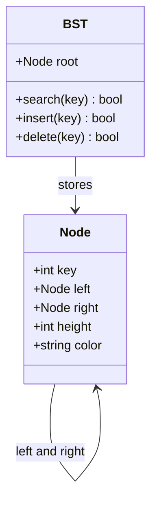

## What it is
A binary search tree (BST) is a binary tree that keeps keys ordered: every key in a node's left subtree precedes the node's key, and every key in its right subtree follows it. This invariant makes search, insertion, deletion, and ordered traversal follow a single tree path.

## How it works
Search compares a target with the current node and continues left or right. Insertion follows the same comparisons until it can attach a leaf. Deletion removes a leaf directly, replaces a one-child node with its child, and replaces a two-child node with its in-order successor. The implementations below expose the same `search`, `insert`, and `delete` operations in all six languages; insertion ignores duplicate keys, and deletion reports whether a key was removed.

An ordinary BST can degenerate into a linked list, so its worst-case height is O(n). An **AVL tree** stores each node's height and restores a height difference of at most one with rotations after each update. A **red-black tree** stores a color bit and uses recoloring and rotations to maintain logarithmic height. Java's `TreeMap`, C++'s `std::map`, Rust's `BTreeMap`, and .NET's `SortedDictionary` use balanced search trees or related implementations.



```java
public class BST {
    static class Node {
        final int key;
        Node left;
        Node right;

        Node(int key) {
            this.key = key;
        }
    }

    private Node root;

    public boolean search(int key) {
        Node current = root;
        while (current != null) {
            if (key == current.key) return true;
            current = key < current.key ? current.left : current.right;
        }
        return false;
    }

    public boolean insert(int key) {
        if (root == null) {
            root = new Node(key);
            return true;
        }
        Node current = root;
        while (true) {
            if (key == current.key) return false;
            if (key < current.key) {
                if (current.left == null) {
                    current.left = new Node(key);
                    return true;
                }
                current = current.left;
            } else {
                if (current.right == null) {
                    current.right = new Node(key);
                    return true;
                }
                current = current.right;
            }
        }
    }

    public boolean delete(int key) {
        boolean existed = search(key);
        root = deleteNode(root, key);
        return existed;
    }

    private Node deleteNode(Node node, int key) {
        if (node == null) return null;
        if (key < node.key) {
            node.left = deleteNode(node.left, key);
        } else if (key > node.key) {
            node.right = deleteNode(node.right, key);
        } else {
            if (node.left == null) return node.right;
            if (node.right == null) return node.left;
            Node successor = node.right;
            while (successor.left != null) successor = successor.left;
            node.key = successor.key;
            node.right = deleteNode(node.right, successor.key);
        }
        return node;
    }
}
```

```c
#include <stdbool.h>
#include <stdlib.h>

typedef struct BSTNode {
    int key;
    struct BSTNode *left;
    struct BSTNode *right;
} BSTNode;

typedef struct BST {
    BSTNode *root;
} BST;

BSTNode *bst_node_new(int key) {
    BSTNode *node = malloc(sizeof(BSTNode));
    node->key = key;
    node->left = NULL;
    node->right = NULL;
    return node;
}

bool bst_search(BST *tree, int key) {
    BSTNode *current = tree->root;
    while (current) {
        if (key == current->key) return true;
        current = key < current->key ? current->left : current->right;
    }
    return false;
}

bool bst_insert(BST *tree, int key) {
    if (!tree->root) {
        tree->root = bst_node_new(key);
        return true;
    }
    BSTNode *current = tree->root;
    for (;;) {
        if (key == current->key) return false;
        if (key < current->key) {
            if (!current->left) {
                current->left = bst_node_new(key);
                return true;
            }
            current = current->left;
        } else {
            if (!current->right) {
                current->right = bst_node_new(key);
                return true;
            }
            current = current->right;
        }
    }
}

bool bst_delete(BST *tree, int key) {
    BSTNode *parent = NULL;
    BSTNode *current = tree->root;
    while (current && current->key != key) {
        parent = current;
        current = key < current->key ? current->left : current->right;
    }
    if (!current) return false;
    BSTNode *replacement = current->left;
    if (!replacement) replacement = current->right;
    else {
        BSTNode *successor_parent = current;
        BSTNode *successor = current->right;
        while (successor->left) {
            successor_parent = successor;
            successor = successor->left;
        }
        if (successor_parent != current) {
            successor_parent->left = successor->right;
            successor->right = current->right;
        }
        replacement = successor;
    }
    if (!parent) tree->root = replacement;
    else if (parent->left == current) parent->left = replacement;
    else parent->right = replacement;
    free(current);
    return true;
}
```

```python
class Node:
    def __init__(self, key):
        self.key = key
        self.left = None
        self.right = None


class BST:
    def __init__(self):
        self.root = None

    def search(self, key):
        current = self.root
        while current is not None:
            if key == current.key:
                return True
            current = current.left if key < current.key else current.right
        return False

    def insert(self, key):
        if self.root is None:
            self.root = Node(key)
            return True
        current = self.root
        while True:
            if key == current.key:
                return False
            if key < current.key:
                if current.left is None:
                    current.left = Node(key)
                    return True
                current = current.left
            else:
                if current.right is None:
                    current.right = Node(key)
                    return True
                current = current.right

    def delete(self, key):
        existed = self.search(key)
        self.root = self._delete(self.root, key)
        return existed

    def _delete(self, node, key):
        if node is None:
            return None
        if key < node.key:
            node.left = self._delete(node.left, key)
        elif key > node.key:
            node.right = self._delete(node.right, key)
        else:
            if node.left is None:
                return node.right
            if node.right is None:
                return node.left
            successor = node.right
            while successor.left is not None:
                successor = successor.left
            node.key = successor.key
            node.right = self._delete(node.right, successor.key)
        return node
```

```rust
use std::cmp::Ordering;

struct Node {
    key: i32,
    left: Option<Box<Node>>,
    right: Option<Box<Node>>,
}

impl Node {
    fn new(key: i32) -> Self {
        Node { key, left: None, right: None }
    }

    fn search(&self, key: i32) -> bool {
        let mut current = Some(self);
        while let Some(node) = current {
            match key.cmp(&node.key) {
                Ordering::Equal => return true,
                Ordering::Less => current = node.left.as_deref(),
                Ordering::Greater => current = node.right.as_deref(),
            }
        }
        false
    }

    fn insert(&mut self, key: i32) -> bool {
        match key.cmp(&self.key) {
            Ordering::Equal => false,
            Ordering::Less => match self.left.as_mut() {
                Some(left) => left.insert(key),
                None => {
                    self.left = Some(Box::new(Node::new(key)));
                    true
                }
            },
            Ordering::Greater => match self.right.as_mut() {
                Some(right) => right.insert(key),
                None => {
                    self.right = Some(Box::new(Node::new(key)));
                    true
                }
            },
        }
    }

    fn delete(node: Box<Self>, key: i32) -> Option<Box<Node>> {
        match key.cmp(&node.key) {
            Ordering::Less => {
                let mut current = node;
                if let Some(left) = current.left.take() {
                    current.left = Node::delete(left, key);
                }
                Some(current)
            }
            Ordering::Greater => {
                let mut current = node;
                if let Some(right) = current.right.take() {
                    current.right = Node::delete(right, key);
                }
                Some(current)
            }
            Ordering::Equal => match (node.left, node.right) {
                (None, right) => right,
                (left, None) => left,
                (left, Some(mut right)) => {
                    let (successor, remainder) = Node::detach_min(right);
                    let mut current = Box::new(Node {
                        key: successor,
                        left,
                        right: remainder,
                    });
                    current.right = Node::delete(current.right.take().unwrap(), successor);
                    Some(current)
                }
            },
        }
    }

    fn detach_min(mut node: Box<Node>) -> (i32, Option<Box<Node>>) {
        if let Some(left) = node.left.take() {
            let (key, remainder) = Node::detach_min(left);
            node.left = remainder;
            (key, Some(node))
        } else {
            (node.key, node.right.take())
        }
    }
}

pub struct BST {
    root: Option<Box<Node>>,
}

impl BST {
    pub fn new() -> Self {
        BST { root: None }
    }

    pub fn search(&self, key: i32) -> bool {
        self.root.as_deref().map_or(false, |node| node.search(key))
    }

    pub fn insert(&mut self, key: i32) -> bool {
        match self.root.as_mut() {
            Some(root) => root.insert(key),
            None => {
                self.root = Some(Box::new(Node::new(key)));
                true
            }
        }
    }

    pub fn delete(&mut self, key: i32) -> bool {
        let existed = self.search(key);
        if let Some(root) = self.root.take() {
            self.root = Node::delete(root, key);
        }
        existed
    }
}
```

```typescript
class Node {
    left: Node | null = null;
    right: Node | null = null;

    constructor(readonly key: number) {}
}

export class BST {
    private root: Node | null = null;

    search(key: number): boolean {
        let current = this.root;
        while (current !== null) {
            if (key === current.key) return true;
            current = key < current.key ? current.left : current.right;
        }
        return false;
    }

    insert(key: number): boolean {
        if (this.root === null) {
            this.root = new Node(key);
            return true;
        }
        let current = this.root;
        while (true) {
            if (key === current.key) return false;
            if (key < current.key) {
                if (current.left === null) {
                    current.left = new Node(key);
                    return true;
                }
                current = current.left;
            } else {
                if (current.right === null) {
                    current.right = new Node(key);
                    return true;
                }
                current = current.right;
            }
        }
    }

    delete(key: number): boolean {
        const existed = this.search(key);
        this.root = this.deleteNode(this.root, key);
        return existed;
    }

    private deleteNode(node: Node | null, key: number): Node | null {
        if (node === null) return null;
        if (key < node.key) node.left = this.deleteNode(node.left, key);
        else if (key > node.key) node.right = this.deleteNode(node.right, key);
        else {
            if (node.left === null) return node.right;
            if (node.right === null) return node.left;
            let successor = node.right;
            while (successor.left !== null) successor = successor.left;
            node.key = successor.key;
            node.right = this.deleteNode(node.right, successor.key);
        }
        return node;
    }
}
```

```go
package bst

type Node struct {
	key   int
	left  *Node
	right *Node
}

type BST struct {
	root *Node
}

func New() *BST {
	return &BST{}
}

func (tree *BST) Search(key int) bool {
	current := tree.root
	for current != nil {
		if key == current.key {
			return true
		}
		if key < current.key {
			current = current.left
		} else {
			current = current.right
		}
	}
	return false
}

func (tree *BST) Insert(key int) bool {
	if tree.root == nil {
		tree.root = &Node{key: key}
		return true
	}
	current := tree.root
	for {
		if key == current.key {
			return false
		}
		if key < current.key {
			if current.left == nil {
				current.left = &Node{key: key}
				return true
			}
			current = current.left
		} else {
			if current.right == nil {
				current.right = &Node{key: key}
				return true
			}
			current = current.right
		}
	}
}

func (tree *BST) Delete(key int) bool {
    var parent *Node
    current := tree.root
    for current != nil && current.key != key {
        parent = current
        if key < current.key {
            current = current.left
        } else {
            current = current.right
        }
    }
    if current == nil {
        return false
    }
    var replacement *Node
    if current.left == nil {
        replacement = current.right
    } else {
        successorParent := current
        successor := current.right
        for successor.left != nil {
            successorParent = successor
            successor = successor.left
        }
        if successorParent != current {
            successorParent.left = successor.right
            successor.right = current.right
        }
        replacement = successor
    }
    if parent == nil {
        tree.root = replacement
    } else if parent.left == current {
        parent.left = replacement
    } else {
        parent.right = replacement
    }
    return true
}
```

### AVL and red-black balancing

An AVL tree stores the height of each node's subtree. After insertion or deletion, it updates those heights and restores the balance invariant with at most one double rotation or a sequence of single rotations. This produces a shorter tree and predictable O(log n) worst-case operations, but every update carries height bookkeeping.

A red-black tree stores one color bit per node. Its constraints limit the longest root-to-leaf path to a constant multiple of the shortest path. An update repairs a red-red violation with recoloring and rotations. Red-black trees usually perform fewer rotations than AVL trees, but their invariants are more distributed and their search is less strictly height-balanced.

## Complexity
| Operation | Time (average) | Time (worst) | Extra space |
| --- | --- | --- | --- |
| Search | O(log n) | O(n) | O(1) |
| Insert | O(log n) | O(n) | O(1) |
| Delete | O(log n) | O(n) | O(1) |
| In-order traversal | O(n) | O(n) | O(h) with recursion |

Here `n` is the number of keys and `h` is tree height. Sorted input can make an ordinary BST a chain. AVL and red-black trees use rotations to keep `h` at O(log n), so every operation has an O(log n) worst-case bound.

## When to use
- You need ordered iteration together with dynamic search, insertion, and deletion.
- You need range queries, predecessor and successor lookups, or floor and ceiling keys.
- You can accept logarithmic worst-case updates only when a self-balancing implementation is used.
- The key set fits in memory and does not require a full disk-oriented index.

## Alternatives
- **Hash table** — wins for point membership with O(1) average operations, but loses ordering and range queries.
- **Sorted array** — gives O(log n) search and O(1) indexed access with compact storage, but shifting makes updates O(n).
- **B+ tree** — favors page-based storage and range scans, but adds block layout and ownership rules.
- **Treap** — gives expected O(log n) operations with simpler balancing than AVL or red-black code, but its behavior depends on random priorities.

## Related
- [Range Query Trees (Segment Trees and Fenwick Trees)](04-range-query-trees.md)
- [Tries, Radix Trees, and Suffix Trees/Arrays](06-tries-suffix.md)
- [Language Parsing Data Structures: ASTs, Parse Trees, and Symbol Tables](08-language-parsing.md)
- [Dynamic Arrays, Memory Allocation, and Amortized Analysis](../01-linear-data-structures/01-dynamic-arrays.md)
