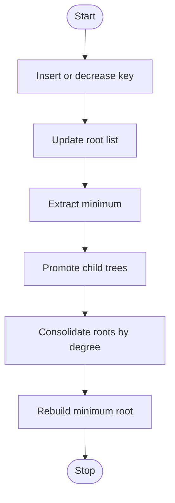

## What it is
A heap is a complete binary tree that keeps every parent ordered before its children. A **binary heap** is commonly stored in an array, and a priority queue is the interface that repeatedly removes the smallest or largest key. A **Fibonacci heap** is a looser forest that trades more update bookkeeping for faster amortized decrease-key.

## How it works
For zero-based array index `i`, a binary min-heap stores children at `2i+1` and `2i+2` and the parent at floor `(i-1)/2`. Insert appends a key and sifts it upward; extraction moves the last key to the root and sifts it downward. The complete-tree layout avoids pointers and keeps the height at floor(log₂ n). The implementations below expose the same `insert`, `extract_min`, `peek`, and `size` operations in all six languages.

A Fibonacci heap consists of root lists and circular linked lists organized into binomial trees. Insertion adds a singleton tree, extraction promotes each child of the minimum root and consolidates roots by degree, and decrease-key cuts a node from its parent before cascading upward. Its amortized bounds are O(1) for insert and decrease-key and O(log n) for extract-min. Java's older `FibonacciHeap` example and research systems illustrate the structure, but production graph libraries usually choose binary or pairing heaps because those designs are simpler and cache-efficient.



```java
import java.util.Arrays;

public class MinHeap {
    private int[] data = new int[16];
    private int size;

    public void insert(int value) {
        if (size == data.length) data = Arrays.copyOf(data, data.length * 2);
        data[size] = value;
        int index = size++;
        while (index > 0) {
            int parent = (index - 1) / 2;
            if (data[parent] <= data[index]) break;
            swap(parent, index);
            index = parent;
        }
    }

    public int extractMin() {
        if (size == 0) throw new IllegalStateException("empty heap");
        int minimum = data[0];
        data[0] = data[--size];
        siftDown();
        return minimum;
    }

    public int peek() {
        if (size == 0) throw new IllegalStateException("empty heap");
        return data[0];
    }

    public int size() {
        return size;
    }

    private void siftDown() {
        int index = 0;
        while (true) {
            int left = 2 * index + 1;
            int right = left + 1;
            int smallest = index;
            if (left < size && data[left] < data[smallest]) smallest = left;
            if (right < size && data[right] < data[smallest]) smallest = right;
            if (smallest == index) break;
            swap(index, smallest);
            index = smallest;
        }
    }

    private void swap(int left, int right) {
        int value = data[left];
        data[left] = data[right];
        data[right] = value;
    }
}
```

```c
#include <stdbool.h>
#include <stddef.h>
#include <stdlib.h>

typedef struct {
    int *data;
    size_t size;
    size_t capacity;
} MinHeap;

void min_heap_init(MinHeap *heap) {
    heap->capacity = 16;
    heap->size = 0;
    heap->data = malloc(heap->capacity * sizeof(int));
}

void min_heap_destroy(MinHeap *heap) {
    free(heap->data);
    heap->data = NULL;
    heap->size = 0;
    heap->capacity = 0;
}

void min_heap_insert(MinHeap *heap, int value) {
    if (heap->size == heap->capacity) {
        heap->capacity *= 2;
        heap->data = realloc(heap->data, heap->capacity * sizeof(int));
    }
    size_t index = heap->size++;
    heap->data[index] = value;
    while (index > 0) {
        size_t parent = (index - 1) / 2;
        if (heap->data[parent] <= heap->data[index]) break;
        int swap = heap->data[parent];
        heap->data[parent] = heap->data[index];
        heap->data[index] = swap;
        index = parent;
    }
}

bool min_heap_extract_min(MinHeap *heap, int *value) {
    if (heap->size == 0) return false;
    *value = heap->data[0];
    heap->data[0] = heap->data[--heap->size];
    size_t index = 0;
    while (index < heap->size) {
        size_t left = 2 * index + 1;
        size_t right = left + 1;
        size_t smallest = index;
        if (left < heap->size && heap->data[left] < heap->data[smallest]) smallest = left;
        if (right < heap->size && heap->data[right] < heap->data[smallest]) smallest = right;
        if (smallest == index) break;
        int swap = heap->data[index];
        heap->data[index] = heap->data[smallest];
        heap->data[smallest] = swap;
        index = smallest;
    }
    return true;
}

bool min_heap_peek(const MinHeap *heap, int *value) {
    if (heap->size == 0) return false;
    *value = heap->data[0];
    return true;
}

size_t min_heap_size(const MinHeap *heap) {
    return heap->size;
}
```

```python
class MinHeap:
    def __init__(self):
        self.data = []

    def insert(self, value):
        self.data.append(value)
        index = len(self.data) - 1
        while index > 0:
            parent = (index - 1) // 2
            if self.data[parent] <= self.data[index]:
                break
            self.data[parent], self.data[index] = self.data[index], self.data[parent]
            index = parent

    def extract_min(self):
        if not self.data:
            raise IndexError("empty heap")
        minimum = self.data[0]
        self.data[0] = self.data.pop()
        self._sift_down()
        return minimum

    def peek(self):
        if not self.data:
            raise IndexError("empty heap")
        return self.data[0]

    def size(self):
        return len(self.data)

    def _sift_down(self):
        index = 0
        while index < len(self.data):
            left = 2 * index + 1
            right = left + 1
            smallest = index
            if left < len(self.data) and self.data[left] < self.data[smallest]:
                smallest = left
            if right < len(self.data) and self.data[right] < self.data[smallest]:
                smallest = right
            if smallest == index:
                break
            self.data[index], self.data[smallest] = self.data[smallest], self.data[index]
            index = smallest
```

```rust
pub struct MinHeap {
    data: Vec<i32>,
}

impl MinHeap {
    pub fn new() -> Self {
        MinHeap { data: Vec::new() }
    }

    pub fn insert(&mut self, value: i32) {
        self.data.push(value);
        let mut index = self.data.len() - 1;
        while index > 0 {
            let parent = (index - 1) / 2;
            if self.data[parent] <= self.data[index] {
                break;
            }
            self.data.swap(parent, index);
            index = parent;
        }
    }

    pub fn extract_min(&mut self) -> Option<i32> {
        if self.data.is_empty() {
            return None;
        }
        let minimum = self.data[0];
        let last = self.data.pop().unwrap();
        if !self.data.is_empty() {
            self.data[0] = last;
            self.sift_down();
        }
        Some(minimum)
    }

    pub fn peek(&self) -> Option<i32> {
        self.data.first().copied()
    }

    pub fn size(&self) -> usize {
        self.data.len()
    }

    fn sift_down(&mut self) {
        let length = self.data.len();
        let mut index = 0;
        while index < length {
            let left = 2 * index + 1;
            let right = left + 1;
            let mut smallest = index;
            if left < length && self.data[left] < self.data[smallest] {
                smallest = left;
            }
            if right < length && self.data[right] < self.data[smallest] {
                smallest = right;
            }
            if smallest == index {
                break;
            }
            self.data.swap(index, smallest);
            index = smallest;
        }
    }
}
```

```typescript
export class MinHeap {
    private data: number[] = [];

    insert(value: number): void {
        this.data.push(value);
        let index = this.data.length - 1;
        while (index > 0) {
            const parent = Math.floor((index - 1) / 2);
            if (this.data[parent] <= this.data[index]) break;
            [this.data[parent], this.data[index]] = [this.data[index], this.data[parent]];
            index = parent;
        }
    }

    extractMin(): number {
        if (this.data.length === 0) throw new Error("empty heap");
        const minimum = this.data[0];
        this.data[0] = this.data.pop()!;
        this.siftDown();
        return minimum;
    }

    peek(): number {
        if (this.data.length === 0) throw new Error("empty heap");
        return this.data[0];
    }

    size(): number {
        return this.data.length;
    }

    private siftDown(): void {
        let index = 0;
        while (index < this.data.length) {
            const left = 2 * index + 1;
            const right = left + 1;
            let smallest = index;
            if (left < this.data.length && this.data[left] < this.data[smallest]) smallest = left;
            if right < this.data.length && this.data[right] < this.data[smallest]) smallest = right;
            if (smallest === index) break;
            [this.data[index], this.data[smallest]] = [this.data[smallest], this.data[index]];
            index = smallest;
        }
    }
}
```

```go
package heap

type MinHeap struct {
	data []int
}

func New() *MinHeap {
	return &MinHeap{}
}

func (heap *MinHeap) Insert(value int) {
	heap.data = append(heap.data, value)
	index := len(heap.data) - 1
	for index > 0 {
		parent := (index - 1) / 2
		if heap.data[parent] <= heap.data[index] {
			break
		}
		heap.data[parent], heap.data[index] = heap.data[index], heap.data[parent]
		index = parent
	}
}

func (heap *MinHeap) ExtractMin() (int, bool) {
	if len(heap.data) == 0 {
		return 0, false
	}
	minimum := heap.data[0]
	heap.data[0] = heap.data[len(heap.data)-1]
	heap.data = heap.data[:len(heap.data)-1]
	heap.siftDown()
	return minimum, true
}

func (heap *MinHeap) Peek() (int, bool) {
	if len(heap.data) == 0 {
		return 0, false
	}
	return heap.data[0], true
}

func (heap *MinHeap) Size() int {
	return len(heap.data)
}

func (heap *MinHeap) siftDown() {
    index := 0
    for index < len(heap.data) {
        left := 2*index + 1
        right := left + 1
        smallest := index
        if left < len(heap.data) && heap.data[left] < heap.data[smallest] {
            smallest = left
        }
        if right < len(heap.data) && heap.data[right] < heap.data[smallest] {
            smallest = right
        }
        if smallest == index {
            break
        }
        heap.data[index], heap.data[smallest] = heap.data[smallest], heap.data[index]
        index = smallest
    }
}
```

### Fibonacci-heap operations

A Fibonacci heap keeps a list of roots and organizes nodes into circular child lists. `insert` adds a singleton tree in O(1) time. `extract_min` removes the minimum root, promotes its children, and consolidates equal-degree trees; the deferred work makes the operation O(log n) amortized. `decrease-key` changes a key, cuts a node from its parent when the heap order breaks, and continues cutting ancestors until the heap property is restored. That cutting is why decrease-key can be O(1) amortized even though a single cut may expose several ancestors.

## Complexity
| Operation or structure | Time | Extra space |
| --- | --- | --- |
| Peek | O(1) | O(1) |
| Binary-heap insert | O(log n) | O(1), excluding growth |
| Binary-heap extract-min | O(log n) | O(1) |
| Bottom-up heap construction | O(n) | O(1) in place |
| Fibonacci-heap insert or decrease-key | O(1) amortized | O(1) amortized |
| Fibonacci-heap extract-min | O(log n) amortized | O(log n) amortized |

Bottom-up binary-heap construction is O(n) because a node's sift-down work is bounded by its subtree height, and most nodes have small subtrees.

## When to use
- You need the minimum or maximum key repeatedly while a set changes.
- You are implementing Dijkstra's or Prim's algorithm with queued candidate keys.
- You need top-k selection or a k-way merge over sorted streams.
- Tasks must run in priority order rather than arrival order.

## Alternatives
- **Balanced search tree** — supports ordered traversal and arbitrary-key deletion, but uses more memory and update bookkeeping.
- **Unsorted list** — makes insertion cheap, but finding the minimum or maximum becomes O(n).
- **Pairing heap** — simplifies fast decrease-key behavior, but has worse practical cache locality than a flat binary heap.
- **Fibonacci heap** — improves the theoretical decrease-key bound, but has higher constants and substantially more complex implementation.

## Related
- [Binary Search Trees](01-binary-search-trees.md)
- [Minimum Spanning Trees](../04-graphs/04-minimum-spanning-trees.md)
- [Shortest Paths](../04-graphs/05-shortest-paths.md)
