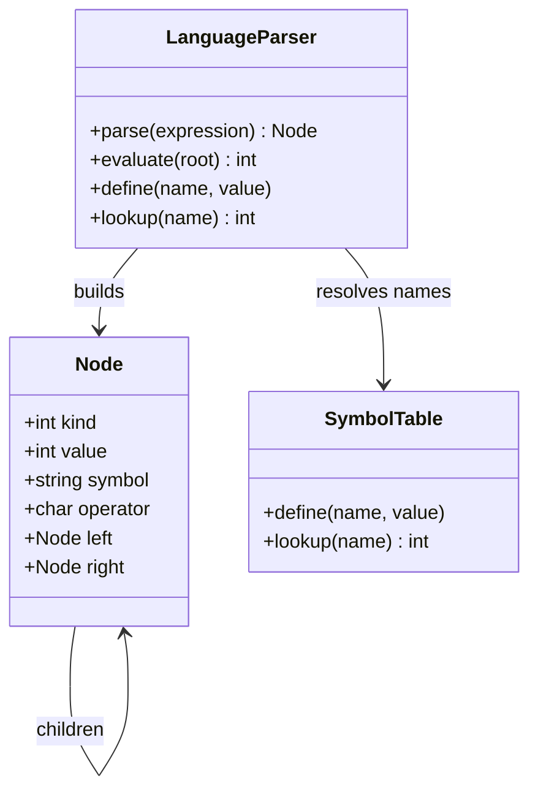

## What it is

Language parsing turns source text into a structured representation before meaning is executed. A **parse tree** mirrors the grammar's production rules, an **abstract syntax tree (AST)** keeps only the structure needed by a language or tool, and a **symbol table** maps names to their declarations, types, scopes, and values. Parsers therefore combine a grammar-driven tree builder with a lookup structure that resolves names after or during parsing.

## How it works

A **lexer** separates source text into tokens such as identifiers, integers, operators, and parentheses. A recursive-descent parser follows grammar rules for expressions: it parses factors, then multiplication or division, then addition or subtraction. Each operator creates a node with left and right children. The resulting AST omits punctuation that no later phase needs, while a concrete parse tree would retain grammar productions that exist only to guide parsing.

A symbol table maps an identifier to a value or declaration. An assignment can insert or update a binding, while evaluation of an identifier looks up that binding. Nested languages add scopes: a child table is searched first, and a parent table is searched when the child does not contain the name. Compilers, linters, interpreters, and query engines all use this separation between structure and name resolution.

The examples below implement the same logical operations in all six languages: `parse` builds an AST, `evaluate` walks it, `define` stores a binding, and `lookup` retrieves a binding. The grammar is intentionally small: non-negative integers, identifiers, parentheses, `+`, `-`, `*`, and `/`. It demonstrates the data structures and recursive parser path without implementing a complete programming language.



```java
import java.util.HashMap;
import java.util.Map;

class Node {
    static final int NUMBER = 0;
    static final int SYMBOL = 1;
    static final int OPERATOR = 2;

    int kind;
    int value;
    String symbol;
    char operator;
    Node left;
    Node right;

    Node(int value) {
        kind = NUMBER;
        this.value = value;
    }

    Node(String symbol) {
        kind = SYMBOL;
        this.symbol = symbol;
    }

    Node(char operator, Node left, Node right) {
        kind = OPERATOR;
        this.operator = operator;
        this.left = left;
        this.right = right;
    }
}

class LanguageParser {
    private final Map<String, Integer> symbols = new HashMap<>();

    Node parse(String expression) {
        Cursor cursor = new Cursor(expression.trim().split("\\s+"));
        Node result = parseExpression(cursor);
        if (cursor.index != cursor.tokens.length) throw new IllegalArgumentException("unexpected token");
        return result;
    }

    int evaluate(Node node) {
        if (node.kind == Node.NUMBER) return node.value;
        if (node.kind == Node.SYMBOL) return lookup(node.symbol);
        int left = evaluate(node.left);
        int right = evaluate(node.right);
        return switch (node.operator) {
            case '+' -> left + right;
            case '-' -> left - right;
            case '*' -> left * right;
            case '/' -> {
                if (right == 0) throw new IllegalArgumentException("division by zero");
                yield left / right;
            }
            default -> throw new IllegalArgumentException("invalid operator");
        };
    }

    void define(String name, int value) {
        symbols.put(name, value);
    }

    int lookup(String name) {
        Integer value = symbols.get(name);
        if (value == null) throw new IllegalArgumentException("unknown symbol");
        return value;
    }

    private Node parseExpression(Cursor cursor) {
        Node value = parseTerm(cursor);
        while (cursor.accept("+") || cursor.accept("-")) {
            String operator = cursor.previous();
            value = new Node(operator.charAt(0), value, parseTerm(cursor));
        }
        return value;
    }

    private Node parseTerm(Cursor cursor) {
        Node value = parseFactor(cursor);
        while (cursor.accept("*") || cursor.accept("/")) {
            String operator = cursor.previous();
            value = new Node(operator.charAt(0), value, parseFactor(cursor));
        }
        return value;
    }

    private Node parseFactor(Cursor cursor) {
        if (cursor.accept("(")) {
            Node value = parseExpression(cursor);
            if (!cursor.accept(")")) throw new IllegalArgumentException("missing parenthesis");
            return value;
        }
        String token = cursor.next();
        if (Character.isDigit(token.charAt(0))) return new Node(Integer.parseInt(token));
        return new Node(token);
    }

    private static class Cursor {
        private final String[] tokens;
        private int index;
        private String previous = "";

        Cursor(String[] tokens) {
            this.tokens = tokens;
        }

        String next() {
            if (index >= tokens.length) throw new IllegalArgumentException("unexpected end");
            previous = tokens[index++];
            return previous;
        }

        boolean accept(String token) {
            if (index < tokens.length && tokens[index].equals(token)) {
                previous = tokens[index++];
                return true;
            }
            return false;
        }

        String previous() {
            return previous;
        }
    }
}
```

```c
#include <ctype.h>
#include <stdlib.h>
#include <string.h>

#define LANGUAGE_PARSER_SYMBOLS 32

typedef struct Node {
    int kind;
    int value;
    char symbol[32];
    char operator;
    struct Node *left;
    struct Node *right;
} Node;

typedef struct {
    char names[LANGUAGE_PARSER_SYMBOLS][32];
    int values[LANGUAGE_PARSER_SYMBOLS];
    int size;
} LanguageParser;

typedef struct {
    char tokens[256][32];
    int count;
    int index;
} Cursor;

static Node *node_number(int value) {
    Node *node = calloc(1, sizeof(Node));
    if (node == NULL) abort();
    node->kind = 0;
    node->value = value;
    return node;
}

static Node *node_symbol(const char *symbol) {
    Node *node = calloc(1, sizeof(Node));
    if (node == NULL) abort();
    node->kind = 1;
    strncpy(node->symbol, symbol, sizeof(node->symbol) - 1);
    return node;
}

static Node *node_operator(char operator, Node *left, Node *right) {
    Node *node = calloc(1, sizeof(Node));
    if (node == NULL) abort();
    node->kind = 2;
    node->operator = operator;
    node->left = left;
    node->right = right;
    return node;
}

static int cursor_accept(Cursor *cursor, const char *token) {
    if (cursor->index < cursor->count && strcmp(cursor->tokens[cursor->index], token) == 0) {
        cursor->index++;
        return 1;
    }
    return 0;
}

static Node *parse_expression(LanguageParser *parser, Cursor *cursor);

static Node *parse_factor(LanguageParser *parser, Cursor *cursor) {
    if (cursor_accept(cursor, "(")) {
        Node *value = parse_expression(parser, cursor);
        if (!cursor_accept(cursor, ")")) return NULL;
        return value;
    }
    if (cursor->index >= cursor->count) return NULL;
    char *token = cursor->tokens[cursor->index++];
    if (isdigit((unsigned char)token[0])) return node_number(atoi(token));
    return node_symbol(token);
}

static Node *parse_term(LanguageParser *parser, Cursor *cursor) {
    Node *value = parse_factor(parser, cursor);
    if (value == NULL) return NULL;
    while (cursor->index < cursor->count &&
           (strcmp(cursor->tokens[cursor->index], "*") == 0 || strcmp(cursor->tokens[cursor->index], "/") == 0)) {
        char operator = cursor->tokens[cursor->index++][0];
        Node *right = parse_factor(parser, cursor);
        if (right == NULL) return NULL;
        value = node_operator(operator, value, right);
    }
    return value;
}

static Node *parse_expression(LanguageParser *parser, Cursor *cursor) {
    Node *value = parse_term(parser, cursor);
    if (value == NULL) return NULL;
    while (cursor->index < cursor->count &&
           (strcmp(cursor->tokens[cursor->index], "+") == 0 || strcmp(cursor->tokens[cursor->index], "-") == 0)) {
        char operator = cursor->tokens[cursor->index++][0];
        Node *right = parse_term(parser, cursor);
        if (right == NULL) return NULL;
        value = node_operator(operator, value, right);
    }
    return value;
}

Node *language_parser_parse(LanguageParser *parser, const char *expression) {
    Cursor cursor = {0};
    char copy[4096];
    if (parser == NULL || expression == NULL || strlen(expression) >= sizeof(copy)) return NULL;
    strcpy(copy, expression);
    char *token = strtok(copy, " \t\n");
    while (token != NULL && cursor.count < 256) {
        strncpy(cursor.tokens[cursor.count++], token, 31);
        token = strtok(NULL, " \t\n");
    }
    Node *result = parse_expression(parser, &cursor);
    if (result == NULL || cursor.index != cursor.count) return NULL;
    return result;
}

int language_parser_evaluate(LanguageParser *parser, const Node *node) {
    if (node == NULL) return 0;
    if (node->kind == 0) return node->value;
    if (node->kind == 1) {
        int value;
        if (!language_parser_lookup(parser, node->symbol, &value)) return 0;
        return value;
    }
    int left = language_parser_evaluate(parser, node->left);
    int right = language_parser_evaluate(parser, node->right);
    if (node->operator == '+') return left + right;
    if (node->operator == '-') return left - right;
    if (node->operator == '*') return left * right;
    return right == 0 ? 0 : left / right;
}

void language_parser_define(LanguageParser *parser, const char *name, int value) {
    if (parser == NULL || name == NULL) return;
    for (int index = 0; index < parser->size; index++) {
        if (strcmp(parser->names[index], name) == 0) {
            parser->values[index] = value;
            return;
        }
    }
    if (parser->size < LANGUAGE_PARSER_SYMBOLS) {
        strncpy(parser->names[parser->size], name, 31);
        parser->values[parser->size] = value;
        parser->size++;
    }
}

int language_parser_lookup(const LanguageParser *parser, const char *name, int *value) {
    for (int index = 0; index < parser->size; index++) {
        if (strcmp(parser->names[index], name) == 0) {
            *value = parser->values[index];
            return 1;
        }
    }
    return 0;
}
```

```python
class Node:
    NUMBER = 0
    SYMBOL = 1
    OPERATOR = 2

    def __init__(self, kind, value=None, operator=None, left=None, right=None):
        self.kind = kind
        self.value = value
        self.operator = operator
        self.left = left
        self.right = right


class LanguageParser:
    def parse(self, expression):
        tokens = expression.split()
        position = 0

        def accept(token):
            nonlocal position
            if position < len(tokens) and tokens[position] == token:
                position += 1
                return True
            return False

        def factor():
            nonlocal position
            if accept("("):
                value = expression_node()
                if not accept(")"):
                    raise ValueError("missing parenthesis")
                return value
            if position >= len(tokens):
                raise ValueError("unexpected end")
            token = tokens[position]
            position += 1
            if token[0].isdigit():
                return Node(Node.NUMBER, value=int(token))
            return Node(Node.SYMBOL, value=token)

        def term():
            value = factor()
            while position < len(tokens) and tokens[position] in {"*", "/"}:
                operator = tokens[position]
                position += 1
                value = Node(Node.OPERATOR, operator=operator, left=value, right=factor())
            return value

        def expression_node():
            value = term()
            while position < len(tokens) and tokens[position] in {"+", "-"}:
                operator = tokens[position]
                position += 1
                value = Node(Node.OPERATOR, operator=operator, left=value, right=term())
            return value

        result = expression_node()
        if position != len(tokens):
            raise ValueError("unexpected token")
        return result

    def evaluate(self, node):
        if node.kind == Node.NUMBER:
            return node.value
        if node.kind == Node.SYMBOL:
            return self.lookup(node.value)
        left = self.evaluate(node.left)
        right = self.evaluate(node.right)
        if node.operator == "+":
            return left + right
        if node.operator == "-":
            return left - right
        if node.operator == "*":
            return left * right
        if right == 0:
            raise ValueError("division by zero")
        return left // right

    def define(self, name, value):
        self.symbols[name] = value

    def lookup(self, name):
        if name not in self.symbols:
            raise KeyError(name)
        return self.symbols[name]

    def __init__(self):
        self.symbols = {}
```

```rust
use std::collections::HashMap;

enum Node {
    Number(i64),
    Symbol(String),
    Operator { operator: char, left: Box<Node>, right: Box<Node> },
}

struct LanguageParser {
    symbols: HashMap<String, i64>,
}

impl LanguageParser {
    fn parse(&self, expression: &str) -> Result<Node, String> {
        let tokens: Vec<&str> = expression.split_whitespace().collect();
        let mut index = 0;
        let node = self.parse_expression(&tokens, &mut index)?;
        if index != tokens.len() { return Err("unexpected token".to_string()); }
        Ok(node)
    }

    fn evaluate(&self, node: &Node) -> Result<i64, String> {
        match node {
            Node::Number(value) => Ok(*value),
            Node::Symbol(name) => self.lookup(name),
            Node::Operator { operator, left, right } => {
                let left = self.evaluate(left)?;
                let right = self.evaluate(right)?;
                match operator {
                    '+' => Ok(left + right),
                    '-' => Ok(left - right),
                    '*' => Ok(left * right),
                    '/' if right == 0 => Err("division by zero".to_string()),
                    '/' => Ok(left / right),
                    _ => Err("invalid operator".to_string()),
                }
            }
        }
    }

    fn define(&mut self, name: &str, value: i64) {
        self.symbols.insert(name.to_string(), value);
    }

    fn lookup(&self, name: &str) -> Result<i64, String> {
        self.symbols.get(name).copied().ok_or_else(|| format!("unknown symbol: {name}"))
    }

    fn parse_expression(&self, tokens: &[&str], index: &mut usize) -> Result<Node, String> {
        let mut value = self.parse_term(tokens, index)?;
        while *index < tokens.len() && (tokens[*index] == "+" || tokens[*index] == "-") {
            let operator = tokens[*index].chars().next().unwrap();
            *index += 1;
            let right = self.parse_term(tokens, index)?;
            value = Node::Operator { operator, left: Box::new(value), right: Box::new(right) };
        }
        Ok(value)
    }

    fn parse_term(&self, tokens: &[&str], index: &mut usize) -> Result<Node, String> {
        let mut value = self.parse_factor(tokens, index)?;
        while *index < tokens.len() && (tokens[*index] == "*" || tokens[*index] == "/") {
            let operator = tokens[*index].chars().next().unwrap();
            *index += 1;
            let right = self.parse_factor(tokens, index)?;
            value = Node::Operator { operator, left: Box::new(value), right: Box::new(right) };
        }
        Ok(value)
    }

    fn parse_factor(&self, tokens: &[&str], index: &mut usize) -> Result<Node, String> {
        if *index >= tokens.len() { return Err("unexpected end".to_string()); }
        if tokens[*index] == "(" {
            *index += 1;
            let value = self.parse_expression(tokens, index)?;
            if *index >= tokens.len() || tokens[*index] != ")" { return Err("missing parenthesis".to_string()); }
            *index += 1;
            return Ok(value);
        }
        let token = tokens[*index];
        *index += 1;
        match token.parse::<i64>() {
            Ok(value) => Ok(Node::Number(value)),
            Err(_) => Ok(Node::Symbol(token.to_string())),
        }
    }
}
```

```typescript
class Node {
    static NUMBER = 0;
    static SYMBOL = 1;
    static OPERATOR = 2;

    constructor(kind: number, value?: number | string, operator?: string, left?: Node, right?: Node) {
        this.kind = kind;
        this.value = value;
        this.operator = operator;
        this.left = left;
        this.right = right;
    }

    kind: number;
    value?: number | string;
    operator?: string;
    left?: Node;
    right?: Node;
}

class LanguageParser {
    private symbols = new Map<string, number>();

    parse(expression: string): Node {
        const tokens = expression.trim().split(/\s+/);
        let position = 0;
        const accept = (token: string): boolean => {
            if (tokens[position] === token) { position++; return true; }
            return false;
        };
        const factor = (): Node => {
            if (accept("(")) {
                const value = expressionNode();
                if (!accept(")")) throw new Error("missing parenthesis");
                return value;
            }
            if (position >= tokens.length) throw new Error("unexpected end");
            const token = tokens[position++];
            if (/^\d+$/.test(token)) return new Node(Node.NUMBER, Number(token));
            return new Node(Node.SYMBOL, token);
        };
        const term = (): Node => {
            let value = factor();
            while (tokens[position] === "*" || tokens[position] === "/") {
                const operator = tokens[position++];
                value = new Node(Node.OPERATOR, undefined, operator, value, factor());
            }
            return value;
        };
        const expressionNode = (): Node => {
            let value = term();
            while (tokens[position] === "+" || tokens[position] === "-") {
                const operator = tokens[position++];
                value = new Node(Node.OPERATOR, undefined, operator, value, term());
            }
            return value;
        };
        const result = expressionNode();
        if (position !== tokens.length) throw new Error("unexpected token");
        return result;
    }

    evaluate(node: Node): number {
        if (node.kind === Node.NUMBER) return node.value as number;
        if (node.kind === Node.SYMBOL) return this.lookup(node.value as string);
        const left = this.evaluate(node.left!);
        const right = this.evaluate(node.right!);
        if (node.operator === "+") return left + right;
        if (node.operator === "-") return left - right;
        if (node.operator === "*") return left * right;
        if (right === 0) throw new Error("division by zero");
        return Math.trunc(left / right);
    }

    define(name: string, value: number): void {
        this.symbols.set(name, value);
    }

    lookup(name: string): number {
        const value = this.symbols.get(name);
        if (value === undefined) throw new Error(`unknown symbol: ${name}`);
        return value;
    }
}
```

```go
package main

import (
    "fmt"
    "strconv"
    "strings"
)

type Node struct {
    Kind     int
    Value    int
    Symbol   string
    Operator string
    Left     *Node
    Right    *Node
}

type LanguageParser struct {
    Symbols map[string]int
}

func (parser *LanguageParser) Parse(expression string) (*Node, error) {
    tokens := strings.Fields(expression)
    position := 0
    node, err := parser.parseExpression(tokens, &position)
    if err != nil { return nil, err }
    if position != len(tokens) { return nil, fmt.Errorf("unexpected token") }
    return node, nil
}

func (parser *LanguageParser) Evaluate(node *Node) (int, error) {
    if node.Kind == 0 { return node.Value, nil }
    if node.Kind == 1 {
        value, found := parser.Lookup(node.Symbol)
        if !found { return 0, fmt.Errorf("unknown symbol: %s", node.Symbol) }
        return value, nil
    }
    left, err := parser.Evaluate(node.Left)
    if err != nil { return 0, err }
    right, err := parser.Evaluate(node.Right)
    if err != nil { return 0, err }
    switch node.Operator {
    case "+": return left + right, nil
    case "-": return left - right, nil
    case "*": return left * right, nil
    case "/":
        if right == 0 { return 0, fmt.Errorf("division by zero") }
        return left / right, nil
    default: return 0, fmt.Errorf("invalid operator")
    }
}

func (parser *LanguageParser) Define(name string, value int) {
    if parser.Symbols == nil { parser.Symbols = make(map[string]int) }
    parser.Symbols[name] = value
}

func (parser *LanguageParser) Lookup(name string) (int, bool) {
    value, found := parser.Symbols[name]
    return value, found
}

func (parser *LanguageParser) parseFactor(tokens []string, position *int) (*Node, error) {
    if *position >= len(tokens) { return nil, fmt.Errorf("unexpected end") }
    if tokens[*position] == "(" {
        *position++
        node, err := parser.parseExpression(tokens, position)
        if err != nil { return nil, err }
        if *position >= len(tokens) || tokens[*position] != ")" { return nil, fmt.Errorf("missing parenthesis") }
        *position++
        return node, nil
    }
    token := tokens[*position]
    *position++
    if value, err := strconv.Atoi(token); err == nil {
        return &Node{Kind: 0, Value: value}, nil
    }
    return &Node{Kind: 1, Symbol: token}, nil
}

func (parser *LanguageParser) parseTerm(tokens []string, position *int) (*Node, error) {
    left, err := parser.parseFactor(tokens, position)
    if err != nil { return nil, err }
    for *position < len(tokens) && (tokens[*position] == "*" || tokens[*position] == "/") {
        operator := tokens[*position]
        *position++
        right, err := parser.parseFactor(tokens, position)
        if err != nil { return nil, err }
        left = &Node{Kind: 2, Operator: operator, Left: left, Right: right}
    }
    return left, nil
}

func (parser *LanguageParser) parseExpression(tokens []string, position *int) (*Node, error) {
    left, err := parser.parseTerm(tokens, position)
    if err != nil { return nil, err }
    for *position < len(tokens) && (tokens[*position] == "+" || tokens[*position] == "-") {
        operator := tokens[*position]
        *position++
        right, err := parser.parseTerm(tokens, position)
        if err != nil { return nil, err }
        left = &Node{Kind: 2, Operator: operator, Left: left, Right: right}
    }
    return left, nil
}
```

## Complexity

| Operation | Time | Space |
| --- | --- | --- |
| Parse expression with `n` tokens | O(n) | O(n) AST space |
| Evaluate an AST with `n` nodes | O(n) | O(h) call stack, where `h` is tree height |
| Define a symbol | O(1) average | O(1) additional |
| Look up a symbol | O(1) average | O(1) auxiliary |

The parser's AST uses O(n) space. Evaluation uses O(h) call-stack space because a depth-first traversal keeps one active path; a balanced expression has logarithmic height, while a deeply nested expression can have linear height.

## When to use

- You need to preserve the structure of source code for a compiler, interpreter, formatter, or linter.
- You need to evaluate an expression more than once without reparsing its text.
- You need to resolve identifiers through a symbol table with explicit bindings or scopes.
- You are designing a syntax-aware tool that must distinguish structure from formatting details.

## Alternatives

- **Direct recursive evaluation** — avoids building an AST and can use less memory for one evaluation, but repeats parsing work and makes later analysis harder.
- **Parse tree** — preserves every grammar production and is useful for grammar tools, but carries nodes that an AST can omit.
- **Hash table symbol table** — provides fast average lookup and simple binding updates, but does not provide ordered iteration or scope hierarchy by itself.
- **Token stream** — is simple and memory-efficient, but forces every later pass to understand grammar rules and structure.

## Related

- [Binary Search Trees & Self-Balancing Trees](01-binary-search-trees.md)
- [Range Queries: Segment Trees, Fenwick Trees, and Interval Trees](04-range-query-trees.md)
- [Tries, Radix Trees, Suffix Trees/Arrays, and Advanced String Matching](06-tries-suffix.md)
