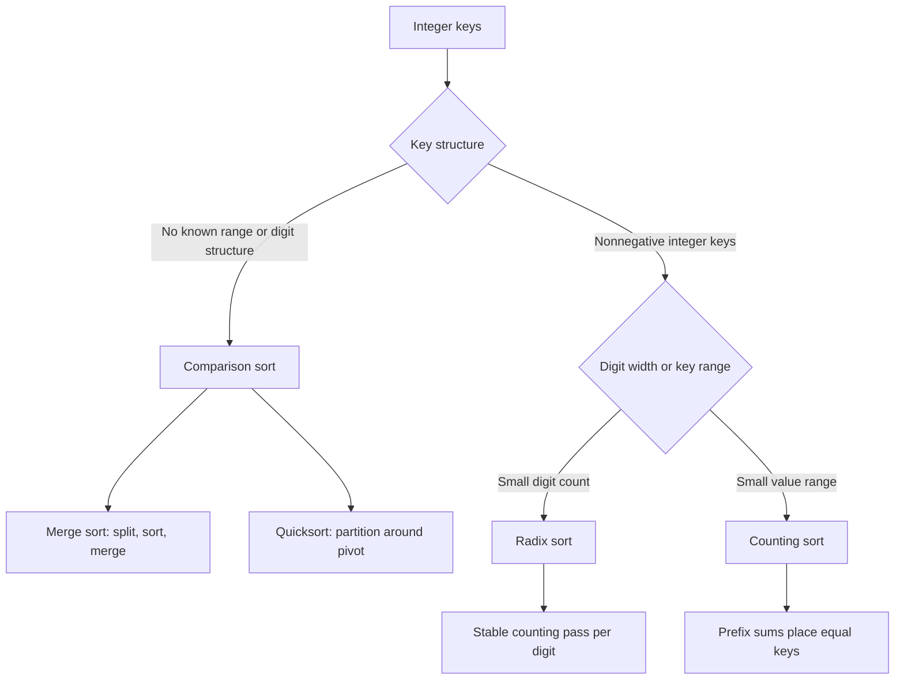

## What it is

**Divide and conquer** solves a problem by splitting it into smaller instances of the same problem, solving each instance recursively, and combining the results. **Comparison sorting** decides the order of values through pairwise comparisons; quicksort and merge sort follow divide and conquer, while radix sort and counting sort use known structure in keys to avoid comparing every pair.

## How it works

Merge sort splits an array near its midpoint, recursively sorts each half, and linearly merges them. Its median split gives O(log n) recursion levels and O(n log n) work regardless of how values are distributed. Quicksort partitions around a pivot and recursively sorts the two partitions; balanced partitions give O(n log n) work, while a repeatedly extreme pivot gives O(n²).

Radix sort processes one digit at a time. Starting at the least significant digit, it performs a **stable** counting-sort pass, so an earlier ordering is preserved when the next digit is processed. Counting sort counts each key, uses prefix sums to locate keys in an output array, and restores their input order for equal keys. Both radix sort and counting sort require nonnegative integer keys; counting sort also performs best when the key range is close to the input size.

The implementations expose the same four operations. Each returns a sorted copy, leaves its input unchanged, and treats merge sort, radix sort, and counting sort as stable. Merge sort and quicksort determine order through pairwise comparisons; radix sort distributes values into buckets by a digit; counting sort uses a frequency table over the key range. This distinction determines their asymptotic costs and required key preconditions.



```java
import java.util.Arrays;

public class Sorting {
    public static int[] mergeSort(int[] values) {
        int[] result = Arrays.copyOf(values, values.length);
        mergeSortRange(result, 0, result.length - 1);
        return result;
    }

    private static void mergeSortRange(int[] values, int left, int right) {
        if (left >= right) return;
        int mid = left + (right - left) / 2;
        mergeSortRange(values, left, mid);
        mergeSortRange(values, mid + 1, right);
        merge(values, left, mid, right);
    }

    private static void merge(int[] values, int left, int mid, int right) {
        int[] merged = new int[right - left + 1];
        int i = left;
        int j = mid + 1;
        int k = 0;
        while (i <= mid && j <= right) {
            merged[k++] = values[i] <= values[j] ? values[i++] : values[j++];
        }
        while (i <= mid) merged[k++] = values[i++];
        while (j <= right) merged[k++] = values[j++];
        System.arraycopy(merged, 0, values, left, merged.length);
    }

    public static int[] quickSort(int[] values) {
        int[] result = Arrays.copyOf(values, values.length);
        quickSortRange(result, 0, result.length - 1);
        return result;
    }

    private static void quickSortRange(int[] values, int left, int right) {
        if (left >= right) return;
        int pivot = partition(values, left, right);
        quickSortRange(values, left, pivot - 1);
        quickSortRange(values, pivot + 1, right);
    }

    private static int partition(int[] values, int left, int right) {
        int pivot = values[right];
        int boundary = left;
        for (int i = left; i < right; i++) {
            if (values[i] < pivot) {
                swap(values, boundary, i);
                boundary++;
            }
        }
        swap(values, boundary, right);
        return boundary;
    }

    private static void swap(int[] values, int i, int j) {
        int temp = values[i];
        values[i] = values[j];
        values[j] = temp;
    }

    public static int[] radixSort(int[] values) {
        int[] result = Arrays.copyOf(values, values.length);
        if (result.length < 2) return result;
        int max = Arrays.stream(result).max().orElse(0);
        int[] output = new int[result.length];
        for (long exponent = 1; exponent <= max; exponent *= 10) {
            int[] counts = new int[10];
            for (int value : result) counts[(value / exponent) % 10]++;
            for (int i = 1; i < counts.length; i++) counts[i] += counts[i - 1];
            for (int i = result.length - 1; i >= 0; i--) {
                int digit = (int) ((result[i] / exponent) % 10);
                output[--counts[digit]] = result[i];
            }
            int[] temp = result;
            result = output;
            output = temp;
        }
        return result;
    }

    public static int[] countingSort(int[] values) {
        if (values.length == 0) return new int[0];
        int max = Arrays.stream(values).max().orElse(0);
        int[] counts = new int[max + 1];
        for (int value : values) counts[value]++;
        for (int i = 1; i < counts.length; i++) counts[i] += counts[i - 1];
        int[] result = new int[values.length];
        for (int i = values.length - 1; i >= 0; i--) {
            result[--counts[values[i]]] = values[i];
        }
        return result;
    }
}
```

```c
#include <stdbool.h>
#include <stddef.h>
#include <stdlib.h>

typedef struct {
    int *values;
    size_t size;
} Sorting;

static void merge(int *values, int left, int mid, int right) {
    size_t size = right - left + 1;
    int *merged = malloc(size * sizeof(int));
    if (merged == NULL) abort();
    size_t i = left;
    size_t j = mid + 1;
    size_t k = 0;
    while (i <= (size_t)mid && j <= (size_t)right) {
        merged[k++] = values[i] <= values[j] ? values[i++] : values[j++];
    }
    while (i <= (size_t)mid) merged[k++] = values[i++];
    while (j <= (size_t)right) merged[k++] = values[j++];
    for (k = 0; k < size; k++) values[left + k] = merged[k];
    free(merged);
}

static void merge_sort_range(int *values, int left, int right) {
    if (left >= right) return;
    int mid = left + (right - left) / 2;
    merge_sort_range(values, left, mid);
    merge_sort_range(values, mid + 1, right);
    merge(values, left, mid, right);
}

static void swap(int *values, int i, int j) {
    int temp = values[i];
    values[i] = values[j];
    values[j] = temp;
}

static int partition(int *values, int left, int right) {
    int pivot = values[right];
    int boundary = left;
    for (int i = left; i < right; i++) {
        if (values[i] < pivot) {
            swap(values, boundary, i);
            boundary++;
        }
    }
    swap(values, boundary, right);
    return boundary;
}

static void quick_sort_range(int *values, int left, int right) {
    if (left >= right) return;
    int pivot = partition(values, left, right);
    quick_sort_range(values, left, pivot - 1);
    quick_sort_range(values, pivot + 1, right);
}

static int *copy_values(const int *values, size_t size) {
    int *copy = malloc(size * sizeof(int));
    if (size > 0 && copy == NULL) abort();
    for (size_t i = 0; i < size; i++) copy[i] = values[i];
    return copy;
}

Sorting sorting_merge_sort(const int *values, size_t size) {
    Sorting result = {copy_values(values, size), size};
    if (size > 1) merge_sort_range(result.values, 0, (int)size - 1);
    return result;
}

Sorting sorting_quick_sort(const int *values, size_t size) {
    Sorting result = {copy_values(values, size), size};
    if (size > 1) quick_sort_range(result.values, 0, (int)size - 1);
    return result;
}

Sorting sorting_radix_sort(const int *values, size_t size) {
    Sorting result = {copy_values(values, size), size};
    if (size < 2) return result;
    int max = 0;
    for (size_t i = 0; i < size; i++) {
        if (result.values[i] > max) max = result.values[i];
    }
    int *output = malloc(size * sizeof(int));
    if (output == NULL) abort();
    for (long long exponent = 1; exponent <= max; exponent *= 10) {
        int counts[10] = {0};
        for (size_t i = 0; i < size; i++) counts[(result.values[i] / exponent) % 10]++;
        for (int i = 1; i < 10; i++) counts[i] += counts[i - 1];
        for (size_t i = size; i > 0; i--) {
            int digit = (int) ((result.values[i - 1] / exponent) % 10);
            output[--counts[digit]] = result.values[i - 1];
        }
        int *temp = result.values;
        result.values = output;
        output = temp;
    }
    free(output);
    return result;
}

Sorting sorting_counting_sort(const int *values, size_t size) {
    if (size == 0) return (Sorting){NULL, 0};
    int max = 0;
    for (size_t i = 0; i < size; i++) {
        if (values[i] > max) max = values[i];
    }
    int *counts = calloc((size_t)max + 1, sizeof(int));
    if (counts == NULL) abort();
    for (size_t i = 0; i < size; i++) counts[values[i]]++;
    for (int i = 1; i <= max; i++) counts[i] += counts[i - 1];
    int *result = malloc(size * sizeof(int));
    if (result == NULL) abort();
    for (size_t i = size; i > 0; i--) result[--counts[values[i - 1]]] = values[i - 1];
    free(counts);
    return (Sorting){result, size};
}
```

```python
class Sorting:
    @staticmethod
    def merge_sort(values):
        result = list(values)
        if len(result) <= 1:
            return result
        mid = len(result) // 2
        return Sorting.merge(Sorting.merge_sort(result[:mid]), Sorting.merge_sort(result[mid:]))

    @staticmethod
    def merge(left, right):
        result = []
        i = j = 0
        while i < len(left) and j < len(right):
            if left[i] <= right[j]:
                result.append(left[i])
                i += 1
            else:
                result.append(right[j])
                j += 1
        result.extend(left[i:])
        result.extend(right[j:])
        return result

    @staticmethod
    def quick_sort(values):
        result = list(values)
        if len(result) <= 1:
            return result
        pivot = result[-1]
        lower = [value for value in result[:-1] if value < pivot]
        equal = [value for value in result[:-1] if value == pivot]
        upper = [value for value in result[:-1] if value > pivot]
        return Sorting.quick_sort(lower) + equal + Sorting.quick_sort(upper)

    @staticmethod
    def radix_sort(values):
        result = list(values)
        if len(result) <= 1:
            return result
        max_value = max(result)
        exponent = 1
        while exponent <= max_value:
            counts = [0] * 10
            for value in result:
                counts[(value // exponent) % 10] += 1
            positions = []
            total = 0
            for count in counts:
                positions.append(total)
                total += count
            output = [0] * len(result)
            for value in result:
                digit = (value // exponent) % 10
                output[positions[digit]] = value
                positions[digit] += 1
            result = output
            exponent *= 10
        return result

    @staticmethod
    def counting_sort(values):
        if not values:
            return []
        counts = [0] * (max(values) + 1)
        for value in values:
            counts[value] += 1
        result = []
        for value, count in enumerate(counts):
            result.extend([value] * count)
        return result
```

```rust
pub struct Sorting;

impl Sorting {
    pub fn merge_sort(values: &[i32]) -> Vec<i32> {
        if values.len() <= 1 {
            return values.to_vec();
        }
        let mid = values.len() / 2;
        let mut left = Self::merge_sort(&values[..mid]);
        let mut right = Self::merge_sort(&values[mid..]);
        let mut result = Vec::with_capacity(values.len());
        let mut i = 0;
        let mut j = 0;
        while i < left.len() && j < right.len() {
            if left[i] <= right[j] {
                result.push(left[i]);
                i += 1;
            } else {
                result.push(right[j]);
                j += 1;
            }
        }
        result.append(&mut left.split_off(i));
        result.append(&mut right.split_off(j));
        result
    }

    pub fn quick_sort(values: &[i32]) -> Vec<i32> {
        let mut result = values.to_vec();
        Self::quick_sort_range(&mut result);
        result
    }

    fn quick_sort_range(values: &mut [i32]) {
        if values.len() <= 1 {
            return;
        }
        let mut boundary = 0;
        for i in 0..values.len() - 1 {
            if values[i] < values[values.len() - 1] {
                values.swap(boundary, i);
                boundary += 1;
            }
        }
        let pivot = values.len() - 1;
        values.swap(boundary, pivot);
        Self::quick_sort_range(&mut values[..boundary]);
        Self::quick_sort_range(&mut values[boundary + 1..]);
    }

    pub fn radix_sort(values: &[i32]) -> Vec<i32> {
        if values.len() <= 1 {
            return values.to_vec();
        }
        let mut result = values.to_vec();
        let max = *result.iter().max().unwrap_or(&0);
        let mut exponent = 1_i64;
        let mut output = vec![0; result.len()];
        while exponent <= max as i64 {
            let mut counts = [0_usize; 10];
            for value in &result {
                counts[((*value as i64 / exponent) % 10) as usize] += 1;
            }
            for i in 1..10 {
                counts[i] += counts[i - 1];
            }
            for value in result.iter().rev() {
                let digit = ((*value as i64 / exponent) % 10) as usize;
                counts[digit] -= 1;
                output[counts[digit]] = *value;
            }
            std::mem::swap(&mut result, &mut output);
            exponent *= 10;
        }
        result
    }

    pub fn counting_sort(values: &[i32]) -> Vec<i32> {
        if values.is_empty() {
            return Vec::new();
        }
        let max = *values.iter().max().unwrap() as usize;
        let mut counts = vec![0_usize; max + 1];
        for value in values {
            counts[*value as usize] += 1;
        }
        for i in 1..counts.len() {
            counts[i] += counts[i - 1];
        }
        let mut result = vec![0; values.len()];
        for value in values.iter().rev() {
            counts[*value as usize] -= 1;
            result[counts[*value as usize]] = *value;
        }
        result
    }
}
```

```typescript
export class Sorting {
  static mergeSort(values: number[]): number[] {
    if (values.length <= 1) return [...values];
    const mid = Math.floor(values.length / 2);
    return this.merge(this.mergeSort(values.slice(0, mid)), this.mergeSort(values.slice(mid)));
  }

  private static merge(left: number[], right: number[]): number[] {
    const result: number[] = [];
    let i = 0;
    let j = 0;
    while (i < left.length && j < right.length) {
      if (left[i] <= right[j]) result.push(left[i++]);
      else result.push(right[j++]);
    }
    return result.concat(left.slice(i), right.slice(j));
  }

  static quickSort(values: number[]): number[] {
    if (values.length <= 1) return [...values];
    const pivot = values[values.length - 1];
    const lower: number[] = [];
    const equal: number[] = [];
    const upper: number[] = [];
    for (let i = 0; i < values.length - 1; i++) {
      if (values[i] < pivot) lower.push(values[i]);
      else if (values[i] === pivot) equal.push(values[i]);
      else upper.push(values[i]);
    }
    return [...this.quickSort(lower), ...equal, ...this.quickSort(upper)];
  }

  static radixSort(values: number[]): number[] {
    let result = [...values];
    if (result.length <= 1) return result;
    const max = result.reduce((largest, value) => Math.max(largest, value), 0);
    let exponent = 1;
    while (exponent <= max) {
      const counts = new Array<number>(10).fill(0);
      for (const value of result) counts[Math.floor(value / exponent) % 10]++;
      for (let i = 1; i < counts.length; i++) counts[i] += counts[i - 1];
      const output = new Array<number>(result.length);
      for (let i = result.length - 1; i >= 0; i--) {
        const digit = Math.floor(result[i] / exponent) % 10;
        output[--counts[digit]] = result[i];
      }
      result = output;
      exponent *= 10;
    }
    return result;
  }

  static countingSort(values: number[]): number[] {
    if (values.length === 0) return [];
    const max = values.reduce((largest, value) => Math.max(largest, value), 0);
    const counts = new Array<number>(max + 1).fill(0);
    for (const value of values) counts[value]++;
    for (let i = 1; i < counts.length; i++) counts[i] += counts[i - 1];
    const result = new Array<number>(values.length);
    for (let i = values.length - 1; i >= 0; i--) {
      result[--counts[values[i]]] = values[i];
    }
    return result;
  }
}
```

```go
package main
type Sorting struct{}

func (Sorting) MergeSort(values []int) []int {
    result := append([]int(nil), values...)
    if len(result) <= 1 {
        return result
    }
    mid := len(result) / 2
    left := (Sorting{}).MergeSort(result[:mid])
    right := (Sorting{}).MergeSort(result[mid:])
    return (Sorting{}).Merge(left, right)
}

func (Sorting) Merge(left, right []int) []int {
    result := make([]int, 0, len(left)+len(right))
    i, j := 0, 0
    for i < len(left) && j < len(right) {
        if left[i] <= right[j] {
            result = append(result, left[i])
            i++
        } else {
            result = append(result, right[j])
            j++
        }
    }
    result = append(result, left[i:]...)
    result = append(result, right[j:]...)
    return result
}

func (Sorting) QuickSort(values []int) []int {
    result := append([]int(nil), values...)
    if len(result) <= 1 {
        return result
    }
    pivot := result[len(result)-1]
    var lower, equal, upper []int
    for _, value := range result[:len(result)-1] {
        if value < pivot {
            lower = append(lower, value)
        } else if value == pivot {
            equal = append(equal, value)
        } else {
            upper = append(upper, value)
        }
    }
    sorter := Sorting{}
    return append(append(sorter.QuickSort(lower), equal...), sorter.QuickSort(upper)...)
}

func (Sorting) RadixSort(values []int) []int {
    result := append([]int(nil), values...)
    if len(result) <= 1 {
        return result
    }
    max := 0
    for _, value := range result {
        if value > max {
            max = value
        }
    }
    output := make([]int, len(result))
    for exponent := int64(1); exponent <= int64(max); exponent *= 10 {
        counts := [10]int{}
        for _, value := range result {
            counts[(int64(value)/exponent)%10]++
        }
        for i := 1; i < 10; i++ {
            counts[i] += counts[i-1]
        }
        for i := len(result) - 1; i >= 0; i-- {
            digit := (int64(result[i]) / exponent) % 10
            counts[digit]--
            output[counts[digit]] = result[i]
        }
        copy(result, output)
    }
    return result
}

func (Sorting) CountingSort(values []int) []int {
    if len(values) == 0 {
        return []int{}
    }
    max := 0
    for _, value := range values {
        if value > max {
            max = value
        }
    }
    counts := make([]int, max+1)
    for _, value := range values {
        counts[value]++
    }
    for i := 1; i < len(counts); i++ {
        counts[i] += counts[i-1]
    }
    result := make([]int, len(values))
    for i := len(values) - 1; i >= 0; i-- {
        counts[values[i]]--
        result[counts[values[i]]] = values[i]
    }
    return result
}
```

## Complexity

| Algorithm | Time | Extra space | Stability |
| --- | --- | --- | --- |
| Merge sort | O(n log n) | O(n) | Stable |
| Quicksort | O(n log n) with balanced partitions; O(n²) worst case | O(n) for the copy; O(log n) expected stack | Not stable |
| Radix sort | O(d(n + k)) | O(n + k) | Stable |
| Counting sort | O(n + k) | O(n + k) | Stable |

Here, `d` is the number of digits processed and `k` is the radix or key range. Merge sort uses O(log n) call-stack space in addition to its temporary arrays.

## When to use

- You need guaranteed O(n log n) comparison sorting and can allocate O(n) temporary space.
- You need an in-place sort and can accept O(n²) worst-case behavior from a simple pivot strategy.
- You sort nonnegative fixed-width integers whose digit count or key range is small enough for linear-time methods.
- You need a stable sort and the implementation preserves the input order of equal keys.

## Alternatives

- **Heapsort** — uses O(n log n) worst-case time and O(1) auxiliary space, but loses stability and usually has worse locality than quicksort.
- **Timsort** — detects and merges existing runs, making it effective for nearly sorted data while using O(n) auxiliary space.
- **Comparison sort library routine** — language runtimes such as Java's primitive sort, Python's `sorted`, Rust's `sort`, and Go's `slices.Sort` choose tuned implementations and pivots for the input type.

## Related

- [Greedy Choice Paradigms & Interval Scheduling](02-greedy.md)
- [Dynamic Programming (Memoization, Tabulation, State Compression, Space Optimization, Peak/Tail Optimization)](03-dynamic-programming.md)
- [Dynamic Arrays, Memory Allocation, and Amortized Analysis](../01-linear-data-structures/01-dynamic-arrays.md)
- [Chapter 3 References](07-references.md)
