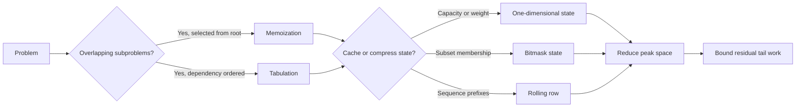

## What it is

**Dynamic programming** solves an optimization or counting problem by defining overlapping subproblems, expressing each result in terms of smaller results, and computing every needed state once. It applies when an optimal solution contains optimal solutions to subproblems and the state can be represented compactly.

## How it works

For 0/1 knapsack, `dp[c]` is the best value obtainable with capacity `c` using the items already processed. Each item creates a transition between skipping the item and taking it. Processing capacities in descending order makes the current item available at most once and reduces the two-dimensional table to one dimension. The operation requires equal-length arrays, strictly positive weights, and a nonnegative capacity; values may be negative, in which case taking no items remains a valid choice.

**Memoization** evaluates a recursive recurrence lazily and caches results in a table. **Tabulation** evaluates a recurrence iteratively in an order where dependencies are ready. The two approaches compute the same states but differ in evaluation order, stack use, and which states are visited. `memoized_fib` and `tabulated_fib` require a nonnegative index.

**State compression** replaces a multi-dimensional state with a compact representation, commonly a bitmask. For example, bit `i` in a subset mask records whether item `i` is present. The implementation below requires fewer than 31 items for `subset_max`, positive weights, and a nonnegative target, but it allows negative values. It returns the true maximum even when every feasible subset has negative value and reports separately when no subset reaches the target. The longest-common-subsequence operation accepts ASCII strings and applies **space optimization**: two adjacent rows determine the next row, so only one row needs to be retained.

**Peak/tail optimization** is a performance description rather than a separate dynamic-programming paradigm. Peak space is the maximum number of live states, which the capacity knapsack and LCS tables reduce to one row. Tail work is the work left after the main transitions, such as combining partial ranges or initializing another row; Fibonacci avoids table cleanup by retaining only the previous and current values. These techniques improve resource use only when dependency order permits discarded states, and they do not change the recurrence's time complexity.



```java
import java.util.Arrays;
import java.util.OptionalLong;

public class Knapsack {
    public static long maxValue(int[] weights, int[] values, int capacity) {
        if (capacity < 0 || weights.length != values.length) throw new IllegalArgumentException();
        for (int weight : weights) {
            if (weight <= 0) throw new IllegalArgumentException();
        }
        long[] dp = new long[capacity + 1];
        for (int i = 0; i < weights.length; i++) {
            for (int c = capacity; c >= weights[i]; c--) {
                dp[c] = Math.max(dp[c], dp[c - weights[i]] + values[i]);
            }
        }
        return dp[capacity];
    }

    public static long memoizedFib(int n) {
        if (n < 0) throw new IllegalArgumentException();
        long[] memo = new long[n + 1];
        Arrays.fill(memo, -1);
        return memoizedFib(n, memo);
    }

    private static long memoizedFib(int n, long[] memo) {
        if (n < 2) return n;
        if (memo[n] >= 0) return memo[n];
        return memo[n] = memoizedFib(n - 1, memo) + memoizedFib(n - 2, memo);
    }

    public static long tabulatedFib(int n) {
        if (n < 0) throw new IllegalArgumentException();
        if (n < 2) return n;
        long previous = 0;
        long current = 1;
        for (int i = 2; i <= n; i++) {
            long next = previous + current;
            previous = current;
            current = next;
        }
        return current;
    }

    public static int lcsLength(String left, String right) {
        int[] dp = new int[right.length() + 1];
        for (int i = 1; i <= left.length(); i++) {
            int diagonal = 0;
            for (int j = 1; j <= right.length(); j++) {
                int previous = dp[j];
                if (left.charAt(i - 1) == right.charAt(j - 1)) {
                    dp[j] = diagonal + 1;
                } else {
                    dp[j] = Math.max(dp[j], dp[j - 1]);
                }
                diagonal = previous;
            }
        }
        return dp[right.length()];
    }

    public static OptionalLong subsetMax(int[] weights, int[] values, int target) {
        int n = weights.length;
        if (n >= 31 || target < 0 || weights.length != values.length) throw new IllegalArgumentException();
        for (int weight : weights) {
            if (weight <= 0) throw new IllegalArgumentException();
        }
        boolean found = false;
        long best = 0;
        for (int mask = 0; mask < (1 << n); mask++) {
            long weight = 0;
            long value = 0;
            for (int i = 0; i < n; i++) {
                if ((mask & (1 << i)) != 0) {
                    weight += weights[i];
                    value += values[i];
                }
            }
            if (weight == target && (!found || value > best)) {
                found = true;
                best = value;
            }
        }
        return found ? OptionalLong.of(best) : OptionalLong.empty();
    }
}
```

```c
#include <stdbool.h>
#include <stddef.h>
#include <stdlib.h>

typedef struct {
    long long value;
} Knapsack;

long long knapsack_max_value(const int *weights, const int *values, size_t n, int capacity) {
    if (capacity < 0) abort();
    for (size_t i = 0; i < n; i++) {
        if (weights[i] <= 0) abort();
    }
    long long *dp = calloc((size_t)capacity + 1, sizeof(long long));
    if (dp == NULL) abort();
    for (size_t i = 0; i < n; i++) {
        for (int c = capacity; c >= weights[i]; c--) {
            long long candidate = dp[c - weights[i]] + values[i];
            if (candidate > dp[c]) dp[c] = candidate;
        }
    }
    long long result = dp[capacity];
    free(dp);
    return result;
}

static long long memoized_fib_inner(int n, long long *memo) {
    if (n < 2) return n;
    if (memo[n] >= 0) return memo[n];
    memo[n] = memoized_fib_inner(n - 1, memo) + memoized_fib_inner(n - 2, memo);
    return memo[n];
}

long long knapsack_memoized_fib(int n) {
    if (n < 0) abort();
    long long *memo = malloc(((size_t)n + 1) * sizeof(long long));
    if (memo == NULL) abort();
    for (int i = 0; i <= n; i++) memo[i] = -1;
    long long result = memoized_fib_inner(n, memo);
    free(memo);
    return result;
}

long long knapsack_tabulated_fib(int n) {
    if (n < 0) abort();
    if (n < 2) return n;
    long long previous = 0;
    long long current = 1;
    for (int i = 2; i <= n; i++) {
        long long next = previous + current;
        previous = current;
        current = next;
    }
    return current;
}

size_t knapsack_lcs_length(const char *left, const char *right) {
    size_t left_size = 0;
    size_t right_size = 0;
    while (left[left_size] != '\0') left_size++;
    while (right[right_size] != '\0') right_size++;
    size_t *dp = calloc(right_size + 1, sizeof(size_t));
    if (dp == NULL) abort();
    for (size_t i = 1; i <= left_size; i++) {
        size_t diagonal = 0;
        for (size_t j = 1; j <= right_size; j++) {
            size_t previous = dp[j];
            if (left[i - 1] == right[j - 1]) dp[j] = diagonal + 1;
            else if (dp[j - 1] > dp[j]) dp[j] = dp[j - 1];
            diagonal = previous;
        }
    }
    size_t result = dp[right_size];
    free(dp);
    return result;
}

int knapsack_subset_max(const int *weights, const int *values, size_t n, int target, long long *result) {
    if (n >= 31 || target < 0) abort();
    for (size_t i = 0; i < n; i++) {
        if (weights[i] <= 0) abort();
    }
    bool found = false;
    long long best = 0;
    unsigned long long limit = 1ULL << n;
    for (unsigned long long mask = 0; mask < limit; mask++) {
        long long weight = 0;
        long long value = 0;
        for (size_t i = 0; i < n; i++) {
            if ((mask & (1ULL << i)) != 0) {
                weight += weights[i];
                value += values[i];
            }
        }
        if (weight == target && (!found || value > best)) {
            found = true;
            best = value;
        }
    }
    *result = best;
    return found;
}
```

```python
class Knapsack:
    @staticmethod
    def max_value(weights, values, capacity):
        if capacity < 0 or len(weights) != len(values) or any(weight <= 0 for weight in weights):
            raise ValueError()
        dp = [0] * (capacity + 1)
        for weight, value in zip(weights, values):
            for current in range(capacity, weight - 1, -1):
                dp[current] = max(dp[current], dp[current - weight] + value)
        return dp[capacity]

    @staticmethod
    def memoized_fib(n):
        if n < 0:
            raise ValueError()
        memo = {}

        def fibonacci(value):
            if value < 2:
                return value
            if value not in memo:
                memo[value] = fibonacci(value - 1) + fibonacci(value - 2)
            return memo[value]

        return fibonacci(n)

    @staticmethod
    def tabulated_fib(n):
        if n < 0:
            raise ValueError()
        if n < 2:
            return n
        previous, current = 0, 1
        for _ in range(2, n + 1):
            previous, current = current, previous + current
        return current

    @staticmethod
    def lcs_length(left, right):
        dp = [0] * (len(right) + 1)
        for left_index in range(1, len(left) + 1):
            diagonal = 0
            for right_index in range(1, len(right) + 1):
                previous = dp[right_index]
                if left[left_index - 1] == right[right_index - 1]:
                    dp[right_index] = diagonal + 1
                else:
                    dp[right_index] = max(dp[right_index], dp[right_index - 1])
                diagonal = previous
        return dp[-1]

    @staticmethod
    def subset_max(weights, values, target):
        if len(weights) >= 31 or target < 0 or len(weights) != len(values):
            raise ValueError()
        if any(weight <= 0 for weight in weights):
            raise ValueError()
        best = None
        for mask in range(1 << len(weights)):
            weight = 0
            value = 0
            for index in range(len(weights)):
                if mask & (1 << index):
                    weight += weights[index]
                    value += values[index]
            if weight == target and (best is None or value > best):
                best = value
        return best
```

```rust
pub struct Knapsack;

impl Knapsack {
    pub fn max_value(weights: &[i64], values: &[i64], capacity: usize) -> i64 {
        assert!(weights.len() == values.len() && weights.iter().all(|&weight| weight > 0));
        let mut dp = vec![0; capacity + 1];
        for (&weight, &value) in weights.iter().zip(values) {
            let weight = weight as usize;
            for current in (weight..=capacity).rev() {
                dp[current] = dp[current].max(dp[current - weight] + value);
            }
        }
        dp[capacity]
    }

    fn memoized_fib_inner(n: usize, memo: &mut [Option<i64>]) -> i64 {
        if n < 2 {
            return n as i64;
        }
        if let Some(value) = memo[n] {
            return value;
        }
        let value = Self::memoized_fib_inner(n - 1, memo)
            + Self::memoized_fib_inner(n - 2, memo);
        memo[n] = Some(value);
        value
    }

    pub fn memoized_fib(n: usize) -> i64 {
        let mut memo = vec![None; n + 1];
        Self::memoized_fib_inner(n, &mut memo)
    }

    pub fn tabulated_fib(n: usize) -> i64 {
        if n < 2 {
            return n as i64;
        }
        let mut previous = 0;
        let mut current = 1;
        for _ in 2..=n {
            let next = previous + current;
            previous = current;
            current = next;
        }
        current
    }

    pub fn lcs_length(left: &[u8], right: &[u8]) -> usize {
        let mut dp = vec![0; right.len() + 1];
        for i in 1..=left.len() {
            let mut diagonal = 0;
            for j in 1..=right.len() {
                let previous = dp[j];
                if left[i - 1] == right[j - 1] {
                    dp[j] = diagonal + 1;
                } else {
                    dp[j] = dp[j].max(dp[j - 1]);
                }
                diagonal = previous;
            }
        }
        dp[right.len()]
    }

    pub fn subset_max(weights: &[i64], values: &[i64], target: i64) -> Option<i64> {
        let n = weights.len();
        assert!(n < 31 && target >= 0 && weights.len() == values.len());
        assert!(weights.iter().all(|&weight| weight > 0));
        let mut best = None;
        for mask in 0..(1_usize << n) {
            let mut weight = 0;
            let mut value = 0;
            for index in 0..n {
                if mask & (1 << index) != 0 {
                    weight += weights[index];
                    value += values[index];
                }
            }
            if weight == target && best.is_none_or(|current| value > current) {
                best = Some(value);
            }
        }
        best
    }
}
```

```typescript
export class Knapsack {
  static maxValue(weights: number[], values: number[], capacity: number): number {
    if (capacity < 0 || weights.length !== values.length || weights.some((weight) => weight <= 0)) throw new Error();
    const dp = new Array<number>(capacity + 1).fill(0);
    for (let i = 0; i < weights.length; i++) {
      for (let current = capacity; current >= weights[i]; current--) {
        dp[current] = Math.max(dp[current], dp[current - weights[i]] + values[i]);
      }
    }
    return dp[capacity];
  }

  static memoizedFib(n: number): number {
    if (n < 0) throw new Error();
    const memo = new Map<number, number>();
    const fibonacci = (value: number): number => {
      if (value < 2) return value;
      const cached = memo.get(value);
      if (cached !== undefined) return cached;
      const result = fibonacci(value - 1) + fibonacci(value - 2);
      memo.set(value, result);
      return result;
    };
    return fibonacci(n);
  }

  static tabulatedFib(n: number): number {
    if (n < 0) throw new Error();
    if (n < 2) return n;
    let previous = 0;
    let current = 1;
    for (let i = 2; i <= n; i++) {
      const next = previous + current;
      previous = current;
      current = next;
    }
    return current;
  }

  static lcsLength(left: string, right: string): number {
    const dp = new Array<number>(right.length + 1).fill(0);
    for (let i = 1; i <= left.length; i++) {
      let diagonal = 0;
      for (let j = 1; j <= right.length; j++) {
        const previous = dp[j];
        if (left[i - 1] === right[j - 1]) dp[j] = diagonal + 1;
        else dp[j] = Math.max(dp[j], dp[j - 1]);
        diagonal = previous;
      }
    }
    return dp[right.length];
  }

  static subsetMax(weights: number[], values: number[], target: number): number | null {
    const n = weights.length;
    if (n >= 31 || target < 0 || weights.length !== values.length || weights.some((weight) => weight <= 0)) {
      throw new Error();
    }
    let best: number | null = null;
    for (let mask = 0; mask < (1 << n); mask++) {
      let weight = 0;
      let value = 0;
      for (let index = 0; index < n; index++) {
        if ((mask & (1 << index)) !== 0) {
          weight += weights[index];
          value += values[index];
        }
      }
      if (weight === target && (best === null || value > best)) best = value;
    }
    return best;
  }
}
```

```go
package dynamicprogramming

type Knapsack struct{}

func (Knapsack) MaxValue(weights, values []int, capacity int) int64 {
    if capacity < 0 || len(weights) != len(values) {
        panic("invalid knapsack input")
    }
    for _, weight := range weights {
        if weight <= 0 {
            panic("weights must be positive")
        }
    }
    dp := make([]int64, capacity+1)
    for i := range weights {
        for current := capacity; current >= weights[i]; current-- {
            candidate := dp[current-weights[i]] + int64(values[i])
            if candidate > dp[current] {
                dp[current] = candidate
            }
        }
    }
    return dp[capacity]
}

func (Knapsack) MemoizedFib(n int) int64 {
    if n < 0 {
        panic("index must be nonnegative")
    }
    memo := make([]int64, n+1)
    for i := range memo {
        memo[i] = -1
    }
    var fib func(int) int64
    fib = func(value int) int64 {
        if value < 2 {
            return int64(value)
        }
        if memo[value] >= 0 {
            return memo[value]
        }
        memo[value] = fib(value-1) + fib(value-2)
        return memo[value]
    }
    return fib(n)
}

func (Knapsack) TabulatedFib(n int) int64 {
    if n < 0 {
        panic("index must be nonnegative")
    }
    if n < 2 {
        return int64(n)
    }
    previous, current := int64(0), int64(1)
    for i := 2; i <= n; i++ {
        previous, current = current, previous+current
    }
    return current
}

func (Knapsack) LCSLength(left, right string) int {
    dp := make([]int, len(right)+1)
    for i := 1; i <= len(left); i++ {
        diagonal := 0
        for j := 1; j <= len(right); j++ {
            previous := dp[j]
            if left[i-1] == right[j-1] {
                dp[j] = diagonal + 1
            } else if dp[j-1] > dp[j] {
                dp[j] = dp[j-1]
            }
            diagonal = previous
        }
    }
    return dp[len(right)]
}

func (Knapsack) SubsetMax(weights, values []int, target int) (int64, bool) {
    n := len(weights)
    if n >= 31 || target < 0 || len(weights) != len(values) {
        panic("invalid subset input")
    }
    for _, weight := range weights {
        if weight <= 0 {
            panic("weights must be positive")
        }
    }
    limit := uint64(1) << n
    found := false
    var best int64
    for mask := uint64(0); mask < limit; mask++ {
        var weight int64
        var value int64
        for index := 0; index < n; index++ {
            if mask&(uint64(1)<<index) != 0 {
                weight += int64(weights[index])
                value += int64(values[index])
            }
        }
        if weight == int64(target) && (!found || value > best) {
            found = true
            best = value
        }
    }
    return best, found
}
```

## Complexity

| Operation | Time | Extra space |
| --- | --- | --- |
| 0/1 knapsack by tabulation | O(nW) | O(W) |
| Fibonacci by memoization | O(n) | O(n) plus O(n) call stack |
| Fibonacci by tabulation | O(n) | O(1) |
| Longest common subsequence | O(nm) | O(m) with one rolling row |
| Maximum-value exact-weight subset | O(n · 2ⁿ) with bit iteration | O(1) beyond input |

## When to use

- The problem has overlapping subproblems whose results can be reused.
- An optimal solution can be built from optimal solutions to smaller instances.
- You can define a compact state and a recurrence for its transitions.
- The state space is small enough to enumerate, as with a bounded bitmask, or dense enough to fill efficiently, as with a knapsack capacity table.
- A rolling row, in-place direction, or other state compression can reduce a table that would not fit in memory.

## Alternatives

- **Greedy algorithm** — selects one locally best option and is faster when an exchange argument proves optimality.
- **Divide and conquer** — reduces work by recursively solving independent subproblems and combining their results.
- **Backtracking** — explores candidate assignments directly and avoids storing states, but can repeat equivalent work exponentially.

## Related

- [Greedy Choice Paradigms & Interval Scheduling](02-greedy.md)
- [Backtracking, Branch-and-Bound, and Constraint Satisfaction Problems](04-backtracking.md)
- [Shortest Paths](../04-graphs/05-shortest-paths.md)
- [Chapter 3 References](07-references.md)
