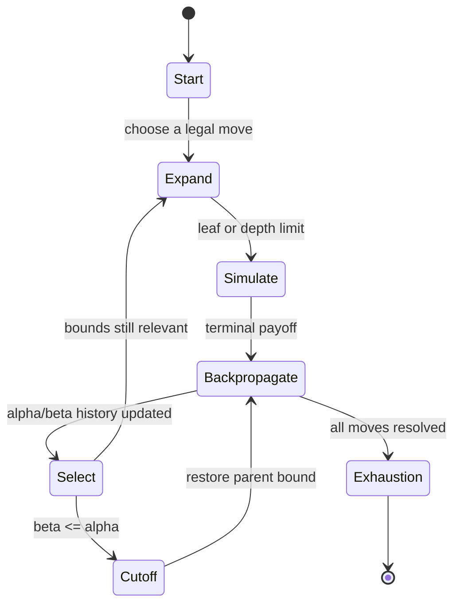

## What it is

**Game theory** studies decisions when an outcome depends on the choices of multiple rational players. **Game-tree search** finds a strong move in a two-player game by looking at possible continuations, while **minimax** evaluates each continuation from the current player's perspective and **alpha-beta pruning** discards branches that cannot change the result.

## How it works

A **payoff matrix** assigns a terminal utility to each pair of actions. In a zero-sum game, the row player's payoff is the matrix entry and the column player's payoff is its negative. A two-ply game can be represented directly by the matrix: the row player selects a row, the opponent selects a column, and the selected cell is the terminal payoff. More deeply nested games repeat this alternation until a leaf has no legal move.

**Minimax** recursively selects a maximizing child for the row player and a minimizing child for the opponent. A leaf returns its payoff. Move ordering changes only the order of exploration, not the exact value, but a strong ordering allows beta bounds to cut off losing branches sooner. The compact `GameSearch` implementation below uses a matrix as a two-level game tree and exposes minimax, alpha-beta, move probing, and Monte Carlo sampling through the same API.

**Alpha-beta pruning** carries two bounds through the search. **Alpha** is the best value already guaranteed for the maximizing player on the current path, and **beta** is the best value already guaranteed for the minimizing player. A node whose bound interval becomes empty cannot affect its parent, so the search returns immediately. Transposition tables and move ordering can reduce additional repeated work in larger trees.

**Game tree probing** evaluates a candidate position or move with a depth limit, an evaluation function, or a smaller search. A probe is useful for tactical situations in which a shallow exact result is not available, but its conclusions depend on the evaluation quality and the depth selected. **Exhaustion** occurs when every legal continuation has been evaluated, either because the tree is finite and fully searched or because every branch reaches a terminal payoff. Exhaustive search gives the exact result for the represented rules but grows exponentially with branching factor and depth.

**Monte Carlo tree search (MCTS)** takes a different route for games too large to exhaust. Selection chooses a child using a policy such as UCB1, expansion adds a new child, simulation plays a policy or random rollout to a leaf, and backpropagation updates visit counts and value estimates. MCTS spends more samples on promising lines, but its result is approximate and depends on simulation budget and randomization. The implementation's `mcts` method uses random opponent responses and averages terminal matrix values, which is a compact two-ply simulation rather than a general MCTS node tree.



A **Nash equilibrium** is a collection of strategies in which no player can improve its expected payoff by changing only its own strategy. A pure **saddle point** is a pure-strategy equilibrium, detectable by a row minimum and a column maximum. When no saddle point exists, a **mixed strategy** assigns probabilities to actions; in a zero-sum matrix game the equilibrium value is the game's value, while exact mixed strategies can require a linear-programming or polynomial-time matrix-game method. Minimax search computes a best response for a particular game position; it does not by itself prove that a collection of strategies is a Nash equilibrium.

The same `GameSearch` API uses these operations in every language:

- `bestMove` returns the row move selected by exact alpha-beta search.
- `minimax` and `alphaBeta` return the same exact move but exercise different evaluation paths.
- `probe` evaluates one row against the best response available in that row.
- `mcts` samples opponent responses and returns the move with the largest simulated average.


```java
public final class GameSearch {
    private final int[][] values;

    public GameSearch(int[][] payoff) {
        if (payoff.length == 0 || payoff[0].length == 0) {
            throw new IllegalArgumentException("payoff must not be empty");
        }
        for (int[] row : payoff) {
            if (row.length != payoff[0].length) throw new IllegalArgumentException("payoff must be rectangular");
        }
        values = new int[payoff.length][payoff[0].length];
        for (int row = 0; row < payoff.length; row++) {
            values[row] = payoff[row].clone();
        }
    }

    public int bestMove() {
        return alphaBeta();
    }

    public int minimax() {
        return search(false, Integer.MIN_VALUE, Integer.MAX_VALUE);
    }

    public int alphaBeta() {
        return search(true, Integer.MIN_VALUE, Integer.MAX_VALUE);
    }

    public int probe(int move) {
        if (move < 0 || move >= values.length) throw new IllegalArgumentException("invalid move");
        int result = Integer.MAX_VALUE;
        for (int value : values[move]) result = Math.min(result, value);
        return result;
    }

    public int mcts(int iterations, long seed) {
        if (iterations <= 0) return bestMove();
        int best = 0;
        double bestScore = Double.NEGATIVE_INFINITY;
        long state = seed;
        for (int iteration = 0; iteration < iterations; iteration++) {
            for (int move = 0; move < values.length; move++) {
                double score = 0;
                for (int sample = 0; sample < values[move].length; sample++) {
                    state = state * 6364136223846793005L + 1442695040888963407L;
                    int column = (int) Math.floorMod(state, values[move].length);
                    score += values[move][column];
                }
                score /= values[move].length;
                if (score > bestScore) {
                    bestScore = score;
                    best = move;
                }
            }
        }
        return best;
    }

    private int search(boolean alphaBeta, int alpha, int beta) {
        int best = Integer.MIN_VALUE;
        int bestMove = 0;
        for (int move = 0; move < values.length; move++) {
            int value = Integer.MAX_VALUE;
            for (int payoff : values[move]) {
                value = Math.min(value, payoff);
                if (alphaBeta && value <= alpha) break;
            }
            if (value > best) {
                best = value;
                bestMove = move;
            }
            if (alphaBeta) {
                alpha = Math.max(alpha, best);
                if (alpha >= beta) break;
            }
        }
        return bestMove;
    }
}
```

```c
#include <limits.h>
#include <math.h>
#include <stdbool.h>
#include <stddef.h>
#include <stdlib.h>

typedef struct {
    size_t rows;
    size_t columns;
    int* values;
} GameSearch;

GameSearch* gs_create(const int* payoff, size_t rows, size_t columns) {
    if (payoff == NULL || rows == 0 || columns == 0) return NULL;
    GameSearch* game = malloc(sizeof(GameSearch));
    if (game == NULL) abort();
    game->rows = rows;
    game->columns = columns;
    game->values = malloc(rows * columns * sizeof(int));
    if (game->values == NULL) abort();
    for (size_t index = 0; index < rows * columns; index++) game->values[index] = payoff[index];
    return game;
}

void gs_free(GameSearch* game) {
    if (game == NULL) return;
    free(game->values);
    free(game);
}

int gs_minimax(GameSearch* game) {
    int best = INT_MIN;
    int best_move_index = 0;
    for (size_t move = 0; move < game->rows; move++) {
        int value = INT_MAX;
        for (size_t column = 0; column < game->columns; column++) {
            int candidate = game->values[move * game->columns + column];
            if (candidate < value) value = candidate;
        }
        if (value > best) {
            best = value;
            best_move_index = (int)move;
        }
    }
    return best_move_index;
}

int gs_alpha_beta(GameSearch* game) {
    int alpha = INT_MIN;
    int best = INT_MIN;
    int best_move_index = 0;
    for (size_t move = 0; move < game->rows; move++) {
        int value = INT_MAX;
        for (size_t column = 0; column < game->columns; column++) {
            int candidate = game->values[move * game->columns + column];
            if (candidate < value) value = candidate;
            if (value <= alpha) break;
        }
        if (value > best) {
            best = value;
            best_move_index = (int)move;
        }
        if (value > alpha) alpha = value;
    }
    return best_move_index;
}

int gs_best_move(GameSearch* game) {
    return gs_alpha_beta(game);
}

int gs_probe(GameSearch* game, int move) {
    if (move < 0 || (size_t)move >= game->rows) return INT_MIN;
    int result = INT_MAX;
    for (size_t column = 0; column < game->columns; column++) {
        int value = game->values[(size_t)move * game->columns + column];
        if (value < result) result = value;
    }
    return result;
}

int gs_mcts(GameSearch* game, int iterations, unsigned long long seed) {
    if (iterations <= 0) return gs_best_move(game);
    unsigned long long state = seed;
    int best_move_index = 0;
    long double best_score = -INFINITY;
    for (int iteration = 0; iteration < iterations; iteration++) {
        for (size_t move = 0; move < game->rows; move++) {
            long double score = 0;
            for (size_t sample = 0; sample < game->columns; sample++) {
                state = state * 6364136223846793005ULL + 1442695040888963407ULL;
                size_t column = (size_t)(state % game->columns);
                score += game->values[move * game->columns + column];
            }
            score /= game->columns;
            if (score > best_score) {
                best_score = score;
                best_move_index = (int)move;
            }
        }
    }
    return best_move_index;
}
```

```python
class GameSearch:
    def __init__(self, payoff):
        if not payoff or not payoff[0] or any(len(row) != len(payoff[0]) for row in payoff):
            raise ValueError("payoff must be a non-empty rectangle")
        self.values = [row[:] for row in payoff]

    def best_move(self):
        return self.alpha_beta()

    def minimax(self):
        return self._search(False, float("-inf"), float("inf"))

    def alpha_beta(self):
        return self._search(True, float("-inf"), float("inf"))

    def probe(self, move):
        if move < 0 or move >= len(self.values):
            raise ValueError("invalid move")
        return min(self.values[move])

    def mcts(self, iterations, seed):
        if iterations <= 0:
            return self.best_move()
        best = 0
        best_score = float("-inf")
        state = seed
        for _ in range(iterations):
            for move, row in enumerate(self.values):
                score = 0
                for _ in row:
                    state = (state * 6364136223846793005 + 1442695040888963407) & ((1 << 64) - 1)
                    score += row[state % len(row)]
                score /= len(row)
                if score > best_score:
                    best_score = score
                    best = move
        return best

    def _search(self, alpha_beta, alpha, beta):
        best = float("-inf")
        best_move = 0
        for move, row in enumerate(self.values):
            value = min(row)
            if value > best:
                best = value
                best_move = move
            if alpha_beta:
                alpha = max(alpha, best)
                if alpha >= beta:
                    break
        return best_move
```

```rust
pub struct GameSearch {
    values: Vec<Vec<i32>>,
}

impl GameSearch {
    pub fn new(payoff: Vec<Vec<i32>>) -> Self {
        assert!(!payoff.is_empty() && !payoff[0].is_empty());
        assert!(payoff.iter().all(|row| row.len() == payoff[0].len()));
        Self { values: payoff }
    }

    pub fn best_move(&self) -> usize {
        self.alpha_beta()
    }

    pub fn minimax(&self) -> usize {
        self.search(false, i32::MIN, i32::MAX)
    }

    pub fn alpha_beta(&self) -> usize {
        self.search(true, i32::MIN, i32::MAX)
    }

    pub fn probe(&self, move_index: usize) -> i32 {
        *self.values[move_index].iter().min().expect("non-empty row")
    }

    pub fn mcts(&self, iterations: i32, seed: u64) -> usize {
        if iterations <= 0 {
            return self.best_move();
        }
        let mut best = 0;
        let mut best_score = f64::NEG_INFINITY;
        let mut state = seed;
        for _ in 0..iterations {
            for (move_index, row) in self.values.iter().enumerate() {
                let mut score = 0.0;
                for _ in row {
                    state = state.wrapping_mul(6364136223846793005).wrapping_add(1442695040888963407);
                    score += row[(state as usize) % row.len()] as f64;
                }
                score /= row.len() as f64;
                if score > best_score {
                    best_score = score;
                    best = move_index;
                }
            }
        }
        best
    }

    fn search(&self, alpha_beta: bool, mut alpha: i32, beta: i32) -> usize {
        let mut best = i32::MIN;
        let mut best_move = 0;
        for (move_index, row) in self.values.iter().enumerate() {
            let value = *row.iter().min().expect("non-empty row");
            if value > best {
                best = value;
                best_move = move_index;
            }
            if alpha_beta {
                alpha = alpha.max(best);
                if alpha >= beta {
                    break;
                }
            }
        }
        best_move
    }
}
```

```typescript
class GameSearch {
    private readonly values: number[][];

    constructor(payoff: number[][]) {
        if (payoff.length === 0 || payoff[0].length === 0 || payoff.some((row) => row.length !== payoff[0].length)) {
            throw new Error("payoff must be a non-empty rectangle");
        }
        this.values = payoff.map((row) => row.slice());
    }

    bestMove(): number {
        return this.alphaBeta();
    }

    minimax(): number {
        return this.search(false, Number.MIN_SAFE_INTEGER, Number.MAX_SAFE_INTEGER);
    }

    alphaBeta(): number {
        return this.search(true, Number.MIN_SAFE_INTEGER, Number.MAX_SAFE_INTEGER);
    }

    probe(move: number): number {
        if (move < 0 || move >= this.values.length) throw new Error("invalid move");
        return Math.min(...this.values[move]);
    }

    mcts(iterations: number, seed: number): number {
        if (iterations <= 0) return this.bestMove();
        let best = 0;
        let bestScore = Number.NEGATIVE_INFINITY;
        let state = BigInt(seed);
        const multiplier = 6364136223846793005n;
        const increment = 1442695040888963407n;
        for (let iteration = 0; iteration < iterations; iteration++) {
            for (let move = 0; move < this.values.length; move++) {
                const row = this.values[move];
                let score = 0;
                for (let sample = 0; sample < row.length; sample++) {
                    state = (state * multiplier + increment) & 0xffffffffffffffffn;
                    score += row[Number(state % BigInt(row.length))];
                }
                score /= row.length;
                if (score > bestScore) {
                    bestScore = score;
                    best = move;
                }
            }
        }
        return best;
    }

    private search(alphaBeta: boolean, alpha: number, beta: number): number {
        let best = Number.NEGATIVE_INFINITY;
        let bestMove = 0;
        for (let move = 0; move < this.values.length; move++) {
            const value = Math.min(...this.values[move]);
            if (value > best) {
                best = value;
                bestMove = move;
            }
            if (alphaBeta) {
                alpha = Math.max(alpha, best);
                if (alpha >= beta) break;
            }
        }
        return bestMove;
    }
}
```

```go
package game

import "fmt"

type GameSearch struct {
    values [][]int
}

func NewGameSearch(payoff [][]int) (*GameSearch, error) {
    if len(payoff) == 0 || len(payoff[0]) == 0 {
        return nil, fmt.Errorf("payoff must not be empty")
    }
    for _, row := range payoff {
        if len(row) != len(payoff[0]) {
            return nil, fmt.Errorf("payoff must be rectangular")
        }
    }
    values := make([][]int, len(payoff))
    for i := range payoff {
        values[i] = append([]int(nil), payoff[i]...)
    }
    return &GameSearch{values: values}, nil
}

func (game *GameSearch) BestMove() int {
    return game.AlphaBeta()
}

func (game *GameSearch) Minimax() int {
    return game.search(false, -int(^uint(0)>>1)-1, int(^uint(0)>>1))
}

func (game *GameSearch) AlphaBeta() int {
    return game.search(true, -int(^uint(0)>>1)-1, int(^uint(0)>>1))
}

func (game *GameSearch) Probe(move int) int {
    if move < 0 || move >= len(game.values) {
        return -int(^uint(0) >> 1) - 1
    }
    result := game.values[move][0]
    for _, value := range game.values[move][1:] {
        if value < result {
            result = value
        }
    }
    return result
}

func (game *GameSearch) MCTS(iterations int, seed uint64) int {
    if iterations <= 0 {
        return game.BestMove()
    }
    best := 0
    bestScore := -1e300
    state := seed
    for iteration := 0; iteration < iterations; iteration++ {
        for move, row := range game.values {
            score := 0.0
            for sample := 0; sample < len(row); sample++ {
                state = state*6364136223846793005 + 1442695040888963407
                score += float64(row[state%uint64(len(row))])
            }
            score /= float64(len(row))
            if score > bestScore {
                bestScore = score
                best = move
            }
        }
    }
    return best
}

func (game *GameSearch) search(alphaBeta bool, alpha int, beta int) int {
    best := -int(^uint(0)>>1) - 1
    bestMove := 0
    for move, row := range game.values {
        value := row[0]
        for _, candidate := range row[1:] {
            if candidate < value {
                value = candidate
            }
        }
        if value > best {
            best = value
            bestMove = move
        }
        if alphaBeta {
            if value > alpha {
                alpha = value
            }
            if alpha >= beta {
                break
            }
        }
    }
    return bestMove
}
```

## Complexity

| Operation | Time | Space |
| --- | --- | --- |
| `probe` on an \(r \times c\) payoff matrix | O(c) | O(1) |
| Minimax on depth \(d\), branching factor \(b\) | O(b^d) | O(d) |
| Alpha-beta in the best ordering | O(b^(d/2)) | O(d) |
| MCTS with \(n\) simulations and sampling cost \(k\) | O(nk) | O(n) statistics |
| Mixed-strategy equilibrium for an \(r \times c\) matrix | Depends on the solver and matrix representation | Depends on the solver |

## When to use

- You need a provably strong move in a small, finite, deterministic adversarial game.
- You can represent the game as a search tree and accept depth-dependent latency.
- You need an exact baseline to compare against heuristic or approximate agents.
- You need a simulation budget rather than a complete enumeration for a broad game.
- You need to model strategic alternatives with payoffs before choosing a policy.

## Alternatives

- **Dynamic programming** — reuse values for repeated positions, trading memory for fewer evaluations when the state space has substantial overlap.
- **MCTS with UCB1** — works well when each rollout is cheap and the game is too broad to exhaust, but it returns an approximate result.
- **Reinforcement learning** — learns a value or policy from experience, trading data and training time for adaptation across repeated play.
- **Beam search** — keeps only a bounded number of promising continuations, reducing work while risking a missed tactical line.
- **Nash equilibrium solvers** — answer strategic-form questions directly, but require a more explicit model and can be costly for large games.

## Related

- [Backtracking, Branch-and-Bound, and Constraint Satisfaction Problems](../03-paradigms/04-backtracking.md)
- [Shortest Path Algorithms & Heuristic Search](../04-graphs/05-shortest-paths.md)
- [Complexity Theory](../04a-computational-theory/01-complexity-theory.md)
- [Chapter 3B References](03-references.md)
