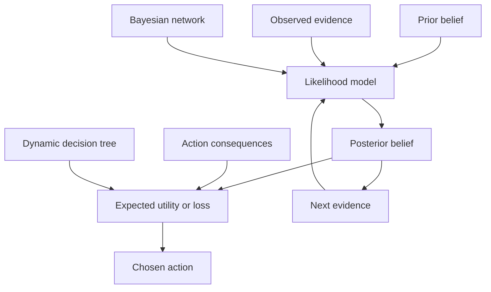

## What it is

**Bayesian decision theory** chooses an action by combining a prior belief, evidence, the consequences of each action, and the loss of a wrong decision. **Probabilistic inference** computes or approximates those beliefs from a model; **Bayes' theorem** is the update rule that connects prior probabilities, likelihoods, and evidence.

## How it works

**Bayes' theorem** states that a hypothesis becomes more probable when its likelihood under the observed evidence is high:

\[
P(H \mid E) = \frac{P(E \mid H)P(H)}{P(E)}.
\]

The denominator normalizes the scores of all mutually exclusive hypotheses. When a class has zero observed evidence, its posterior is zero; when the denominator is zero, the evidence is impossible under the model and the update is undefined. Numeric implementations add smoothing to avoid zero-likelihood overconfidence.

**Naive Bayes** is a classifier that computes a prior score for each class and multiplies the class likelihoods of observed features. It assumes features are conditionally independent given the class. That assumption is rarely exact for real data, but the resulting scores are simple to train and often effective for text classification, spam filtering, and other high-dimensional problems.

A **Bayesian network** is a directed acyclic graph whose nodes are random variables and whose conditional probability tables specify each variable given its parents. The graph encodes conditional independence, and its joint distribution factorizes into local factors. Inference combines those factors with evidence. Exact variable elimination or junction-tree methods are effective for small networks; approximate sampling, variational inference, or belief propagation is used when the graph is large or the latent state space is continuous.

**Belief updating** applies Bayes' theorem as evidence arrives. A sequence of observations updates the same posterior state, while a network propagates a local change to other variables through its dependencies. The update order can affect numerical error and work, so implementations commonly normalize only when the scores become too large or too small.



A **dynamic decision tree** turns inference into a sequence of decisions. It splits on the variable with useful information about the target, branches on possible observations, updates the remaining belief, and chooses an action after reaching a leaf or stopping rule. The tree can use posterior probabilities instead of hard labels, prune low-value branches, and refresh its structure as new observations arrive. A fixed decision tree is easier to inspect; a dynamic tree spends more work adapting to changing evidence.

The compact `BayesianInference` API uses the same operations in every language. `posterior` applies Bayes' theorem to one hypothesis, `update` is the belief-state form of the same operation, `naiveBayes` combines feature likelihoods, and `bestAction` maximizes expected utility from posterior probabilities and an action payoff table.


```java
public final class BayesianInference {
    public double posterior(double prior, double likelihood, double evidence) {
        if (prior < 0 || likelihood < 0 || evidence <= 0) throw new IllegalArgumentException();
        return prior * likelihood / evidence;
    }

    public double update(double belief, double likelihood, double evidence) {
        return posterior(belief, likelihood, evidence);
    }

    public double[] naiveBayes(double[] priors, double[][][] featureProbabilities, int[] observation) {
        if (priors.length == 0 || featureProbabilities.length != priors.length) throw new IllegalArgumentException();
        double[] scores = new double[priors.length];
        for (int klass = 0; klass < priors.length; klass++) {
            if (priors[klass] < 0 || featureProbabilities[klass].length != observation.length) throw new IllegalArgumentException();
            scores[klass] = priors[klass];
            for (int feature = 0; feature < observation.length; feature++) {
                double[] likelihoods = featureProbabilities[klass][feature];
                int value = observation[feature];
                if (value < 0 || value >= likelihoods.length || likelihoods[value] < 0) throw new IllegalArgumentException();
                scores[klass] *= likelihoods[value];
            }
        }
        double total = 0;
        for (double score : scores) total += score;
        if (total <= 0) throw new IllegalArgumentException("evidence has zero probability");
        for (int klass = 0; klass < scores.length; klass++) scores[klass] /= total;
        return scores;
    }

    public int bestAction(double[] posterior, double[][] actionPayoffs) {
        if (posterior.length == 0 || actionPayoffs.length == 0) throw new IllegalArgumentException();
        int best = 0;
        double bestUtility = Double.NEGATIVE_INFINITY;
        for (int action = 0; action < actionPayoffs.length; action++) {
            if (actionPayoffs[action].length != posterior.length) throw new IllegalArgumentException();
            double utility = 0;
            for (int klass = 0; klass < posterior.length; klass++) utility += posterior[klass] * actionPayoffs[action][klass];
            if (utility > bestUtility) {
                bestUtility = utility;
                best = action;
            }
        }
        return best;
    }
}
```

```c
#include <math.h>
#include <stddef.h>
#include <stdbool.h>
#include <stdlib.h>

typedef struct {
    int unused;
} BayesianInference;

double bi_posterior(BayesianInference* inference, double prior, double likelihood, double evidence) {
    (void)inference;
    if (prior < 0 || likelihood < 0 || evidence <= 0) return -1;
    return prior * likelihood / evidence;
}

double bi_update(BayesianInference* inference, double belief, double likelihood, double evidence) {
    return bi_posterior(inference, belief, likelihood, evidence);
}

int bi_naive_bayes(
    BayesianInference* inference,
    size_t class_count,
    size_t feature_count,
    const double* priors,
    const double* feature_probabilities,
    const size_t* value_counts,
    const int* observation,
    double* output
) {
    (void)inference;
    if (class_count == 0 || priors == NULL || feature_probabilities == NULL || value_counts == NULL || observation == NULL || output == NULL) return -1;
    double* scores = calloc(class_count, sizeof(double));
    if (scores == NULL) return -1;
    double total = 0;
    for (size_t klass = 0; klass < class_count; klass++) {
        scores[klass] = priors[klass];
        if (scores[klass] < 0) {
            free(scores);
            return -1;
        }
        for (size_t feature = 0; feature < feature_count; feature++) {
            size_t value_count = value_counts[feature];
            int value = observation[feature];
            if (value_count == 0 || value < 0 || (size_t)value >= value_count) {
                free(scores);
                return -1;
            }
            size_t index = (klass * feature_count + feature) * value_count + (size_t)value;
            if (feature_probabilities[index] < 0) {
                free(scores);
                return -1;
            }
            scores[klass] *= feature_probabilities[index];
        }
        total += scores[klass];
    }
    if (total <= 0) {
        free(scores);
        return -1;
    }
    for (size_t klass = 0; klass < class_count; klass++) output[klass] = scores[klass] / total;
    free(scores);
    return 0;
}

int bi_best_action(
    BayesianInference* inference,
    size_t action_count,
    size_t class_count,
    const double* posterior,
    const double* action_payoffs
) {
    (void)inference;
    if (action_count == 0 || class_count == 0 || posterior == NULL || action_payoffs == NULL) return -1;
    int best = -1;
    double best_utility = -INFINITY;
    for (size_t action = 0; action < action_count; action++) {
        double utility = 0;
        for (size_t klass = 0; klass < class_count; klass++) {
            utility += posterior[klass] * action_payoffs[action * class_count + klass];
        }
        if (utility > best_utility) {
            best_utility = utility;
            best = (int)action;
        }
    }
    return best;
}
```

```python
class BayesianInference:
    def posterior(self, prior, likelihood, evidence):
        if prior < 0 or likelihood < 0 or evidence <= 0:
            raise ValueError()
        return prior * likelihood / evidence

    def update(self, belief, likelihood, evidence):
        return self.posterior(belief, likelihood, evidence)

    def naive_bayes(self, priors, feature_probabilities, observation):
        if not priors or len(feature_probabilities) != len(priors):
            raise ValueError()
        scores = []
        for prior, likelihoods in zip(priors, feature_probabilities):
            if prior < 0 or len(likelihoods) != len(observation):
                raise ValueError()
            score = prior
            for values, value in zip(likelihoods, observation):
                if value < 0 or value >= len(values) or values[value] < 0:
                    raise ValueError()
                score *= values[value]
            scores.append(score)
        total = sum(scores)
        if total <= 0:
            raise ValueError("evidence has zero probability")
        return [score / total for score in scores]

    def best_action(self, posterior, action_payoffs):
        if not posterior or not action_payoffs:
            raise ValueError()
        best = 0
        best_utility = float("-inf")
        for action, payoffs in enumerate(action_payoffs):
            if len(payoffs) != len(posterior):
                raise ValueError()
            utility = sum(p * payoff for p, payoff in zip(posterior, payoffs))
            if utility > best_utility:
                best_utility = utility
                best = action
        return best
```

```rust
pub struct BayesianInference;

impl BayesianInference {
    pub fn posterior(&self, prior: f64, likelihood: f64, evidence: f64) -> f64 {
        assert!(prior >= 0.0 && likelihood >= 0.0 && evidence > 0.0);
        prior * likelihood / evidence
    }

    pub fn update(&self, belief: f64, likelihood: f64, evidence: f64) -> f64 {
        self.posterior(belief, likelihood, evidence)
    }

    pub fn naive_bayes(
        &self,
        priors: &[f64],
        feature_probabilities: &[Vec<Vec<f64>>],
        observation: &[usize],
    ) -> Vec<f64> {
        assert!(!priors.is_empty() && feature_probabilities.len() == priors.len());
        let mut scores = Vec::with_capacity(priors.len());
        for (prior, likelihoods) in priors.iter().zip(feature_probabilities) {
            assert!(*prior >= 0.0 && likelihoods.len() == observation.len());
            let mut score = *prior;
            for (values, value) in likelihoods.iter().zip(observation) {
                assert!(*value < values.len() && values[*value] >= 0.0);
                score *= values[*value];
            }
            scores.push(score);
        }
        let total: f64 = scores.iter().sum();
        assert!(total > 0.0);
        scores.into_iter().map(|score| score / total).collect()
    }

    pub fn best_action(&self, posterior: &[f64], action_payoffs: &[Vec<f64>]) -> usize {
        assert!(!posterior.is_empty() && !action_payoffs.is_empty());
        let mut best = 0;
        let mut best_utility = f64::NEG_INFINITY;
        for (action, payoffs) in action_payoffs.iter().enumerate() {
            assert!(payoffs.len() == posterior.len());
            let utility: f64 = posterior.iter().zip(payoffs).map(|(p, payoff)| p * payoff).sum();
            if utility > best_utility {
                best_utility = utility;
                best = action;
            }
        }
        best
    }
}
```

```typescript
class BayesianInference {
    posterior(prior: number, likelihood: number, evidence: number): number {
        if (prior < 0 || likelihood < 0 || evidence <= 0) throw new Error("invalid probability");
        return (prior * likelihood) / evidence;
    }

    update(belief: number, likelihood: number, evidence: number): number {
        return this.posterior(belief, likelihood, evidence);
    }

    naiveBayes(priors: number[], featureProbabilities: number[][][], observation: number[]): number[] {
        if (priors.length === 0 || featureProbabilities.length !== priors.length) throw new Error("invalid classes");
        const scores = priors.map((prior, klass) => {
            const likelihoods = featureProbabilities[klass];
            if (prior < 0 || likelihoods.length !== observation.length) throw new Error("invalid model");
            return observation.reduce((score, value, feature) => {
                if (value < 0 || value >= likelihoods[feature].length || likelihoods[feature][value] < 0) throw new Error("invalid feature");
                return score * likelihoods[feature][value];
            }, prior);
        });
        const total = scores.reduce((sum, score) => sum + score, 0);
        if (total <= 0) throw new Error("evidence has zero probability");
        return scores.map((score) => score / total);
    }

    bestAction(posterior: number[], actionPayoffs: number[][]): number {
        if (posterior.length === 0 || actionPayoffs.length === 0) throw new Error("invalid model");
        let best = 0;
        let bestUtility = Number.NEGATIVE_INFINITY;
        actionPayoffs.forEach((payoffs, action) => {
            if (payoffs.length !== posterior.length) throw new Error("invalid payoffs");
            const utility = posterior.reduce((sum, probability, klass) => sum + probability * payoffs[klass], 0);
            if (utility > bestUtility) {
                bestUtility = utility;
                best = action;
            }
        });
        return best;
    }
}
```

```go
package bayes

import "fmt"

type BayesianInference struct{}

func (inference BayesianInference) Posterior(prior float64, likelihood float64, evidence float64) (float64, error) {
    if prior < 0 || likelihood < 0 || evidence <= 0 {
        return 0, fmt.Errorf("invalid probability")
    }
    return prior * likelihood / evidence, nil
}

func (inference BayesianInference) Update(belief float64, likelihood float64, evidence float64) (float64, error) {
    return inference.Posterior(belief, likelihood, evidence)
}

func (inference BayesianInference) NaiveBayes(priors []float64, featureProbabilities [][][]float64, observation []int) ([]float64, error) {
    if len(priors) == 0 || len(featureProbabilities) != len(priors) {
        return nil, fmt.Errorf("invalid classes")
    }
    scores := make([]float64, len(priors))
    total := 0.0
    for klass, prior := range priors {
        likelihoods := featureProbabilities[klass]
        if prior < 0 || len(likelihoods) != len(observation) {
            return nil, fmt.Errorf("invalid model")
        }
        score := prior
        for feature, value := range observation {
            if value < 0 || value >= len(likelihoods[feature]) || likelihoods[feature][value] < 0 {
                return nil, fmt.Errorf("invalid feature")
            }
            score *= likelihoods[feature][value]
        }
        scores[klass] = score
        total += score
    }
    if total <= 0 {
        return nil, fmt.Errorf("evidence has zero probability")
    }
    for klass := range scores {
        scores[klass] /= total
    }
    return scores, nil
}

func (inference BayesianInference) BestAction(posterior []float64, actionPayoffs [][]float64) (int, error) {
    if len(posterior) == 0 || len(actionPayoffs) == 0 {
        return 0, fmt.Errorf("invalid model")
    }
    best := 0
    bestUtility := -1e300
    for action, payoffs := range actionPayoffs {
        if len(payoffs) != len(posterior) {
            return 0, fmt.Errorf("invalid payoffs")
        }
        utility := 0.0
        for klass, probability := range posterior {
            utility += probability * payoffs[klass]
        }
        if utility > bestUtility {
            bestUtility = utility
            best = action
        }
    }
    return best, nil
}
```

## Tradeoffs

| Property | Gain | Cost |
| --- | --- | --- |
| Exact Bayes update | Directly follows the model and remains interpretable | Requires correct priors, likelihoods, and evidence mass |
| Naive Bayes | Fast training and prediction with few parameters | Conditional-independence errors can reduce calibration |
| Bayesian networks | Represents dependencies and supports structured evidence queries | Inference can require exponential work without exploitable structure |
| Variable elimination | Exact and deterministic for manageable networks | Memory and time grow with the largest intermediate factor |
| Sampling or variational inference | Handles larger or continuous latent spaces | Introduces approximation error and sampling variability |
| Dynamic decision tree | Adapts splits and stops to new evidence | More complex to train, monitor, and explain than a static tree |

## When to use

- You need a posterior distribution or a normalized class probability after observing evidence.
- You have a prior model and can state which observations are likely under each hypothesis.
- You need fast classification when conditional independence is a reasonable approximation.
- You need to explain interactions among variables rather than treating them as a flat feature vector.
- You must choose an action and can express its payoff or expected loss for every relevant outcome.

## Alternatives

- **Frequentist inference** — emphasizes sampling behavior and error rates, but does not update a probability distribution over hypotheses in the same way.
- **Logistic regression** — is a discriminative classifier that does not require a generative model, but it does not represent the same conditional dependencies.
- **Factor graphs and message passing** — separate variables from factors and make local inference explicit, at the cost of a more specialized model.
- **Static decision trees** — are easier to deploy and audit, but do not adapt their structure or belief representation to new evidence.
- **Monte Carlo methods** — estimate difficult posteriors by sampling, trading exactness for scalability.

## Related

- [Dynamic Programming (Memoization, Tabulation, State Compression, Space Optimization, Peak/Tail Optimization)](../03-paradigms/03-dynamic-programming.md)
- [Graph Representations (Adjacency Matrix, Adjacency List, Edge List, Sparsity Representations, Graph Neural Network Data Structures)](../04-graphs/01-graph-representations.md)
- [Complexity Theory](../04a-computational-theory/01-complexity-theory.md)
- [Chapter 3B References](03-references.md)
