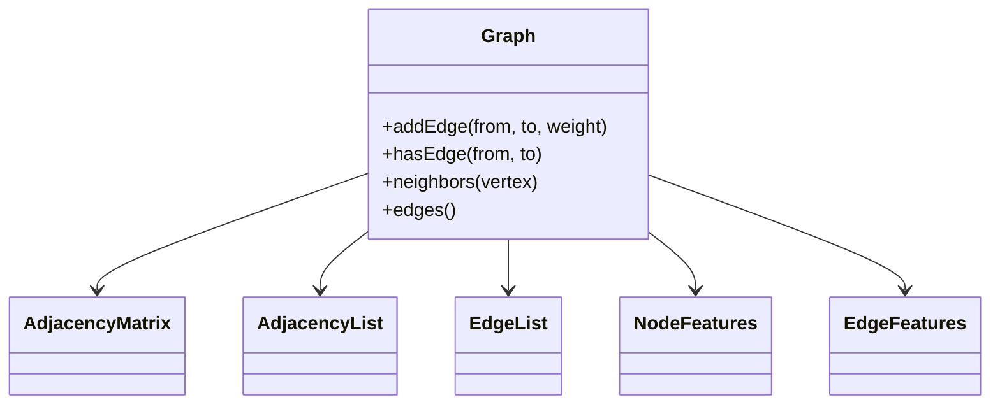

## What it is
A **graph representation** stores the same vertices and edges in a form optimized for different operations: an adjacency matrix for constant-time edge tests, an adjacency list for efficient neighbor iteration, and an edge list for compact edge processing.

## How it works
A graph has a fixed vertex count and either directed or undirected edges. `addEdge` records the edge in all three representations. `hasEdge` uses the matrix sentinel, so the examples assume nonzero edge weights; `neighbors` returns the vertices that adjacency-list traversal visits, and `edges` exposes the edge-list view.

### Graph Neural Network data structures
A **graph neural network (GNN)** keeps the graph topology separate from the numerical features used by message passing. A node-feature matrix stores one vector of \(d\) values per vertex. An edge list stores the source and destination vertex IDs, while **compressed sparse row (CSR)** storage groups destination IDs by source vertex so neighbor gathering is a contiguous read. Edge features are an optional third matrix for relationship attributes such as distance, type, or time.

For a layer, the GNN gathers each vertex's neighbor features, aggregates them with a permutation-invariant operation such as sum or mean, combines the result with the vertex's current state, and applies a neural-network update. A mini-batch can represent several graphs with one node table plus a batch-ID vector, avoiding a separate object for every graph. Sparse adjacency saves memory when \(E \ll V^2\), while a dense matrix makes tensor operations simpler but costs \(O(V^2)\) storage. Production frameworks such as PyTorch Geometric, DGL, and TensorFlow use combinations of edge lists, CSR-style indices, sampled neighborhoods, and contiguous feature buffers.



```java
import java.util.ArrayList;
import java.util.List;

public class Graph {
    public record Edge(int from, int to, int weight) {}

    private final int vertexCount;
    private final boolean directed;
    private final List<List<Integer>> adjacency;
    private final List<Edge> edges;
    private final int[][] matrix;

    public Graph(int vertexCount, boolean directed) {
        this.vertexCount = vertexCount;
        this.directed = directed;
        this.adjacency = new ArrayList<>();
        this.edges = new ArrayList<>();
        this.matrix = new int[vertexCount][vertexCount];
        for (int i = 0; i < vertexCount; i++) adjacency.add(new ArrayList<>());
    }

    public void addEdge(int from, int to, int weight) {
        adjacency.get(from).add(to);
        matrix[from][to] = weight;
        edges.add(new Edge(from, to, weight));
        if (!directed) {
            adjacency.get(to).add(from);
            matrix[to][from] = weight;
        }
    }

    public boolean hasEdge(int from, int to) {
        return matrix[from][to] != 0;
    }

    public List<Integer> neighbors(int vertex) {
        return List.copyOf(adjacency.get(vertex));
    }

    public List<Edge> edges() {
        return List.copyOf(edges);
    }
}
```

```c
#include <stdbool.h>
#include <stdlib.h>

typedef struct {
    int from;
    int to;
    int weight;
} Edge;

typedef struct Node {
    int vertex;
    struct Node* next;
} Node;

typedef struct {
    int vertex_count;
    bool directed;
    Node** adjacency;
    int** matrix;
    Edge* edges;
    int edge_count;
    int edge_capacity;
} Graph;

Graph* graph_create(int vertex_count, bool directed) {
    Graph* graph = calloc(1, sizeof(Graph));
    graph->vertex_count = vertex_count;
    graph->directed = directed;
    graph->adjacency = calloc(vertex_count, sizeof(Node*));
    graph->matrix = calloc(vertex_count, sizeof(int*));
    for (int i = 0; i < vertex_count; i++) {
        graph->matrix[i] = calloc(vertex_count, sizeof(int));
    }
    return graph;
}

void graph_add_edge(Graph* graph, int from, int to, int weight) {
    Node* node = malloc(sizeof(Node));
    node->vertex = to;
    node->next = graph->adjacency[from];
    graph->adjacency[from] = node;
    graph->matrix[from][to] = weight;
    if (graph->edge_count == graph->edge_capacity) {
        graph->edge_capacity = graph->edge_capacity == 0 ? 4 : graph->edge_capacity * 2;
        graph->edges = realloc(graph->edges, graph->edge_capacity * sizeof(Edge));
    }
    graph->edges[graph->edge_count++] = (Edge){from, to, weight};
    if (!graph->directed) {
        node = malloc(sizeof(Node));
        node->vertex = from;
        node->next = graph->adjacency[to];
        graph->adjacency[to] = node;
        graph->matrix[to][from] = weight;
    }
}

bool graph_has_edge(const Graph* graph, int from, int to) {
    return graph->matrix[from][to] != 0;
}

int graph_neighbors(const Graph* graph, int vertex, int* output) {
    int count = 0;
    for (Node* node = graph->adjacency[vertex]; node; node = node->next) {
        output[count++] = node->vertex;
    }
    return count;
}

Edge* graph_edges(const Graph* graph, int* count) {
    *count = graph->edge_count;
    return graph->edges;
}
```

```python
from dataclasses import dataclass


@dataclass(frozen=True)
class Edge:
    from_vertex: int
    to_vertex: int
    weight: int


class Graph:
    def __init__(self, vertex_count: int, directed: bool) -> None:
        self.vertex_count = vertex_count
        self.directed = directed
        self.adjacency: list[list[int]] = [[] for _ in range(vertex_count)]
        self.matrix = [[0] * vertex_count for _ in range(vertex_count)]
        self._edges: list[Edge] = []

    def add_edge(self, from_vertex: int, to_vertex: int, weight: int) -> None:
        self.adjacency[from_vertex].append(to_vertex)
        self.matrix[from_vertex][to_vertex] = weight
        self._edges.append(Edge(from_vertex, to_vertex, weight))
        if not self.directed:
            self.adjacency[to_vertex].append(from_vertex)
            self.matrix[to_vertex][from_vertex] = weight

    def has_edge(self, from_vertex: int, to_vertex: int) -> bool:
        return self.matrix[from_vertex][to_vertex] != 0

    def neighbors(self, vertex: int) -> list[int]:
        return self.adjacency[vertex].copy()

    def edges(self) -> list[Edge]:
        return self._edges.copy()
```

```rust
#[derive(Clone, Copy)]
pub struct Edge {
    pub from_vertex: usize,
    pub to_vertex: usize,
    pub weight: i32,
}

pub struct Graph {
    vertex_count: usize,
    directed: bool,
    adjacency: Vec<Vec<usize>>,
    matrix: Vec<Vec<i32>>,
    edges: Vec<Edge>,
}

impl Graph {
    pub fn new(vertex_count: usize, directed: bool) -> Self {
        Self {
            vertex_count,
            directed,
            adjacency: vec![Vec::new(); vertex_count],
            matrix: vec![vec![0; vertex_count]; vertex_count],
            edges: Vec::new(),
        }
    }

    pub fn add_edge(&mut self, from_vertex: usize, to_vertex: usize, weight: i32) {
        self.adjacency[from_vertex].push(to_vertex);
        self.matrix[from_vertex][to_vertex] = weight;
        self.edges.push(Edge { from_vertex, to_vertex, weight });
        if !self.directed {
            self.adjacency[to_vertex].push(from_vertex);
            self.matrix[to_vertex][from_vertex] = weight;
        }
    }

    pub fn has_edge(&self, from_vertex: usize, to_vertex: usize) -> bool {
        self.matrix[from_vertex][to_vertex] != 0
    }

    pub fn neighbors(&self, vertex: usize) -> &[usize] {
        &self.adjacency[vertex]
    }

    pub fn edges(&self) -> &[Edge] {
        &self.edges
    }
}
```

```typescript
export interface Edge {
  fromVertex: number;
  toVertex: number;
  weight: number;
}

export class Graph {
  readonly vertexCount: number;
  readonly directed: boolean;
  private readonly adjacency: number[][];
  private readonly matrix: number[][];
  private readonly edgeList: Edge[];

  constructor(vertexCount: number, directed: boolean) {
    this.vertexCount = vertexCount;
    this.directed = directed;
    this.adjacency = Array.from({ length: vertexCount }, () => []);
    this.matrix = Array.from({ length: vertexCount }, () => Array(vertexCount).fill(0));
    this.edgeList = [];
  }

  addEdge(fromVertex: number, toVertex: number, weight: number): void {
    this.adjacency[fromVertex].push(toVertex);
    this.matrix[fromVertex][toVertex] = weight;
    this.edgeList.push({ fromVertex, toVertex, weight });
    if (!this.directed) {
      this.adjacency[toVertex].push(fromVertex);
      this.matrix[toVertex][fromVertex] = weight;
    }
  }

  hasEdge(fromVertex: number, toVertex: number): boolean {
    return this.matrix[fromVertex][toVertex] !== 0;
  }

  neighbors(vertex: number): number[] {
    return this.adjacency[vertex].slice();
  }

  edges(): Edge[] {
    return this.edgeList.map((edge) => ({ ...edge }));
  }
}
```

```go
package graph

type Edge struct {
	FromVertex int
	ToVertex   int
	Weight     int
}

type Graph struct {
	VertexCount int
	Directed    bool
	Adjacency   [][]int
	Matrix      [][]int
	Edges       []Edge
}

func NewGraph(vertexCount int, directed bool) *Graph {
	adjacency := make([][]int, vertexCount)
	matrix := make([][]int, vertexCount)
	for i := 0; i < vertexCount; i++ {
		adjacency[i] = []int{}
		matrix[i] = make([]int, vertexCount)
	}
	return &Graph{VertexCount: vertexCount, Directed: directed, Adjacency: adjacency, Matrix: matrix}
}

func (g *Graph) AddEdge(fromVertex, toVertex, weight int) {
	g.Adjacency[fromVertex] = append(g.Adjacency[fromVertex], toVertex)
	g.Matrix[fromVertex][toVertex] = weight
	g.Edges = append(g.Edges, Edge{FromVertex: fromVertex, ToVertex: toVertex, Weight: weight})
	if !g.Directed {
		g.Adjacency[toVertex] = append(g.Adjacency[toVertex], fromVertex)
		g.Matrix[toVertex][fromVertex] = weight
	}
}

func (g *Graph) HasEdge(fromVertex, toVertex int) bool {
	return g.Matrix[fromVertex][toVertex] != 0
}

func (g *Graph) Neighbors(vertex int) []int {
	return append([]int(nil), g.Adjacency[vertex]...)
}

func (g *Graph) EdgesSnapshot() []Edge {
    return append([]Edge(nil), g.Edges...)
}
```

### GNN message passing and CSR

Message passing gathers each vertex's neighbor features, aggregates them, and updates the vertex state. CSR stores offsets and destination IDs in contiguous arrays, so one row's neighbors are gathered with sequential reads. The representation separates topology from node and edge features, allowing the same sparse index to feed a model without materializing a dense adjacency matrix.

## Complexity
For \(V\) vertices, \(E\) edges, and maximum degree \(\Delta\), the storage includes one operation per representation.

| Representation | Add edge | Test edge | Iterate neighbors | Space |
| --- | --- | --- | --- | --- |
| Adjacency matrix | O(1) | O(1) | O(V) | O(V²) |
| Adjacency list | O(1) amortized | O(deg(u)) | O(deg(u)) | O(V+E) |
| Edge list | O(1) amortized | O(E) | O(E) | O(E) |
| Linked adjacency list | O(1) | O(deg(u)) | O(deg(u)) | O(V+E) |
| GNN message passing with CSR neighbor storage | O(E + Nd) | O(E) edge index | O(deg(u)) per node gather | O(Vd + E) for features and indices |

`O(deg(u))` is at most `O(Δ)`. Head insertion in a linked-list implementation costs `O(1)` because the example stores each new edge at the head.

## When to use
- You need frequent neighbor iteration and the graph is sparse.
- You need constant-time edge tests and the \(V^2\) matrix cost is acceptable.
- You need compact storage for sorting or processing edges once.
- You need static, cache-friendly adjacency for repeated read-heavy traversal.

## Alternatives
- **Compressed sparse row (CSR)** — packs adjacency into contiguous arrays for fast reads, but updates require shifting or rebuilding data.
- **Hash adjacency map** — supports arbitrary vertex labels and expected constant-time edge tests, but iteration and locality are less predictable.
- **Implicit graph** — generates neighbors on demand and avoids storage when the full edge set is never materialized.

## Related
- [Graph Traversals: Breadth-First Search (BFS) and Depth-First Search (DFS)](02-graph-traversals.md)
- [Topological Sorting & Strongly Connected Components (Tarjan’s, Kosaraju’s)](03-topological-sort-scc.md)
- [Shortest Path Algorithms: Single-Source (Dijkstra’s, Bellman-Ford) & All-Pairs (Floyd-Warshall, Johnson’s)](05-shortest-paths.md)
- [Network Flow & Matching (Ford-Fulkerson, Edmonds-Karp, Dinic’s, Hopcroft-Karp)](06-network-flow.md)
