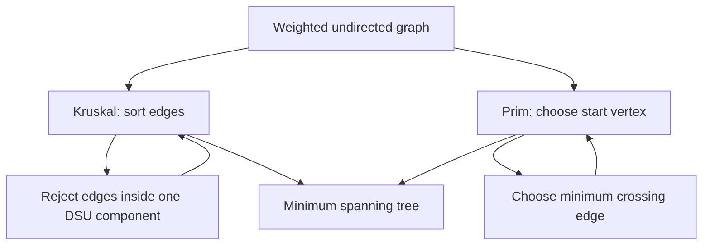

## What it is
A **minimum spanning tree (MST)** is a cycle-free subset of a connected, weighted, undirected graph that connects every vertex with minimum total edge weight.

## How it works
Kruskal's algorithm sorts edges and accepts the cheapest edge whose endpoints are in different **disjoint-set (DSU)** components. Prim's algorithm grows one tree from a start vertex and repeatedly accepts the cheapest edge crossing from that tree to the rest of the graph. The examples return total weight for a connected graph and use integer weights.



```java
import java.util.ArrayList;
import java.util.Comparator;
import java.util.List;
import java.util.PriorityQueue;

public final class MST {
    public record Edge(int from, int to, int weight) {}

    private static final class DSU {
        private final int[] parent;
        private final int[] rank;

        private DSU(int size) {
            parent = new int[size];
            rank = new int[size];
            for (int vertex = 0; vertex < size; vertex++) parent[vertex] = vertex;
        }

        private int find(int vertex) {
            if (parent[vertex] != vertex) parent[vertex] = find(parent[vertex]);
            return parent[vertex];
        }

        private boolean union(int first, int second) {
            int firstRoot = find(first);
            int secondRoot = find(second);
            if (firstRoot == secondRoot) return false;
            if (rank[firstRoot] < rank[secondRoot]) {
                int swap = firstRoot;
                firstRoot = secondRoot;
                secondRoot = swap;
            }
            parent[secondRoot] = firstRoot;
            if (rank[firstRoot] == rank[secondRoot]) rank[firstRoot]++;
            return true;
        }
    }

    public static long kruskal(int vertexCount, List<Edge> edges) {
        DSU dsu = new DSU(vertexCount);
        edges.sort(Comparator.comparingInt(Edge::weight));
        long total = 0;
        int selected = 0;
        for (Edge edge : edges) {
            if (dsu.union(edge.from(), edge.to())) {
                total += edge.weight();
                if (++selected == vertexCount - 1) break;
            }
        }
        return total;
    }

    public static long prim(List<List<int[]>> adjacency) {
        int vertexCount = adjacency.size();
        boolean[] inTree = new boolean[vertexCount];
        PriorityQueue<int[]> queue = new PriorityQueue<>(Comparator.comparingInt(edge -> edge[1]));
        queue.add(new int[]{0, 0});
        long total = 0;
        int selected = 0;
        while (!queue.isEmpty() && selected < vertexCount) {
            int[] edge = queue.remove();
            int vertex = edge[0];
            if (inTree[vertex]) continue;
            inTree[vertex] = true;
            if (selected > 0) total += edge[1];
            selected++;
            for (int[] neighbor : adjacency.get(vertex)) {
                if (!inTree[neighbor[0]]) queue.add(neighbor);
            }
        }
        return total;
    }
}
```

```c
#include <stdbool.h>
#include <stdlib.h>

typedef struct {
    int from;
    int to;
    int weight;
} Edge;

typedef struct WeightedEdge {
    int vertex;
    int weight;
    struct WeightedEdge* next;
} WeightedEdge;

typedef struct {
    int* parent;
    int* rank;
} DSU;

typedef struct {
    int vertex;
    int weight;
} HeapEntry;

static DSU* dsu_create(int vertex_count) {
    DSU* dsu = malloc(sizeof(DSU));
    dsu->parent = malloc(vertex_count * sizeof(int));
    dsu->rank = calloc(vertex_count, sizeof(int));
    for (int vertex = 0; vertex < vertex_count; vertex++) dsu->parent[vertex] = vertex;
    return dsu;
}

static int dsu_find(DSU* dsu, int vertex) {
    if (dsu->parent[vertex] != vertex) dsu->parent[vertex] = dsu_find(dsu, dsu->parent[vertex]);
    return dsu->parent[vertex];
}

static int dsu_union(DSU* dsu, int first, int second) {
    int first_root = dsu_find(dsu, first);
    int second_root = dsu_find(dsu, second);
    if (first_root == second_root) return 0;
    if (dsu->rank[first_root] < dsu->rank[second_root]) {
        int swap = first_root;
        first_root = second_root;
        second_root = swap;
    }
    dsu->parent[second_root] = first_root;
    if (dsu->rank[first_root] == dsu->rank[second_root]) dsu->rank[first_root]++;
    return 1;
}

static int compare_edge(const void* first, const void* second) {
    int first_weight = ((const Edge*)first)->weight;
    int second_weight = ((const Edge*)second)->weight;
    return (first_weight > second_weight) - (first_weight < second_weight);
}

long long mst_kruskal(int vertex_count, Edge* edges, int edge_count) {
    DSU* dsu = dsu_create(vertex_count);
    qsort(edges, edge_count, sizeof(Edge), compare_edge);
    long long total = 0;
    int selected = 0;
    for (int index = 0; index < edge_count && selected < vertex_count - 1; index++) {
        if (dsu_union(dsu, edges[index].from, edges[index].to)) {
            total += edges[index].weight;
            selected++;
        }
    }
    free(dsu->parent);
    free(dsu->rank);
    free(dsu);
    return total;
}

long long mst_prim(WeightedEdge** adjacency, int vertex_count) {
    if (vertex_count == 0) return 0;
    bool* in_tree = calloc(vertex_count, sizeof(bool));
    HeapEntry* queue = malloc((vertex_count * 2) * sizeof(HeapEntry));
    int queue_size = 0;
    queue[queue_size++] = (HeapEntry){0, 0};
    long long total = 0;
    int selected = 0;
    while (queue_size > 0 && selected < vertex_count) {
        int best = 0;
        for (int index = 1; index < queue_size; index++) {
            if (queue[index].weight < queue[best].weight) best = index;
        }
        HeapEntry entry = queue[best];
        queue[best] = queue[--queue_size];
        if (in_tree[entry.vertex]) continue;
        in_tree[entry.vertex] = true;
        if (selected > 0) total += entry.weight;
        selected++;
        for (WeightedEdge* edge = adjacency[entry.vertex]; edge; edge = edge->next) {
            if (!in_tree[edge->vertex]) {
                if (queue_size == vertex_count * 2) {
                    queue = realloc(queue, queue_size * 2 * sizeof(HeapEntry));
                }
                queue[queue_size++] = (HeapEntry){edge->vertex, edge->weight};
            }
        }
    }
    free(queue);
    free(in_tree);
    return total;
}
```

```python
import heapq


class DSU:
    def __init__(self, size: int) -> None:
        self.parent = list(range(size))
        self.rank = [0] * size

    def find(self, vertex: int) -> int:
        if self.parent[vertex] != vertex:
            self.parent[vertex] = self.find(self.parent[vertex])
        return self.parent[vertex]

    def union(self, first: int, second: int) -> bool:
        first_root = self.find(first)
        second_root = self.find(second)
        if first_root == second_root:
            return False
        if self.rank[first_root] < self.rank[second_root]:
            first_root, second_root = second_root, first_root
        self.parent[second_root] = first_root
        if self.rank[first_root] == self.rank[second_root]:
            self.rank[first_root] += 1
        return True


class MST:
    @staticmethod
    def kruskal(vertex_count: int, edges: list[tuple[int, int, int]]) -> int:
        dsu = DSU(vertex_count)
        total = 0
        selected = 0
        for first, second, weight in sorted(edges, key=lambda edge: edge[2]):
            if dsu.union(first, second):
                total += weight
                if selected == vertex_count - 1:
                    break
        return total

    @staticmethod
    def prim(adjacency: list[list[tuple[int, int]]]) -> int:
        if not adjacency:
            return 0
        in_tree = [False] * len(adjacency)
        queue = [(0, 0)]
        total = 0
        selected = 0
        while queue and selected < len(adjacency):
            weight, vertex = heapq.heappop(queue)
            if in_tree[vertex]:
                continue
            in_tree[vertex] = True
            if selected > 0:
                total += weight
            selected += 1
            for neighbor, edge_weight in adjacency[vertex]:
                if not in_tree[neighbor]:
                    heapq.heappush(queue, (edge_weight, neighbor))
        return total
```

```rust
use std::cmp::Reverse;
use std::collections::BinaryHeap;

struct DSU {
    parent: Vec<usize>,
    rank: Vec<u8>,
}

impl DSU {
    fn new(size: usize) -> Self {
        Self { parent: (0..size).collect(), rank: vec![0; size] }
    }

    fn find(&mut self, vertex: usize) -> usize {
        if self.parent[vertex] != vertex {
            self.parent[vertex] = self.find(self.parent[vertex]);
        }
        self.parent[vertex]
    }

    fn union(&mut self, first: usize, second: usize) -> bool {
        let mut first_root = self.find(first);
        let mut second_root = self.find(second);
        if first_root == second_root {
            return false;
        }
        if self.rank[first_root] < self.rank[second_root] {
            std::mem::swap(&mut first_root, &mut second_root);
        }
        self.parent[second_root] = first_root;
        if self.rank[first_root] == self.rank[second_root] {
            self.rank[first_root] += 1;
        }
        true
    }
}

pub struct MST;

impl MST {
    pub fn kruskal(vertex_count: usize, edges: &mut [(usize, usize, i32)]) -> i64 {
        edges.sort_by_key(|edge| edge.2);
        let mut dsu = DSU::new(vertex_count);
        let mut total = 0;
        let mut selected = 0;
        for &(first, second, weight) in edges.iter() {
            if dsu.union(first, second) {
                total += i64::from(weight);
                selected += 1;
                if selected == vertex_count - 1 {
                    break;
                }
            }
        }
        total
    }

    pub fn prim(adjacency: &[Vec<(usize, i32)>]) -> i64 {
        if adjacency.is_empty() {
            return 0;
        }
        let mut in_tree = vec![false; adjacency.len()];
        let mut queue = BinaryHeap::new();
        queue.push(Reverse((0, 0usize)));
        let mut total = 0;
        let mut selected = 0;
        while let Some(Reverse((weight, vertex))) = queue.pop() {
            if in_tree[vertex] {
                continue;
            }
            in_tree[vertex] = true;
            if selected > 0 {
                total += i64::from(weight);
            }
            selected += 1;
            for &(neighbor, edge_weight) in &adjacency[vertex] {
                if !in_tree[neighbor] {
                    queue.push(Reverse((edge_weight, neighbor)));
                }
            }
        }
        total
    }
}
```

```typescript
class DSU {
  private parent: number[];
  private rank: number[];

  constructor(size: number) {
    this.parent = Array.from({ length: size }, (_, vertex) => vertex);
    this.rank = new Array<number>(size).fill(0);
  }

  find(vertex: number): number {
    if (this.parent[vertex] !== vertex) this.parent[vertex] = this.find(this.parent[vertex]);
    return this.parent[vertex];
  }

  union(first: number, second: number): boolean {
    let firstRoot = this.find(first);
    let secondRoot = this.find(second);
    if (firstRoot === secondRoot) return false;
    if (this.rank[firstRoot] < this.rank[secondRoot]) [firstRoot, secondRoot] = [secondRoot, firstRoot];
    this.parent[secondRoot] = firstRoot;
    if (this.rank[firstRoot] === this.rank[secondRoot]) this.rank[firstRoot]++;
    return true;
  }
}

export class MST {
  static kruskal(vertexCount: number, edges: [number, number, number][]): number {
    const dsu = new DSU(vertexCount);
    edges.sort((first, second) => first[2] - second[2]);
    let total = 0;
    let selected = 0;
    for (const [from, to, weight] of edges) {
      if (dsu.union(from, to)) {
        total += weight;
        if (++selected === vertexCount - 1) break;
      }
    }
    return total;
  }

  static prim(adjacency: [number, number][][]): number {
    if (adjacency.length === 0) return 0;
    const inTree = new Array<boolean>(adjacency.length).fill(false);
    const queue: [number, number][] = [[0, 0]];
    let total = 0;
    let selected = 0;
    while (queue.length > 0 && selected < adjacency.length) {
      queue.sort((first, second) => first[0] - second[0]);
      const [weight, vertex] = queue.shift()!;
      if (inTree[vertex]) continue;
      inTree[vertex] = true;
      if (selected > 0) total += weight;
      selected++;
      for (const [neighbor, edgeWeight] of adjacency[vertex]) {
        if (!inTree[neighbor]) queue.push([edgeWeight, neighbor]);
      }
    }
    return total;
  }
}
```

```go
package graph

import (
	"container/heap"
	"sort"
)

type Edge struct {
	From   int
	To     int
	Weight int
}

type DSU struct {
	parent []int
	rank   []int
}

func newDSU(size int) *DSU {
	dsu := &DSU{parent: make([]int, size), rank: make([]int, size)}
	for vertex := 0; vertex < size; vertex++ {
		dsu.parent[vertex] = vertex
	}
	return dsu
}

func (dsu *DSU) Find(vertex int) int {
	if dsu.parent[vertex] != vertex {
		dsu.parent[vertex] = dsu.Find(dsu.parent[vertex])
	}
	return dsu.parent[vertex]
}

func (dsu *DSU) Union(first, second int) bool {
	firstRoot := dsu.Find(first)
	secondRoot := dsu.Find(second)
	if firstRoot == secondRoot {
		return false
	}
	if dsu.rank[firstRoot] < dsu.rank[secondRoot] {
		firstRoot, secondRoot = secondRoot, firstRoot
	}
	dsu.parent[secondRoot] = firstRoot
	if dsu.rank[firstRoot] == dsu.rank[secondRoot] {
		dsu.rank[firstRoot]++
	}
	return true
}

type MST struct{}

type heapEntry struct {
	vertex int
	weight int
}

type minHeap []heapEntry

func (heap minHeap) Len() int           { return len(heap) }
func (heap minHeap) Less(i, j int) bool { return heap[i].weight < heap[j].weight }
func (heap minHeap) Swap(i, j int)      { heap[i], heap[j] = heap[j], heap[i] }
func (heap *minHeap) Push(value any)    { *heap = append(*heap, value.(heapEntry)) }
func (heap *minHeap) Pop() any {
	old := *heap
	last := len(old) - 1
	value := old[last]
	*heap = old[:last]
	return value
}

func (MST) Kruskal(vertexCount int, edges []Edge) int64 {
	dsu := newDSU(vertexCount)
	sort.Slice(edges, func(first, second int) bool { return edges[first].Weight < edges[second].Weight })
	var total int64
	selected := 0
	for _, edge := range edges {
		if dsu.Union(edge.From, edge.To) {
			total += int64(edge.Weight)
			selected++
			if selected == vertexCount-1 {
				break
			}
		}
	}
	return total
}

func (MST) Prim(adjacency [][]Edge) int64 {
    if len(adjacency) == 0 {
        return 0
    }
    inTree := make([]bool, len(adjacency))
    queue := &minHeap{{vertex: 0, weight: 0}}
    heap.Init(queue)
    var total int64
    selected := 0
    for queue.Len() > 0 && selected < len(adjacency) {
        entry := heap.Pop(queue).(heapEntry)
        if inTree[entry.vertex] {
            continue
        }
        inTree[entry.vertex] = true
        if selected > 0 {
            total += int64(entry.weight)
        }
        selected++
        for _, edge := range adjacency[entry.vertex] {
            if !inTree[edge.To] {
                heap.Push(queue, heapEntry{vertex: edge.To, weight: edge.Weight})
            }
        }
    }
    return total
}
```

### Cut property, forests, and edge reconstruction

The MST cut property says that a minimum-weight edge crossing any cut of the graph is safe to include. Kruskal applies this idea to globally sorted edges, while Prim applies it to the cut between the current tree and the remaining vertices. A disconnected graph produces a minimum spanning forest with one tree per component. Returning selected edges, not only their total weight, is necessary for applications that need the actual network.

## Complexity
For \(V\) vertices, \(E\) edges, and an undirected connected graph:

| Algorithm | Time | Extra space |
| --- | --- | --- |
| Kruskal with sorting and path-compressed DSU | O(E log E) | O(V) beyond the input |
| Prim with a binary heap | O((V+E) log V) | O(V+E) |
| Prim with a Fibonacci heap | O(E + V log V) | O(V) |
| Borůvka | O(E log V) | O(V) |

The C and TypeScript Prim examples maintain sorted arrays rather than a binary heap, so their running time is O(E²) under those implementations. The Java, Python, Rust, and Go examples use heap implementations with the stated heap bounds.

## When to use
- You need a minimum-cost network that connects every node without cycles.
- You have an undirected edge list and can sort edges easily.
- You need a connected subgraph with minimum total weight, not shortest paths between every pair.
- You need a starting point for a heuristic such as single-linkage clustering.

## Alternatives
- **Borůvka's algorithm** — finds several safe edges per phase and suits distributed MST construction, but needs more bookkeeping.
- **Reverse-delete** — removes the heaviest edge in every cycle, which is conceptually simple but less efficient in practice.
- **Minimum bottleneck spanning tree** — minimizes the largest selected edge, which is different from minimizing total weight.

## Related
- [Graph Representations (Adjacency Matrix, Adjacency List, Edge List)](01-graph-representations.md)
- [Graph Traversals: Breadth-First Search (BFS) and Depth-First Search (DFS)](02-graph-traversals.md)
- [Union-Find](../02-search-trees/05-union-find.md)
- [Heaps, Priority Queues, and Fibonacci Heaps](../02-search-trees/02-heaps-priority-queues.md)
