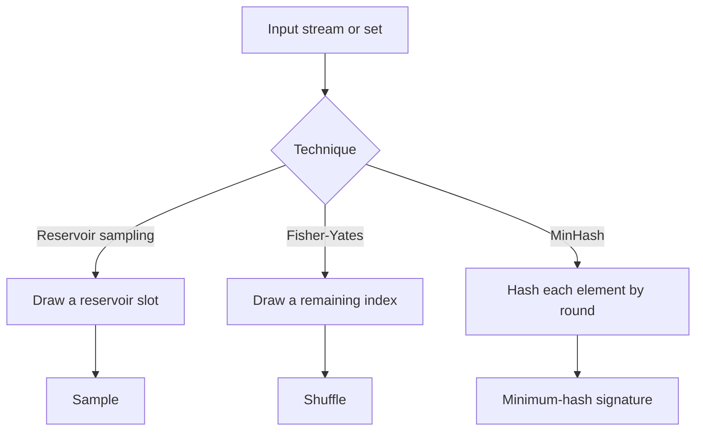

## What it is
**Randomized algorithms** use controlled chance to decide what to compute next, while **approximation algorithms** return a result close to the optimum without necessarily finding the exact answer. Together they trade certainty, worst-case work, or exactness for practical speed on large inputs.

## How it works
Reservoir sampling maintains \(k\) representatives while reading an unknown-length stream. For zero-based item \(i\), it replaces a random reservoir slot only when \(i<k\), then with probability \(k/(i+1)\). Every item therefore has probability \(k/n\) of remaining after \(n\) items, so a single pass produces a uniformly sampled subset without storing the stream.

Fisher-Yates shuffle chooses an unbiased remaining index for each output position. Swapping rather than shifting preserves an already-built prefix and gives every permutation probability \(1/n!\). The implementation uses a reproducible pseudo-random generator; production systems must use a properly seeded cryptographic generator when statistical unpredictability matters.

MinHash assigns each set a small fingerprint. In the ideal random-hash model, the fingerprint is the minimum hash of the set's individual elements, and two sets collide with probability equal to their Jaccard similarity \(|A\cap B|/|A\cup B|\). In that model, averaging matching positions over \(k\) independent hash functions estimates similarity, with standard error at most \(1/(2\sqrt{k})\). This implementation uses deterministic seeded hash functions, so it is reproducible but does not itself establish independence or that error bound for a particular seed and data set.

An **approximation ratio** or **additive error** states how far an answer can be from the best answer. A 2-approximation is useful only if being within a factor of two is acceptable. Randomized guarantees also specify success probability, such as “at least 99%,” rather than promising deterministic correctness.



```java
import java.util.Arrays;

public final class RandomizedAlgorithms {
    private static int next(int[] state) {
        state[0] = (int) ((state[0] * 1664525L + 1013904223L) & 0xffffffffL);
        return state[0];
    }

    private static int nextBelow(int[] state, int bound) {
        int threshold = (int) (0x1_0000_0000L % bound);
        while (true) {
            int value = next(state);
            if (Integer.compareUnsigned(value, threshold) >= 0) return (int) (Integer.toUnsignedLong(value) % bound);
        }
    }

    private static int elementHash(int seed, int round, int value) {
        long mixed = Integer.toUnsignedLong(seed) + 0x9e3779b97f4a7c15L * (round + 1L)
            + Integer.toUnsignedLong(value) * 0xbf58476d1ce4e5b9L;
        mixed = (mixed ^ (mixed >>> 30)) * 0xbf58476d1ce4e5b9L;
        mixed = (mixed ^ (mixed >>> 27)) * 0x94d049bb133111ebL;
        return (int) (mixed ^ (mixed >>> 31));
    }

    public static int[] reservoirSample(int[] items, int count, int seed) {
        if (count < 0 || count > items.length) throw new IllegalArgumentException("invalid sample size");
        int[] reservoir = Arrays.copyOf(items, count);
        int[] state = {seed};
        for (int index = count; index < items.length; index++) {
            int choice = nextBelow(state, index + 1);
            if (choice < count) reservoir[choice] = items[index];
        }
        return reservoir;
    }

    public static void fisherYates(int[] items, int seed) {
        int[] state = {seed};
        for (int index = items.length - 1; index > 0; index--) {
            int other = nextBelow(state, index + 1);
            int value = items[index];
            items[index] = items[other];
            items[other] = value;
        }
    }

    public static int[][] minHash(int[][] sets, int signatureSize, int seed) {
        int[][] signatures = new int[sets.length][signatureSize];
        for (int set = 0; set < sets.length; set++) {
            Arrays.fill(signatures[set], Integer.MAX_VALUE);
            for (int round = 0; round < signatureSize; round++) {
                for (int value : sets[set]) {
                    signatures[set][round] = Math.min(signatures[set][round], elementHash(seed, round, value));
                }
            }
        }
        return signatures;
    }
}
```

```c
#include <limits.h>
#include <stdbool.h>
#include <stdint.h>
#include <stdlib.h>
#include <string.h>

typedef struct {
    uint32_t state;
} RandomState;

static uint32_t randomized_algorithms_next(RandomState* random) {
    random->state = random->state * UINT32_C(1664525) + UINT32_C(1013904223);
    return random->state;
}

static uint32_t randomized_algorithms_next_below(RandomState* random, uint32_t bound) {
    uint32_t threshold = (uint32_t)((UINT64_C(1) << 32) % bound);
    for (;;) {
        uint32_t value = randomized_algorithms_next(random);
        if (value >= threshold) return value % bound;
    }
}

static uint32_t randomized_algorithms_element_hash(uint32_t seed, uint32_t round, int value) {
    uint64_t mixed = (uint64_t)seed + UINT64_C(0x9e3779b97f4a7c15) * (round + UINT64_C(1))
        + (uint32_t)value * UINT64_C(0xbf58476d1ce4e5b9);
    mixed = (mixed ^ (mixed >> 30)) * UINT64_C(0xbf58476d1ce4e5b9);
    mixed = (mixed ^ (mixed >> 27)) * UINT64_C(0x94d049bb133111eb);
    return (uint32_t)(mixed ^ (mixed >> 31));
}

int* randomized_algorithms_reservoir_sample(int* items, int item_count, int sample_size, uint32_t seed) {
    if (sample_size < 0 || sample_size > item_count) return NULL;
    int* reservoir = malloc(sample_size * sizeof(int));
    memcpy(reservoir, items, sample_size * sizeof(int));
    RandomState random = {seed};
    for (int index = sample_size; index < item_count; index++) {
        uint32_t choice = randomized_algorithms_next_below(&random, (uint32_t)(index + 1));
        if (choice < (uint32_t)sample_size) reservoir[choice] = items[index];
    }
    return reservoir;
}

void randomized_algorithms_fisher_yates(int* items, int item_count, uint32_t seed) {
    RandomState random = {seed};
    for (int index = item_count - 1; index > 0; index--) {
        int other = (int)randomized_algorithms_next_below(&random, (uint32_t)(index + 1));
        int value = items[index];
        items[index] = items[other];
        items[other] = value;
    }
}

uint32_t* randomized_algorithms_min_hash(int** sets, int* set_sizes, int set_count, int signature_size, uint32_t seed) {
    uint32_t* signatures = calloc((size_t)set_count * signature_size, sizeof(uint32_t));
    for (int set = 0; set < set_count; set++) {
        for (int round = 0; round < signature_size; round++) {
            uint32_t minimum = UINT32_MAX;
            for (int index = 0; index < set_sizes[set]; index++) {
                uint32_t hash = randomized_algorithms_element_hash(seed, (uint32_t)round, sets[set][index]);
                if (hash < minimum) minimum = hash;
            }
            signatures[(size_t)set * signature_size + round] = minimum;
        }
    }
    return signatures;
}
```

```python
class RandomizedAlgorithms:
    @staticmethod
    def _next_below(state: int, bound: int) -> tuple[int, int]:
        threshold = 2**32 % bound
        while True:
            state = (state * 1664525 + 1013904223) & 0xFFFFFFFF
            if state >= threshold:
                return state, state % bound

    @staticmethod
    def _element_hash(seed: int, round_index: int, value: int) -> int:
        mixed = (seed + 0x9E3779B97F4A7C15 * (round_index + 1) + (value & 0xFFFFFFFF) * 0xBF58476D1CE4E5B9) & 0xFFFFFFFFFFFFFFFF
        mixed = ((mixed ^ (mixed >> 30)) * 0xBF58476D1CE4E5B9) & 0xFFFFFFFFFFFFFFFF
        mixed = ((mixed ^ (mixed >> 27)) * 0x94D049BB133111EB) & 0xFFFFFFFFFFFFFFFF
        return (mixed ^ (mixed >> 31)) & 0xFFFFFFFF

    @staticmethod
    def reservoir_sample(items: list[int], count: int, seed: int) -> list[int]:
        if count < 0 or count > len(items):
            raise ValueError("invalid sample size")
        reservoir = items[:count]
        state = seed & 0xFFFFFFFF
        for index in range(count, len(items)):
            state, choice = RandomizedAlgorithms._next_below(state, index + 1)
            if choice < count:
                reservoir[choice] = items[index]
        return reservoir

    @staticmethod
    def fisher_yates(items: list[int], seed: int) -> list[int]:
        state = seed & 0xFFFFFFFF
        for index in range(len(items) - 1, 0, -1):
            state, other = RandomizedAlgorithms._next_below(state, index + 1)
            items[index], items[other] = items[other], items[index]
        return items

    @staticmethod
    def min_hash(sets: list[set[int]], signature_size: int, seed: int) -> list[list[int]]:
        signatures = [[2**32 - 1] * signature_size for _ in sets]
        for set_index, values in enumerate(sets):
            for round_index in range(signature_size):
                signatures[set_index][round_index] = min(
                    (RandomizedAlgorithms._element_hash(seed, round_index, value) for value in values),
                    default=2**32 - 1,
                )
        return signatures
```

```rust
pub struct RandomizedAlgorithms;

impl RandomizedAlgorithms {
    fn next(state: &mut u32) -> u32 {
        *state = state.wrapping_mul(1664525).wrapping_add(1013904223);
        *state
    }

    fn next_below(state: &mut u32, bound: u32) -> u32 {
        let threshold = (0x1_0000_0000u64 % bound as u64) as u32;
        loop {
            let value = Self::next(state);
            if value >= threshold {
                return value % bound;
            }
        }
    }

    fn element_hash(seed: u32, round: usize, value: i32) -> u32 {
        let mut mixed = (seed as u64)
            .wrapping_add(0x9e37_79b9_7f4a_7c15u64.wrapping_mul((round as u64).wrapping_add(1)))
            .wrapping_add(((value as u32) as u64).wrapping_mul(0xbf58_476d_1ce4_e5b9u64));
        mixed = (mixed ^ (mixed >> 30)).wrapping_mul(0xbf58_476d_1ce4_e5b9);
        mixed = (mixed ^ (mixed >> 27)).wrapping_mul(0x94d0_49bb_1331_11eb);
        (mixed ^ (mixed >> 31)) as u32
    }

    pub fn reservoir_sample(items: &[i32], count: usize, seed: u32) -> Option<Vec<i32>> {
        if count > items.len() {
            return None;
        }
        let mut reservoir = items[..count].to_vec();
        let mut state = seed;
        for (index, value) in items.iter().enumerate().skip(count) {
            let choice = Self::next_below(&mut state, (index + 1) as u32);
            if (choice as usize) < count {
                reservoir[choice as usize] = *value;
            }
        }
        Some(reservoir)
    }

    pub fn fisher_yates(items: &mut [i32], seed: u32) {
        let mut state = seed;
        for index in (1..items.len()).rev() {
            let other = Self::next_below(&mut state, (index + 1) as u32) as usize;
            items.swap(index, other);
        }
    }

    pub fn min_hash(sets: &[&[i32]], signature_size: usize, seed: u32) -> Vec<Vec<u32>> {
        sets.iter().map(|values| {
            (0..signature_size)
                .map(|round| values.iter().map(|&value| Self::element_hash(seed, round, value)).min().unwrap_or(u32::MAX))
                .collect()
        }).collect()
    }
}
```

```typescript
export class RandomizedAlgorithms {
  private static next(state: { value: number }): number {
    state.value = (Math.imul(state.value, 1664525) + 1013904223) >>> 0;
    return state.value;
  }

  private static nextBelow(state: { value: number }, bound: number): number {
    const threshold = 0x100000000 % bound;
    for (;;) {
      const value = RandomizedAlgorithms.next(state);
      if (value >= threshold) return value % bound;
    }
  }

  private static elementHash(seed: number, round: number, value: number): number {
    let mixed = BigInt.asUintN(
      64,
      BigInt(seed >>> 0)
        + 0x9e3779b97f4a7c15n * BigInt(round + 1)
        + BigInt(value >>> 0) * 0xbf58476d1ce4e5b9n,
    );
    mixed = BigInt.asUintN(64, (mixed ^ (mixed >> 30n)) * 0xbf58476d1ce4e5b9n);
    mixed = BigInt.asUintN(64, (mixed ^ (mixed >> 27n)) * 0x94d049bb133111ebn);
    return Number(BigInt.asUintN(32, mixed ^ (mixed >> 31n)));
  }

  static reservoirSample(items: number[], count: number, seed: number): number[] {
    if (count < 0 || count > items.length) throw new Error("invalid sample size");
    const reservoir = items.slice(0, count);
    const state = { value: seed >>> 0 };
    for (let index = count; index < items.length; index++) {
      const choice = RandomizedAlgorithms.nextBelow(state, index + 1);
      if (choice < count) reservoir[choice] = items[index];
    }
    return reservoir;
  }

  static fisherYates(items: number[], seed: number): number[] {
    const state = { value: seed >>> 0 };
    for (let index = items.length - 1; index > 0; index--) {
      const other = RandomizedAlgorithms.nextBelow(state, index + 1);
      [items[index], items[other]] = [items[other], items[index]];
    }
    return items;
  }

  static minHash(sets: number[][], signatureSize: number, seed: number): number[][] {
    return sets.map(values => Array.from({ length: signatureSize }, (_, round) => {
      let minimum = 0xffffffff;
      for (const value of values) minimum = Math.min(minimum, RandomizedAlgorithms.elementHash(seed, round, value));
      return minimum;
    }));
  }
}
```

```go
package randomized

type RandomizedAlgorithms struct{}

func randomizedAlgorithmsNext(state *uint32) uint32 {
	*state = *state*1664525 + 1013904223
	return *state
}

func randomizedAlgorithmsNextBelow(state *uint32, bound uint32) uint32 {
	threshold := uint32((uint64(1) << 32) % uint64(bound))
	for {
		value := randomizedAlgorithmsNext(state)
		if value >= threshold {
			return value % bound
		}
	}
}

func randomizedAlgorithmsElementHash(seed uint32, round int, value int) uint32 {
	mixed := uint64(seed) + uint64(0x9e3779b97f4a7c15)*uint64(round+1) + uint64(uint32(value))*uint64(0xbf58476d1ce4e5b9)
	mixed = (mixed ^ (mixed >> 30)) * uint64(0xbf58476d1ce4e5b9)
	mixed = (mixed ^ (mixed >> 27)) * uint64(0x94d049bb133111eb)
	return uint32(mixed ^ (mixed >> 31))
}

func (RandomizedAlgorithms) ReservoirSample(items []int, count int, seed uint32) []int {
	if count < 0 || count > len(items) {
		return nil
	}
	reservoir := append([]int(nil), items[:count]...)
	state := seed
	for index := count; index < len(items); index++ {
		choice := randomizedAlgorithmsNextBelow(&state, uint32(index+1))
		if int(choice) < count {
			reservoir[choice] = items[index]
		}
	}
	return reservoir
}

func (RandomizedAlgorithms) FisherYates(items []int, seed uint32) []int {
	state := seed
	for index := len(items) - 1; index > 0; index-- {
		other := int(randomizedAlgorithmsNextBelow(&state, uint32(index+1)))
		items[index], items[other] = items[other], items[index]
	}
	return items
}

func (RandomizedAlgorithms) MinHash(sets [][]int, signatureSize int, seed uint32) [][]uint32 {
	signatures := make([][]uint32, len(sets))
	for setIndex, values := range sets {
		signatures[setIndex] = make([]uint32, signatureSize)
		for round := range signatures[setIndex] {
			minimum := ^uint32(0)
			for _, value := range values {
				hash := randomizedAlgorithmsElementHash(seed, round, value)
				if hash < minimum {
					minimum = hash
				}
			}
			signatures[setIndex][round] = minimum
		}
	}
	return signatures
}
```

## Tradeoffs

| Technique | Gain | Cost |
| --- | --- | --- |
| Reservoir sampling | Uniform sample from a stream with one pass and O(k) memory | Depends on a valid random stream and may miss high-frequency items when counting only |
| Fisher-Yates shuffle | Uniform permutation in O(n) time | Mutates or copies the collection and consumes randomness |
| MinHash | Compresses set similarity into fixed-size signatures | Similarity is probabilistic and k hashes trade accuracy for memory and time |
| Approximation | Fast answer with a proven error bound | Does not always return the exact optimum |

## When to use
- You need a uniform sample from a stream that is too large to retain.
- You need an unbiased shuffle with linear time and a simple correctness argument.
- You need approximate Jaccard similarity for document, product, or record deduplication.
- You need a result within a proven bound faster than the exact optimum.

## Alternatives
- **Exact Jaccard computation** — use sorted sets or bitsets when inputs are small and exact intersections are required.
- **Weighted reservoir sampling** — preserves nonuniform item probabilities but requires known or estimated sampling weights.
- **Deterministic optimization** — use linear programming or combinatorial optimization when exact answers matter more than latency.

## Related
- [Computational Complexity Theory: P vs NP, NP-Completeness, NP-Hardness, and Polynomial-Time Reductions](01-complexity-theory.md)
- [Finite Automata & Formal Languages: NFA/DFA Constructions, Thompson's Construction, and Regex Engine Compilation](03-automata-formal-languages.md)
- [Computational Geometry Algorithms](04-computational-geometry.md)
