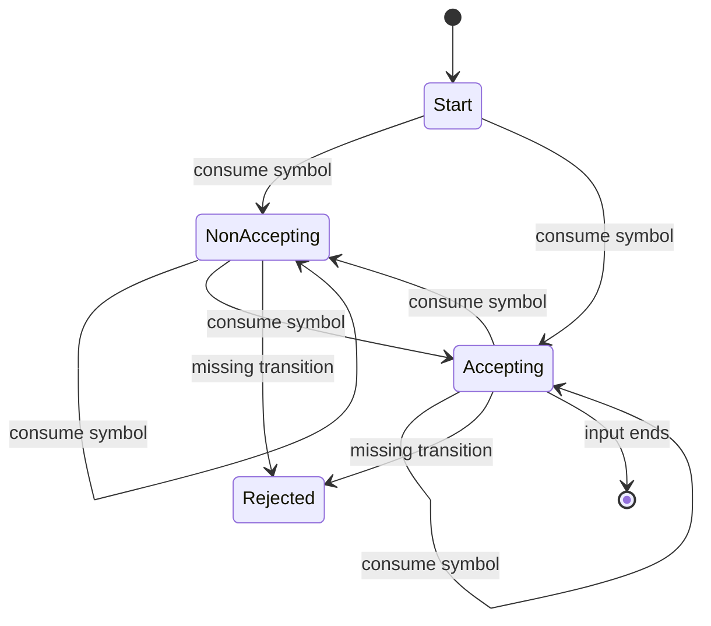

## What it is
**Finite automata** are state machines that read one symbol at a time without storing an entire history. Regular expressions describe the same regular languages, and compiler-like algorithms turn expressions into machines that can test or scan strings efficiently.

## How it works
A **deterministic finite automaton (DFA)** has exactly one next state for every state and input symbol. A **nondeterministic finite automaton (NFA)** may have several next states or none. The NFA is useful to construct because a regular expression has a direct piece-by-piece translation, but the DFA is convenient to execute.

Thompson's construction wraps each literal in a two-state machine. It adds epsilon transitions for alternation, connects fragments for concatenation, and loops a fragment back to its start for `*`. Here `ε` means “move without consuming a symbol.” The implementation supports literals, `|`, grouping with parentheses, and `*`.

A regex compiler parses precedence from lowest to highest: `|`, then concatenation, then repetition. Each parsed fragment contributes an NFA; Thompson's construction assembles those fragments. The engine then applies subset construction: each DFA state represents a set of NFA states, and an **epsilon-closure** follows every path that consumes no symbol. Each DFA transition applies one symbol and takes the epsilon-closure of the reached states.

This is how regular-expression engines such as RE2 use finite-automaton execution instead of backtracking. Avoiding general backtracking gives predictable work for supported regular syntax. Exponentiation and backreferences are not regular features; supporting them requires a different engine model. Catastrophic backtracking is therefore avoided for the language implemented here.

All six implementations deliberately use the same restricted alphabet: patterns contain at most 63 printable ASCII characters, and the engine reports a match only when the input is also printable ASCII. This avoids silently treating a multibyte UTF-8 sequence as several regex symbols. The C implementation additionally reserves capacity for 256 NFA states, 512 NFA transitions, 128 alphabet symbols, and 256 reachable DFA states. It rejects null or oversized inputs, invalid patterns, invalid NFA state references, and subsets that exceed the fixed DFA capacity; callers can distinguish these failures only by the returned `false` value.



```java
import java.util.ArrayDeque;
import java.util.ArrayList;
import java.util.Deque;
import java.util.HashSet;
import java.util.List;
import java.util.Set;

public final class FormalLanguages {
    public record Transition(int target, int symbol) {}
    public record Nfa(List<List<Transition>> transitions, int start, int accept) {}
    public record Dfa(int[][] transitions, boolean[] accepting, int[] alphabet, int start, int stateCount) {}

    private record Fragment(int start, int end) {}

    private static final class Parser {
        private final String pattern;
        private int position;
        private final List<List<Transition>> transitions;

        Parser(String pattern) {
            this.pattern = pattern;
            this.transitions = new ArrayList<>();
        }

        int state() {
            transitions.add(new ArrayList<>());
            return transitions.size() - 1;
        }

        void epsilon(int from, int to) {
            transitions.get(from).add(new Transition(to, -1));
        }

        void consume(int from, int to, int symbol) {
            transitions.get(from).add(new Transition(to, symbol));
        }

        Fragment expression() {
            Fragment left = concatenation();
            while (position < pattern.length() && pattern.charAt(position) == '|') {
                position++;
                Fragment right = concatenation();
                int start = state();
                int accept = state();
                epsilon(start, left.start());
                epsilon(start, right.start());
                epsilon(left.end(), accept);
                epsilon(right.end(), accept);
                left = new Fragment(start, accept);
            }
            return left;
        }

        Fragment concatenation() {
            if (position == pattern.length() || pattern.charAt(position) == ')') {
                int empty = state();
                return new Fragment(empty, empty);
            }
            Fragment left = repetition();
            while (position < pattern.length() && pattern.charAt(position) != ')' && pattern.charAt(position) != '|') {
                Fragment right = repetition();
                epsilon(left.end(), right.start());
                left = new Fragment(left.start(), right.end());
            }
            return left;
        }

        Fragment repetition() {
            Fragment fragment = atom();
            while (position < pattern.length() && pattern.charAt(position) == '*') {
                position++;
                int start = state();
                int accept = state();
                epsilon(start, fragment.start());
                epsilon(start, accept);
                epsilon(fragment.end(), fragment.start());
                epsilon(fragment.end(), accept);
                fragment = new Fragment(start, accept);
            }
            return fragment;
        }

        Fragment atom() {
            if (position == pattern.length()) throw new IllegalArgumentException("incomplete pattern");
            char symbol = pattern.charAt(position++);
            if (symbol == '(') {
                Fragment fragment = expression();
                if (position == pattern.length() || pattern.charAt(position++) != ')') throw new IllegalArgumentException("unclosed group");
                return fragment;
            }
            if (symbol == ')' || symbol == '|') throw new IllegalArgumentException("unexpected operator");
            int start = state();
            int accept = state();
            consume(start, accept, symbol);
            return new Fragment(start, accept);
        }
    }

    public static Nfa compile(String pattern) {
        if (pattern.length() > 63 || !pattern.chars().allMatch(symbol -> symbol >= 32 && symbol < 127)) {
            throw new IllegalArgumentException("pattern must contain at most 63 printable ASCII characters");
        }
        Parser parser = new Parser(pattern);
        Fragment fragment;
        if (pattern.isEmpty()) {
            int empty = parser.state();
            fragment = new Fragment(empty, empty);
        } else {
            fragment = parser.expression();
        }
        if (parser.position != pattern.length()) throw new IllegalArgumentException("invalid pattern");
        return new Nfa(parser.transitions, fragment.start(), fragment.end());
    }

    private static Set<Integer> closure(List<List<Transition>> transitions, Set<Integer> seeds) {
        Set<Integer> result = new HashSet<>(seeds);
        Deque<Integer> queue = new ArrayDeque<>(seeds);
        while (!queue.isEmpty()) {
            for (Transition transition : transitions.get(queue.removeFirst())) {
                if (transition.symbol() == -1 && result.add(transition.target())) queue.addLast(transition.target());
            }
        }
        return result;
    }

    public static Dfa toDfa(Nfa nfa) {
        Set<Integer> symbolSet = new java.util.TreeSet<>();
        for (List<Transition> stateTransitions : nfa.transitions()) {
            for (Transition transition : stateTransitions) {
                if (transition.symbol() >= 0) symbolSet.add(transition.symbol());
            }
        }
        int[] alphabet = new int[symbolSet.size()];
        int alphabetIndex = 0;
        for (int symbol : symbolSet) alphabet[alphabetIndex++] = symbol;
        List<Set<Integer>> states = new ArrayList<>();
        states.add(closure(nfa.transitions(), Set.of(nfa.start())));
        List<Set<Integer>> canonical = new ArrayList<>();
        canonical.add(states.get(0));
        int[][] table = new int[alphabet.length][1];
        if (alphabet.length > 0) java.util.Arrays.fill(table[0], -1);
        boolean[] accepting = {states.get(0).contains(nfa.accept())};
        for (int state = 0; state < states.size(); state++) {
            for (int symbolIndex = 0; symbolIndex < alphabet.length; symbolIndex++) {
                Set<Integer> reached = new HashSet<>();
                for (int nfaState : states.get(state)) {
                    for (Transition transition : nfa.transitions().get(nfaState)) {
                        if (transition.symbol() == alphabet[symbolIndex]) reached.add(transition.target());
                    }
                }
                Set<Integer> target = closure(nfa.transitions(), reached);
                if (target.isEmpty()) continue;
                int targetIndex = -1;
                for (int index = 0; index < canonical.size(); index++) {
                    if (canonical.get(index).equals(target)) {
                        targetIndex = index;
                        break;
                    }
                }
                if (targetIndex < 0) {
                    targetIndex = states.size();
                    states.add(target);
                    canonical.add(target);
                    accepting = java.util.Arrays.copyOf(accepting, targetIndex + 1);
                    accepting[targetIndex] = target.contains(nfa.accept());
                    for (int rowIndex = 0; rowIndex < table.length; rowIndex++) {
                        int oldLength = table[rowIndex].length;
                        table[rowIndex] = java.util.Arrays.copyOf(table[rowIndex], targetIndex + 1);
                        java.util.Arrays.fill(table[rowIndex], oldLength, targetIndex + 1, -1);
                    }
                }
                table[symbolIndex][state] = targetIndex;
            }
        }
        return new Dfa(table, accepting, alphabet, 0, states.size());
    }

    public static boolean matches(String pattern, String input) {
        if (!input.chars().allMatch(symbol -> symbol >= 32 && symbol < 127)) return false;
        Dfa dfa = toDfa(compile(pattern));
        int state = 0;
        for (int index = 0; index < input.length(); index++) {
            int symbol = input.charAt(index);
            int column = -1;
            for (int row = 0; row < dfa.alphabet().length; row++) {
                if (dfa.alphabet()[row] == symbol) column = row;
            }
            if (column < 0) return false;
            state = dfa.transitions()[column][state];
            if (state < 0) return false;
        }
        return dfa.accepting()[state];
    }
}
```

```c
#include <stdbool.h>
#include <stddef.h>

#define FORMAL_LANGUAGES_MAX_PATTERN_LENGTH 64
#define FORMAL_LANGUAGES_MAX_STATES 256
#define FORMAL_LANGUAGES_MAX_TRANSITIONS 512
#define FORMAL_LANGUAGES_MAX_ALPHABET 128

typedef struct {
    int source;
    int target;
    int symbol;
} Transition;

typedef struct {
    Transition transitions[FORMAL_LANGUAGES_MAX_TRANSITIONS];
    int transition_count;
    int state_count;
    int start;
    int accept;
} Nfa;

typedef struct {
    int transitions[FORMAL_LANGUAGES_MAX_ALPHABET][FORMAL_LANGUAGES_MAX_STATES];
    bool accepting[FORMAL_LANGUAGES_MAX_STATES];
    int alphabet[FORMAL_LANGUAGES_MAX_ALPHABET];
    int alphabet_count;
    int start;
    int state_count;
} Dfa;

typedef struct {
    const char* pattern;
    size_t length;
    size_t position;
    Nfa* nfa;
    bool failed;
} Parser;

typedef struct {
    int start;
    int end;
} Fragment;

static Fragment formal_languages_invalid_fragment(void) {
    return (Fragment){-1, -1};
}

static int formal_languages_state(Parser* parser) {
    if (parser->failed || parser->nfa->state_count >= FORMAL_LANGUAGES_MAX_STATES) {
        parser->failed = true;
        return -1;
    }
    return parser->nfa->state_count++;
}

static bool formal_languages_add_transition(Parser* parser, int source, int target, int symbol) {
    Nfa* nfa = parser->nfa;
    if (parser->failed || source < 0 || target < 0 || source >= nfa->state_count
        || target >= nfa->state_count || symbol < -1 || symbol >= FORMAL_LANGUAGES_MAX_ALPHABET
        || nfa->transition_count >= FORMAL_LANGUAGES_MAX_TRANSITIONS) {
        parser->failed = true;
        return false;
    }
    Transition* transition = &nfa->transitions[nfa->transition_count++];
    transition->source = source;
    transition->target = target;
    transition->symbol = symbol;
    return true;
}

static Fragment formal_languages_atom(Parser* parser);
static Fragment formal_languages_repetition(Parser* parser);
static Fragment formal_languages_concatenation(Parser* parser);

static Fragment formal_languages_expression(Parser* parser) {
    Fragment left = formal_languages_concatenation(parser);
    if (parser->failed || left.start < 0) return formal_languages_invalid_fragment();
    while (parser->position < parser->length && parser->pattern[parser->position] == '|') {
        parser->position++;
        Fragment right = formal_languages_concatenation(parser);
        int start = formal_languages_state(parser);
        int accept = formal_languages_state(parser);
        if (right.start < 0 || start < 0 || accept < 0
            || !formal_languages_add_transition(parser, start, left.start, -1)
            || !formal_languages_add_transition(parser, start, right.start, -1)
            || !formal_languages_add_transition(parser, left.end, accept, -1)
            || !formal_languages_add_transition(parser, right.end, accept, -1)) {
            return formal_languages_invalid_fragment();
        }
        left = (Fragment){start, accept};
    }
    return left;
}

static Fragment formal_languages_concatenation(Parser* parser) {
    if (parser->failed) return formal_languages_invalid_fragment();
    if (parser->position == parser->length || parser->pattern[parser->position] == ')') {
        int state = formal_languages_state(parser);
        return state < 0 ? formal_languages_invalid_fragment() : (Fragment){state, state};
    }
    Fragment left = formal_languages_repetition(parser);
    if (parser->failed || left.start < 0) return formal_languages_invalid_fragment();
    while (parser->position < parser->length
        && parser->pattern[parser->position] != ')'
        && parser->pattern[parser->position] != '|') {
        Fragment right = formal_languages_repetition(parser);
        if (right.start < 0
            || !formal_languages_add_transition(parser, left.end, right.start, -1)) {
            return formal_languages_invalid_fragment();
        }
        left = (Fragment){left.start, right.end};
    }
    return left;
}

static Fragment formal_languages_repetition(Parser* parser) {
    Fragment fragment = formal_languages_atom(parser);
    if (parser->failed || fragment.start < 0) return formal_languages_invalid_fragment();
    while (parser->position < parser->length && parser->pattern[parser->position] == '*') {
        parser->position++;
        int start = formal_languages_state(parser);
        int accept = formal_languages_state(parser);
        if (start < 0 || accept < 0
            || !formal_languages_add_transition(parser, start, fragment.start, -1)
            || !formal_languages_add_transition(parser, start, accept, -1)
            || !formal_languages_add_transition(parser, fragment.end, fragment.start, -1)
            || !formal_languages_add_transition(parser, fragment.end, accept, -1)) {
            return formal_languages_invalid_fragment();
        }
        fragment = (Fragment){start, accept};
    }
    return fragment;
}

static Fragment formal_languages_atom(Parser* parser) {
    if (parser->failed || parser->position >= parser->length) {
        parser->failed = true;
        return formal_languages_invalid_fragment();
    }
    unsigned char symbol = (unsigned char)parser->pattern[parser->position++];
    if (symbol == '(') {
        Fragment fragment = formal_languages_expression(parser);
        if (parser->failed || fragment.start < 0
            || parser->position >= parser->length
            || parser->pattern[parser->position++] != ')') {
            parser->failed = true;
            return formal_languages_invalid_fragment();
        }
        return fragment;
    }
    if (symbol == ')' || symbol == '|') {
        parser->failed = true;
        return formal_languages_invalid_fragment();
    }
    int start = formal_languages_state(parser);
    int accept = formal_languages_state(parser);
    if (start < 0 || accept < 0 || !formal_languages_add_transition(parser, start, accept, (int)symbol)) {
        return formal_languages_invalid_fragment();
    }
    return (Fragment){start, accept};
}

bool formal_languages_compile(const char* pattern, Nfa* nfa) {
    if (pattern == NULL || nfa == NULL) return false;
    size_t length = 0;
    while (length < FORMAL_LANGUAGES_MAX_PATTERN_LENGTH && pattern[length] != '\0') {
        unsigned char symbol = (unsigned char)pattern[length];
        if (symbol < 32 || symbol >= 127) return false;
        length++;
    }
    if (length == FORMAL_LANGUAGES_MAX_PATTERN_LENGTH) return false;
    nfa->transition_count = 0;
    nfa->state_count = 0;
    nfa->start = -1;
    nfa->accept = -1;
    Parser parser = {pattern, length, 0, nfa, false};
    Fragment fragment;
    if (length == 0) {
        int state = formal_languages_state(&parser);
        fragment = (Fragment){state, state};
    } else {
        fragment = formal_languages_expression(&parser);
    }
    if (parser.failed || fragment.start < 0 || fragment.end < 0 || parser.position != length) return false;
    nfa->start = fragment.start;
    nfa->accept = fragment.end;
    return true;
}

static void formal_languages_closure(
    const Nfa* nfa,
    bool states[FORMAL_LANGUAGES_MAX_STATES],
    int queue[FORMAL_LANGUAGES_MAX_STATES]
) {
    int head = 0;
    int tail = 0;
    for (int state = 0; state < nfa->state_count; state++) {
        if (states[state]) queue[tail++] = state;
    }
    while (head < tail) {
        int state = queue[head++];
        for (int transition = 0; transition < nfa->transition_count; transition++) {
            Transition edge = nfa->transitions[transition];
            if (edge.source == state && edge.symbol == -1 && !states[edge.target]) {
                states[edge.target] = true;
                queue[tail++] = edge.target;
            }
        }
    }
}

bool formal_languages_to_dfa(const Nfa* nfa, Dfa* dfa) {
    if (nfa == NULL || dfa == NULL || nfa->state_count <= 0
        || nfa->state_count > FORMAL_LANGUAGES_MAX_STATES
        || nfa->transition_count < 0
        || nfa->transition_count > FORMAL_LANGUAGES_MAX_TRANSITIONS
        || nfa->start < 0 || nfa->start >= nfa->state_count
        || nfa->accept < 0 || nfa->accept >= nfa->state_count) {
        return false;
    }
    for (int transition = 0; transition < nfa->transition_count; transition++) {
        Transition edge = nfa->transitions[transition];
        if (edge.source < 0 || edge.source >= nfa->state_count
            || edge.target < 0 || edge.target >= nfa->state_count
            || edge.symbol < -1 || edge.symbol >= FORMAL_LANGUAGES_MAX_ALPHABET) {
            return false;
        }
    }
    bool states[FORMAL_LANGUAGES_MAX_STATES][FORMAL_LANGUAGES_MAX_STATES] = {false};
    int queue[FORMAL_LANGUAGES_MAX_STATES];
    for (int row = 0; row < FORMAL_LANGUAGES_MAX_ALPHABET; row++) {
        for (int state = 0; state < FORMAL_LANGUAGES_MAX_STATES; state++) {
            dfa->transitions[row][state] = -1;
        }
    }
    for (int state = 0; state < FORMAL_LANGUAGES_MAX_STATES; state++) dfa->accepting[state] = false;
    dfa->alphabet_count = 0;
    for (int symbol = 0; symbol < FORMAL_LANGUAGES_MAX_ALPHABET; symbol++) {
        bool present = false;
        for (int transition = 0; transition < nfa->transition_count; transition++) {
            if (nfa->transitions[transition].symbol == symbol) present = true;
        }
        if (present) {
            if (dfa->alphabet_count >= FORMAL_LANGUAGES_MAX_ALPHABET) return false;
            dfa->alphabet[dfa->alphabet_count++] = symbol;
        }
    }
    states[0][nfa->start] = true;
    formal_languages_closure(nfa, states[0], queue);
    dfa->state_count = 1;
    dfa->start = 0;
    dfa->accepting[0] = states[0][nfa->accept];
    for (int state = 0; state < dfa->state_count; state++) {
        for (int symbol_index = 0; symbol_index < dfa->alphabet_count; symbol_index++) {
            bool reached[FORMAL_LANGUAGES_MAX_STATES] = {false};
            for (int nfa_state = 0; nfa_state < nfa->state_count; nfa_state++) {
                if (!states[state][nfa_state]) continue;
                for (int transition = 0; transition < nfa->transition_count; transition++) {
                    Transition edge = nfa->transitions[transition];
                    if (edge.source == nfa_state && edge.symbol == dfa->alphabet[symbol_index]) {
                        reached[edge.target] = true;
                    }
                }
            }
            formal_languages_closure(nfa, reached, queue);
            bool empty = true;
            int target = -1;
            for (int nfa_state = 0; nfa_state < nfa->state_count; nfa_state++) {
                if (reached[nfa_state]) empty = false;
            }
            if (empty) continue;
            for (int candidate = 0; candidate < dfa->state_count; candidate++) {
                bool equal = true;
                for (int nfa_state = 0; nfa_state < nfa->state_count; nfa_state++) {
                    if (states[candidate][nfa_state] != reached[nfa_state]) equal = false;
                }
                if (equal) {
                    target = candidate;
                    break;
                }
            }
            if (target < 0) {
                if (dfa->state_count >= FORMAL_LANGUAGES_MAX_STATES) return false;
                target = dfa->state_count++;
                for (int nfa_state = 0; nfa_state < nfa->state_count; nfa_state++) {
                    states[target][nfa_state] = reached[nfa_state];
                }
                dfa->accepting[target] = reached[nfa->accept];
            }
            dfa->transitions[symbol_index][state] = target;
        }
    }
    return true;
}

bool formal_languages_matches(const char* pattern, const char* input) {
    if (pattern == NULL || input == NULL) return false;
    for (const unsigned char* value = (const unsigned char*)input; *value; value++) {
        if (*value < 32 || *value >= 127) return false;
    }
    Nfa nfa = {0};
    Dfa dfa = {0};
    if (!formal_languages_compile(pattern, &nfa)) return false;
    if (!formal_languages_to_dfa(&nfa, &dfa)) return false;
    int state = dfa.start;
    for (const unsigned char* symbol = (const unsigned char*)input; *symbol; symbol++) {
        int column = -1;
        for (int index = 0; index < dfa.alphabet_count; index++) {
            if (dfa.alphabet[index] == *symbol) column = index;
        }
        if (column < 0) return false;
        state = dfa.transitions[column][state];
        if (state < 0) return false;
    }
    return dfa.accepting[state];
}
```

```python
class FormalLanguages:
    Transition = tuple[int, int]
    Nfa = tuple[list[list[tuple[int, int]]], int, int]
    Dfa = tuple[list[list[int]], list[bool], list[int], int]

    @staticmethod
    def compile(pattern: str) -> Nfa:
        if len(pattern) > 63 or any(not 32 <= ord(symbol) < 127 for symbol in pattern):
            raise ValueError("pattern must contain at most 63 printable ASCII characters")
        transitions: list[list[tuple[int, int]]] = []

        def state() -> int:
            transitions.append([])
            return len(transitions) - 1

        def epsilon(source: int, target: int) -> None:
            transitions[source].append((target, -1))

        def consume(source: int, target: int, symbol: int) -> None:
            transitions[source].append((target, symbol))

        def atom(position: int) -> tuple[tuple[int, int], int]:
            if position == len(pattern):
                raise ValueError("incomplete pattern")
            symbol = pattern[position]
            if symbol == "(":
                fragment, position = expression(position + 1)
                if position == len(pattern) or pattern[position] != ")":
                    raise ValueError("unclosed group")
                return fragment, position + 1
            if symbol in ")|":
                raise ValueError("unexpected operator")
            start = state()
            accept = state()
            consume(start, accept, ord(symbol))
            return (start, accept), position + 1

        def repetition(position: int) -> tuple[tuple[int, int], int]:
            fragment, position = atom(position)
            while position < len(pattern) and pattern[position] == "*":
                position += 1
                start = state()
                accept = state()
                epsilon(start, fragment[0])
                epsilon(start, accept)
                epsilon(fragment[1], fragment[0])
                epsilon(fragment[1], accept)
                fragment = (start, accept)
            return fragment, position

        def concatenation(position: int) -> tuple[tuple[int, int], int]:
            if position == len(pattern) or pattern[position] == ")":
                empty = state()
                return (empty, empty), position
            fragment, position = repetition(position)
            while position < len(pattern) and pattern[position] not in ")|":
                right, position = repetition(position)
                epsilon(fragment[1], right[0])
                fragment = (fragment[0], right[1])
            return fragment, position

        def expression(position: int) -> tuple[tuple[int, int], int]:
            fragment, position = concatenation(position)
            while position < len(pattern) and pattern[position] == "|":
                right, position = concatenation(position + 1)
                start = state()
                accept = state()
                epsilon(start, fragment[0])
                epsilon(start, right[0])
                epsilon(fragment[1], accept)
                epsilon(right[1], accept)
                fragment = (start, accept)
            return fragment, position

        if not pattern:
            empty = state()
            fragment, position = (empty, empty), 0
        else:
            fragment, position = expression(0)
        if position != len(pattern):
            raise ValueError("invalid pattern")
        return transitions, fragment[0], fragment[1]

    @staticmethod
    def _closure(transitions: list[list[tuple[int, int]]], seeds: set[int]) -> set[int]:
        result = set(seeds)
        pending = list(seeds)
        while pending:
            for target, symbol in transitions[pending.pop()]:
                if symbol == -1 and target not in result:
                    result.add(target)
                    pending.append(target)
        return result

    @staticmethod
    def to_dfa(nfa: Nfa) -> Dfa:
        transitions, nfa_start, nfa_accept = nfa
        alphabet = sorted({symbol for state in transitions for _, symbol in state if symbol >= 0})
        start = FormalLanguages._closure(transitions, {nfa_start})
        states = [start]
        mapping = {frozenset(start): 0}
        accepting = [nfa_start in start]
        table = [[-1] for _ in alphabet]
        state = 0
        while state < len(states):
            for symbol_index, symbol in enumerate(alphabet):
                reached = {target for nfa_state in states[state] for target, edge_symbol in transitions[nfa_state] if edge_symbol == symbol}
                target_set = FormalLanguages._closure(transitions, reached)
                if not target_set:
                    continue
                frozen = frozenset(target_set)
                if frozen not in mapping:
                    mapping[frozen] = len(states)
                    states.append(target_set)
                    accepting.append(nfa_accept in target_set)
                    for row in table:
                        row.append(-1)
                    table.append([-1] * len(states))
                table[symbol_index][state] = mapping[frozen]
            state += 1
        return table, accepting, alphabet, len(states)

    @staticmethod
    def matches(pattern: str, input_text: str) -> bool:
        if any(not 32 <= ord(symbol) < 127 for symbol in input_text): return False
        table, accepting, alphabet, _ = FormalLanguages.to_dfa(FormalLanguages.compile(pattern))
        current = 0
        for character in input_text:
            symbol = ord(character)
            symbol_index = alphabet.index(symbol) if symbol in alphabet else -1
            if symbol_index < 0:
                return False
            current = table[symbol_index][current]
            if current < 0:
                return False
        return accepting[current]
```

```rust
use std::collections::{BTreeSet, HashMap, HashSet, VecDeque};

pub struct FormalLanguages;

pub struct Transition {
    pub target: usize,
    pub symbol: i32,
}

pub struct Nfa {
    pub transitions: Vec<Vec<Transition>>,
    pub start: usize,
    pub accept: usize,
}

pub struct Dfa {
    pub transitions: Vec<Vec<i32>>,
    pub accepting: Vec<bool>,
    pub alphabet: Vec<i32>,
    pub start: usize,
}

impl FormalLanguages {
    pub fn compile(pattern: &str) -> Option<Nfa> {
        if pattern.len() > 63 || !pattern.bytes().all(|symbol| (32..127).contains(&symbol)) { return None; }
        let mut transitions: Vec<Vec<Transition>> = Vec::new();
        let characters: Vec<char> = pattern.chars().collect();
        let mut position = 0usize;

        fn state(transitions: &mut Vec<Vec<Transition>>) -> usize {
            transitions.push(Vec::new());
            transitions.len() - 1
        }
        fn epsilon(transitions: &mut Vec<Vec<Transition>>, source: usize, target: usize) {
            transitions[source].push(Transition { target, symbol: -1 });
        }

        fn atom(
            characters: &[char],
            position: &mut usize,
            transitions: &mut Vec<Vec<Transition>>,
        ) -> Option<(usize, usize)> {
            let symbol = *characters.get(*position)?;
            *position += 1;
            if symbol == '(' {
                let fragment = expression(characters, position, transitions)?;
                if characters.get(*position) != Some(&')') {
                    return None;
                }
                *position += 1;
                Some(fragment)
            } else if symbol == ')' || symbol == '|' {
                None
            } else {
                let start = state(transitions);
                let accept = state(transitions);
                transitions[start].push(Transition { target: accept, symbol: symbol as i32 });
                Some((start, accept))
            }
        }

        fn repetition(
            characters: &[char],
            position: &mut usize,
            transitions: &mut Vec<Vec<Transition>>,
        ) -> Option<(usize, usize)> {
            let mut fragment = atom(characters, position, transitions)?;
            while characters.get(*position) == Some(&'*') {
                *position += 1;
                let start = state(transitions);
                let accept = state(transitions);
                epsilon(transitions, start, fragment.0);
                epsilon(transitions, start, accept);
                epsilon(transitions, fragment.1, fragment.0);
                epsilon(transitions, fragment.1, accept);
                fragment = (start, accept);
            }
            Some(fragment)
        }

        fn concatenation(
            characters: &[char],
            position: &mut usize,
            transitions: &mut Vec<Vec<Transition>>,
        ) -> Option<(usize, usize)> {
            if characters.get(*position).is_none() || characters[*position] == ')' {
                let empty = state(transitions);
                return Some((empty, empty));
            }
            let mut fragment = repetition(characters, position, transitions)?;
            while let Some(symbol) = characters.get(*position) {
                if *symbol == ')' || *symbol == '|' {
                    break;
                }
                let right = repetition(characters, position, transitions)?;
                epsilon(transitions, fragment.1, right.0);
                fragment = (fragment.0, right.1);
            }
            Some(fragment)
        }

        fn expression(
            characters: &[char],
            position: &mut usize,
            transitions: &mut Vec<Vec<Transition>>,
        ) -> Option<(usize, usize)> {
            let mut fragment = concatenation(characters, position, transitions)?;
            while characters.get(*position) == Some(&'|') {
                *position += 1;
                let right = concatenation(characters, position, transitions)?;
                let start = state(transitions);
                let accept = state(transitions);
                epsilon(transitions, start, fragment.0);
                epsilon(transitions, start, right.0);
                epsilon(transitions, fragment.1, accept);
                epsilon(transitions, right.1, accept);
                fragment = (start, accept);
            }
            Some(fragment)
        }

        let fragment = if characters.is_empty() {
            let empty = state(&mut transitions);
            (empty, empty)
        } else {
            expression(&characters, &mut position, &mut transitions)?
        };
        if position != characters.len() {
            return None;
        }
        Some(Nfa { transitions, start: fragment.0, accept: fragment.1 })
    }

    fn closure(transitions: &[Vec<Transition>], seeds: &HashSet<usize>) -> HashSet<usize> {
        let mut result = seeds.clone();
        let mut pending: VecDeque<usize> = seeds.iter().copied().collect();
        while let Some(source) = pending.pop_front() {
            for transition in &transitions[source] {
                if transition.symbol == -1 && result.insert(transition.target) {
                    pending.push_back(transition.target);
                }
            }
        }
        result
    }

    pub fn to_dfa(nfa: &Nfa) -> Dfa {
        let alphabet: BTreeSet<i32> = nfa
            .transitions
            .iter()
            .flatten()
            .filter_map(|transition| (transition.symbol >= 0).then_some(transition.symbol))
            .collect();
        let alphabet: Vec<i32> = alphabet.into_iter().collect();
        let start = Self::closure(&nfa.transitions, &HashSet::from([nfa.start]));
        let mut states = vec![start];
        let mut mapping = HashMap::from([(Self::signature(&states[0]), 0usize)]);
        let mut accepting = vec![states[0].contains(&nfa.accept)];
        let mut table = vec![vec![-1i32; states.len()]; alphabet.len()];
        let mut state = 0;
        while state < states.len() {
            for (symbol_index, symbol) in alphabet.iter().enumerate() {
                let reached: HashSet<usize> = states[state]
                    .iter()
                    .flat_map(|nfa_state| &nfa.transitions[*nfa_state])
                    .filter(|transition| transition.symbol == *symbol)
                    .map(|transition| transition.target)
                    .collect();
                let target = Self::closure(&nfa.transitions, &reached);
                if target.is_empty() {
                    continue;
                }
                let target_index = if let Some(index) = mapping.get(&Self::signature(&target)) {
                    *index
                } else {
                    let index = states.len();
                    mapping.insert(Self::signature(&target), index);
                    states.push(target.clone());
                    accepting.push(target.contains(&nfa.accept));
                    for row in &mut table {
                        row.push(-1);
                    }
                    table.push(vec![-1; states.len()]);
                    index
                };
                table[symbol_index][state] = target_index as i32;
            }
            state += 1;
        }
        Dfa { transitions: table, accepting, alphabet, start: 0 }
    }

    pub fn matches(pattern: &str, input_text: &str) -> bool {
        if !input_text.bytes().all(|symbol| (32..127).contains(&symbol)) { return false; }
        let Some(nfa) = Self::compile(pattern) else { return false };
        let dfa = Self::to_dfa(&nfa);
        let mut state = dfa.start;
        for character in input_text.chars() {
            let Some(symbol_index) = dfa.alphabet.iter().position(|symbol| *symbol == character as i32) else { return false };
            let target = dfa.transitions[symbol_index][state];
            if target < 0 {
                return false;
            }
            state = target as usize;
        }
        dfa.accepting[state]
    }

    fn signature(states: &HashSet<usize>) -> Vec<usize> {
        let mut signature: Vec<usize> = states.iter().copied().collect();
        signature.sort_unstable();
        signature
    }
}
```

```typescript
export class FormalLanguages {
  static compile(pattern: string): { transitions: [number, number][][]; start: number; accept: number } {
    if (pattern.length > 63 || Array.from(pattern).some((symbol) => {
      const code = symbol.charCodeAt(0);
      return code < 32 || code >= 127;
    })) {
      throw new Error("pattern must contain at most 63 printable ASCII characters");
    }
    const transitions: [number, number][][] = [];
    const state = (): number => {
      transitions.push([]);
      return transitions.length - 1;
    };
    const epsilon = (source: number, target: number): void => {
      transitions[source].push([target, -1]);
    };
    const atom = (position: number): [{ start: number; end: number }, number] => {
      if (position === pattern.length) throw new Error("incomplete pattern");
      const symbol = pattern[position];
      if (symbol === "(") {
        const [fragment, next] = expression(position + 1);
        if (pattern[next] !== ")") throw new Error("unclosed group");
        return [fragment, next + 1];
      }
      if (symbol === ")" || symbol === "|") throw new Error("unexpected operator");
      const start = state();
      const accept = state();
      transitions[start].push([accept, symbol.charCodeAt(0)]);
      return [{ start, end: accept }, position + 1];
    };
    const repetition = (position: number): [{ start: number; end: number }, number] => {
      let [fragment, next] = atom(position);
      while (pattern[next] === "*") {
        next++;
        const start = state();
        const accept = state();
        epsilon(start, fragment.start);
        epsilon(start, accept);
        epsilon(fragment.end, fragment.start);
        epsilon(fragment.end, accept);
        fragment = { start, end: accept };
      }
      return [fragment, next];
    };
    const concatenation = (position: number): [{ start: number; end: number }, number] => {
      if (position === pattern.length || pattern[position] === ")") {
        const empty = state();
        return [{ start: empty, end: empty }, position];
      }
      let [fragment, next] = repetition(position);
      while (next < pattern.length && pattern[next] !== ")" && pattern[next] !== "|") {
        const [right, following] = repetition(next);
        epsilon(fragment.end, right.start);
        fragment = { start: fragment.start, end: right.end };
        next = following;
      }
      return [fragment, next];
    };
    const expression = (position: number): [{ start: number; end: number }, number] => {
      let [fragment, next] = concatenation(position);
      while (pattern[next] === "|") {
        const [right, following] = concatenation(next + 1);
        const start = state();
        const accept = state();
        epsilon(start, fragment.start);
        epsilon(start, right.start);
        epsilon(fragment.end, accept);
        epsilon(right.end, accept);
        fragment = { start, end: accept };
        next = following;
      }
      return [fragment, next];
    };
    if (pattern.length === 0) {
      const empty = state();
      return { transitions, start: empty, accept: empty };
    }
    const [fragment, position] = expression(0);
    if (position !== pattern.length) throw new Error("invalid pattern");
    return { transitions, start: fragment.start, accept: fragment.end };
  }

  private static closure(transitions: [number, number][][], seeds: Set<number>): Set<number> {
    const result = new Set(seeds);
    const pending = [...seeds];
    while (pending.length > 0) {
      const source = pending.pop()!;
      for (const [target, symbol] of transitions[source]) {
        if (symbol === -1 && !result.has(target)) {
          result.add(target);
          pending.push(target);
        }
      }
    }
    return result;
  }

  static toDfa(nfa: { transitions: [number, number][][]; start: number; accept: number }): { transitions: number[][]; accepting: boolean[]; alphabet: number[] } {
    const alphabet = [...new Set(nfa.transitions.flat().filter(([, symbol]) => symbol >= 0).map(([, symbol]) => symbol))].sort((left, right) => left - right);
    const start = FormalLanguages.closure(nfa.transitions, new Set([nfa.start]));
    const states = [start];
    const accepting = [start.has(nfa.accept)];
    const table = alphabet.map(() => [-1]);
    for (let state = 0; state < states.length; state++) {
      for (let symbolIndex = 0; symbolIndex < alphabet.length; symbolIndex++) {
        const symbol = alphabet[symbolIndex];
        const reached = new Set<number>();
        for (const nfaState of states[state]) {
          for (const [target, edgeSymbol] of nfa.transitions[nfaState]) {
            if (edgeSymbol === symbol) reached.add(target);
          }
        }
        const target = FormalLanguages.closure(nfa.transitions, reached);
        if (target.size === 0) continue;
        const key = [...target].sort((left, right) => left - right).join(",");
        let targetIndex = states.findIndex((candidate) => [...candidate].sort((left, right) => left - right).join(",") === key);
        if (targetIndex < 0) {
          targetIndex = states.length;
          states.push(target);
          accepting.push(target.has(nfa.accept));
          for (const row of table) row.push(-1);
          table.push(new Array<number>(states.length).fill(-1));
        }
        table[symbolIndex][state] = targetIndex;
      }
    }
    return { transitions: table, accepting, alphabet };
  }

  static matches(pattern: string, inputText: string): boolean {
    if (Array.from(inputText).some((symbol) => {
      const code = symbol.charCodeAt(0);
      return code < 32 || code >= 127;
    })) return false;
    const dfa = FormalLanguages.toDfa(FormalLanguages.compile(pattern));
    let state = 0;
    for (let index = 0; index < inputText.length; index++) {
      const symbol = inputText.charCodeAt(index);
      const column = dfa.alphabet.indexOf(symbol);
      if (column < 0) return false;
      state = dfa.transitions[column][state];
      if (state < 0) return false;
    }
    return dfa.accepting[state];
  }
}
```

```go
package automata

import "sort"

type FormalLanguages struct{}

type Transition struct {
	Target int
	Symbol int
}

type Nfa struct {
	Transitions [][]Transition
	Start       int
	Accept      int
}

type Dfa struct {
	Transitions [][]int
	Accepting   []bool
	Alphabet    []int
	Start       int
}

type parser struct {
	pattern      []rune
	position     int
	transitions  [][]Transition
}

type fragment struct {
	start int
	end   int
}

func (p *parser) state() int {
	p.transitions = append(p.transitions, []Transition{})
	return len(p.transitions) - 1
}

func (p *parser) epsilon(source, target int) {
	p.transitions[source] = append(p.transitions[source], Transition{Target: target, Symbol: -1})
}

func (p *parser) atom() (fragment, bool) {
	if p.position == len(p.pattern) {
		return fragment{}, false
	}
	symbol := p.pattern[p.position]
	p.position++
	if symbol == '(' {
		value, ok := p.expression()
		if !ok || p.position == len(p.pattern) || p.pattern[p.position] != ')' {
			return fragment{}, false
		}
		p.position++
		return value, true
	}
	if symbol == ')' || symbol == '|' {
		return fragment{}, false
	}
	start := p.state()
	accept := p.state()
	p.transitions[start] = append(p.transitions[start], Transition{Target: accept, Symbol: int(symbol)})
	return fragment{start: start, end: accept}, true
}

func (p *parser) repetition() (fragment, bool) {
	value, ok := p.atom()
	if !ok {
		return fragment{}, false
	}
	for p.position < len(p.pattern) && p.pattern[p.position] == '*' {
		p.position++
		start := p.state()
		accept := p.state()
		p.epsilon(start, value.start)
		p.epsilon(start, accept)
		p.epsilon(value.end, value.start)
		p.epsilon(value.end, accept)
		value = fragment{start: start, end: accept}
	}
	return value, true
}

func (p *parser) concatenation() (fragment, bool) {
	if p.position == len(p.pattern) || p.pattern[p.position] == ')' {
		empty := p.state()
		return fragment{start: empty, end: empty}, true
	}
	left, ok := p.repetition()
	if !ok {
		return fragment{}, false
	}
	for p.position < len(p.pattern) && p.pattern[p.position] != ')' && p.pattern[p.position] != '|' {
		right, ok := p.repetition()
		if !ok {
			return fragment{}, false
		}
		p.epsilon(left.end, right.start)
		left = fragment{start: left.start, end: right.end}
	}
	return left, true
}

func (p *parser) expression() (fragment, bool) {
	left, ok := p.concatenation()
	if !ok {
		return fragment{}, false
	}
	for p.position < len(p.pattern) && p.pattern[p.position] == '|' {
		p.position++
		right, ok := p.concatenation()
		if !ok {
			return fragment{}, false
		}
		start := p.state()
		accept := p.state()
		p.epsilon(start, left.start)
		p.epsilon(start, right.start)
		p.epsilon(left.end, accept)
		p.epsilon(right.end, accept)
		left = fragment{start: start, end: accept}
	}
	return left, true
}

func (FormalLanguages) Compile(pattern string) (Nfa, bool) {
	if len(pattern) > 63 {
		return Nfa{}, false
	}
	for _, character := range pattern {
		if character < 32 || character >= 127 {
			return Nfa{}, false
		}
	}
	p := parser{pattern: []rune(pattern)}
	var value fragment
	ok := true
	if len(p.pattern) == 0 {
		empty := p.state()
		value = fragment{start: empty, end: empty}
	} else {
		value, ok = p.expression()
	}
	return Nfa{Transitions: p.transitions, Start: value.start, Accept: value.end}, ok && p.position == len(p.pattern)
}

func (FormalLanguages) closure(transitions [][]Transition, seeds map[int]bool) map[int]bool {
	result := make(map[int]bool, len(seeds))
	pending := make([]int, 0, len(seeds))
	for state := range seeds {
		result[state] = true
		pending = append(pending, state)
	}
	for len(pending) > 0 {
		source := pending[0]
		pending = pending[1:]
		for _, transition := range transitions[source] {
			if transition.Symbol == -1 && !result[transition.Target] {
				result[transition.Target] = true
				pending = append(pending, transition.Target)
			}
		}
	}
	return result
}

func (FormalLanguages) ToDfa(nfa Nfa) Dfa {
	alphabetMap := make(map[int]bool)
	for _, state := range nfa.Transitions {
		for _, transition := range state {
			if transition.Symbol >= 0 {
				alphabetMap[transition.Symbol] = true
			}
		}
	}
	alphabet := make([]int, 0, len(alphabetMap))
	for symbol := range alphabetMap {
		alphabet = append(alphabet, symbol)
	}
	sort.Ints(alphabet)
	start := FormalLanguages{}.closure(nfa.Transitions, map[int]bool{nfa.Start: true})
	states := []map[int]bool{start}
	accepting := []bool{start[nfa.Accept]}
	table := make([][]int, len(alphabet))
	for state := 0; state < len(states); state++ {
		for symbolIndex, symbol := range alphabet {
			reached := make(map[int]bool)
			for nfaState := range states[state] {
				for _, transition := range nfa.Transitions[nfaState] {
					if transition.Symbol == symbol {
						reached[transition.Target] = true
					}
				}
			}
			target := FormalLanguages{}.closure(nfa.Transitions, reached)
			if len(target) == 0 {
				continue
			}
			targetIndex := -1
			for index, candidate := range states {
				if (FormalLanguages{}).sameStates(candidate, target) {
					targetIndex = index
					break
				}
			}
			if targetIndex < 0 {
				targetIndex = len(states)
				states = append(states, target)
				accepting = append(accepting, target[nfa.Accept])
				for index := range table {
					table[index] = append(table[index], -1)
				}
				newRow := make([]int, len(states))
				for index := range newRow {
					newRow[index] = -1
				}
				table = append(table, newRow)
			}
			table[symbolIndex][state] = targetIndex
		}
	}
	return Dfa{Transitions: table, Accepting: accepting, Alphabet: alphabet, Start: 0}
}

func (FormalLanguages) sameStates(left, right map[int]bool) bool {
	if len(left) != len(right) {
		return false
	}
	for state := range left {
		if !right[state] {
			return false
		}
	}
	return true
}

func (FormalLanguages) Matches(pattern, inputText string) bool {
	for _, character := range inputText {
		if character < 32 || character >= 127 {
			return false
		}
	}
	nfa, ok := FormalLanguages{}.Compile(pattern)
	if !ok {
		return false
	}
	dfa := FormalLanguages{}.ToDfa(nfa)
	state := dfa.Start
	for _, character := range inputText {
		column := -1
		for index, symbol := range dfa.Alphabet {
			if symbol == int(character) {
				column = index
				break
			}
		}
		if column < 0 {
			return false
		}
		state = dfa.Transitions[column][state]
		if state < 0 {
			return false
		}
	}
	return dfa.Accepting[state]
}
```

## Complexity
For NFA state count \(N\), input length \(L\), and DFA state count \(D\):

| Task | Time | Space |
| --- | --- | --- |
| Thompson construction for a length-\(m\) expression | O(m) | O(m) |
| Subset construction | O(N 2^N) in the worst case | O(N 2^N), exponential in N |
| DFA simulation | O(L) | O(1) additional space |
| NFA simulation | O(mL) | O(m) excluding transition storage |

A DFA can be larger than the NFA, and the theoretical worst case is exponential in the NFA state count. RE2 and many search engines use hybrid or restricted state sets to cap work and memory.

## When to use
- You need a predictable recognizer for search, filtering, lexical rules, or protocol input.
- You need to convert a regular expression into a reusable execution plan.
- You need to decide whether two regular languages are equivalent after determinization.
- You need to avoid the unbounded stack growth of a backtracking regular-expression engine.

## Alternatives
- **Backtracking regex engines** — support richer features such as backreferences, but can take superlinear time on adversarial inputs.
- **Pushdown automata** — recognize context-free languages such as balanced expressions, at the cost of an explicit stack.
- **Turing machines** — model general computation, but are not practical recognizers for ordinary text filtering.

## Related
- [Computational Complexity Theory: P vs NP, NP-Completeness, NP-Hardness, and Polynomial-Time Reductions](01-complexity-theory.md)
- [Randomized & Approximation Algorithms: Reservoir Sampling, Fisher-Yates, MinHash, and Approximation Bounds](02-randomized-approximation-algorithms.md)
- [Tries, Radix Trees, Suffix Trees/Arrays, and Advanced String Matching](../02-search-trees/06-tries-suffix.md)
