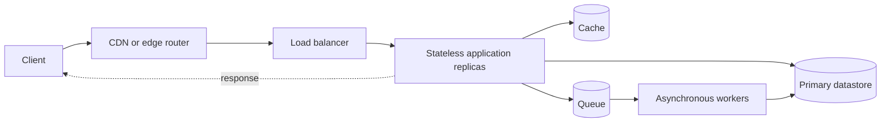

## What it is

System design turns product requirements into cooperating components and measurable operating goals. **Latency** measures how long an operation takes, **throughput** measures completed work per unit of time, and **availability** measures the fraction of time a service can perform its required work; a **service-level indicator (SLI)** measures one of those properties, a **service-level objective (SLO)** sets a target for the SLI, and a **service-level agreement (SLA)** is the contractual boundary built around the objective.

## How it works

A design starts with a workload model: request rates, arrival patterns, data sizes, latency targets, and the consequences of failure. A **goodput** target distinguishes useful completed requests from merely completed attempts, while percentile latency describes the slow tail that users experience. An SLI needs a precise numerator, denominator, observation window, and eligible traffic; "99.9% uptime" is incomplete until those boundaries define which failures count.

The component and data-flow view separates request-path work from asynchronous work:



For this example, eligible checkout traffic is a request that reaches the authenticated production checkout handler. Health checks, synthetic probes, and requests rejected at the edge before the handler are excluded. A 5xx response from the handler is a bad event; if 4xx responses represent failed user journeys, define that explicitly rather than silently including or excluding them.

Prometheus rules can turn those definitions into continuously evaluated SLIs and multi-window error-budget alerts:

```yaml
groups:
  - name: checkout-api-service-level-indicators
    interval: 30s
    rules:
      - record: checkout_api:request_rate:5m
        expr: sum(rate(http_requests_total{service="checkout-api"}[5m]))
      - record: checkout_api:goodput:1h
        expr: sum(rate(http_requests_total{service="checkout-api",sl_class="eligible",status!~"5.."}[1h]))
      - record: checkout_api:availability:1h
        expr: |
          sum(rate(http_requests_total{service="checkout-api",sl_class="eligible",status!~"5.."}[1h]))
          /
          sum(rate(http_requests_total{service="checkout-api",sl_class="eligible"}[1h]))
      - record: checkout_api:availability:6h
        expr: |
          sum(rate(http_requests_total{service="checkout-api",sl_class="eligible",status!~"5.."}[6h]))
          /
          sum(rate(http_requests_total{service="checkout-api",sl_class="eligible"}[6h]))
      - record: checkout_api:request_duration:p99_5m
        expr: |
          histogram_quantile(
            0.99,
            sum by (le) (
              rate(http_request_duration_seconds_bucket{service="checkout-api",sl_class="eligible"}[5m])
            )
          )
      - alert: CheckoutApiAvailabilityFastBudgetBurn
        expr: (1 - checkout_api:availability:1h) / (1 - 0.999) > 14.4
        for: 5m
      - alert: CheckoutApiAvailabilitySlowBudgetBurn
        expr: (1 - checkout_api:availability:6h) / (1 - 0.999) > 6
        for: 30m
```

The 0.1% error budget comes from the 99.9% availability SLO. A 14.4-times burn rate exhausts that 30-day budget in about two days, while a 6-times rate exhausts it in about five days. The SLA states external consequences and remedies when the provider misses the committed SLO, such as service credits. During capacity planning, you allocate a latency budget across DNS, connection setup, the edge, the application, each datastore call, and the client. During operations, you compare measured SLIs with the SLO, preserve raw indicators, and alert on error-budget burn rather than treating isolated infrastructure alerts as user-visible failures.

A request path commonly crosses DNS or an anycast address, a CDN, a load balancer, stateless application replicas, and a stateful tier. You scale stateless replicas horizontally; you scale databases and caches through replication, partitioning, or both; and you use queues to absorb work that does not need to finish in the request. Each hop must have bounded timeouts, and retries require a retry budget so one failed dependency does not multiply traffic.

## Tradeoffs

The design objective determines which measurements and optimization choices deserve priority:

| Objective | Primary measurement | Prefer when | Cost to manage |
| --- | --- | --- | --- |
| Tail latency | Successful-operation latency at a percentile such as p99 | Users directly feel slow requests | Instrumentation, coordinated timeout budgets, and tail-aware capacity testing |
| Maximum throughput | Good completed operations per second | The service has a hard demand or quota limit | More contention, backpressure, and cost from running near saturation |
| High availability | Successful eligible requests divided by eligible requests | The product must remain usable during dependency or zone failures | Redundant capacity, failover testing, and potentially weaker consistency |
| Fast recovery | Time to restore an SLO after a failure | Failures occur and restoration is operationally expensive | On-call capability, automation, and maintained recovery procedures |
| Durable processing | Successfully completed asynchronous work | Callers cannot wait for downstream work to finish | Duplicate delivery handling, backlog growth, and observability across stages |

Availability, latency, and consistency are separate choices rather than a single universal slider. Caching and replication can improve some requests while introducing stale data; synchronous writes can simplify correctness at the cost of latency and dependency availability. Pick explicit consistency and failure semantics for each operation, then document the resulting budget.

## When to use

- You need to translate user needs into measurable latency, throughput, availability, and recovery targets.
- You expect traffic, data volume, or failure domains to exceed one process or machine.
- You are choosing between synchronous and asynchronous work, or between caching and reading from the source of truth.
- You need an error budget to decide when reliability work takes priority over feature delivery.
- You are reviewing a design for dependency timeouts, retries, overload behavior, and recovery.

## Alternatives

- **Single-server monolith** — wins for small workloads and simple operations, but concentrates capacity and failure in one process or machine.
- **Serverless composition** — removes server management and scales on demand, but introduces platform limits, cold starts, and less control over steady-state capacity.
- **Fixed service contract** — a static SLA is simpler to administer, but offers a weaker operational objective than directly measuring and managing SLOs.

## Related

- [Network Protocols & Transport Mechanics](02-network-protocols.md)
- [Load Balancing Strategies](03-load-balancing.md)
- [API Paradigms & Contracts](05-api-paradigms.md)
- [Resilience & Fault Tolerance Patterns](../02-software-architecture-patterns/03-resilience-fault-tolerance.md)
