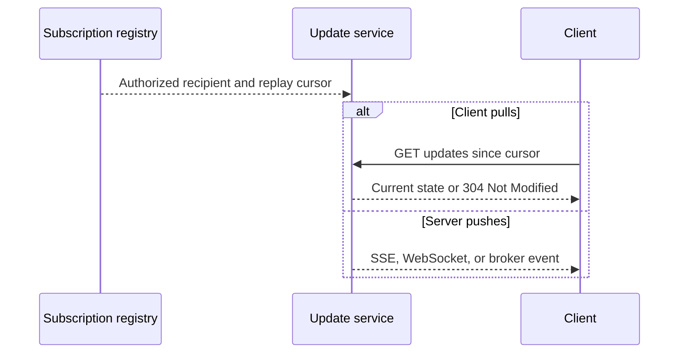

## What it is

Network protocols define how communicating systems frame, route, and interpret messages. The **Open Systems Interconnection (OSI) model** separates communication responsibilities into seven layers, while deployed systems commonly use the TCP/IP model; below them, TCP and UDP provide transport services, and HTTP, gRPC, and WebSocket define application-level exchanges.

## How it works

Each protocol adds meaning without discarding the layers beneath it. Ethernet and IP carry frames between links and hosts, TCP establishes a connection and provides an ordered reliable byte stream, and UDP sends independent datagrams without connection setup, delivery guarantees, or ordering. Application protocols then define messages such as HTTP requests, Protocol Buffers records, and WebSocket frames.

An HTTP exchange exposes the application layer directly:

```http
GET /users/42 HTTP/1.1
Host: api.example.com
Accept: application/json

HTTP/1.1 200 OK
Content-Type: application/json
Cache-Control: private, max-age=60

{"id":"42","name":"Ada"}
```

The seven-layer OSI model organizes the stack by responsibility:

| Layer | Unit or concept | Example protocols or technologies | System-design concern |
| --- | --- | --- | --- |
| 7 Application | Messages and operations | HTTP, gRPC, WebSocket, SMTP | Contracts, status semantics, streaming |
| 6 Presentation | Encoding, compression, encryption | JSON, Protocol Buffers, TLS | Payload size, CPU cost, compatibility |
| 5 Session | Dialog and session state | RPC sessions, WebSocket sessions | Connection lifetime, state ownership |
| 4 Transport | Processes across networks | TCP, UDP, QUIC's transport | Reliability, ordering, flow and congestion control |
| 3 Network | Packets between networks | IP, ICMP, routing protocols | Addressing, hops, topology, MTU |
| 2 Data link | Frames on one link | Ethernet, Wi-Fi, PPP | Framing, local delivery, link errors |
| 1 Physical | Signals on a medium | Electrical, optical, or radio links | Bandwidth, latency, distance |

TCP uses sequence numbers, acknowledgments, retransmission, and congestion control to create a reliable stream. This works well for ordinary request/response traffic, but a missing segment can delay later bytes on that same connection. HTTP/1.1 normally sends one request at a time on a connection unless clients use multiple connections. HTTP/2 frames multiple independent streams over one TCP connection and compresses headers, but loss of a TCP segment can still block delivery of every stream on that connection. HTTP/3 carries HTTP semantics over QUIC, whose independently managed streams avoid transport-level head-of-line blocking between requests; QUIC also integrates encrypted transport and connection establishment.

**Remote procedure call (RPC)** presents a local-looking method call while preserving network boundaries. The client stub validates or serializes arguments, attaches a method name, request identity, metadata, and deadline, and writes the encoded request to a transport. A server framework decodes the message, authenticates the caller, applies authorization, dispatches to the registered method, and returns a typed result or structured status. A deadline bounds execution, cancellation propagates when possible, and retries require idempotency and a retry policy. Unary RPC returns one response; server streaming, client streaming, and bidirectional streaming keep an ordered call context open. gRPC instantiates these mechanics with HTTP/2, Protocol Buffers, metadata, deadlines, and status codes, but an RPC framework does not remove partial failure or make retries safe.

WebSocket begins with an HTTP upgrade and then reuses the connection for full-duplex text or binary frames. A stateful long-lived connection changes reconnection, load-balancing, and capacity management. **Server pull** gives the client control: ordinary polling repeatedly sends a conditional request with a version or event cursor, while long polling holds a response open until an event or timeout. Pull works through ordinary HTTP infrastructure and naturally resumes from a durable cursor, but polling adds avoidable requests and long polling consumes connection capacity.

**Server push** lets the server send an update after it occurs. SSE keeps an HTTP response open for one-way browser events, WebSockets allow both peers to send frames, broker subscriptions deliver events to services, and webhooks send HTTP callbacks to registered endpoints. Push lowers idle polling latency but requires subscription state, authorization, backpressure, replay, and observability. Neither transport alone guarantees durable history, exactly-once processing, or business-level replay.

**Broadcasting** describes fan-out, not a specific transport. Unicast targets one receiver. A pub/sub topic can deliver each record to every consumer group while members within a group divide the work, or a broadcast log can maintain a cursor for every logical subscriber. Consumer groups support work distribution; per-subscriber offsets support independent replay. IP multicast exists, but it does not provide the durable identity, authorization, and replay semantics that application broadcasts usually require.

A minimal SSE response makes the one-way contract visible:

```http
HTTP/1.1 200 OK
Content-Type: text/event-stream
Cache-Control: no-cache
Connection: keep-alive

id: 418
event: order.updated
data: {"orderId":"order-123","status":"paid"}

```

The pull and push paths share a durable event position even when their transport differs:



A proxy can buffer or time out an SSE response, so the edge and gateway must disable buffering for the route and set a connection lifetime compatible with heartbeats. A WebSocket gateway must instead track upgraded connections, forward close and ping/pong behavior, and reconnect clients after a node or network failure. For a chat or collaborative editor, WebSockets are usually the simpler fit. For a browser dashboard receiving server updates, SSE is often enough and preserves ordinary HTTP authentication and monitoring. gRPC server streaming suits a controlled client that needs a typed sequence from one service.

## Tradeoffs

Choose a protocol by matching its guarantees to the operation rather than by transport label alone:

| Choice | Wins when | Main cost or limitation | Decision rule |
| --- | --- | --- | --- |
| TCP | Ordered, reliable delivery matters | Retransmission and connection state can delay later data | Use for ordinary request/response and file transfer |
| UDP | A fresh datagram is more useful than a delayed one | Application must handle loss, duplication, ordering, and congestion | Use for real-time media, DNS, or QUIC building blocks |
| HTTP/1.1 | Interoperability and simple intermediaries matter | Limited multiplexing increases connection and request overhead | Use through general-purpose caches and legacy clients |
| HTTP/2 | Many concurrent RPCs share a connection | A TCP loss can block all streams on that connection | Use for gRPC and modern clients behind controlled infrastructure |
| HTTP/3 | Loss on one request should not stall other requests | Requires QUIC-aware endpoints and intermediaries | Use when the end-to-end path supports HTTP/3 |
| gRPC | A typed internal contract and streaming matter | Browser access and human-readable inspection require extra tooling | Use between controlled services, not as the only public contract |
| WebSocket | Both peers exchange messages over a long-lived channel | Reconnection, heartbeat, and connection-affinity state complicate scaling | Use for interactive bidirectional sessions |
| SSE | HTTP-native one-way server push with event IDs and browser reconnect support | The response is one-way and proxies may buffer long-lived responses | Use for dashboards and notifications over ordinary HTTP |

## When to use

- You need a public request/response contract and the widest client compatibility, which points to HTTP/1.1 or HTTP/2 over TLS.
- You need typed internal RPC, compact messages, or streaming, which points to gRPC over HTTP/2.
- You need a full-duplex interactive channel, which points to WebSocket.
- You need a QUIC-aware path where transport head-of-line blocking matters, which points to HTTP/3.
- You need low-latency datagrams and can tolerate application-level loss handling, which points to UDP.

## Alternatives

- **Raw TCP or UDP sockets** — offer direct control over framing, but require you to build compatibility, discovery, security, and often reliability yourself.
- **Server-Sent Events** — provide simpler one-way server push over HTTP, but cannot carry client-to-server messages on the same stream.
- **Message-oriented middleware** — decouple producers from consumers, but add broker operations and delivery semantics rather than preserving a direct socket connection.

## Related

- [Fundamentals of System Design](01-fundamentals.md)
- [Load Balancing Strategies](03-load-balancing.md)
- [Reverse Proxies, API Gateways, and Edge Routing](04-proxies-gateways.md)
- [Cloud Networking](../../05-cloud-devops/01-cloud-primitives/03-cloud-networking.md)
