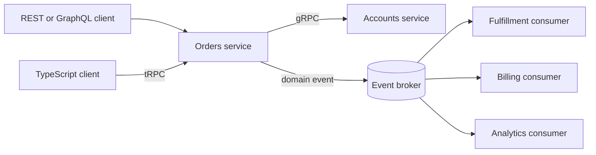

## What it is

API paradigms define the contract and direction of communication between components. **REST** exposes resources through HTTP methods and representations, **GraphQL** exposes a typed graph that clients query for selected fields, **gRPC** exposes typed RPC methods serialized as Protocol Buffers, and **event-driven systems** publish facts that consumers process independently.

## How it works

REST maps a domain operation to a resource URI and an HTTP method, then uses status codes, headers, and a representation such as JSON to exchange data. GraphQL clients send operations against a schema; the server resolves the selected fields and returns matching data, usually as JSON. gRPC code generators turn a schema into typed clients and servers, and Protocol Buffers provide a compact, language-neutral wire format. Event-driven systems instead publish a domain event to durable storage or a broker; consumers acknowledge progress and may replay the event to rebuild state or trigger follow-on work. **tRPC** keeps a TypeScript procedure definition as the source of truth and generates a typed client, router, and runtime validation from it. **OpenAPI** describes synchronous HTTP operations, while **AsyncAPI** describes event-driven channels, messages, and brokers.

The runtime data flow below shows the boundaries those contracts describe: REST, tRPC, and gRPC choose direct request paths, while an event contract covers asynchronous fan-out through a broker.



The GraphQL contract names resources as graph fields:

```graphql
type Query {
  user(id: ID!): User
}

type User {
  id: ID!
  name: String!
  email: String!
}
```

The gRPC contract defines the same operation as a typed RPC:

```proto
syntax = "proto3";

package accounts.v1;

message GetUserRequest {
  string id = 1;
}

message User {
  string id = 1;
  string name = 2;
  string email = 3;
}

service UserService {
  rpc GetUser(GetUserRequest) returns (User);
}
```

REST represents the same operation as `GET /users/{id}`, while an event describes something that already happened rather than commanding a receiver to perform work:

```json
{
  "eventId": "01J2YH6J8Q3P6M4N2K7R9T1V0X",
  "eventType": "user.created.v1",
  "occurredAt": "2026-09-24T12:00:00Z",
  "key": "user-123",
  "data": {
    "userId": "user-123",
    "name": "Ada"
  }
}
```

For REST, clients and intermediaries can cache responses when cache headers permit, and independent resources can evolve without exposing every internal service. GraphQL reduces accidental over-fetching for clients with different field needs, but arbitrary selections complicate HTTP caching and can trigger excessive resolver work unless query cost and data-loader controls are explicit. gRPC makes method schemas and generated types visible to build systems, but browser clients need a proxy and generic clients need tooling for discovery. In an event-driven design, the producer records that a fact occurred; the broker orders records within a partition, and consumers track offsets. Retries can duplicate delivery, so consumers need idempotent handling, schema compatibility, and a policy for poison messages. A webhook is one delivery mechanism for an event, not a substitute for the event-driven architecture itself.

tRPC is especially useful when a TypeScript web application and its server share one repository. A procedure definition names the input, output, and authorization context; the framework creates a typed caller and can validate input at the boundary. It removes hand-written fetch clients and keeps contracts close to the code, but it is not a wire standard understood by every language or external partner. A public API still needs a language-neutral contract or an adapter.

OpenAPI is a machine-readable description of HTTP paths, methods, parameters, request bodies, responses, and security schemes. It can generate documentation, mock servers, client stubs, and contract tests. AsyncAPI applies a similar idea to event channels: it describes topics, message schemas, producers, consumers, acknowledgments, and broker bindings. A specification describes intent; it does not prove that a broker, consumer, or authorization policy behaves that way. CI should lint the specification, run compatibility checks, and test representative messages.

```yaml
openapi: 3.1.0
info:
  title: Orders API
  version: 1.0.0
paths:
  /orders/{orderId}:
    get:
      operationId: getOrder
      security:
        - oauth2: [orders:read]
      parameters:
        - name: orderId
          in: path
          required: true
          schema:
            type: string
      responses:
        "200":
          description: Order found
          content:
            application/json:
              schema:
                $ref: "#/components/schemas/Order"
components:
  securitySchemes:
    oauth2:
      type: oauth2
      flows:
        authorizationCode:
          authorizationUrl: https://identity.example.com/authorize
          tokenUrl: https://identity.example.com/token
          scopes:
            orders:read: Read an order
```

```yaml
asyncapi: 3.0.0
info:
  title: Orders Events
  version: 1.0.0
channels:
  orderPlaced:
    address: orders.placed.v1
    messages:
      OrderPlaced:
        payload:
          type: object
          required: [eventId, orderId, occurredAt]
          properties:
            eventId:
              type: string
            orderId:
              type: string
            occurredAt:
              type: string
              format: date-time
operations:
  receiveOrderPlaced:
    action: receive
    channel:
      $ref: "#/channels/orderPlaced"
```

A tRPC contract is strongest when the team controls the TypeScript boundary. OpenAPI is strongest when many HTTP clients need an interoperable contract. AsyncAPI is strongest when the contract must describe channels and message evolution. They can be combined: OpenAPI can describe the command endpoint, tRPC can power an internal TypeScript client, and AsyncAPI can describe the resulting event.

## Tradeoffs

Use the interaction and deployment model together when choosing a paradigm:

| Paradigm | Gain | Cost or risk | Prefer when |
| --- | --- | --- | --- |
| REST over HTTP | Cacheable semantics, broad tooling, independent resources | Multiple calls for related data; field and contract drift across endpoints | Public resource-oriented APIs or cacheable HTTP workloads |
| GraphQL | One endpoint can serve different field selections and related data | Query-cost control, resolver N+1 patterns, and less predictable intermediary caching | Several clients need different views of a connected domain |
| gRPC with Protocol Buffers | Typed methods, compact messages, and native streaming | Browser support requires a bridge; wire traffic is less human-readable | Controlled service-to-service calls and typed internal contracts |
| tRPC | TypeScript callers, routers, and validation come from one procedure definition | Couples clients to the TypeScript ecosystem and needs adapters for other languages | A TypeScript application and its internal service boundary |
| OpenAPI | Interoperable HTTP description for documentation, clients, and contract tests | Describes intent rather than runtime behavior and needs compatibility policy | Public or cross-team HTTP APIs |
| AsyncAPI | Makes event channels, message schemas, and broker bindings reviewable | Does not provide durable delivery or enforce consumer behavior | Event-driven integrations and schema evolution |
| Event-driven system | Producers and consumers scale and deploy independently; new consumers can use past facts | Duplicate delivery, ordering boundaries, schema evolution, and replay operations | Long-running workflows, fan-out, or decoupled integrations |
| Webhook delivery | Pushes an event directly to an HTTP endpoint without polling callbacks | The provider handles retries, signatures, and endpoint availability | The consumer exposes a stable, security-controlled HTTPS endpoint |

GraphQL and gRPC require explicit query and method limits. Event-driven systems require explicit delivery semantics. These are not formats that can be selected safely without capacity, failure, and security rules.

## When to use

- You need cacheable, resource-oriented operations with broad HTTP client support, which points to REST.
- Several client roles need different fields from connected domain data, which points to GraphQL.
- Controlled services need typed contracts, compact messages, or streaming, which points to gRPC.
- Producers and consumers need independent deployment, durable replay, or many downstream reactions, which points to events.
- A third party needs near-real-time notification through an HTTPS callback, which points to webhooks.

## Alternatives

- **Server-Sent Events** — provide simple one-way browser push over HTTP, but the server holds the connection and the model does not support arbitrary consumer groups.
- **Long polling** — works through ordinary HTTP infrastructure, but repeated empty polls consume connections and often add latency compared with streaming.
- **Command messages** — coordinate an action the receiver must perform, but couple senders to receiver-side state and workflow more tightly than a past-tense domain event.

## Related

- [Fundamentals of System Design](01-fundamentals.md)
- [Network Protocols & Transport Mechanics](02-network-protocols.md)
- [Reverse Proxies, API Gateways, and Edge Routing](04-proxies-gateways.md)
- [Cryptography & System Security](06-cryptography-system-security.md)
