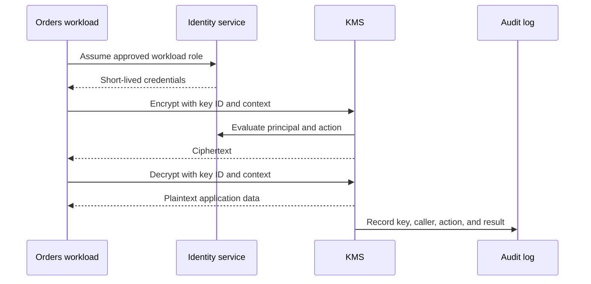

## What it is

Cryptography and system security protect data in transit, at rest, and while it is being used. **TLS** authenticates a server and encrypts a connection, **PKI** binds identities to trusted certificates, symmetric and asymmetric encryption solve different key-distribution problems, a **KMS** centralizes key operations, OAuth 2.0 delegates access without sharing passwords, OIDC adds an identity layer, and **zero trust** verifies every request instead of trusting network location.

## How it works

A TLS handshake lets a client and server agree on a protocol version and cipher suite, verify the server certificate, and create a session key. The server proves possession of the private key associated with its certificate. The session key then encrypts application records, while the certificate chain lets the client reach a trusted certificate authority. TLS provides confidentiality and integrity; it does not make the application bug-free or authorize every request.

The **public key infrastructure (PKI)** is the system of certificates, certificate authorities, revocation information, and trust stores that makes those proofs meaningful. A server certificate should match the requested name, have an acceptable lifetime and key strength, and chain to a trust anchor that the client already trusts. Certificate rotation must happen before expiry, and clients must reject revoked or invalid certificates according to the deployment's revocation policy.

Symmetric encryption uses one shared secret to encrypt and decrypt data. It is fast and suitable for bulk data, but both parties must obtain the secret securely. Asymmetric encryption uses a mathematically related key pair: a public key can be shared, while the private key remains protected. Public-key systems commonly establish a shared session secret, authenticate messages, or verify signatures. A common TLS design therefore combines asymmetric cryptography for identity and key establishment with symmetric cryptography for data transfer.

A **key management service (KMS)** keeps master keys inside a protected service and exposes controlled operations such as encrypt, decrypt, sign, verify, and key rotation. Applications request cryptographic operations with a key identifier and an authorization context; they should not export raw key material. Hardware security modules, cloud KMS services, envelope encryption, audit logs, and separation of duties reduce the impact of an application credential leak.

The KMS flow separates caller authorization from cryptographic work and audit evidence:



OAuth 2.0 is an authorization framework. In the authorization-code flow with PKCE, a user authenticates at an authorization server, the client receives an authorization code, and the client exchanges that code plus its verifier for tokens. The access token authorizes an API call; it is not normally a user identity document. OIDC adds an ID token containing identity claims, a nonce for replay protection, a user-info endpoint, and discovery metadata. A resource server validates issuer, audience, signature, expiry, and scopes before acting on a token.

Zero trust replaces “inside is safe” with continuous checks. Identity, device health, workload identity, network location, request sensitivity, and resource policy are evaluated together. A service-to-service call can use a short-lived identity issued by a platform, encrypted with mTLS, and authorized by a policy engine. A successful network connection alone never grants unrestricted access.

A policy artifact can make the decision points explicit:

```yaml
zero_trust_policy:
  identity:
    source: workload_identity
    lifetime: short
  device:
    require_encryption: true
    require_managed_device: true
  workload:
    mTLS: required
    authorize_by: service_identity
  resource:
    default: deny
    allow:
      - from: orders
        to: payments
        scopes: [payment:create]
  data:
    classify: confidential
    log_payloads: false
```

The following AWS KMS key policy limits one application role to two cryptographic actions on one key:

```json
{
  "Version": "2012-10-17",
  "Statement": [{
    "Effect": "Allow",
    "Principal": {"AWS": "arn:aws:iam::123456789012:role/orders-api"},
    "Action": ["kms:Decrypt", "kms:GenerateDataKey"],
    "Resource": "arn:aws:kms:us-east-1:123456789012:key/example",
    "Condition": {"StringEquals": {"kms:EncryptionContext:purpose": "payment-data"}}
  }]
}
```

The encryption context is caller-supplied metadata, not proof of the caller's intent or an authorization boundary by itself. If the context separates permitted workloads or purposes, enforce the corresponding constraints in IAM and use separate encrypt and decrypt roles when the threat model warrants the added separation. Review both the key policy and the caller's effective IAM permissions.

TLS protects the channel, OAuth and OIDC establish delegated identity, KMS protects key use, and zero-trust policy decides which workload may perform which action. These controls complement one another; none replaces authorization, logging, patching, or secure software development.

## Tradeoffs

Security controls add latency, operational state, and failure modes. Choose controls according to the asset and threat rather than enabling every mechanism everywhere.

| Control | Gain | Cost or limitation |
| --- | --- | --- |
| TLS 1.3 | Encrypted, authenticated transport with a simpler modern handshake | Certificate and key rotation, proxy compatibility, and handshake CPU |
| Symmetric encryption | Efficient protection for large data volumes | Both parties must manage a shared secret |
| Asymmetric cryptography | Solves identity and key distribution across untrusted parties | Higher CPU cost and larger keys or signatures |
| Cloud KMS or HSM-backed keys | Central revocation, rotation, audit, and key custody | Availability dependency, policy work, and possible network latency |
| OAuth 2.0 authorization code with PKCE | Avoids sending passwords through the client and supports delegated scopes | Token lifecycle, consent, and provider availability |
| OIDC | Standard identity claims and discovery for user-facing applications | Identity-provider coupling and claim-validation mistakes |
| Service-mesh mTLS | Uniform workload identity and encryption inside a cluster | More data-plane components and certificate-management work |
| Zero-trust policy | Limits lateral movement when internal network access is broad | Policy complexity and continuous identity or device signals are required |

## When to use

- You need to protect a public or internal network connection, which requires TLS and correct certificate validation.
- You need to encrypt large application data without distributing raw long-lived keys, which points to a KMS with envelope encryption.
- A browser or client must access APIs on a user's behalf, which points to OAuth 2.0 with an appropriate flow and scopes.
- You need user login and identity claims, which points to OIDC rather than treating an access token as an identity assertion.
- You cannot trust a private network boundary and need workload identity, least privilege, and continuous authorization.

## Alternatives

- **Application-level encryption** — gives the application control over selected fields, but key distribution, queryability, and rotation become application responsibilities.
- **A service mesh for mTLS** — centralizes east-west encryption and workload identity, but does not replace application authorization or public-edge policy.
- **Short-lived certificates and workload identity** — reduce long-lived credential exposure, but require a reliable issuer and careful audience validation.
- **Network firewalls alone** — restrict some reachability, but cannot prove the identity or authorization context of a request.

## Related

- [Network Protocols & Transport Mechanics](02-network-protocols.md)
- [Reverse Proxies, API Gateways, and Edge Routing](04-proxies-gateways.md)
- [API Paradigms & Contracts](05-api-paradigms.md)
- [AppSec & Threat Defense](07-appsec-threat-defense.md)
