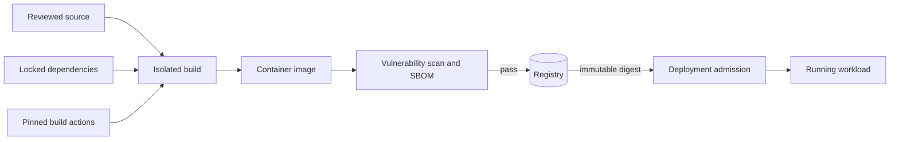

## What it is

Application security protects software from the mistakes and attacks that compromise data, users, or systems. **Threat modeling** identifies valuable assets, possible attackers, entry points, and mitigations before implementation; the **OWASP Top 10** names common web-application weaknesses; **secrets management** keeps credentials out of source code and deployment logs; and **supply-chain security** protects the dependencies, build systems, and artifacts used to build the application.

## How it works

A threat model makes security decisions reviewable. Start with a data-flow diagram, then ask four questions: what are we building, what can go wrong, what will we do about it, and did we do a good enough job? For a checkout service, the assets might include payment instructions, customer data, authorization tokens, and audit records. The threats might include a stolen session, an attacker changing a quantity after validation, a compromised dependency, or an administrator exposing a production secret.

The supply-chain artifact flow makes the required inspection boundaries explicit:



The OWASP Top 10 gives teams a common vocabulary for reviewing common risks:

| Risk class | What can go wrong | Defense to test |
| --- | --- | --- |
| Broken access control | A user reads or changes another user's object | Deny-by-default authorization on every object and action |
| Cryptographic failures | Sensitive data is exposed in transit or at rest | TLS, managed keys, and verified encryption settings |
| Injection | Untrusted input changes a query, command, or template | Parameterized queries, output encoding, and safe APIs |
| Insecure design | A workflow has no abuse limit or recovery rule | Threat model, abuse cases, and explicit state transitions |
| Security misconfiguration | Debug endpoints, default credentials, or excessive permissions remain enabled | Hardened images, policy checks, and environment separation |
| Vulnerable components | A dependency or image contains a known weakness | Inventory, scanning, updates, and provenance |
| Authentication failures | Credentials or sessions are stolen or misused | Strong authentication, session protection, and rate limits |
| Integrity failures | An update or dependency is altered in transit | Signed artifacts, lockfiles, and verified sources |
| Logging and monitoring failures | Attacks succeed without useful evidence | Structured security events and alerting |
| SSRF | A server fetches an attacker-selected internal URL | Egress policy, URL validation, and network segmentation |

A concrete threat-model record names the trust boundary and the verification that must happen:

```yaml
threat_model:
  asset: payment_instruction
  trust_boundary: public_edge_to_orders_service
  attacker: unauthenticated_network_client
  threat: quantity_or_account_changed_before_authorization
  controls:
    - validate_account_ownership
    - authorize_amount_limit
    - reject_replayed_idempotency_key
    - record_security_event
  verification:
    - integration_test_cross_account_access
    - property_test_quantity_tampering
    - alert_review_for_repeated_denials
```

Secrets such as database passwords, signing keys, and cloud credentials should be generated and stored separately from application source. HashiCorp Vault can issue short-lived dynamic credentials, authenticate workloads, and record audit events. A deployment can authenticate to Vault, request a database credential for one role, and receive a lease that expires. The application still needs rotation, access policy, backup, and an emergency revocation plan.

A least-privilege Vault policy separates read and write capabilities and limits the paths a workload can use:

```hcl
path "database/creds/orders-api" {
  capabilities = ["read"]
}

path "transit/keys/payment-data" {
  capabilities = ["encrypt", "decrypt"]
}

path "kv/data/orders-api" {
  capabilities = ["read"]
}
```

Supply-chain security starts with a software bill of materials, or **SBOM**, a machine-readable inventory of components and relationships detected in a shipped artifact. Its completeness depends on the build tools and scanning coverage, so an SBOM is evidence for investigation rather than proof that every dependency is present or safe. The build must use reviewed source revisions, locked dependencies, verified third-party actions, isolated runners, and short-lived credentials. The resulting image can be scanned, signed, attested, and deployed by immutable digest. Rejecting a known-vulnerable image also requires a current vulnerability feed and a defined severity policy; signature verification must bind the signature to the expected repository, workflow, source reference, and digest rather than accept any valid signature.

This release workflow assumes a Gradle wrapper and Dockerfile. It pins both GitHub actions by commit, uses checked-in Gradle verification metadata, scans the local image before publication, resolves the exact registry manifest digest after push, and signs only the digest that the repository returns:

```yaml
name: supply-chain
on:
  push:
    branches: [main]
  workflow_dispatch:
permissions:
  contents: read
  packages: write
  id-token: write
env:
  IMAGE_NAME: ${{ github.repository }}
jobs:
  verify:
    runs-on: ubuntu-latest
    steps:
      - uses: actions/checkout@11bd71901bbe5b1630ceea73d27597364c9af683
        with:
          persist-credentials: false
      - run: ./gradlew --no-daemon --dependency-verification strict assemble
      - run: |
          image_ref="ghcr.io/${IMAGE_NAME,,}:${GITHUB_SHA}"
          docker build --tag "$image_ref" .
      - run: |
          mkdir -p "$RUNNER_TEMP/supply-chain-bin"
          GOBIN="$RUNNER_TEMP/supply-chain-bin" go install github.com/anchore/syft/cmd/syft@v1.2.0
          GOBIN="$RUNNER_TEMP/supply-chain-bin" go install github.com/aquasecurity/trivy/cmd/trivy@v0.58.1
          GOBIN="$RUNNER_TEMP/supply-chain-bin" go install github.com/sigstore/cosign/v2/cmd/cosign@v2.4.1
      - run: |
          image_ref="ghcr.io/${IMAGE_NAME,,}:${GITHUB_SHA}"
          "$RUNNER_TEMP/supply-chain-bin/syft" "$image_ref" -o spdx-json=sbom.spdx.json
          "$RUNNER_TEMP/supply-chain-bin/trivy" image --exit-code 1 --severity HIGH,CRITICAL "$image_ref"
      - uses: docker/login-action@9780b0c442fbb1117ed29e0efdff1e18412f7567
        with:
          registry: ghcr.io
          username: ${{ github.actor }}
          password: ${{ secrets.GITHUB_TOKEN }}
      - run: |
          image_ref="ghcr.io/${IMAGE_NAME,,}:${GITHUB_SHA}"
          docker push "$image_ref"
      - run: |
          image_ref="ghcr.io/${IMAGE_NAME,,}:${GITHUB_SHA}"
          registry_digest="$(docker buildx imagetools inspect "$image_ref" --format '{{.Manifest.Digest}}')"
          test -n "$registry_digest"
          image_digest="ghcr.io/${IMAGE_NAME,,}@${registry_digest}"
          "$RUNNER_TEMP/supply-chain-bin/cosign" sign --yes "$image_digest"
          "$RUNNER_TEMP/supply-chain-bin/cosign" attest --yes --predicate sbom.spdx.json --type spdxjson "$image_digest"
          echo "digest=$image_digest" >> "$GITHUB_OUTPUT"
```

A secret scanner, dependency review, SAST, and DAST each find different classes of defects. They complement threat modeling rather than replacing it: a scanner cannot infer whether a payment transition is safe, and a threat model cannot know every vulnerable transitive dependency. A defense is effective only when it has an owner, a test, an alert or review path, and a response when it fails.

## Tradeoffs

| Defense | Gain | Cost or limitation |
| --- | --- | --- |
| Threat modeling | Turns security into concrete design and verification work | Requires domain knowledge and regular review as the system changes |
| OWASP review and secure defaults | Finds recurring categories of application mistakes | A checklist can miss business-specific abuse cases |
| Vault dynamic secrets | Avoids long-lived credentials and centralizes revocation | Adds Vault availability, lease handling, and policy administration |
| SBOM and dependency scanning | Makes component inventory and known-risk detection repeatable | A clean scan does not prove a component is safe or unmodified |
| Signed immutable artifacts | Connects a deployed digest to a verified producer | Key custody and verification policy still require operations |
| Runtime and egress controls | Limits damage after a credential or server flaw | Adds proxy or platform dependencies and can block legitimate traffic |

## When to use

- You need to identify abuse cases and trust boundaries before a workflow reaches production.
- You store or use credentials that would be damaging in source code, images, CI logs, or developer laptops.
- You depend on packages, build actions, container images, and deployment systems outside your own codebase.
- You need evidence for a security review, audit, or incident investigation.
- You operate a service that accepts untrusted input or changes sensitive state.

## Alternatives

- **Environment variables for all secrets** — simple for a small process, but easier to leak, hard to rotate, and invisible to centralized audit unless a platform adds controls.
- **A secrets file mounted at runtime** — keeps values out of application source, but leaves file permissions, image history, and rotation to the deployment platform.
- **Dependency scanning only** — useful for known vulnerabilities, but does not model business logic, runtime permissions, or compromised maintainers.
- **Manual security review only** — can catch subtle design flaws, but is difficult to repeat consistently under release pressure.

## Related

- [Cryptography & System Security: TLS/SSL, PKI, Symmetric/Asymmetric Encryption, KMS, OAuth 2.0/OIDC, and Zero-Trust Architecture](06-cryptography-system-security.md)
- [Enterprise Architecture Patterns: Monoliths, Microservices, Service Mesh, BFF, Strangler Fig, and Cell-Based Architecture](../02-software-architecture-patterns/01-enterprise-architecture-patterns.md)
- [CI/CD Workflows, Automated Testing Pipelines, and GitOps Engines](../../05-cloud-devops/02-containers-cicd/04-cicd-gitops.md)
- [Container Orchestration: Kubernetes Architecture](../../05-cloud-devops/02-containers-cicd/02-kubernetes.md)
