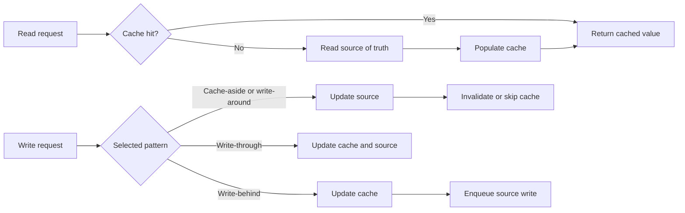

## What it is
Application caching patterns define who reads from and writes to the cache when an application changes data in its backing store. Cache-aside, write-through, write-around, and write-behind move the cache-fill and cache-update steps to different places in the request path. The choice controls read latency, write amplification, staleness, and the work required to recover when a cache operation fails.

## How it works
Write the application's cache contract before selecting an eviction algorithm. This artifact makes the read and write responsibilities explicit:

```yaml
patterns:
  cache_aside:
    read: [cache, source_of_truth, populate_cache]
    write: [source_of_truth, invalidate_cache]
  write_through:
    read: [cache]
    write: [cache, source_of_truth]
  write_around:
    read: [cache, source_of_truth, populate_cache]
    write: [source_of_truth, skip_cache]
  write_behind:
    read: [cache]
    write: [cache, enqueue_source_write]
```

In **cache-aside**, the application owns both sides of the cache. It returns a hit directly, loads and populates after a miss, and updates the source of truth before invalidating the cache. In **write-through**, the cache updates the source synchronously before acknowledging the write, which keeps the two stores aligned if the operation succeeds but adds source latency to every write. In **write-around**, a write goes only to the source, so a one-off write does not evict a hot cached value; the next cache-aside read repopulates it. In **write-behind**, the cache acknowledges a write and later forwards it to the source, reducing request-path latency at the cost of buffered data loss and ordering unless the queue has suitable durability.



A cache miss can become a **cache stampede** when many callers load the same expired key together. A per-key lock, request coalescing, or early recomputation for popular keys limits the duplicate work. LFU eviction is a separate capacity policy: it stores each key's access count, groups keys by count, and evicts the least popular group. Every implementation below accepts only a positive integer capacity. Hash-table lookups and direct key removal are expected O(1) in all six implementations. The C implementation's ordered frequency-list insertion is O(b), where `b` is the number of active frequency buckets, and the Rust implementation's `VecDeque::retain` removal is O(w), where `w` is the width of the current frequency bucket.

```java
import java.util.HashMap;
import java.util.LinkedHashSet;
import java.util.Map;

class LFUCache {
    private final int capacity;
    private int minFreq = 0;
    private final Map<Integer, int[]> cache = new HashMap<>();            // key -> {value, freq}
    private final Map<Integer, LinkedHashSet<Integer>> freq = new HashMap<>(); // freq -> ordered keys

    LFUCache(int capacity) {
        if (capacity <= 0) throw new IllegalArgumentException("capacity must be positive");
        this.capacity = capacity;
    }

    public int get(int key) {
        int[] e = cache.get(key);
        if (e == null) return -1;
        bump(key, e);
        return e[0];
    }

    public void put(int key, int value) {
        int[] e = cache.get(key);
        if (e != null) {
            e[0] = value;
            bump(key, e);
            return;
        }
        if (cache.size() == capacity) {
            LinkedHashSet<Integer> keys = freq.get(minFreq);
            int evict = keys.iterator().next();
            keys.remove(evict);
            if (keys.isEmpty()) freq.remove(minFreq);
            cache.remove(evict);
        }
        cache.put(key, new int[]{value, 1});
        freq.computeIfAbsent(1, k -> new LinkedHashSet<>()).add(key);
        minFreq = 1;
    }

    private void bump(int key, int[] e) {
        int f = e[1]++;
        LinkedHashSet<Integer> keys = freq.get(f);
        keys.remove(key);
        if (keys.isEmpty()) {
            freq.remove(f);
            if (minFreq == f) minFreq++;
        }
        freq.computeIfAbsent(f + 1, k -> new LinkedHashSet<>()).add(key);
    }
}
```

```c
#include <stdbool.h>
#include <stddef.h>
#include <stdlib.h>

typedef struct Entry Entry;
typedef struct Bucket Bucket;

struct Entry {
    int key;
    int value;
    int freq;
    Entry *prev;
    Entry *next;
    Entry *hnext;
    Bucket *bucket;
};

struct Bucket {
    int freq;
    Entry *head;
    Entry *tail;
    Bucket *prev;
    Bucket *next;
    Bucket *hnext;
};

typedef struct {
    int capacity;
    int size;
    int nbuckets;
    Entry **key_buckets;
    Bucket **freq_buckets;
    Bucket *freq_head;
    Bucket *freq_tail;
    Bucket *min_bucket;
} LFUCache;

static unsigned hash(unsigned int value, int count) {
    return (value * 2654435761u) % (unsigned int)count;
}

LFUCache *lfu_cache_create(int capacity) {
    if (capacity <= 0) return NULL;
    LFUCache *c = calloc(1, sizeof(*c));
    c->capacity = capacity;
    c->nbuckets = capacity * 2 + 1;
    c->key_buckets = calloc((size_t)c->nbuckets, sizeof(Entry *));
    c->freq_buckets = calloc((size_t)c->nbuckets, sizeof(Bucket *));
    return c;
}

static Entry **find_entry(LFUCache *c, int key) {
    Entry **slot = &c->key_buckets[hash((unsigned int)key, c->nbuckets)];
    while (*slot && (*slot)->key != key) slot = &(*slot)->hnext;
    return slot;
}

static Bucket **find_bucket(LFUCache *c, int freq) {
    Bucket **slot = &c->freq_buckets[hash((unsigned int)freq, c->nbuckets)];
    while (*slot && (*slot)->freq != freq) slot = &(*slot)->hnext;
    return slot;
}

static Bucket *get_bucket(LFUCache *c, int freq) {
    Bucket **slot = find_bucket(c, freq);
    if (*slot) return *slot;
    Bucket *bucket = calloc(1, sizeof(*bucket));
    bucket->freq = freq;
    bucket->hnext = *slot;
    *slot = bucket;
    Bucket *current = c->freq_head;
    Bucket *previous = NULL;
    while (current && current->freq < freq) {
        previous = current;
        current = current->next;
    }
    bucket->prev = previous;
    bucket->next = current;
    if (previous) previous->next = bucket;
    else c->freq_head = bucket;
    if (current) current->prev = bucket;
    else c->freq_tail = bucket;
    if (!c->min_bucket || bucket->freq < c->min_bucket->freq) c->min_bucket = bucket;
    return bucket;
}

static void unlink_bucket(LFUCache *c, Bucket *bucket) {
    if (bucket->prev) bucket->prev->next = bucket->next;
    else c->freq_head = bucket->next;
    if (bucket->next) bucket->next->prev = bucket->prev;
    else c->freq_tail = bucket->prev;
    if (c->min_bucket == bucket) c->min_bucket = bucket->next;
    Bucket **slot = find_bucket(c, bucket->freq);
    *slot = bucket->hnext;
    free(bucket);
}

static void unlink_entry(LFUCache *c, Entry *entry) {
    Bucket *bucket = entry->bucket;
    if (entry->prev) entry->prev->next = entry->next;
    else bucket->head = entry->next;
    if (entry->next) entry->next->prev = entry->prev;
    else bucket->tail = entry->prev;
    if (!bucket->head) unlink_bucket(c, bucket);
    entry->prev = NULL;
    entry->next = NULL;
    entry->bucket = NULL;
}

static void link_back(LFUCache *c, Entry *entry) {
    Bucket *bucket = get_bucket(c, entry->freq);
    entry->bucket = bucket;
    entry->prev = bucket->tail;
    entry->next = NULL;
    if (bucket->tail) bucket->tail->next = entry;
    else bucket->head = entry;
    bucket->tail = entry;
}

static void bump(LFUCache *c, Entry *entry) {
    unlink_entry(c, entry);
    entry->freq++;
    link_back(c, entry);
}

int lfu_cache_get(LFUCache *c, int key) {
    Entry **slot = find_entry(c, key);
    if (!*slot) return -1;
    bump(c, *slot);
    return (*slot)->value;
}

void lfu_cache_put(LFUCache *c, int key, int value) {
    Entry **slot = find_entry(c, key);
    if (*slot) {
        (*slot)->value = value;
        bump(c, *slot);
        return;
    }
    if (c->size == c->capacity) {
        Entry *evict = c->min_bucket->head;
        unlink_entry(c, evict);
        Entry **key_slot = find_entry(c, evict->key);
        *key_slot = evict->hnext;
        free(evict);
        c->size--;
    }
    Entry *entry = calloc(1, sizeof(*entry));
    entry->key = key;
    entry->value = value;
    entry->freq = 1;
    entry->hnext = c->key_buckets[hash((unsigned int)key, c->nbuckets)];
    c->key_buckets[hash((unsigned int)key, c->nbuckets)] = entry;
    link_back(c, entry);
    c->size++;
}

void lfu_cache_free(LFUCache *c) {
    for (int i = 0; i < c->nbuckets; i++) {
        Entry *entry = c->key_buckets[i];
        while (entry) {
            Entry *next = entry->hnext;
            free(entry);
            entry = next;
        }
    }
    Bucket *bucket = c->freq_head;
    while (bucket) {
        Bucket *next = bucket->next;
        free(bucket);
        bucket = next;
    }
    free(c->key_buckets);
    free(c->freq_buckets);
    free(c);
}
```

```python
from collections import OrderedDict

class LFUCache:
    def __init__(self, capacity: int):
        if capacity <= 0:
            raise ValueError("capacity must be positive")
        self.capity = capacity
        self.min_freq = 0
        self.cache = {}      # key -> (value, freq)
        self.freqs = {}      # freq -> OrderedDict[key]

    def _bump(self, key: int, freq: int) -> None:
        freq_map = self.freqs[freq]
        freq_map.pop(key, None)
        if not freq_map:
            del self.freqs[freq]
            if self.min_freq == freq:
                self.min_freq += 1
        self.freqs.setdefault(freq + 1, OrderedDict())[key] = None
        self.cache[key] = (self.cache[key][0], freq + 1)

    def get(self, key: int) -> int:
        if key not in self.cache:
            return -1
        value, freq = self.cache[key]
        self._bump(key, freq)
        return value

    def put(self, key: int, value: int) -> None:
        if key in self.cache:
            _, freq = self.cache[key]
            self.cache[key] = (value, freq)
            self._bump(key, freq)
            return
        if len(self.cache) == self.capacity:
            evict, _ = self.freqs[self.min_freq].popitem(last=False)
            if not self.freqs[self.min_freq]:
                del self.freqs[self.min_freq]
            del self.cache[evict]
        self.cache[key] = (value, 1)
        self.freqs.setdefault(1, OrderedDict())[key] = None
        self.min_freq = 1
```

```rust
use std::collections::{HashMap, VecDeque};

struct LFUCache {
    capacity: usize,
    min_freq: i32,
    cache: HashMap<i32, (i32, i32)>,     // key -> (value, freq)
    freqs: HashMap<i32, VecDeque<i32>>,  // freq -> keys in insertion order
}

impl LFUCache {
    fn new(capacity: i32) -> Option<Self> {
        if capacity <= 0 {
            return None;
        }
        Some(LFUCache {
            capacity: capacity as usize,
            min_freq: 0,
            cache: HashMap::new(),
            freqs: HashMap::new(),
        })
    }

    fn bump(&mut self, key: i32, freq: i32) {
        let keys = self.freqs.get_mut(&freq).unwrap();
        keys.retain(|&k| k != key);
        if keys.is_empty() {
            self.freqs.remove(&freq);
            if self.min_freq == freq {
                self.min_freq += 1;
            }
        }
        self.freqs.entry(freq + 1).or_default().push_back(key);
        if let Some((_, f)) = self.cache.get_mut(&key) {
            *f = freq + 1;
        }
    }

    fn get(&mut self, key: i32) -> i32 {
        match self.cache.get(&key) {
            Some(&(v, f)) => {
                self.bump(key, f);
                v
            }
            None => -1,
        }
    }

    fn put(&mut self, key: i32, value: i32) {
        if let Some(&(_, f)) = self.cache.get(&key) {
            self.cache.insert(key, (value, f));
            self.bump(key, f);
            return;
        }
        if self.cache.len() == self.capacity {
            let evict = self.freqs.get_mut(&self.min_freq).unwrap().pop_front().unwrap();
            if self.freqs.get(&self.min_freq).map_or(true, |k| k.is_empty()) {
                self.freqs.remove(&self.min_freq);
            }
            self.cache.remove(&evict);
        }
        self.cache.insert(key, (value, 1));
        self.freqs.entry(1).or_default().push_back(key);
        self.min_freq = 1;
    }
}
```

```typescript
class LFUCache {
    private capacity: number;
    private minFreq = 0;
    private cache = new Map<number, [number, number]>();     // key -> [value, freq]
    private freqs = new Map<number, Map<number, null>>();    // freq -> ordered keys

    constructor(capacity: number) {
        if (!Number.isInteger(capacity) || capacity <= 0) {
            throw new Error("capacity must be a positive integer");
        }
        this.capacity = capacity;
    }

    private bump(key: number, freq: number): void {
        const keys = this.freqs.get(freq)!;
        keys.delete(key);
        if (keys.size === 0) {
            this.freqs.delete(freq);
            if (this.minFreq === freq) this.minFreq++;
        }
        if (!this.freqs.has(freq + 1)) this.freqs.set(freq + 1, new Map());
        this.freqs.get(freq + 1)!.set(key, null);
        this.cache.set(key, [this.cache.get(key)![0], freq + 1]);
    }

    get(key: number): number {
        const e = this.cache.get(key);
        if (!e) return -1;
        this.bump(key, e[1]);
        return e[0];
    }

    put(key: number, value: number): void {
        if (this.cache.has(key)) {
            const [, freq] = this.cache.get(key)!;
            this.cache.set(key, [value, freq]);
            this.bump(key, freq);
            return;
        }
        if (this.cache.size === this.capacity) {
            const keys = this.freqs.get(this.minFreq)!;
            const evict = keys.keys().next().value as number;
            keys.delete(evict);
            if (keys.size === 0) this.freqs.delete(this.minFreq);
            this.cache.delete(evict);
        }
        this.cache.set(key, [value, 1]);
        if (!this.freqs.has(1)) this.freqs.set(1, new Map());
        this.freqs.get(1)!.set(key, null);
        this.minFreq = 1;
    }
}
```

```go
package lfu

import "container/list"

type LFUCache struct {
	capacity int
	minFreq  int
	cache    map[int][2]int
	freqs    map[int]*list.List
	entries  map[int]*list.Element
}

func NewLFUCache(capacity int) *LFUCache {
	if capacity <= 0 {
		return nil
	}
	return &LFUCache{
		capacity: capacity,
		cache:    make(map[int][2]int),
		freqs:    make(map[int]*list.List),
		entries:  make(map[int]*list.Element),
	}
}

func (c *LFUCache) bump(key, freq int) {
	l := c.freqs[freq]
	l.Remove(c.entries[key])
	delete(c.entries, key)
	if l.Len() == 0 {
		delete(c.freqs, freq)
		if c.minFreq == freq {
			c.minFreq++
		}
	}
	if c.freqs[freq+1] == nil {
		c.freqs[freq+1] = list.New()
	}
	c.entries[key] = c.freqs[freq+1].PushBack(key)
	v := c.cache[key]
	c.cache[key] = [2]int{v[0], freq + 1}
}

func (c *LFUCache) Get(key int) int {
	v, ok := c.cache[key]
	if !ok {
		return -1
	}
	c.bump(key, v[1])
	return v[0]
}

func (c *LFUCache) Put(key, value int) {
    if v, ok := c.cache[key]; ok {
        c.cache[key] = [2]int{value, v[1]}
        c.bump(key, v[1])
        return
    }
    if len(c.cache) == c.capacity {
        l := c.freqs[c.minFreq]
        evict := l.Front()
        key := evict.Value.(int)
        l.Remove(evict)
        delete(c.entries, key)
        if l.Len() == 0 {
            delete(c.freqs, c.minFreq)
        }
        delete(c.cache, key)
    }
    c.cache[key] = [2]int{value, 1}
    if c.freqs[1] == nil {
        c.freqs[1] = list.New()
    }
    c.entries[key] = c.freqs[1].PushBack(key)
    c.minFreq = 1
}
```

## Tradeoffs

| Choice | Gain | Cost or risk |
| --- | --- | --- |
| Cache-aside | Keeps cache and source libraries loosely coupled and lets the cache fail open. | Every writer must populate or invalidate correctly; misses still load the source. |
| Write-through | Makes the cache update visible with the acknowledged write. | Couples cache availability and latency to every source write. |
| Write-around | Preserves a stable hot set across one-off writes. | Moves the fill cost to the next read and can expose a different stale value. |
| Write-behind | Absorbs source-write bursts into buffered work. | Requires durable delivery, replay, ordering, and duplicate-write handling. |
| LFU | Retains established hot keys under skewed reads. | Exact counts can favor old entries; aging or probabilistic counts let new keys recover. |

## When to use
- You need cache-aside for optional derived reads whose source of truth can be loaded on a miss.
- You need write-through when acknowledgement must wait for the backing-store update.
- You need write-around when one-off writes should not displace a stable hot set.
- You need write-behind when measured request latency matters more than immediate source durability and you can operate the write queue.
- You need LFU when a small group of keys dominates access and its long-lived reuse is more important than new-key discovery.

## Alternatives
- **Read-through cache** — moves cache-miss loading into a cache client, but couples that client to every backing store and data shape.
- **LRU eviction** — uses less frequency metadata and reacts faster when popularity changes, but large scans can evict a useful working set.
- **Backing-store reads** — remove cache coherence concerns, but increase source load and place database latency on the request path.

## Related
- [In-Memory Caching Engines (Redis, Memcached), Data Structures, and Eviction Policies](01-in-memory-caching.md)
- [Content Delivery Networks (CDNs), Edge Computing, and Static/Dynamic Content Acceleration](03-cdns-edge.md)
- [Chapter 6 References](05-references.md)
