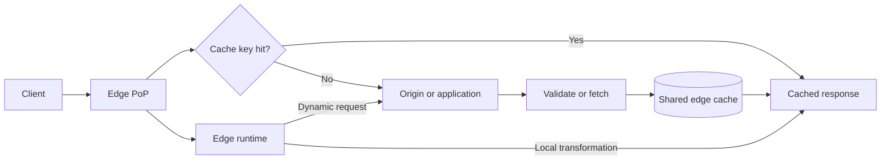

## What it is
A content delivery network (CDN) is a distributed set of proxy servers that caches HTTP responses closer to clients than the origin. Edge computing adds request-time code to those proxies, so a CDN can route, rewrite, authenticate, or compute a response without first forwarding every request to a central application. Together they accelerate versioned static assets and selectively cache or compute dynamic responses while the origin remains the authoritative service.

## How it works
A CDN-specific policy assigns edge and browser lifetimes to matching responses. This Cloudflare Cache Rules artifact uses the `http_request_cache_settings` phase to make the behavior for versioned static assets and a dynamic API explicit. The 86,400-second edge TTL and 3,600-second browser TTL assume that every URL under `/assets/` is immutable because its path includes a content version or digest. If a deploy changes bytes without changing the key, use origin revalidation or a shorter policy instead. The API rule disables shared caching for that host; it does not imply that the API is cacheable in another path.

```json
{
  "name": "static-and-dynamic-cache-policy",
  "kind": "zone",
  "phase": "http_request_cache_settings",
  "rules": [
    {
      "action": "set_cache_settings",
      "action_parameters": {
        "cache": true,
        "edge_ttl": {
          "mode": "override_origin",
          "default": 86400
        },
        "browser_ttl": {
          "mode": "override_origin",
          "default": 3600
        }
      },
      "expression": "http.host eq \"static.example.com\" and starts_with(http.request.uri.path, \"/assets/\")"
    },
    {
      "action": "set_cache_settings",
      "action_parameters": {
        "cache": false
      },
      "expression": "http.host eq \"api.example.com\""
    }
  ]
}
```



Anycast can announce one address from many points of presence, and BGP routes a client toward one of those locations; it does not guarantee that the selected location is geographically closest.

Edge runtimes differ in where they execute. **WebAssembly (Wasm) at the edge** runs a sandboxed module inside a provider-managed runtime, such as a WebAssembly module invoked by a Cloudflare Worker, and exposes only the host APIs that the runtime allows. **eBPF** attaches verified programs to Linux kernel hooks, so it can make early packet or flow decisions in a CDN node or service mesh, but it is not a general-purpose replacement for application request handlers. Choose Wasm for portable request logic and eBPF for low-level network policy where the operating environment supports it.

A cache key separates otherwise different responses and commonly includes the hostname, path, selected query parameters, and selected request headers. On a hit, the PoP returns the stored response. On a miss, it validates or fetches from the origin, stores the response under its policy, and returns it. A **preload** uploads an object to edge storage before a request; ordinary **pull** caching fills it after a request.

Shared caching suits content that is public, repeatable, and valid for many users. Private or personalized responses require a private cache policy and must not be stored in a shared cache. Dynamic acceleration can terminate TLS, apply authentication, rewrite a route, or call an origin API, but any remote data fetch still incurs a network round trip. Route the response according to its reuse and privacy properties:

| Response | Edge path | Source of truth | Invalidation |
| --- | --- | --- | --- |
| Fingerprinted image, script, or stylesheet | Shared edge cache | Object store or release pipeline | New fingerprint on deploy; old URLs can expire |
| Anonymous page or public API response | Shared cache when its response varies by the cache key | Application or API | TTL, purge, or surrogate key |
| Personalized HTML | Edge compute, then application request | Application and databases | Not shared; explicit private policy if cached |
| Authenticated API response | Gateway and origin, normally without shared caching | Domain service | Request-specific freshness rules |

Purge-by-URL or purge-by-tag removes content from reachable PoPs, but deletion is not an atomic global transaction; a stale response can remain or be in flight while other PoPs process the purge. A cache key generator and `Vary` policy must prevent responses for different users or variants from sharing an entry.

## Tradeoffs

| Choice | Gain | Cost or risk |
| --- | --- | --- |
| Long shared TTL | High hit ratio and low origin load | Longer staleness and more purge coordination |
| Versioned asset names | Deploys create a new immutable URL | Old assets and metadata can accumulate |
| Edge compute | Request-time routing without a dedicated edge proxy tier | Constrained runtimes, provider APIs, and harder debugging |
| Purge by tag | Targeted invalidation across object groups | Asynchronous propagation and incomplete support across CDNs |
| Dynamic edge composition | Personalized logic can run near the client | Each remote dependency still adds latency and failure modes |

A CDN also introduces a partial failure domain: an edge may hold stale or incorrectly keyed content even while origin data is current. Monitoring must distinguish cache hits, misses, revalidations, purge failures, origin fetches, and edge-function errors.

## When to use
- You serve repeated public assets to clients spread across multiple regions.
- You need origin protection during predictable traffic spikes.
- You can encode reusable public responses in a stable cache key and assign a freshness policy.
- You need lightweight request-time routing, authentication, or transformation near clients.
- You can observe cache age, hit ratio, purge status, and origin fallback behavior.

## Alternatives
- **Origin or reverse-proxy cache** — gives direct control over an origin's path, but improves latency only for clients routed near that origin.
- **Multi-region application deployment** — keeps dynamic computation close to clients, but requires replicated data, deployment, and failover management.
- **Object storage with direct delivery** — handles immutable files simply, but provides limited per-request application logic and response composition.

## Related
- [In-Memory Caching Engines (Redis, Memcached), Data Structures, and Eviction Policies](01-in-memory-caching.md)
- [Application Caching Patterns: Cache-Aside, Write-Through, Write-Around, Write-Behind](02-caching-patterns.md)
- [Chapter 6 References](05-references.md)
