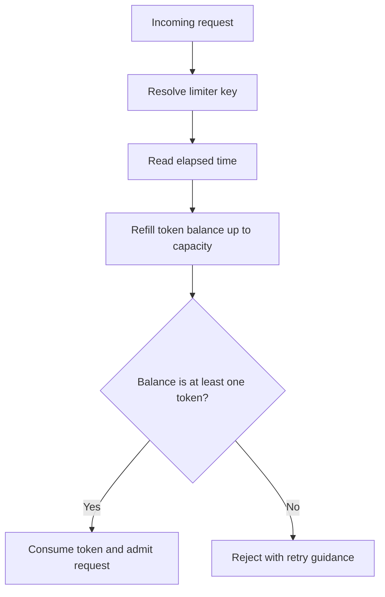

## What it is
Rate limiting and traffic shaping enforce a request or job-admission policy so one client, tenant, route, or downstream service cannot exceed a defined budget. Rate limiting decides whether to admit work now; traffic shaping controls when admitted work is sent. Common admission algorithms include token bucket, leaky bucket, sliding window log, and fixed or sliding counters.

## How it works
An edge or gateway makes the policy decision before work reaches the protected tier. This Envoy local rate-limit filter fragment allows a burst of 20 requests and refills one token every 50 milliseconds. It defines a process-wide default bucket and does not show per-key request-descriptor overrides:

```yaml
filter:
  name: envoy.filters.http.local_ratelimit
  typed_config:
    "@type": type.googleapis.com/envoy.extensions.filters.http.local_ratelimit.v3.LocalRateLimit
    stat_prefix: api_rate_limit
    token_bucket:
      max_tokens: 20
      tokens_per_fill: 1
      fill_interval: 50ms
    filter_enabled:
      runtime_key: rate_limit_api_enabled
      default_value:
        numerator: 100
        denominator: HUNDRED
    filter_enforced:
      runtime_key: rate_limit_api_enforced
      default_value:
        numerator: 100
        denominator: HUNDRED
```

The filter's default bucket is shared by all requests handled by one Envoy process by default, so this fragment describes a process-local limit rather than a global or cross-process limit. The `local_rate_limit_per_downstream_connection` setting can change the scope to a downstream connection, but this fragment does not set that field. If request descriptors are configured, matching route actions can select separate bucket policies; this fragment does not configure those overrides. The filter reads the selected bucket state, refills it from elapsed time, and consumes one token per admitted request. A rejection returns `429 Too Many Requests` by default; clients should also receive retry guidance from the deployment.

A **token bucket** stores a token balance and refill time. It admits a short burst up to capacity, then admits traffic at the refill rate. A **leaky bucket** admits requests at a fixed output rate and either queues excess work or drops it when a bounded queue is full. A **sliding window log** stores one timestamp per request, removes timestamps older than the window, and rejects when the remaining count reaches the limit; it evaluates every request in the current window exactly. A **counter** stores a count for a window. A fixed counter is O(1) state but has a boundary discontinuity between adjacent windows; a sliding counter combines the current and previous window to approximate a sliding limit with constant state.

Choose an algorithm from the behavior and state budget, not from the algorithm name:

| Algorithm | State per key | Admission behavior | Best fit |
| --- | --- | --- | --- |
| Token bucket | Balance and last-refill time | Allows bounded bursts; long-term average equals refill rate | Public APIs with legitimate spikes |
| Leaky bucket | Queue contents or virtual queue state | Smooths output at one rate; excess waits or fails | Workload shaping and protected downstream services |
| Sliding window log | One timestamp per request in the window | Enforces the exact recent count | Low-limit or compliance-sensitive paths |
| Fixed or sliding counter | Constant numeric state | Cheap approximate count; fixed windows reset at boundaries | High-cardinality, high-throughput limits |



Local state is fast but applies independently to every process. A distributed limit stores the selected state in Redis or another coordination service and performs refill, membership, and increment operations atomically. The caller must then choose a deliberate dependency policy: fail open preserves availability but removes protection, while fail closed preserves the limit but can turn a store outage into an application outage.

```java
class TokenBucket {
    private final double capacity;
    private final double refillRate;   // tokens per second
    private double tokens;
    private long lastRefill;

    TokenBucket(double capacity, double refillRate) {
        if (!Double.isFinite(capacity) || capacity <= 0 ||
            !Double.isFinite(refillRate) || refillRate <= 0) {
            throw new IllegalArgumentException("capacity and refill rate must be positive finite values");
        }
        this.capacity = capacity;
        this.refillRate = refillRate;
        this.tokens = capacity;
        this.lastRefill = System.nanoTime();
    }

    synchronized boolean allow() {
        long now = System.nanoTime();
        double elapsed = (now - lastRefill) / 1e9;
        tokens = Math.min(capacity, tokens + elapsed * refillRate);
        lastRefill = now;
        if (tokens < 1.0) return false;
        tokens -= 1.0;
        return true;
    }
}
```

```c
#include <stdbool.h>
#include <math.h>
#include <time.h>

typedef struct {
    double capacity;
    double refill_rate;
    double tokens;
    double last_refill;
} TokenBucket;

static double now_seconds(void) {
    struct timespec ts;
    clock_gettime(CLOCK_MONOTONIC, &ts);
    return ts.tv_sec + ts.tv_nsec / 1e9;
}

bool token_bucket_init(TokenBucket *b, double capacity, double refill_rate) {
    if (!isfinite(capacity) || capacity <= 0 ||
        !isfinite(refill_rate) || refill_rate <= 0) return false;
    b->capacity = capacity;
    b->refill_rate = refill_rate;
    b->tokens = capacity;
    b->last_refill = now_seconds();
    return true;
}

bool token_bucket_allow(TokenBucket *b) {
    double now = now_seconds();
    double elapsed = now - b->last_refill;
    b->tokens += elapsed * b->refill_rate;
    if (b->tokens > b->capacity) b->tokens = b->capacity;
    b->last_refill = now;
    if (b->tokens < 1.0) return false;
    b->tokens -= 1.0;
    return true;
}
```

```python
import math
import time

class TokenBucket:
    def __init__(self, capacity: float, refill_rate: float):
        if not math.isfinite(capacity) or capacity <= 0:
            raise ValueError("capacity must be a positive finite value")
        if not math.isfinite(refill_rate) or refill_rate <= 0:
            raise ValueError("refill rate must be a positive finite value")
        self.capacity = capacity
        self.refill_rate = refill_rate
        self.tokens = capacity
        self.last_refill = time.monotonic()

    def allow(self) -> bool:
        now = time.monotonic()
        elapsed = now - self.last_refill
        self.tokens = min(self.capacity, self.tokens + elapsed * self.refill_rate)
        self.last_refill = now
        if self.tokens < 1.0:
            return False
        self.tokens -= 1.0
        return True
```

```rust
use std::time::Instant;

struct TokenBucket {
    capacity: f64,
    refill_rate: f64,
    tokens: f64,
    last_refill: Instant,
}

impl TokenBucket {
    fn new(capacity: f64, refill_rate: f64) -> Option<Self> {
        if !capacity.is_finite() || capacity <= 0.0 ||
            !refill_rate.is_finite() || refill_rate <= 0.0 {
            return None;
        }
        Some(TokenBucket {
            capacity,
            refill_rate,
            tokens: capacity,
            last_refill: Instant::now(),
        })
    }

    fn allow(&mut self) -> bool {
        let now = Instant::now();
        let elapsed = now.duration_since(self.last_refill).as_secs_f64();
        self.tokens = (self.tokens + elapsed * self.refill_rate).min(self.capacity);
        self.last_refill = now;
        if self.tokens < 1.0 {
            return false;
        }
        self.tokens -= 1.0;
        true
    }
}
```

```typescript
class TokenBucket {
    private capacity: number;
    private refillRate: number;
    private tokens: number;
    private lastRefill: number;

    constructor(capacity: number, refillRate: number) {
        if (!Number.isFinite(capacity) || capacity <= 0 ||
            !Number.isFinite(refillRate) || refillRate <= 0) {
            throw new Error("capacity and refill rate must be positive finite values");
        }
        this.capacity = capacity;
        this.refillRate = refillRate;
        this.tokens = capacity;
        this.lastRefill = performance.now();
    }

    allow(): boolean {
        const now = performance.now();
        const elapsed = (now - this.lastRefill) / 1000;
        this.tokens = Math.min(this.capacity, this.tokens + elapsed * this.refillRate);
        this.lastRefill = now;
        if (this.tokens < 1) return false;
        this.tokens -= 1;
        return true;
    }
}
```

```go
package ratelimit

import (
    "math"
    "time"
)

type TokenBucket struct {
	capacity   float64
	refillRate float64
	tokens     float64
	lastRefill time.Time
}

func NewTokenBucket(capacity, refillRate float64) *TokenBucket {
	if math.IsNaN(capacity) || math.IsInf(capacity, 0) || capacity <= 0 {
		return nil
	}
	if math.IsNaN(refillRate) || math.IsInf(refillRate, 0) || refillRate <= 0 {
		return nil
	}
	return &TokenBucket{capacity: capacity, refillRate: refillRate, tokens: capacity, lastRefill: time.Now()}
}

func (b *TokenBucket) Allow() bool {
    now := time.Now()
    elapsed := now.Sub(b.lastRefill).Seconds()
    b.tokens += elapsed * b.refillRate
    if b.tokens > b.capacity {
        b.tokens = b.capacity
    }
    b.lastRefill = now
    if b.tokens < 1.0 {
        return false
    }
    b.tokens -= 1.0
    return true
}
```

## Complexity

| Algorithm operation | Time | Space |
| --- | --- | --- |
| Token-bucket allow | O(1) expected | O(1) |
| Leaky-bucket dequeue | O(1) with a queue | O(q), where `q` is queued work |
| Sliding-window-log admit | O(log n) with an ordered-set insert and removal, plus amortized O(1) pruning per expired timestamp; O(n) when each admission scans a timestamp list | O(n), where `n` is the number of requests retained in the window |
| Counter increment and read | O(1) expected | O(1) |

The six implementations above use local token-bucket state, so their expected decision work and space are O(1). A shared Redis implementation adds a network round trip and must execute each decision atomically, normally with a server-side Lua function or an equivalent transaction.

## When to use
- You need per-user, per-IP, per-tenant, or per-key protection for a public or multi-tenant API.
- You need to enforce an average request rate while allowing a defined burst.
- You need to smooth outbound work before a database, queue, or rate-limited third-party API.
- You need a policy that remains consistent across stateless instances.
- You can define the identity source, response status, retry guidance, and dependency failure mode.

## Alternatives
- **Concurrency limit** — caps simultaneously active work and protects thread, connection, or memory limits, but does not enforce a request rate.
- **Queue length limit** — rejects work when a buffer is full, but does not control the rate at which the queue drains.
- **Calendar or billing quota** — limits long-period usage, but is too coarse to protect an individual request burst.

## Related
- [In-Memory Caching Engines (Redis, Memcached), Data Structures, and Eviction Policies](01-in-memory-caching.md)
- [Application Caching Patterns: Cache-Aside, Write-Through, Write-Around, Write-Behind](02-caching-patterns.md)
- [Content Delivery Networks (CDNs), Edge Computing, and Static/Dynamic Content Acceleration](03-cdns-edge.md)
- [Chapter 6 References](05-references.md)
