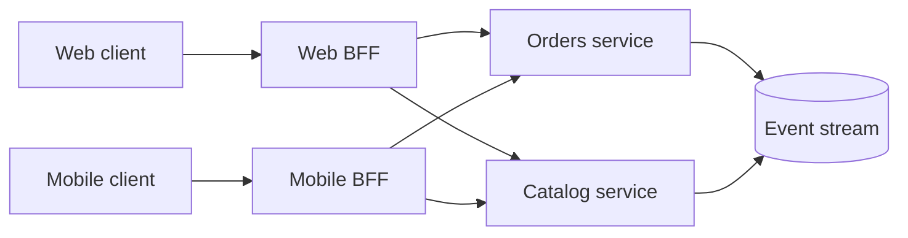

## What it is

Enterprise architecture patterns organize a large application around explicit ownership and failure boundaries. A **monolith** deploys components together, **microservices** deploy business capabilities independently, a **service mesh** manages service-to-service networking, a **backend-for-frontend (BFF)** creates an API tailored to one client experience, the **Strangler Fig** pattern gradually replaces an old system, and **cell-based architecture (CBA)** repeats a bounded slice of the system to limit blast radius.

## How it works

Choose a deployment boundary from the way the business changes, not from a diagram alone. A modular monolith keeps orders, billing, and notifications in one deployable unit but isolates their code and data behind modules. It gives a small team one build, one release, and one operational unit. Microservices split those capabilities into independently deployable processes, which improve team autonomy and fault isolation but add network calls, contract evolution, distributed tracing, and more deployment coordination.

A **BFF** sits between a client and downstream services. A web BFF can aggregate a page's data and shape it for a browser, while a mobile BFF can optimize for bandwidth and offline-friendly responses. A BFF owns client-specific behavior, but it does not become a place for every business rule. Domain services remain the source of truth. This split is useful when a web and mobile client need different aggregates or release cycles.



A service mesh such as Istio or Linkerd places a proxy beside each workload or uses an ambient data plane. The proxies establish mTLS, discover eligible destinations, apply traffic policy, and emit telemetry. The application still owns domain behavior. The mesh is valuable when many services need the same east-west security and resilience policy, but it adds data-plane CPU, configuration, certificate rotation, and a new operational layer.

A Strangler Fig places a new interface in front of a legacy system and routes selected capabilities to the replacement. As each capability moves, traffic shifts from the old implementation to the new one. The facade prevents clients from depending on internal migration state and gives rollback a route. It works best with observable boundaries such as a table, API, or business capability that can migrate independently.

Cell-based architecture divides the system into cells, each with its own traffic entry, data, and dependent capacity. A router sends a user or tenant to one cell. A cell can fail without taking down every other cell, and capacity can scale by adding cells. It requires a deliberate cell key, a router with a complete cell map, and operations that can repair or rebuild one cell. A cell is not just a Kubernetes cluster; it is an operational slice with bounded responsibilities.

```yaml
architecture_decision:
  boundary: orders_and_payments
  deployment: independently_deployable_services
  client_edge: web_bff
  east_west: istio_service_mesh
  migration: strangler_fig
  capacity: cells_by_tenant_hash
  invariants:
    - one owner for each business write
    - externalized session state
    - idempotent event consumers
```

These patterns compose. A company can use a modular monolith for billing, services for customer-facing order flows, an Istio mesh for the service fleet, a web BFF for its storefront, a Strangler Fig migration from a legacy database, and cells for the busiest tenant partitions. Each choice should have an owner, a failure behavior, and a migration path.

## Tradeoffs

| Pattern | Gain | Cost or limitation |
| --- | --- | --- |
| Modular monolith | Simple local transactions, deployment, and debugging | A failure or release affects the whole unit; boundaries can erode |
| Microservices | Independent deployment, scaling, and team ownership | Network latency, partial failure, observability, and contract management |
| BFF | Tailors responses to one client and reduces client orchestration | Adds a deployable layer and can duplicate transformation logic |
| Service mesh | Uniform mTLS, routing, telemetry, and resilience policy | More proxies, configuration, CPU, and upgrade work |
| Strangler Fig | Incremental replacement with routing-level rollback | Migration mapping, dual-run behavior, and temporary complexity |
| Cell-based architecture | Contains failures and scales by adding repeatable slices | Router correctness, data placement, rebalancing, and cell operations |

## When to use

- A small team needs a simple release and transaction model, which points to a modular monolith.
- Business capabilities have different owners, scaling needs, and release cadences, which points to microservices.
- Web and mobile clients need different response shapes or client-specific release timing, which points to a BFF.
- Many services need centrally managed mTLS, traffic policy, and telemetry, which points to a service mesh.
- You need to limit a large system's failure or capacity domain, which points to cells.

## Alternatives

- **A gateway shared by every client** — reduces proxy types, but forces unrelated clients into one response contract.
- **Direct client-to-service calls** — removes extra hops, but exposes topology and duplicates client-specific aggregation and security logic.
- **A single large cluster without cells** — is operationally simpler initially, but makes some failures and capacity problems affect the whole system.
- **Big-bang replacement** — avoids temporary routing rules, but creates a high-risk cutover and makes rollback harder.

## Related

- [Domain-Driven Design & Event Architectures: Bounded Contexts, CQRS, Event Sourcing, and Transactional Outbox](02-domain-driven-event-architectures.md)
- [Resilience & Fault Tolerance Patterns: Circuit Breakers, Bulkheads, Backoff, Retries, and Timeout Budgets](03-resilience-fault-tolerance.md)
- [Reverse Proxies, API Gateways, and Edge Routing](../01-system-design-fundamentals/04-proxies-gateways.md)
- [Cryptography & System Security: TLS/SSL, PKI, Symmetric/Asymmetric Encryption, KMS, OAuth 2.0/OIDC, and Zero-Trust Architecture](../01-system-design-fundamentals/06-cryptography-system-security.md)
- [AppSec & Threat Defense: OWASP Top 10, Threat Modeling, Secrets Management (HashiCorp Vault), and Supply-Chain Security](../01-system-design-fundamentals/07-appsec-threat-defense.md)
