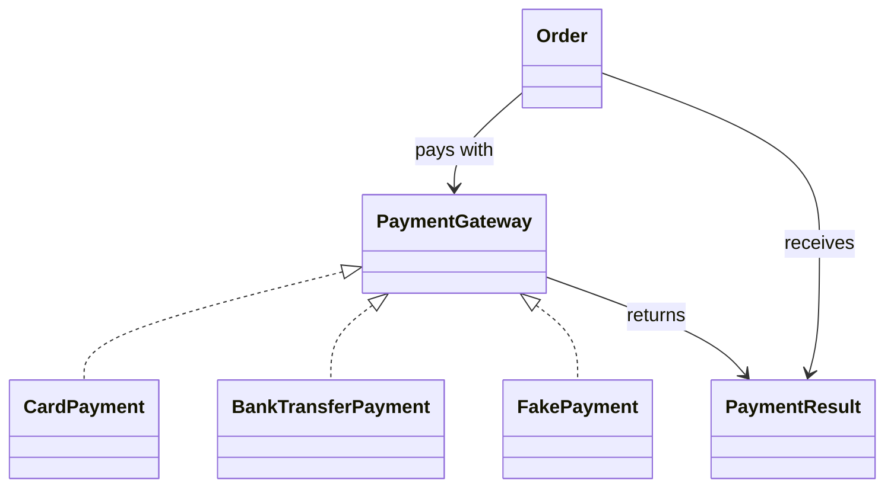

## What it is

Object-oriented programming is a way to combine data with the operations that protect and use that data, while **SOLID** principles give that design a set of rules for change. The goal is not to create the largest possible class hierarchy; it is to make each important reason to change local, explicit, and easy to test.

## How it works

A useful object has a small public promise and hides how it keeps that promise. **Encapsulation** keeps state private behind methods such as `placeOrder`; callers cannot corrupt an order by changing its fields directly. **Abstraction** exposes the operations a client needs, such as `charge`, without exposing payment-provider details. **Inheritance** lets a specialized object reuse a stable family of behavior, and **polymorphism** lets one call work with different implementations through a common contract.

Think of a checkout service as a traffic controller for payment providers. The order code asks for a payment result, while a card provider, bank-transfer provider, and test provider decide how the request is fulfilled. The order does not need a `switch` statement that names every provider.



The SOLID principles apply to that design:

- **Single Responsibility Principle (SRP)** — a class has one main reason to change. `PaymentGateway` handles the payment contract; an invoice formatter and an order repository do not belong in it.
- **Open/Closed Principle (OCP)** — new providers can be added without editing a large conditional. A new `PaymentGateway` implementation extends the system without changing `Order`.
- **Liskov Substitution Principle (LSP)** — every implementation must honor the gateway contract. A provider that requires a different currency or silently declines requests cannot be substituted for a compliant gateway.
- **Interface Segregation Principle (ISP)** — small, focused interfaces are easier to implement than one interface with unrelated operations. Separate `capture`, `refund`, and `queryStatus` when clients need different subsets.
- **Dependency Inversion Principle (DIP)** — high-level policy depends on an abstraction, not a provider-specific library. The order depends on `PaymentGateway`; the application wiring chooses the concrete provider.

Composition is often clearer than inheritance. A `DiscountPolicy` object can be passed to an `Order` without creating a `SpecialDiscountOrder` subclass that may be valid for only one kind of discount. Inheritance remains useful when the child truly preserves the parent's contract and adds a coherent specialization.

A small design artifact makes the dependency direction reviewable:

```yaml
payment_contract:
  high_level_policy: Order
  abstraction: PaymentGateway
  implementations:
    - CardPayment
    - BankTransferPayment
  contract:
    - authorize(amount, currency)
    - returns PaymentResult
  prohibited_dependencies:
    - provider-specific SDK in Order
```

The important distinction is between a contract and an implementation. The order can be tested with a fake gateway, and the concrete provider can be replaced without changing order behavior.

## Tradeoffs

| Principle | Gain | Cost or limitation |
| --- | --- | --- |
| Encapsulation | Protects invariants and makes local changes safer | More deliberate interfaces and occasional indirect access |
| Inheritance | Reuses a stable behavioral family | Can create fragile base classes and false “is-a” relationships |
| Polymorphism | Removes provider branches from callers | Requires stable abstractions and indirection in the call path |
| SRP | Keeps change local and supports focused ownership | Can split a working feature across many small classes |
| OCP | Allows extension through stable contracts | Over-abstraction can create unnecessary interfaces |
| LSP | Makes interchangeable implementations trustworthy | Requires careful documentation and contract tests |
| ISP | Reduces implementation burden and dependency scope | Many narrow interfaces can make orchestration more verbose |
| DIP | Makes policy testable and independent of infrastructure | Adds wiring and abstractions that are worthwhile only at real boundaries |

SOLID is a set of review questions, not a target object count. Apply it where change, reuse, or testability makes a boundary valuable.

## When to use

- You need to protect business invariants such as order totals or payment state.
- A class changes for unrelated business or infrastructure reasons.
- A conditional selects behavior that can be represented by separate implementations.
- A shared contract has implementations used interchangeably by clients.
- You want unit tests to replace a database, payment provider, or clock with a controlled test double.

## Alternatives

- **Procedural functions and immutable data** — works well for small workflows, but can make stateful invariants and lifecycle rules spread across callers.
- **Deep inheritance trees** — centralizes shared behavior, but makes a change to a base class affect many subclasses.
- **Reflection and configuration-driven rules** — reduces code branching, but moves failures into runtime data and makes contracts less visible.
- **A feature service with one public method** — can be a useful boundary, but it still needs cohesive internals and focused dependencies.

## Related

- [Classic Software Design Patterns](02-classic-software-design-patterns.md)
- [Refactoring Mechanics & Technical Debt Reduction](03-refactoring-mechanics-technical-debt-reduction.md)
- [Code Smells Catalog](04-code-smells-catalog.md)
- [Domain-Driven Design & Event Architectures: DDD Bounded Contexts, CQRS, Event Sourcing, and Transactional Outbox](../02-software-architecture-patterns/02-domain-driven-event-architectures.md)
