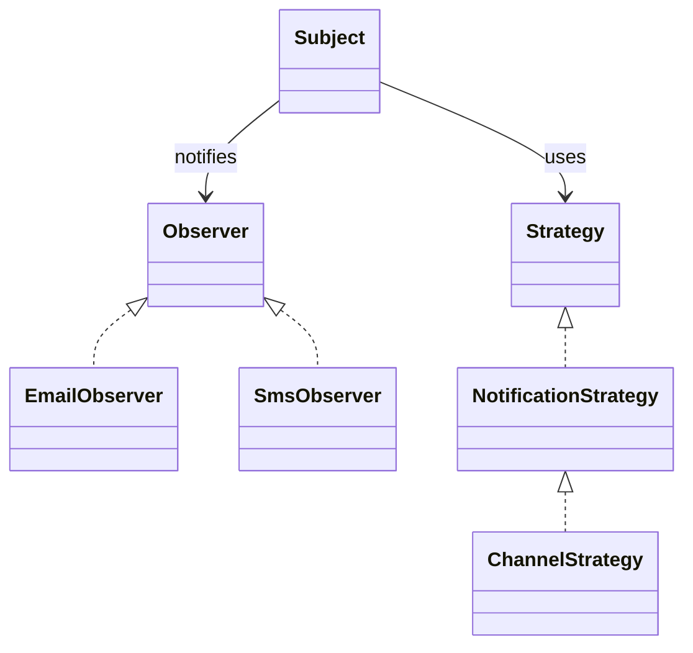

## What it is

Software design patterns are named, reusable solutions to recurring design problems. A pattern is not a library or a copy-paste template; it is a trade-off with a known intent, forces, structure, and consequences.

## How it works

Patterns organize design choices by the job they do. Use a **creational pattern** when code must create or copy objects safely, a **structural pattern** when objects must compose without exposing their internals, and a **behavioral pattern** when objects need to distribute or vary behavior.

The following classes show a small notification flow. The **Subject** can notify observers, each **Observer** handles a different reaction, and a **Strategy** supplies the channel-specific behavior. The classes are not mandatory; they are a vocabulary for discussing the roles.

### Creational patterns

- **Factory Method** — a creation method lets a subclass choose a product without the caller naming the concrete constructor.
- **Abstract Factory** — one factory creates a compatible family of products, such as dark-theme and light-theme UI controls.
- **Builder** — assembles a valid object through readable steps when a constructor or initializer would have too many or too fragile parameters.
- **Singleton** — controls access to one shared instance; use it only when global identity is truly a requirement, because hidden state makes tests and coordination harder.
- **Prototype** — creates a new object by copying an existing template, useful when object creation is expensive or the object graph is variable.

### Structural patterns

- **Adapter** — translates one interface into another so an existing client can use an incompatible provider.
- **Bridge** — separates an abstraction from its implementation so both sides can vary independently.
- **Composite** — treats individual objects and groups of objects through one common interface, as in a file tree.
- **Decorator** — adds behavior by wrapping an object while keeping its interface.
- **Facade** — provides a simple entry point to a subsystem with many collaborators.
- **Proxy** — stands in for an object to control access, add caching, manage a remote boundary, or defer creation.

### Behavioral patterns

- **Chain of Responsibility** — passes a request through handlers until one handles it.
- **Command** — represents a request as an object, which can be queued, logged, or undone.
- **Iterator** — provides a uniform way to traverse a collection without exposing its representation.
- **Mediator** — coordinates collaborators through a central object instead of direct peer-to-peer calls.
- **Memento** — captures state so it can be restored later without exposing its internals.
- **Observer** — notifies dependents when a subject changes.
- **State** — changes behavior by changing the object's state representation.
- **Strategy** — swaps one algorithm for another behind a common interface.
- **Template Method** — defines an algorithm skeleton while allowing selected steps to vary.
- **Visitor** — adds operations over a stable object structure without changing every element class.

For example, an order can publish a `PaymentApproved` notification, use an **Observer** for interested handlers, and a **Strategy** for email or SMS delivery. A **Facade** can simplify the API used by a request handler, while an **Adapter** can keep a legacy payment client behind the new gateway contract. The combination is useful only when each role is clear.

## Tradeoffs

- **Use a pattern** — reuses a well-understood solution, but adds indirection and requires the team to learn the pattern's vocabulary.
- **Prefer a direct implementation** — is faster to read for a small, stable problem, but can duplicate logic when the same pressure appears again.
- **Use a catalog decision** — makes trade-offs visible, but a catalog does not know your performance, security, or deployment constraints.
- **Combine patterns carefully** — can express complex variation, but too many collaborators can make execution paths and failure handling difficult to trace.

Patterns are most valuable at a repeated boundary: creating pluggable components, adapting third-party APIs, observing events, or applying a replaceable policy. A one-off method does not need a pattern merely to have one.

## When to use

- Creation logic is repeated, expensive, or must choose a compatible family of products.
- A third-party interface must be adapted without changing every caller.
- A subsystem needs a simpler public entry point or a replaceable implementation boundary.
- Several objects must react to a change, and the reaction list should remain open.
- An algorithm varies independently of the object that uses it.

## Alternatives

- **Direct function calls** — fewer layers and easier tracing, but less flexibility when implementations must change independently.
- **Event bus or framework container** — centralizes wiring, but introduces runtime discovery, ordering, and debugging concerns.
- **Plain data plus service functions** — reduces object ceremony for simple workflows, but can scatter lifecycle and invariant rules.
- **Composition of small interfaces** — often a better default than a deep hierarchy, though it still benefits from a named pattern when the structure is recognizable.

## Related

- [OOP Foundations & SOLID Principles](01-oop-foundations-solid-principles.md)
- [Refactoring Techniques](05-refactoring-techniques.md)
- [Domain-Driven Design & Event Architectures: Bounded Contexts, CQRS, Event Sourcing, and Transactional Outbox](../02-software-architecture-patterns/02-domain-driven-event-architectures.md)
- [Resilience & Fault Tolerance Patterns: Circuit Breakers, Bulkheads, Backoff, Retries, and Timeout Budgets](../02-software-architecture-patterns/03-resilience-fault-tolerance.md)
