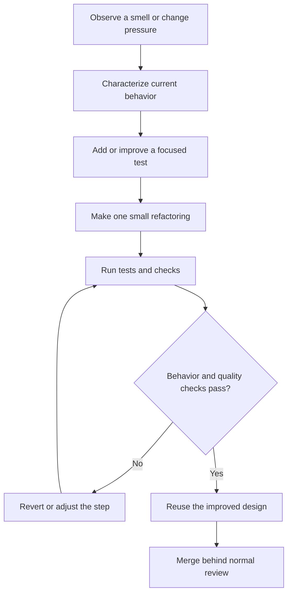

## What it is

Refactoring is the deliberate restructuring of existing code to improve its internal design without changing observable behavior. **Technical debt** is the future cost created by taking a useful shortcut now, and reducing it means paying that cost deliberately through smaller, safer changes.

## How it works

A refactoring starts with a safety net. First identify a behavior that matters and add or confirm a test around it. Then change the code in small steps, run the relevant tests after each step, and keep the public behavior unchanged. This is the **Red-Green-Refactor** cycle: establish a failing test for a new requirement, make it pass with the smallest useful implementation, then improve the design without changing the result.

A safe workflow separates discovery, feedback, and cleanup:



Before changing a risky area, write down the current contract, identify callers, and define the rollback boundary. Characterizing tests can capture unusual inputs and legacy behavior. A branch or small pull request limits the blast radius, and a separate behavior-changing commit keeps review focused.

Technical debt is not the same as every shortcut. A useful **debt quadrants** view separates debt by its impact:

| Quadrant | Deliberate shortcut | Example | Action |
| --- | --- | --- | --- |
| Deliberate and prudent | Yes | A launch feature uses a direct database call to ship safely | Record the expected payoff and revisit date |
| Deliberate and reckless | Yes | A team skips tests and permission checks because time is short | Stop new changes until risk is contained |
| Accidental and prudent | No | A useful abstraction is duplicated because the team did not know the pattern | Refactor during the next related change |
| Accidental and reckless | No | Every change edits a large, untested module | Quarantine, test, and reduce the risk before adding features |

**Clean code** means code whose names, boundaries, and control flow make a change easy to review. It is not a universal line-count limit. The practical questions are: can a reader identify the reason for change, can a test isolate it, and can a change be reverted without understanding the entire repository?

A change ledger keeps the decision visible:

```yaml
refactor:
  goal: separate order rules from invoice formatting
  behavior_change: none
  safety:
    tests:
      - places order with discounted total
      - rejects order with invalid customer
    integration_check: checkout_suite
  debt_repaid:
    - duplicate discount calculation
    - formatter reaching into order fields
  follow_up:
    - measure change time for invoice work
```

Refactoring is not unlimited cleanup. Allocate a small amount of effort to the code you are changing, and stop when the next change is safer or the current design meets its stated purpose. Unrelated cleanup belongs in a separate change so reviewers can distinguish behavior preservation from behavior modification.

## Tradeoffs

- **Refactor during feature work** — improves the area you already understand, but lengthens the feature change and needs a disciplined safety net.
- **Schedule dedicated cleanup** — gives debt reduction a visible priority, but may compete with product deadlines.
- **Preserve behavior with tests** — makes change safer, but tests can become expensive when they assert implementation details.
- **Batch related cleanup** — reduces branch and review overhead, but increases the amount of change that can fail together.
- **Use a time-box** — limits interruption and encourages a useful slice, but leaves some debt for a later budget.

## When to use

- A repeated change touches the same few methods, classes, or files.
- A bug fix is difficult because the relevant behavior is spread across several layers.
- You need to change a contract, add a provider, or remove a dependency safely.
- Tests can characterize current behavior before structural work begins.
- A debt item is blocking delivery, security, observability, or operational work.

## Alternatives

- **Leave the code unchanged** — minimizes immediate churn, but preserves the cost for every future change.
- **Rewrite the component** — can remove old constraints, but creates a large risky migration and loses small-batch feedback.
- **Add tests first without structural changes** — protects behavior, but does not reduce design cost.
- **Treat cleanup as a permanent feature** — keeps debt visible, but requires product planning and ownership.

## Related

- [Code Smells Catalog](04-code-smells-catalog.md)
- [Refactoring Techniques](05-refactoring-techniques.md)
- [OOP Foundations & SOLID Principles](01-oop-foundations-solid-principles.md)
- [Enterprise Architecture Patterns: Monolith vs Microservices, Service Mesh, BFF, Strangler Fig, and Cell-Based Architecture](../02-software-architecture-patterns/01-enterprise-architecture-patterns.md)
