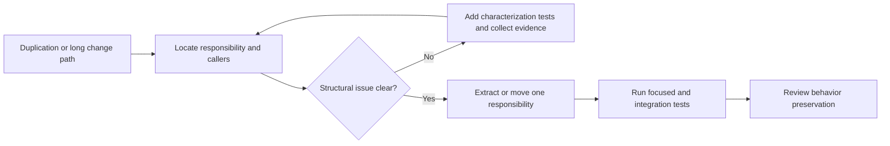

## What it is

A **code smell** is a surface symptom that suggests a design or maintenance problem, not a rule violation and not proof that a change is needed. Smells become important when they make behavior hard to understand, change, test, or operate.

## How it works

Review a smell by asking three questions: what does the code make hard to change, what evidence confirms that friction, and which smaller refactoring would improve it without changing behavior? A diagram should point from symptom to investigation to remedy, not from smell to a universal automatic rewrite.

The main groups are:

### Bloaters

- **Long Method** — a method contains several steps at different abstraction levels; extract meaningful steps, name them, and keep the orchestration visible.
- **Large Class** — one class owns unrelated fields and methods; split responsibilities by reason to change and preserve a small facade when callers need both views.
- **Long Parameter List** — a caller passes a bundle of related values repeatedly; introduce a parameter object only when the values form a coherent concept.

### Object-oriented abusers

- **Switch Statements** — the same conditional repeatedly selects a type-specific behavior; use polymorphism, a strategy, or a lookup when the cases are stable and distinct.
- **Refused Bequest** — a subclass ignores or contradicts a parent contract; prefer composition or redesign the inheritance relationship.
- **Alternative Classes** — two classes have the same public behavior with different APIs; make the intended replacement explicit or remove one after migrating callers.

### Change preventers

- **Divergent Change** — one class must be edited for many unrelated reasons; split it along those reasons.
- **Shotgun Surgery** — a small requirement requires coordinated edits across many classes; clarify ownership and make the relevant information travel through one boundary.

### Dispensables

- **Comments** — comments should explain intent or constraint, not narrate obvious syntax; improve names and extract intent into code when possible.
- **Duplicate Code** — repeated logic that must change together; merge it behind a clear abstraction, but do not combine unrelated lookalikes.
- **Dead Code** — unreachable or unused paths increase navigation and maintenance cost; prove usage and remove it with tests.
- **Lazy Class** — a class has no meaningful behavior or responsibility; collapse it into its only sensible owner or give it a real boundary.

### Couplers

- **Feature Envy** — one object reaches repeatedly into another object's data; move the behavior to the data owner or extract a focused value object.
- **Inappropriate Intimacy** — two classes know too much about each other's implementation; reduce the shared surface to a contract.
- **Message Chains** — a caller navigates `a.b().c().d()` to get one result; expose the result as a method or return a focused object.
- **Middle Man** — a class only forwards calls while adding little value; remove it or give it boundary behavior such as translation, caching, or policy.

A smell catalog is a diagnostic checklist. For example, a long parameter list is not automatically a defect: a function that genuinely needs twenty independent values may be better served by a request object, a command, or a value object. Conversely, a short class can still have a harmful responsibility if it changes for unrelated reasons.

## Tradeoffs

- **Refactor every smell immediately** — can raise short-term quality, but creates endless cleanup and delays product changes.
- **Use a catalog during review** — makes risks discussable and repeatable, but does not replace tests or domain knowledge.
- **Replace conditionals with classes** — removes branches from callers, but adds types and can make simple logic heavier.
- **Merge duplicate code** — reduces repeated changes, but can create an abstraction that serves unrelated domains poorly.
- **Keep a targeted legacy smell** — avoids unnecessary churn, but records the cost and an owner for a later improvement.

The right response depends on frequency of change, business risk, test confidence, and whether the smell is local or architectural.

## When to use

- A change repeatedly touches unrelated responsibilities or a scattered group of classes.
- A method is difficult to test because it hides many steps or a long chain of collaborators.
- A conditional grows every time a new business type is added.
- A bug hides in duplicated logic, a misleading comment, or an apparently unused path.
- Reviewers need a shared vocabulary for discussing design without arguing about formatting.

## Alternatives

- **Rely on style and complexity metrics** — catches some trends quickly, but cannot tell whether a structure is useful for the domain.
- **Use a rewrite plan** — can remove legacy structure, but postpones incremental feedback and increases migration risk.
- **Apply a blanket rule** — creates consistency, but can encourage renaming or abstraction that does not improve behavior.
- **Document the smell and defer it** — preserves delivery capacity, but only works when the risk, owner, and revisit condition are recorded.

## Related

- [Refactoring Mechanics & Technical Debt Reduction](03-refactoring-mechanics-technical-debt-reduction.md)
- [Refactoring Techniques](05-refactoring-techniques.md)
- [OOP Foundations & SOLID Principles](01-oop-foundations-solid-principles.md)
- [Classic Software Design Patterns](02-classic-software-design-patterns.md)
