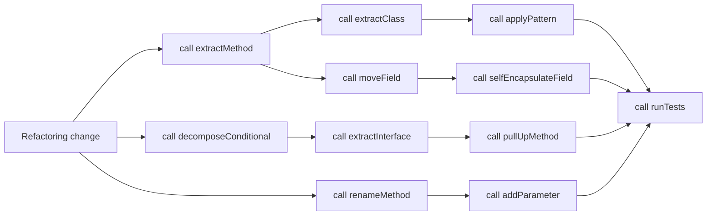

## What it is

Refactoring techniques are small, repeatable transformations that improve code structure while preserving behavior. They give a reviewer a concrete answer to “what changed?” instead of a broad rewrite disguised as cleanup.

## How it works

Choose a technique from the pressure you observed, apply one transformation at a time, and run the narrowest useful tests after each step. The technique names below cover the common movements in the catalog.

### Composing methods

- **Extract Method** moves a coherent block into a named method, making the original method read like a plan.
- **Inline Method** removes a method whose wrapper adds no clarity, keeping behavior in the caller.
- **Replace Temp with Query** replaces a temporary variable that is only a calculation with a method call, when the calculation is clear and safe.

### Moving features between objects

- **Move Method** moves behavior to the class that owns the data it operates on.
- **Move Field** moves state to the class that owns its lifecycle.
- **Extract Class** groups a coherent set of fields and behavior behind a new focused class.

### Organizing data

- **Self-Encapsulate Field** prevents direct field access so the owner controls validation and future changes.
- **Replace Magic Number with Symbolic Constant** gives a domain limit a name and one documented location.

### Simplifying conditional expressions

- **Decompose Conditional** replaces a compound condition with named predicates or methods.
- **Replace Conditional with Polymorphism** moves type-specific behavior behind implementations when the cases represent stable variants.

### Simplifying method calls

- **Rename Method** makes the operation's purpose and vocabulary clear.
- **Add Parameter** passes a new value instead of reaching for hidden global state.
- **Remove Parameter** removes a value the method no longer needs after a caller or design change.

### Dealing with generalization

- **Pull Up Field** moves shared state to a common parent when subclasses use it consistently.
- **Pull Up Method** moves behavior to a parent when the contract is genuinely shared.
- **Push Down Method** moves behavior to subclasses that own a specialized rule.
- **Push Down Field** keeps a field close to the subclass that defines its meaning.
- **Extract Interface** creates a contract for the behavior callers actually need.
- **Extract Superclass** factors common behavior when several classes share a stable algorithm structure.

The relationships are easier to see as a call graph of design work. A detected smell selects a technique; the technique creates a new seam; the seam enables a pattern or a SOLID improvement.

A practical example is a checkout function that validates a cart, applies several discount policies, formats an invoice, and sends a notification. First **Extract Method** to expose `calculateTotal`, then **Extract Class** for a `DiscountPolicy` value if the inputs travel together. If payment and notification providers now require different contracts, **Extract Interface** on the narrow capability each caller uses. Each transformation makes the next decision easier to inspect.

Do not apply every technique by default. `Inline Method` can make a useful seam disappear; `Pull Up Method` can create a base class whose contract is too broad. Prefer the smallest transformation that leaves the code clearer and still testable.

## Tradeoffs

- **One transformation per change** — improves review and rollback, but can create a sequence of small commits.
- **A larger cleanup change** — can deliver a cleaner result sooner, but makes behavior regressions harder to isolate.
- **Add a seam with an interface** — improves substitution and testing, but can hide useful concrete behavior.
- **Use inheritance to share code** — reduces duplication, but can increase coupling and constrain future variation.
- **Keep a small method** — improves readability, but too many fragments can obscure the business flow.

## When to use

- A method is doing several unrelated steps or repeating a calculation.
- A parameter list, field, or dependency has one clear owner.
- A conditional selects stable behavior that can be represented by a type.
- Two classes share a contract that callers need without knowing their concrete type.
- A reviewer needs a small, named behavior-preserving change.

## Alternatives

- **Rewrite from scratch** — can produce a clean model, but carries more risk and loses incremental history.
- **Add another layer without moving responsibility** — may improve naming, but leaves the underlying coupling in place.
- **Accept duplication deliberately** — can keep a simple design, but should have a clear boundary and a recorded reason.
- **Defer the change** — protects immediate delivery, but should include an owner and a condition for revisiting the smell.

## Related

- [Refactoring Mechanics & Technical Debt Reduction](03-refactoring-mechanics-technical-debt-reduction.md)
- [Code Smells Catalog](04-code-smells-catalog.md)
- [OOP Foundations & SOLID Principles](01-oop-foundations-solid-principles.md)
- [Classic Software Design Patterns](02-classic-software-design-patterns.md)
