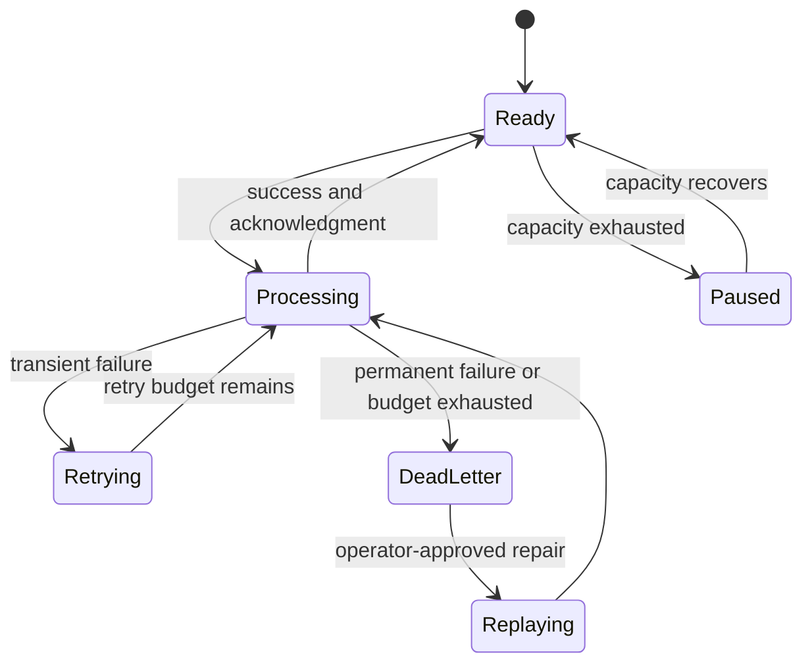

## What it is

Backpressure is the deliberate slowdown, pause, or rejection of work when a consumer cannot keep up with a producer. A **dead letter queue (DLQ)** is a separate holding destination for messages that fail a retry policy or cannot be processed because of a permanent defect, such as an invalid schema. Backpressure protects the pipeline's memory and latency; a DLQ preserves failed work for diagnosis, replay, or deliberate disposal.

## How it works

A producer sends work at its natural rate, while the broker and consumer expose their available capacity through queue depth, in-flight limits, acknowledgment lag, or stream consumer lag. When a bounded queue reaches its limit, the system blocks, rejects with a retryable error, pauses the producer, or routes overflow to a separate policy. An unbounded queue can accept more work, but its memory or disk use grows until the system fails. Consumer lag is a measurement, not itself backpressure: a system must act on that measurement by scaling consumers, limiting concurrency, or throttling upstream work.

A retryable failure is delayed with a bounded retry policy. Exponential backoff increases the delay after each attempt, and jitter spreads attempts so many consumers do not retry at the same instant. After the retry budget is exhausted, the broker or application moves the record to a DLQ and records the failure reason, original topic or queue, attempt count, and correlation ID. A DLQ must be monitored; parking a message indefinitely is not recovery.

This policy describes a bounded queue and a dead-letter route in a broker-neutral form:

```yaml
queue:
  capacity: bounded
  overflow: pause_producer_or_reject_with_retry_after
  redelivery: unacknowledged_message_may_be_requeued
consumer:
  concurrency: bounded_by_throughput_test
  lag: measured_per_partition
retry:
  maximum_attempts: 5
  delay: exponential_with_jitter
  retryable: [timeout, rate_limit, dependency_unavailable]
dead_letter:
  destination: orders.dlq
  payload: [message, failure_reason, attempt_count, correlation_id]
  operations: [inspect, repair, replay, discard]
```



A DLQ is a routing outcome, not a repair. The original payload, failure reason, attempt count, correlation ID, and schema version must remain associated with the dead-lettered record so an operator can decide whether to fix, replay, expire, or discard it. A replay should normally target a rate-limited or isolated destination first; replaying directly into the original route can recreate the overload that caused the failure.

A broker redelivery policy makes an unacknowledged message eligible for delivery again after its consumer or visibility timeout. If the original consumer is still processing, the broker can deliver the message again, so redelivery creates a risk of duplicate or concurrent processing. Consumers therefore need idempotent handlers or a mechanism that coordinates exclusive processing.

RabbitMQ can bind a queue to a dead-letter exchange and configure a dead-letter routing key. Amazon SQS provides a native DLQ redrive policy, while an application retry queue can add its own delay before redriving the message. Kafka commonly uses retry topics and a dead-letter topic because the log itself is retained; a consumer can copy the original record and failure metadata to the dead-letter topic before advancing its source offset.

Event replay is a controlled second delivery path, not a blanket reset. Kafka consumer groups can reset offsets to a retained position, RabbitMQ can republish DLQ records, and Amazon EventBridge can replay events from an archive. A replay framework should support an explicit source range, the original event ID and schema version, a bounded destination or rate, progress visibility, and a way to stop the replay. Debezium-style change capture can supply a new event stream for rebuilding a projection, but it does not replace a replay policy for arbitrary business events.

## Tradeoffs

| Approach | Gain | Cost or failure behavior |
| --- | --- | --- |
| Bounded queue with blocking or rejection | Caps memory and storage use; exposes overload to the producer | Producers can stall or receive retryable failures |
| Unbounded buffering | Absorbs bursts without immediate producer rejection | Backlog and latency grow without a hard limit |
| Consumer autoscaling | Increases drain rate when more work is available | Costs rise during bursts and cannot react instantly to every spike |
| Exponential backoff with jitter | Reduces synchronized retry pressure | Adds latency and requires retry classification and idempotency |
| DLQ | Isolates poison messages and preserves failure evidence | Requires monitoring, ownership, and a repair or replay procedure |
| Offset or archive replay | Rebuilds projections or reprocesses a historical range | Replays can duplicate side effects, overload downstream systems, or lose data past retention |

## When to use

- Producer rate can exceed sustained consumer capacity and memory, disk, or latency must remain bounded.
- A downstream dependency can fail transiently and retries need explicit backoff and a maximum budget.
- Poison messages or schema failures must be isolated for inspection rather than blocking healthy work.
- You need to rebuild a projection or replay a known range after a consumer bug or deployment.

## Alternatives

- **Drop or sample on overflow** — protects a telemetry path's availability, but discards work and makes recovery incomplete.
- **Unbounded buffering** — absorbs a short spike, but shifts the failure to resource exhaustion when the backlog grows.
- **Synchronous retry in the consumer** — avoids an extra queue, but can hold worker capacity and amplify a dependency outage.
- **Reconciliation from an authoritative store** — repairs derived state after loss or duplication, but does not preserve the original event workflow by itself.

## Related

- [Message Delivery Guarantees](03-delivery-guarantees.md)
- [Message Queues vs Event Streams](01-queues-vs-streams.md)
- [Fast Data Propagation Mechanics](05-fast-data-propagation-mechanics.md)
- [Chapter 7 References](06-references.md)
