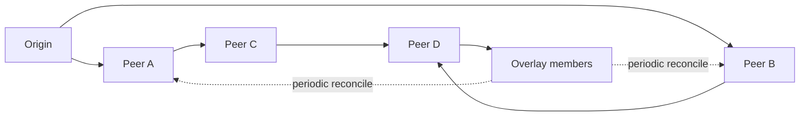

## What it is

Fast data propagation is the set of mechanisms that spreads a small piece of state, membership information, or a notification through a distributed population without requiring every node to contact every other node. **Gossip** is a push-based dissemination protocol, **epidemic dissemination** describes the resulting spreading process, **anti-entropy** is a repair process that reconciles missed state, an **overlay network** supplies the logical peer relationships, and a **broadcast tree** organizes fan-out to reduce hops or contention.

## How it works

A node publishes a local change to a selected set of peers. Each receiving node stores the change and forwards it to a different subset, so the update travels along several paths instead of a single central path. The random or shuffled peer selection limits hotspots and keeps the work per node bounded. Membership and health information commonly use this model: Apache Cassandra uses gossip for cluster membership, and Dynamo-style systems use gossip and anti-entropy to discover replicas that have fallen behind. Gossip is eventually consistent, not instantaneous; a bounded round can leave some nodes behind, and a failed partition can delay convergence.

The overlay is a logical graph over processes, services, or peers. It can be fully connected logically while using only a small number of actual transports, and it can change membership without changing the physical network. An epidemic overlay favors many short exchanges; a broadcast tree selects a root and parallel child links so a message reaches a layer in a predictable number of rounds. Trees reduce duplicate work when fan-out is large, but a failed internal node can delay or partition the subtree unless the overlay has alternate paths.

Anti-entropy repairs the gaps left by missed pushes. A node periodically compares its state with a peer and exchanges missing values, commonly using version vectors, timestamps, or content hashes to avoid repeatedly transferring unchanged data. A full-state union is correct for immutable update identifiers, while mutable state needs conflict resolution or a data type that defines merge semantics. The operation below is deliberately simple: each node stores update IDs, exchanges its set with one peer, and both nodes retain the union. Repeating the exchange across the overlay eventually gives connected nodes the same update set.



The example uses a direct two-way reconciliation because it makes the correctness rule visible. The sender and receiver may learn the same update independently, and the exchange may run in either direction; the set union makes the operation idempotent. A production implementation must bound the number of update IDs, compact old versions, authenticate peers, and prevent a single large exchange from becoming a new overload source.

```java
import java.util.HashSet;
import java.util.Set;

public final class GossipNode {
    private final Set<String> updates = new HashSet<>();

    public void addUpdate(String update) {
        updates.add(update);
    }

    public Set<String> reconcileWith(GossipNode peer) {
        Set<String> merged = new HashSet<>(updates);
        merged.addAll(peer.updates);
        updates.addAll(merged);
        peer.updates.addAll(merged);
        return Set.copyOf(merged);
    }
}
```

```c
#include <stddef.h>
#include <stdlib.h>
#include <string.h>

typedef struct GossipNode {
    char **updates;
    size_t count;
    size_t capacity;
} GossipNode;

static int gossip_node_contains(const GossipNode *node, const char *update) {
    for (size_t i = 0; i < node->count; ++i) {
        if (strcmp(node->updates[i], update) == 0) {
            return 1;
        }
    }
    return 0;
}

static int gossip_node_add_unique(GossipNode *node, const char *update) {
    if (gossip_node_contains(node, update)) {
        return 1;
    }
    if (node->count == node->capacity) {
        size_t new_capacity = node->capacity == 0 ? 4 : node->capacity * 2;
        char **resized = realloc(node->updates, new_capacity * sizeof(*resized));
        if (resized == NULL) {
            return 0;
        }
        node->updates = resized;
        node->capacity = new_capacity;
    }
    size_t length = strlen(update) + 1;
    char *copy = malloc(length);
    if (copy == NULL) {
        return 0;
    }
    memcpy(copy, update, length);
    node->updates[node->count++] = copy;
    return 1;
}

void gossip_node_add_update(GossipNode *node, const char *update) {
    gossip_node_add_unique(node, update);
}

size_t gossip_node_reconcile(GossipNode *node, GossipNode *peer) {
    for (size_t i = 0; i < peer->count; ++i) {
        if (!gossip_node_add_unique(node, peer->updates[i])) {
            return node->count;
        }
    }
    for (size_t i = 0; i < node->count; ++i) {
        if (!gossip_node_add_unique(peer, node->updates[i])) {
            return node->count;
        }
    }
    return node->count;
}
```

```python
class GossipNode:
    def __init__(self):
        self.updates = set()

    def add_update(self, update):
        self.updates.add(update)

    def reconcile_with(self, peer):
        merged = self.updates | peer.updates
        self.updates.update(merged)
        peer.updates.update(merged)
        return merged
```

```rust
use std::collections::BTreeSet;

pub struct GossipNode {
    updates: BTreeSet<String>,
}

impl GossipNode {
    pub fn new() -> Self {
        Self { updates: BTreeSet::new() }
    }

    pub fn add_update(&mut self, update: &str) {
        self.updates.insert(update.to_owned());
    }

    pub fn reconcile_with(&mut self, peer: &mut GossipNode) -> BTreeSet<String> {
        let merged = self.updates.union(&peer.updates).cloned().collect();
        self.updates.extend(merged.iter().cloned());
        peer.updates.extend(merged);
        merged
    }
}
```

```typescript
export class GossipNode {
    private updates = new Set<string>();

    addUpdate(update: string): void {
        this.updates.add(update);
    }

    reconcileWith(peer: GossipNode): string[] {
        const merged = new Set([...this.updates, ...peer.updates]);
        this.updates = new Set(merged);
        peer.updates = new Set(merged);
        return [...merged];
    }
}
```

```go
type GossipNode struct {
    updates map[string]struct{}
}

func NewGossipNode() *GossipNode {
    return &GossipNode{updates: make(map[string]struct{})}
}

func (n *GossipNode) AddUpdate(update string) {
    n.updates[update] = struct{}{}
}

func (n *GossipNode) ReconcileWith(peer *GossipNode) map[string]struct{} {
    for update := range peer.updates {
        n.updates[update] = struct{}{}
    }
    for update := range n.updates {
        peer.updates[update] = struct{}{}
    }
    return n.updates
}
```

## Tradeoffs

| Approach | Gain | Cost |
| --- | --- | --- |
| Randomized push gossip | Decentralized, resilient to a central coordinator, and simple to fan out | Convergence is probabilistic and traffic remains under sustained partitions |
| Periodic anti-entropy | Repairs missed messages and missed notifications | Requires metadata, scheduling, bandwidth, and conflict rules |
| Epidemic overlay | High reach with bounded per-node work | Can amplify duplicate exchanges and produce uneven load |
| Low-latency broadcast tree | Predictable fan-out depth and low redundant traffic | Tree maintenance and alternate paths add complexity |
| Centralized broker or leader | Strong sequencing and straightforward operations | The coordinator is a bottleneck and availability dependency |

## When to use

- You need membership, presence, configuration, or small updates to reach many peers without a central broker.
- You prefer eventual convergence and can define a bounded staleness objective.
- The overlay has changing membership and no stable physical neighbor relationship.
- You can combine fast push propagation with periodic anti-entropy repair.

## Alternatives

- **A replicated consensus log** — provides a globally ordered decision stream when ordering and linearizable reads matter more than decentralized convergence.
- **A centralized publish-subscribe broker** — provides explicit routing, retention, and acknowledgment policies when strong operational control is more important than offline reach.
- **A multicast transport** — can efficiently reach network recipients that support multicast, but it does not solve application-level repair or membership discovery.
- **CRDTs** — define mergeable concurrent state, but they do not replace the transport and scheduling work needed to deliver updates.

## Related

- [Message Queues vs Event Streams](01-queues-vs-streams.md)
- [Publish-Subscribe](02-pub-sub.md)
- [Backpressure, Dead Letter Queues, and Event Replay](04-backpressure-dlq.md)
- [Chapter 7 References](06-references.md)
