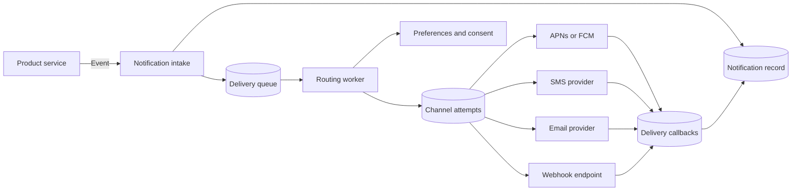

## What it is

A multi-channel notification dispatcher is an application service that turns one user-facing event into channel-specific deliveries through mobile push, SMS, email, and webhooks. It centralizes recipient preferences, routing, provider credentials, retries, idempotency, and delivery status so product services do not implement those controls independently.

## How it works

A producer submits an event such as `payment.cleared` with a stable event identifier. The dispatcher records that request before accepting downstream work, builds a notification envelope, and sends channel work to a durable queue. Separating intake from delivery prevents a slow provider from blocking the event producer and lets workers scale independently.

The dispatch path separates policy evaluation, durable attempts, and provider delivery:



The normalized envelope is independent of a provider's payload:

```json
{
  "notification_id": "evt_01JZ7Y2H3S4M5N6P7Q8R9T0U1V",
  "recipient_id": "user_142",
  "event_type": "payment.cleared",
  "template_id": "payment_cleared_v3",
  "channels": ["push", "email"],
  "priority": "high",
  "data": {
    "order_id": "order_5831"
  },
  "expires_at": "2026-09-24T18:00:00Z"
}
```

A routing worker reads the recipient's consent, channel preferences, locale, time zone, quiet hours, and device registrations. It selects one primary channel or a fallback chain and materializes a channel attempt. This step prevents a system event from bypassing an unsubscribe or a mandatory-consent decision.

Channel adapters then render provider-specific payloads:

- **APNs and FCM** — mobile push adapters resolve current device tokens, validate payload limits, and map the application's priority to provider priority. The service removes registrations rejected as invalid instead of retrying them forever.
- **SMS** — an aggregator such as Twilio receives a normalized message and handles carrier routing. The dispatcher respects destination consent, quiet hours, and provider throttling.
- **Email** — a provider API or SMTP relay receives rendered, localized content. Bounce, complaint, and unsubscribe callbacks update the recipient's delivery state.
- **Webhook** — the dispatcher signs a JSON request, sets a short timeout, and treats a non-success status as retryable only according to an explicit policy. Some `4xx` responses are permanent configuration errors, while `429` and most `5xx` responses can be retried.

Each attempt has a stable key such as `notification_id:channel:recipient_id:destination_id`, where the destination identifies a device registration, phone number, email address, or webhook endpoint. Workers persist that key with the attempt state to suppress repeated queue deliveries within the dispatcher's retention window. A worker can still fail after the provider accepts a request but before the response is recorded, so this check reduces duplicates without claiming exactly-once delivery. The application still needs a duplicate-tolerant consumer contract.

Transient errors use a retry schedule with jitter and an expiration deadline. Invalid credentials, malformed templates, suppressed consent, and permanently invalid device tokens do not consume the same retry budget. Exhausted work moves to a dead-letter queue for inspection and controlled replay. Provider acceptance records that the upstream service accepted a request; an open or click event is stronger evidence of user interaction, and neither should be described as proof that a human read the message.

## Tradeoffs

| Choice | Gain | Cost or risk |
| --- | --- | --- |
| Persist on send | Preserves history, supports audit, and enables offline fallback | Adds storage, retention, and deletion obligations |
| Fan out at send time | Avoids unused inbox writes and keeps preferences current | Adds read latency during bursts and can overload the preference store |
| Precompute recipient inboxes | Makes per-recipient delivery fast and replayable | Multiplies writes by fan-out and requires expiration policy |
| Synchronous provider calls | Immediate status and simpler control flow | Couples request latency and availability to the provider |
| Asynchronous channel workers | Absorbs provider bursts and isolates failures | Adds queues, delayed delivery, and operational state |
| Provider abstraction | Keeps products independent of APNs, FCM, Twilio, and email APIs | The lowest common denominator can hide provider-specific capabilities |
| Strict cross-channel ordering | Produces a consistent escalation sequence | Serializes independent channels and reduces throughput |
| Independent channel delivery | Improves throughput and fault isolation | A user can receive an SMS before an earlier email or push attempt completes |

## When to use

- You need one product event to reach recipients through more than one delivery channel.
- APNs, FCM, email, SMS, or webhook credentials and retry policies must remain outside feature services.
- Recipients need channel preferences, quiet hours, localization, fallback delivery, or offline notification history.
- Replayed events and worker retries require stable notification identifiers and duplicate suppression.

## Alternatives

- **Direct provider SDKs in feature services** — reduce initial platform work, but duplicate token management, consent enforcement, retries, and provider observability.
- **A managed notification platform** — accelerates multi-provider integration, but adds per-message cost, provider abstractions, and vendor dependency.
- **A durable event stream with application-owned consumers** — preserves replay and independent processing, but leaves channel policy and provider integration in the consuming services.

## Related

- [Real-Time Protocols: WebSockets, Server-Sent Events (SSE), and Long Polling](02-realtime-protocols.md)
- [Message Queues vs Event Streams (RabbitMQ, Apache Kafka, Apache Pulsar)](../01-messaging/01-queues-vs-streams.md)
- [Backpressure, Dead Letter Queues (DLQ), and Event Replay Frameworks](../01-messaging/04-backpressure-dlq.md)
- [Chapter 8 References](05-references.md)
