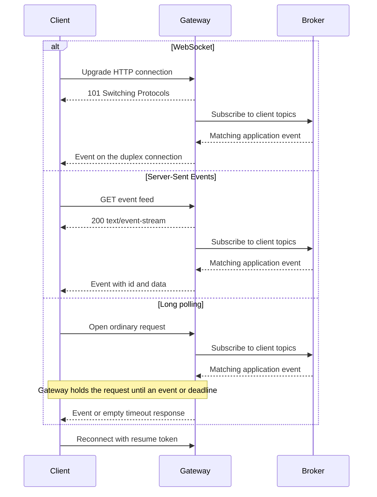

## What it is

Real-time protocols maintain a server-to-client event path so a client receives updates without repeatedly asking whether data exists. WebSockets support bidirectional messaging over one upgraded connection, Server-Sent Events (SSE) stream one-way events over HTTP, and long polling has the server hold each HTTP request open while waiting for an event or timeout.

## How it works

A transport selection determines the connection model, message direction, failure behavior, and server resource cost. The three mechanisms expose different choices rather than different guarantees for the same application event:



```yaml
websocket:
  establishment: HTTP upgrade to a full-duplex connection
  direction: client-to-server and server-to-client
  framing: text or binary frames over TCP
  reconnect: application and client policy
sse:
  establishment: long-lived HTTP response
  direction: server-to-client
  encoding: text/event-stream
  reconnect: EventSource with Last-Event-ID support
long_poll:
  establishment: ordinary HTTP request
  direction: request-response with server-side waiting
  reconnect: immediate next request after each response
```

**WebSockets** begin with an HTTP/1.1 upgrade request containing `Connection: Upgrade`, `Upgrade: websocket`, and `Sec-WebSocket-Key`. After the server accepts the handshake, the connection carries WebSocket frames rather than a sequence of HTTP requests. Control frames handle close and ping/pong, while application heartbeats and sequence numbers detect a stale or interrupted session. WebSocket preserves the ordered TCP byte stream, but it does not define event replay, durable delivery, or automatic reconnection.

**Server-Sent Events** return an HTTP response with `Content-Type: text/event-stream`. The server writes `id`, `event`, and `data` fields, and a browser's `EventSource` reconnects when the stream ends. After a supported reconnection, the client sends the last received event ID in `Last-Event-ID`; the server can use that identifier to resume. Client-to-server events use separate HTTP requests because the SSE response is one-way. Token refresh, connection limits, proxy buffering, and response lifetime still require explicit configuration.

**Long polling** sends an ordinary request that identifies the client's last event or wait deadline. The server holds the request until a matching event arrives or its own timeout expires, then responds. The client sends another request immediately. This works through intermediaries that support ordinary HTTP but block streaming responses or connection upgrades, at the cost of repeated requests and connection churn across successive waits.

**Server push** and **server pull** describe who initiates delivery. A WebSocket or SSE server pushes an event over an already-established stream, while fixed-interval polling makes the client pull by issuing a new request. Long polling is a hybrid: the client initiates each HTTP request, but the server waits and returns as soon as an event is available. None of these transport choices guarantees replay; a resume token, durable event store, or broker offset must supply missed-event recovery.

A scalable service normally separates connection handling from message routing. Stateless or mostly stateless gateways authenticate sessions and publish events to a shared broker; gateway nodes subscribe for the users connected to them. This removes a mandatory need for sticky sessions, although local routing state, device updates, or non-replayable requests can still benefit from affinity. Shared subscription placement, heartbeats, backpressure, and replay are the actual scaling concerns.

## Tradeoffs

| Protocol | Gain | Cost or limitation |
| --- | --- | --- |
| WebSockets | Full-duplex interaction with one upgraded connection and compact message framing | Application owns heartbeat, replay, resumption, and proxy behavior; one server socket per connection |
| SSE | HTTP-native server push, event IDs, and browser-managed reconnection | One-way stream; browser and proxy connection limits still apply |
| Long polling | Broad HTTP compatibility; the server holds the request open until an event or timeout | Repeated requests, extra handshakes, and more load than a persistent stream |
| Broker-backed fan-out | Gateways remain horizontally scalable and independent of event origin | Broker ordering, backpressure, and availability affect every connected gateway |
| Connection affinity | Keeps local state on one gateway and can avoid a broker read | A failed node disconnects its clients and reduces routing flexibility |
| Stateless gateways | Clients reconnect to any healthy gateway after externalized state | Session restoration and fan-out require shared state or a broker |

## When to use

- You need client-to-server and server-to-client messages over one connection, which points to WebSockets.
- You need a browser to consume a one-way event feed with standard HTTP and event-ID resumption, which points to SSE.
- You need server push through restrictive proxies or clients without upgraded or streaming responses, which points to long polling.
- You operate long-lived sessions and need to budget sockets, gateway capacity, heartbeats, and reconnection behavior.

## Alternatives

- **Fixed-interval HTTP polling** — uses simple cacheable requests, but adds idle traffic and latency bounded by the polling interval.
- **WebTransport** — multiplexes unreliable and reliable streams over HTTP/3, but requires newer clients, servers, and network support.
- **WebRTC data channels** — support peer-to-peer or relayed bidirectional data after signaling and NAT traversal, but add substantially more connection setup.
- **MQTT** — fits constrained devices and brokered publish/subscribe clients, but requires a broker model different from browser-native HTTP streaming.

## Related

- [Multi-Channel Notification Dispatchers: Push (APNs, FCM), SMS, Email, and Webhook Architecture](01-notification-dispatchers.md)
- [Distributed Presence Engines, User State Tracking, and Heartbeat Protocols](03-presence-engines.md)
- [Scalable Real-Time Chat & Collaboration Systems Architecture](04-realtime-chat.md)
- [Chapter 8 References](05-references.md)
