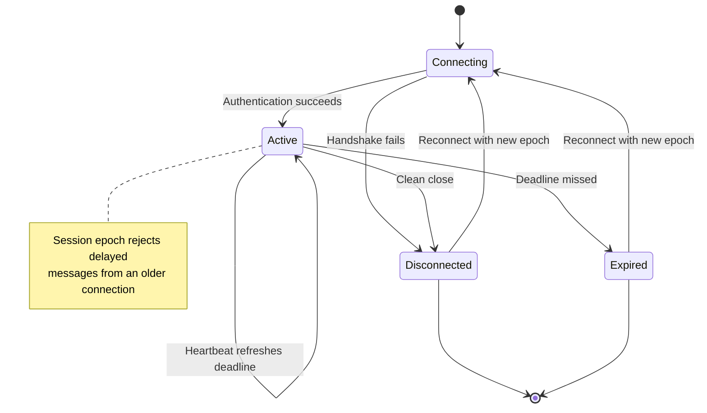

## What it is

A distributed presence engine tracks which user sessions are active across gateway nodes and publishes their current status. User state adds attributes such as available, busy, or away, while heartbeat and expiry rules turn silent network failures into observable offline transitions.

## How it works

Each authenticated client opens a real-time session through a gateway. The gateway creates a unique **session epoch** for that connection, records which node owns it, and starts a heartbeat deadline. A client heartbeat refreshes the deadline; a clean disconnect marks the epoch offline immediately. If no heartbeat arrives by the deadline, the gateway or presence store expires the session.

The connection state machine distinguishes a clean close from a failure detected by timeout:



The session record makes the lifecycle and ownership explicit:

```yaml
session:
  states: [active, expired, disconnected]
  fields:
    user_id: user_142
    session_id: ses_8a4f
    epoch: 17
    gateway_id: gateway-eu-2
    status: available
    expires_at: 2026-09-24T17:45:30Z
  transitions:
    heartbeat: active_with_same_epoch
    timeout: active_to_expired
    disconnect: active_to_disconnected
    reconnect: new_session_epoch
```

The epoch prevents a delayed heartbeat or disconnect from an old connection from overwriting a newer session for the same user. A reconnect therefore creates a new session rather than reviving an expired record by user ID alone.

A common implementation stores short-lived records in Redis with a TTL slightly longer than the heartbeat timeout. A gateway refreshes a record only when its session epoch still matches the current owner, so a delayed update cannot replace a newer session. A keyspace notification or Redis Stream can publish state changes to interested gateway nodes, although durable presence is not required for ephemeral online status. Expired records represent a detected failure, not proof that the client closed cleanly. The timeout must exceed expected heartbeat jitter and network delay while still meeting the product's acceptable offline-detection delay.

A user can connect from several devices. The engine applies product-defined precedence to aggregate those sessions. The user is online when at least one session is active; an account-level away or do-not-disturb setting can override device availability, and a busy result comes from the designated authoritative device or explicit account setting. The aggregate carries its contributing session set so a status change can be explained and reconciled.

For group views, the engine can query active records, maintain a materialized set, or subscribe to changes and maintain a local projection. Per-user records answer direct lookups efficiently; group projections make roster counts cheap but introduce cleanup and consistency work. Presence events include a version or session epoch so subscribers can reject stale updates.

Redis-backed presence is centralized and operationally simple. Gossiped node membership removes the central store but converges only after multiple exchanges and can retain stale observations until timeout. A replicated state store is another option when the presence service already needs durability and cross-region reads. The storage choice changes consistency and failure behavior; the session, heartbeat, and aggregate rules remain the core protocol.

## Tradeoffs

| Choice | Gain | Cost or risk |
| --- | --- | --- |
| Short heartbeat interval | Detects failed sessions sooner | Increases gateway, network, and store write volume |
| Longer heartbeat interval | Reduces refresh traffic | Extends the interval in which a dead session appears online |
| TTL-backed records | Makes abandoned sessions expire without a cleanup sweep | Detects failure only at expiry and makes immediate disconnect races possible |
| Central presence store | Gives one queryable state model | Creates a shared availability and scaling dependency |
| Gossip between gateways | Avoids a central bottleneck and tolerates partition loss | Converges slowly and permits temporary disagreement |
| Per-session state | Distinguishes multiple devices and supports accurate aggregation | Requires aggregation and session cleanup |
| Materialized group sets | Makes large roster reads inexpensive | Adds derived-state repair and expiration logic |
| Polling presence snapshots | Keeps clients and stores simple | Delays updates and increases repeated read traffic |

## When to use

- A product needs online, away, or busy indicators across multiple clients and gateway nodes.
- Message routing needs to know which gateway currently owns an active user session.
- Connection failures must become visible without relying on a graceful disconnect.
- User state must be aggregated across phones, browsers, desktop clients, or temporary sessions.

## Alternatives

- **HTTP status polling** — is simple and works with ordinary infrastructure, but adds stale state and repeated request load.
- **A durable relational presence table** — supports historical queries and transactions, but TTL cleanup and high-frequency heartbeat writes require separate care.
- **Managed real-time presence services** — provide channel membership and connection recovery with less operational work, but add provider dependency and cost.
- **Gossip-only membership** — removes a central presence authority, but accepts eventual convergence and requires versioned state to resolve stale updates.

## Related

- [Real-Time Protocols: WebSockets, Server-Sent Events (SSE), and Long Polling](02-realtime-protocols.md)
- [Scalable Real-Time Chat & Collaboration Systems Architecture](04-realtime-chat.md)
- [Publish-Subscribe (Pub/Sub) Architecture Mechanics & Fan-Out Design Patterns](../01-messaging/02-pub-sub.md)
- [Chapter 8 References](05-references.md)
