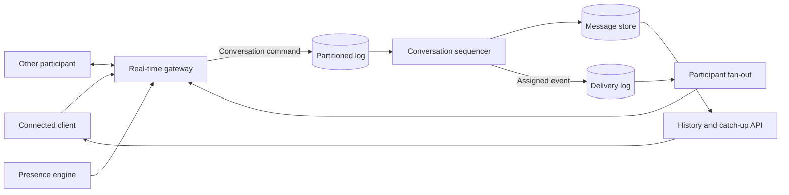

## What it is

A scalable real-time chat and collaboration system accepts concurrent events, assigns a durable order within each conversation, distributes updates to connected participants, and restores missed state after disconnection. The same architecture can carry chat messages, presence, read state, typing signals, and shared-document operations without making every event equally durable or ordered.

## How it works

Clients authenticate at a real-time gateway and subscribe to conversation and presence streams. Gateway nodes publish accepted events to a partitioned log such as Kafka, route resulting updates back to local sockets, and use a presence engine to locate active sessions. Durable chat history and collaboration metadata live in stores that clients can query after a stream resumes.

The durable write path is separate from fan-out to active sockets:



A canonical chat message separates client intent from server-assigned state:

```json
{
  "message_id": "msg_01JZ7ZB1H4VJ8KQ2M6N9P3R5T7",
  "client_message_id": "mobile-7f31",
  "conversation_id": "conversation_842",
  "sender_id": "user_142",
  "sequence": 91847,
  "type": "text",
  "body": "The rollout is complete.",
  "created_at": "2026-09-24T17:42:16Z"
}
```

The send path begins when a client creates a unique `client_message_id` and sends the message over WebSocket. The ingress service authenticates the sender, checks conversation membership, validates the payload, and publishes the command to the partition for `conversation_id`. A log preserves order within that partition, but the sequencer must also process one conversation in order rather than running competing consumers against it. It allocates the next conversation sequence, persists the message, and records the sender-local client identifier for deduplication.

Exactly-once processing across a gateway, log, database, and push path is not automatic. The design instead makes retries safe: the database enforces a unique `(conversation_id, sender_id, client_message_id)` constraint, and the client treats its local identifier as an idempotency key. The sequencer writes the message and an outbox entry containing the assigned event in one database transaction. A relay publishes outbox entries to the delivery log; duplicate publication remains safe because consumers key effects by `message_id`. The sequencer commits its source offset only after that transaction succeeds.

After publication, the system fans the assigned event out to participant gateways. Each gateway sends it to local connections and advances a membership cursor. Clients de-duplicate by `message_id` and place messages by `sequence`; a gap pauses later messages until catch-up completes. For long outages, clients request missing events by conversation and sequence rather than relying on ephemeral socket replay. Conversation history must therefore remain available for at least the product's retention and offline-access window.

Durable conversation history, rather than socket delivery, preserves messages for offline participants. A per-user inbox projection is optional when the product needs precomputed unread counts or ordered conversation previews; it can consume the same assigned events and advance a per-user watermark. Reopening chat reads the conversation store and catches up from the last confirmed sequence. A snapshot can collapse a very large gap into one current-state read followed by a bounded event replay.

Presence, typing, and read state follow different rules:

- **Presence** is ephemeral, heartbeat-backed state that can be reconstructed from active sessions.
- **Typing** is a throttled hint with a short expiry; missed or duplicated events are acceptable.
- **Read state** is a user-and-conversation watermark rather than a new copy of every message.
- **Shared-document operations** use a CRDT or operational transformation layer to merge concurrent edits, while chat messages keep a conversation order.

This separation prevents a losable typing hint from entering the durable message path. A client reports read progress with a per-user watermark instead of appending a separate receipt for every rendered message. Collaboration documents may use presence-aware connections while keeping the document operation log independent of chat delivery.

## Tradeoffs

| Choice | Gain | Cost or risk |
| --- | --- | --- |
| Partition by conversation | Natural message ordering and parallel conversations | One hot conversation can saturate a partition; cross-conversation order is absent |
| Global sequence service | One easy ordering model | Adds coordination latency and limits throughput |
| Durable log as source | Replay, recovery, and independent projections | Consumers must manage offsets, lag, and retention |
| Database as source | Transactional history and straightforward queries | Requires a separate durable event log when cross-service replay is needed |
| Transactional outbox | Records the message and publishable event atomically | Adds a relay and possible duplicate events that consumers must deduplicate |
| Gateway fan-out | Low delivery latency for active participants | Requires connection routing, backpressure, and per-user offline handling |
| Read-modify-write plus notifications | Simple and familiar client code | Concurrent messages and duplicate HTTP requests can lose data |
| CRDT collaboration | Clients can edit and merge during disconnection | Larger payloads and metadata, semantic conflicts, and privacy tradeoffs |
| Operational transformation | Compact transformation history for shared editors | A central ordering service and complex transformation rules |

## When to use

- Users need low-latency messages, presence, typing state, and durable history in the same product.
- Conversations require stable ordering, retry safety, offline catch-up, and multi-device synchronization.
- Collaboration sessions need concurrent edits to merge without holding a central connection lock.
- Gateway capacity and durable event volume require independent horizontal scaling.

## Alternatives

- **Polling-based messaging** — works with simple HTTP infrastructure, but adds polling load and latency to every update.
- **A managed real-time chat SDK** — provides presence, typing, and multi-device features quickly, but adds provider cost and constrains architecture at large scale.
- **Email-style asynchronous discussion** — provides durable history and broad client support, but does not provide live cursors or low-latency collaboration.
- **WebRTC data channels** — move suitable data transfers toward peer-to-peer paths, but signaling, NAT traversal, and fallback relays add complexity and do not replace durable server state.

## Related

- [Real-Time Protocols: WebSockets, Server-Sent Events (SSE), and Long Polling](02-realtime-protocols.md)
- [Distributed Presence Engines, User State Tracking, and Heartbeat Protocols](03-presence-engines.md)
- [Chapter 8 References](05-references.md)
