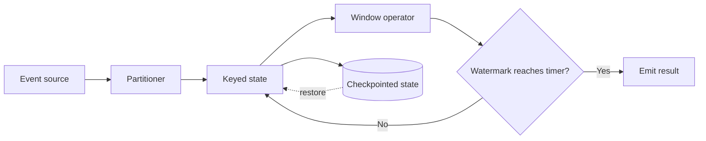

## What it is

Stateful stream and batch processing frameworks execute transformations over unbounded event streams or bounded datasets and retain the intermediate state that makes the result correct. **Event time** is the time assigned by the event itself; **processing time** is the time a worker receives or handles it. **Watermarking** is a framework estimate that no more events below a chosen event-time threshold are expected, allowing a result to close without waiting forever for a late event. A **window** groups events by a time or key boundary so the job can aggregate, join, or summarize a defined interval.

Apache Spark Structured Streaming uses micro-batches and integrates with batch SQL. Apache Flink executes long-running dataflow jobs and keeps state as part of the job. Apache Beam defines a common programming model that can execute on multiple runners. The models differ in execution, state, recovery, and operational control, but they share one mental model: place each record into a keyed state space, update that state, and publish results at a defined point.

## How it works

A record first needs a stable identity and a time model. The source assigns or preserves an event ID, an event time, and an ingestion time. A partitioner selects a key such as customer ID, device ID, or order ID. The keyed operator reads that key's state, updates it, and writes an output record. State is durable enough for recovery, and a checkpoint records the source position together with operator state so a restart does not silently start from the beginning.

Event time prevents a delayed record from being assigned to the wrong business interval. A watermark for event time `T` means that the framework can advance its timer beyond `T` even though a straggler may still arrive. A job can emit an early result, hold a small allowed-lateness interval, route an older record to an update or correction stream, or reject it. Processing time is simpler, but its result can change when network delay, worker load, or replay changes.

The processing path separates durable progress from the event-by-event data path. A watermark generator derives progress from observed event times and the configured lateness bound; it does not guarantee that every straggler has arrived.



The framework's processing contract can be represented as configuration and as a state machine:

```yaml
job:
  source:
    records: [event_id, event_time, ingest_time, key, payload]
    delivery: at_least_once
  time:
    primary: event_time
    watermark: max_observed_event_time_minus_bound
    late_event: update_or_side_output
  partitioning:
    key: customer_id
    ordering: within_key
  state:
    backend: [keyed_value, embedded_rocksdb]
    checkpoint: operator_state_and_source_offsets
  execution:
    spark: micro_batches
    flink: continuous_dataflow
    beam: runner_independent_pipeline
```

```text
on_record(record):
  partition = choose_key(record.key)
  update_watermark(record.event_time)
  window = assign_window(record.event_time)
  state[partition, window] = apply(state[partition, window], record)
  timer = window.end + allowed_lateness
  if watermark >= timer:
    emit_final_result(state[partition, window])
    retire_window(state[partition, window])

on_checkpoint():
  persist_source_offsets()
  persist_keyed_state()
  persist_timer_state()
```

A **tumbling window** starts at fixed boundaries, such as 00:00–00:05 and 00:05–00:10. A **sliding window** evaluates overlapping fixed-size windows, which supports smoother trends but repeats work. A **session window** groups events for one key until an inactivity gap closes it, which fits visits or conversations. A global window has no key and can become a coordination bottleneck.

Spark Structured Streaming represents a query as a table-like plan. It reads a bounded micro-batch, updates state, and checkpoints progress. Flink commonly uses keyed state, timers, and checkpoint barriers to align state across parallel workers. Beam runners can execute a Beam pipeline as batch or streaming, but the runner still determines checkpointing, state backend, latency, and delivery behavior. A stateful job should be designed around bounded keys, explicit retention, replay, and upgrade compatibility; otherwise one hot key or an unbounded state map can consume the cluster.

## Tradeoffs

| Design choice | Gain | Cost |
| --- | --- | --- |
| Micro-batches | Reuses mature batch operators and gives predictable checkpoint boundaries | Adds small scheduling latency and waits for a batch interval |
| Continuous dataflow | Low per-record latency and timers can react to each event | State, backpressure, and recovery are always active concerns |
| Event time | Business windows remain meaningful when arrival is delayed | Watermark policy, allowed lateness, and correction handling add complexity |
| Processing time | Simple and easy to reason about for a live dashboard | Results can shift when events are delayed or replayed |
| Tumbling windows | Each event contributes to one compact aggregate | Fixed boundaries can split a business activity across results |
| Sliding windows | Smooths trends and captures overlap | Multiple windows recompute overlapping data |
| Session windows | Naturally represents activity separated by inactivity | State stays active until a session closes and hot sessions can skew work |
| Checkpointed state | Recovery avoids starting all work from zero | Checkpoint storage, state backend tuning, and restore time are operational costs |

## When to use

- You need to aggregate, join, or detect patterns in events as they arrive rather than waiting for a daily load.
- You need a bounded historical recomputation as well as an incremental result.
- Records can arrive late and you need a defined watermark and correction policy.
- A restart must resume from a source position and a consistent keyed state.
- You can partition the workload by a key and estimate state and retention requirements.

## Alternatives

- **Batch warehouse queries** — simpler for complete, predictable files, but results are delayed until a load completes.
- **Database triggers plus materialized views** — familiar transactional state, but high-volume event processing and replay can overload the database.
- **MapReduce jobs** — straightforward parallel scans and shuffles, with less natural support for continuous, stateful updates.
- **A stream processor plus a separate batch recomputation path** — gives low-latency operations and a clean full rebuild, but requires two implementations and reconciliation rules.

## Related

- [Data Architecture & Lakehouse Engines](02-lakehouse-architectures.md)
- [Data Serialization & In-Memory Formats](03-serialization-in-memory-formats.md)
