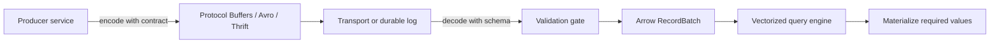

## What it is

Data serialization converts structured values into bytes for storage or transfer, then reconstructs those values in another process or later in time. **Protocol Buffers**, **Apache Avro**, and **Apache Thrift** are schema-based wire formats with different evolution and code-generation models. **Apache Arrow** is a columnar in-memory format designed to share buffers between execution engines, and **Feather V2** is a compact file format based on Arrow IPC. Feather V1 is an older format with a different on-disk representation, so tools that support Arrow do not necessarily read every Feather version. The wire format decides how data crosses a boundary; the in-memory format decides how a process scans and computes over data after it arrives.

A useful mental model has two paths. A service serializes a request into a compact byte representation, sends it, and the receiver decodes it into a language object; compatible columnar data can instead be exposed as an Arrow batch. In the best case, a columnar file or IPC buffer is memory-mapped and its buffers are read without copying the entire payload into a new object graph. Zero-copy does not mean zero work: the reader must still interpret offsets, validate the buffer, and materialize values for operations that need them.

## How it works

Protocol Buffers encode fields with a field number and wire type. Generated code exposes typed accessors, and readers can skip fields they do not know. Protobuf is a strong fit for service RPC and compact payloads, but a schema and generated-code discipline are part of the contract. Thrift also uses an IDL and generated interfaces, with a different type system and wire protocol. Avro uses a schema and a compact binary encoding; object-container files embed a writer schema, and readers can resolve it against a reader schema. Avro's schema registry and object-container files are common in event and lakehouse pipelines.

A compact service contract looks like this:

```proto
syntax = "proto3";

package orders;

message OrderCreated {
  string order_id = 1;
  string customer_id = 2;
  int64 event_time_unix_ms = 3;
  string currency = 4;
  int64 amount_minor_units = 5;
}

service OrderService {
  rpc GetOrder(GetOrderRequest) returns (OrderCreated);
}

message GetOrderRequest {
  string order_id = 1;
}
```

The evolution rule is not “any change is safe.” Removing a field requires reserving its number when the old meaning must not be reused, changing a field's meaning can surprise old readers, and widening or narrowing a type can change compatibility. A schema registry can enforce compatibility for Avro or Protobuf, but a registry is only useful if producers, consumers, retention, and failure behavior are operated as one system.

Arrow stores columns with buffers for values, validity bits, offsets, and dictionary data. An Arrow RecordBatch or Table exposes column chunks that multiple libraries can use without converting every value to a language-native object. Memory mapping makes a file's bytes addressable through the operating system's virtual memory, so a scan can read the needed pages. Alignment, lifetime, endianness, and the validity buffer still matter. Dictionary encoding can reduce repeated string cost, while a predicate or aggregate may need decoding of selected values.

The component boundary matters: the wire format moves a contract between services, while Arrow moves column buffers between execution components. A shared Arrow batch can avoid a full copy, but it does not make incompatible schemas or buffer lifetimes disappear.



The choice of representation can be expressed as a pipeline contract:

```yaml
wire_formats:
  protobuf:
    schema: proto_idl
    evolution: field_numbers_and_compatibility_policy
    use: service_rpc_and_event_payloads
  avro:
    schema: avro_schema_and_reader_writer_pair
    evolution: schema_resolution
    use: event_logs_and_analytical_data
  thrift:
    schema: thrift_idl
    evolution: generated_interfaces_and_compatibility_policy
    use: service_rpc
columnar_formats:
  arrow:
    layout: buffers_by_column
    sharing: record_batch_or_ipc_stream
    scan: vectorized_execution
  feather:
    version: v2
    layout: arrow_ipc_file
    use: local_interchange_and_analytics
pipeline:
  receive: bytes_with_schema_id
  decode: validate_and_select_reader
  execute: arrow_batch
  materialize: only_values_required_by_the_operation
```

A practical validation gate rejects a payload that fails its schema or compatibility policy, contains an invalid UTF-8 string, is missing a required key, or has a timestamp outside the accepted range. The gate should return a diagnostic and, for replayable streams, preserve the original bytes and schema ID in a dead-letter path. A numeric value that fits a database column is not automatically safe to decode: units, time zones, nullability, and precision are part of the data contract.

## Tradeoffs

| Format or choice | Gain | Cost |
| --- | --- | --- |
| Protocol Buffers | Compact wire data, generated APIs, and field skipping | Protobuf is not a columnar query format; schema and generated-code compatibility must be managed |
| Apache Avro | Schema is data, reader-writer resolution, and strong event/log integration | Resolution metadata and object-file scans add storage and implementation work |
| Apache Thrift | Mature IDL and generated RPC interfaces | Less useful than Avro for analytical file evolution; toolchains and compatibility still matter |
| JSON | Human-readable and broadly understood | Repetition, parsing cost, weak numeric and schema contracts, and larger payloads |
| Arrow | Columnar layout, vectorized execution, and shared buffers between engines | Requires compatible layouts, buffer lifetime discipline, and handling of null or dictionary state |
| Feather V2 | Compact local interchange using an Arrow IPC file | Not compatible with older Feather V1 files without explicit conversion; less suitable for durable distributed transaction logs and broad RPC contracts |
| Object conversion | Simple language ergonomics | Copies values and loses some cross-language efficiency |

## When to use

- You need a versioned contract for service messages or event records and can enforce compatibility.
- You need analytical scans that read a few columns over many rows.
- Several engines should exchange batches without repeatedly copying the same buffers.
- You need schema validation, dead-letter handling, and a replayable source identity.
- You can document the boundary between wire bytes, language objects, and columnar batches.

## Alternatives

- **JSON** — wins for debugging and loose public interfaces, but costs parsing, bytes, and stronger validation.
- **MessagePack or CBOR** — compact self-describing formats are useful in some APIs, but their evolution and analytics behavior still need explicit policy.
- **A database row format** — integrates with a relational engine, but it is not a general cross-language columnar interchange format.
- **Copying Arrow batches into native objects** — simplifies application code, but gives up the main performance benefit of shared columnar buffers.

## Related

- [Data Architecture & Lakehouse Engines](02-lakehouse-architectures.md)
- [Stateful Stream & Batch Processing Frameworks](01-stateful-stream-batch-processing.md)
