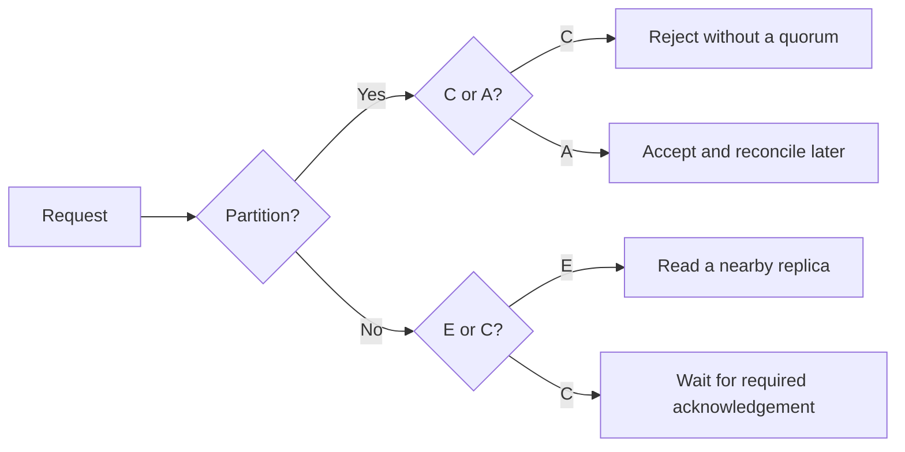

## What it is

The CAP theorem describes the consistency-availability trade-off of a replicated data store during a network **partition**, when nodes cannot reliably communicate. **Consistency** means reads appear to observe the latest completed write in one agreed history, while **availability** means every request received by a non-failing node eventually receives a non-error response. Because a partitioned distributed system must choose between those guarantees, CAP classifies a design as **CP** or **AP** in the partition branch. **PACELC** adds the normal-operation branch: if a **P**artition occurs, choose **A**vailability or **C**onsistency; **E**lse, choose **L**atency or **C**onsistency.

## How it works

During a partition, a CP design preserves one agreed history by rejecting operations that cannot reach a quorum, so requests may fail while a minority is isolated. An AP design continues serving reachable replicas, accepts divergent work, and reconciles conflicts later. The decision is operational rather than a permanent label: a system can expose strong consistency for some operations and eventual consistency for others.

The normal-operation branch matters because coordination is expensive even when no partition exists. A low-latency design can read a nearby replica and return immediately, while a consistency-first design waits for enough acknowledgement to establish the requested consistency. Quorums provide one common mechanism: with `N` replicas, overlapping read and write quorums satisfy `R + W > N`, but that equation alone does not establish linearizability without versioning, conflict rules, or a stronger coordination protocol.



```yaml
partition_behavior:
  choice: CP
  cp: rejects operations that cannot reach a quorum
  ap: serves reachable replicas and reconciles divergent operations later
normal_operation_behavior:
  choice: EC
  ec: waits for the required acknowledgement before returning
  el: returns from a reachable replica and may expose stale data
quorum_overlap:
  condition: R + W > N
  limitation: overlap alone does not prove linearizability
examples:
  coordination:
    system: ZooKeeper
    posture: CP under a partition that prevents quorum
  replicated_data:
    system: Cassandra
    posture: partition-tolerant with per-query consistency levels
  managed_replicated_data:
    system: DynamoDB
    posture: partition-tolerant with per-operation consistency choices
```

## Tradeoffs

| Property | Gain | Cost |
| --- | --- | --- |
| Consistency (C) | Clients observe one ordered history under the chosen protocol | Coordination latency; unavailable operations on a partition that cannot form a quorum |
| Availability (A) | Reachable replicas continue serving requests during a partition | Stale reads or conflicting writes; reconciliation is required |
| Partition tolerance (P) | The architecture handles communication loss between nodes | Replication, quorum handling, and conflict resolution increase operational complexity |
| Low latency (PACELC "E") | Short read and write response times and better throughput under normal load | Eventual consistency can expose stale data and ordering anomalies |
| Strong consistency (PACELC "C") | Linearizable and externally visible ordering when the store provides it | Extra round trips, higher tail latency, and reduced progress during failures |

## When to use

- You need a quorum-backed coordination service and would rather reject an operation than permit two leaders or conflicting linearization decisions.
- You need replicated reads and writes to remain available during a regional partition and can accept eventual convergence.
- You need per-operation consistency because a single workload contains both correctness-critical transactions and latency-sensitive lookups.
- You need to document the failure behavior of a design so operators can distinguish unavailable operations from stale or conflicting results.

## Alternatives

- **Single-node store with backups** — gives a simple consistency model and fast local reads, but the node is a single point of failure and a partition does not provide distributed availability.
- **Quorum-based tunable replication** — lets each operation trade consistency against latency, but the application must understand version selection, read repair, or conflict handling.
- **CRDT-based replication** — supports concurrent updates that merge without a central coordinator, but each data type needs merge semantics and reads can remain stale until propagation completes.

## Related

- [Consensus Protocols: Paxos, Raft, Multi-Paxos, and Distributed Locks (Chubby, Redlock)](02-consensus.md)
- [Database Replication & Data Synchronization: Leader-Follower, Multi-Leader, Leaderless (Dynamo-Style), Change Data Capture (CDC), Active-Active Multi-Region Sync, and Point-In-Time Recovery (PITR)](../02-databases/05-replication.md)
- [ACID Guarantees & Transaction Isolation Levels (Read Committed, Repeatable Read, Serializable)](../02-databases/04-acid-isolation.md)
