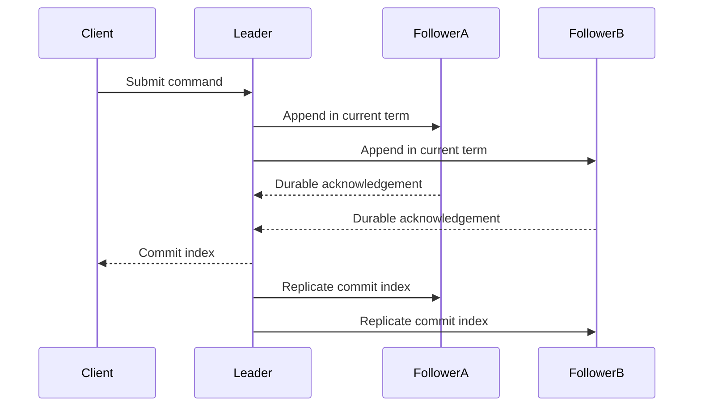

## What it is

Consensus is the problem of making a set of distributed processes agree on one value or one ordered sequence of log entries despite crashes and message delay. **Paxos**, **Raft**, and **ZooKeeper's ZAB** are crash-fault consensus protocols used to build replicated logs, leader election, and strongly consistent coordination services. Distributed locks add mutual exclusion and ownership to that foundation, but a lock is only as safe as its lease, failure detection, and fencing model.

## How it works

The standard crash-fault configuration uses `2f+1` replicas and a majority of `f+1` acknowledgements, allowing the group to tolerate `f` crash failures. Proposers issue commands, acceptors or voters record promises and acknowledgements, and learners apply committed entries in log order. A deterministic state machine turns the same committed log into the same state on every correct replica.

**Paxos** separates the proposer, acceptor, and learner roles. In phase 1, a proposer obtains promises and learns the highest previously accepted proposal and any value already accepted for it. In phase 2, it asks acceptors to accept a value consistent with those promises; a value chosen by a quorum is safe. **Multi-Paxos** amortizes phase 1 for a stable leader, then runs an accept phase for each log slot instead of repeating a full single-value decision for every entry. **Raft** makes the leader and log roles explicit: followers grant a vote only to a candidate whose log is at least as up-to-date as the voter's log, and a leader advances `commitIndex` only after an entry from its current term is acknowledged by a majority. **ZAB** is ZooKeeper's atomic-broadcast protocol and adds epochs to order proposals and leadership changes.

Consensus-backed locks usually combine an agreed log with a lease. **Chubby** uses Paxos for coordination and a sequencer-based lock service, while clients use fencing information when an operation may outlive a lease. **Redlock** is a different design: a client writes a unique value to a majority of independent Redis masters, checks that acquisition completed before the lease expires, and releases only its own value. Redlock is an algorithm over independent stores, not a consensus protocol; its reasoning depends on bounded clock drift and process pauses, and a client still needs fencing when work can continue after lease expiry.



```yaml
crash_failure_model:
  replicas: 2f + 1
  quorum: f + 1
  progress: a majority remains reachable
paxos:
  roles: [proposer, acceptor, learner]
  phase_1: [select proposal number, obtain majority promise, learn prior value]
  phase_2: [propose value, obtain majority accept]
  multi_paxos: reuse phase 1 for a stable leader and accept each log slot
raft:
  terms: monotonically increasing election terms
  election: [timeout, request votes, require majority, become leader]
  log_rule: [match term and index, preserve committed entries, commit current-term entry by majority]
  membership: joint consensus for a safe configuration change
zab:
  role: ZooKeeper atomic broadcast
  ordering: leader proposals with epochs and quorum acknowledgement
distributed_locks:
  chubby:
    coordination: [Paxos group, sequencer lock, lease]
    client_rule: use a fencing token when work can outlive a lease
  redlock:
    acquire: [write a unique value to a majority of N independent Redis masters, verify time remains]
    release: delete only the value owned by the client
    limits: [depends on clock and pause assumptions, not a consensus protocol]
```

## Tradeoffs

| Property | Gain | Cost |
| --- | --- | --- |
| Raft | Strong-leader log and explicit election rules make the design easier to reason about than basic Paxos | The leader can bottleneck writes; elections temporarily reduce progress |
| Paxos | Flexible role separation and a well-understood safety argument | Implementations must handle promises, recovery, and multiple proposers carefully |
| Multi-Paxos | Reuses the stable leader's phase-1 work and supports efficient replicated logs | A leader change and slot bookkeeping complicate the implementation |
| ZAB | Provides ordered atomic broadcast for ZooKeeper clients | Closely follows ZooKeeper's primary-backup protocol and leader model |
| Consensus-backed lock | Agrees on ownership and can provide a durable, ordered coordination record | Leases, fencing, and recovery add latency and failure cases |
| Redlock | Avoids a single coordinator and uses independent Redis masters | Its safety argument relies on timing assumptions and does not replace fencing |

## When to use

- You need one ordered log or one linearizable decision across replicas after crash failures.
- You need leader election, a configuration store, or a lock service where split-brain ownership is unacceptable.
- You need a high-throughput replicated log and can keep one stable leader for long periods.
- You need a distributed lock with a bounded lease and can require clients to fence writes with monotonically increasing tokens.

## Alternatives

- **Leaderless quorum storage (Dynamo-style)** — reduces leader coordination and can accept writes at any replica, but it does not provide one globally ordered log or a consensus-backed lock.
- **Database row locks or advisory locks** — are simpler for transactions confined to one database, but they do not coordinate independent services or survive a database failover as a distributed lease.
- **Byzantine fault-tolerant protocols (PBFT, Tendermint)** — tolerate malicious participants as well as crashes, but require more messages and have different performance and governance costs.

## Related

- [The CAP Theorem, PACELC, and Architectural Trade-offs](01-cap-pacelc.md)
- [Clocks & Ordering: Physical Clocks, NTP, Logical Clocks (Lamport), and Vector Clocks](03-clocks-ordering.md)
- [Distributed Transactions: Two-Phase Commit (2PC), Three-Phase Commit (3PC), and the Saga Pattern](04-distributed-transactions.md)
- [Decentralized Systems, Web3 & Blockchain: Merkle-Patricia Tries, PoW/PoS Consensus, EVM Runtimes, P2P Mesh Networks (Libp2p, Kademlia DHT), and DeFi Protocols (AMMs, Oracles)](05-decentralized-systems-blockchain.md)
