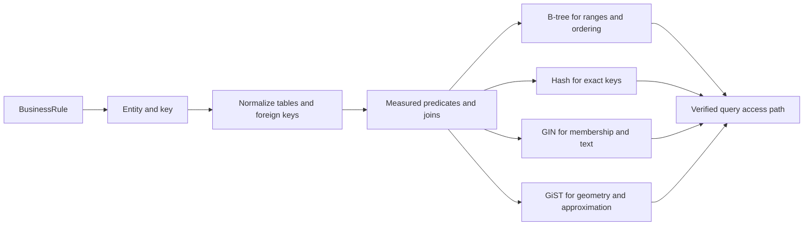

## What it is

Relational modeling is the practice of representing business entities as tables with explicit keys, relationships, and constraints, then choosing indexes that match measured query patterns. Normalization reduces duplicated facts, while a carefully designed index restores efficient access without sacrificing write behavior.

## How it works

Start with the entities and invariants in the domain. Give each entity a primary key, move repeating attributes into child tables, and remove partial and transitive dependencies through normalization. Represent relationships with foreign keys, then identify the predicates, joins, and ordering patterns used by the application. Choose a B-tree index for equality, sorting, and range predicates; use a hash index when only exact-key lookup matters. PostgreSQL GIN indexes accelerate searches over arrays, full-text vectors, and other values that can contain many matches, while GiST indexes support approximate and geometric predicates such as overlap and nearest-neighbor search.



A physical schema can denormalize a stable read model after the source model is understood. The duplicate data must then have an explicit owner and refresh or transaction rule. The SQL block is a standalone PostgreSQL schema. The YAML block is a non-executable design inventory for additional index examples; its names are not a schema that combines with the SQL or implements every table it mentions.

```sql
CREATE TABLE customers (
  customer_id BIGINT PRIMARY KEY,
  name TEXT NOT NULL
);

CREATE TABLE orders (
  order_id BIGINT PRIMARY KEY,
  customer_id BIGINT NOT NULL REFERENCES customers(customer_id),
  created_at TIMESTAMPTZ NOT NULL,
  total NUMERIC(12, 2) NOT NULL
);

CREATE INDEX orders_customer_created_idx
  ON orders (customer_id, created_at DESC);
```

```yaml
artifact_kind: non_executable_design_examples
applies_to_the_preceding_sql_schema: false
logical_model_examples:
  orders:
    primary_key: order_id
    foreign_keys:
      - customer_id -> customers.customer_id
  order_items:
    primary_key: [order_id, line_no]
    foreign_keys:
      - order_id -> orders.order_id
      - product_id -> products.product_id
normalization:
  target: 3NF
  exceptions: deliberate_read_models
index_examples:
  orders_customer_created_idx: b_tree
  customer_email_hash: hash
  article_search: gin
  location_search: gist
```

## Tradeoffs

| Property | Gain | Cost |
| --- | --- | --- |
| Normalized schema | One authoritative fact and straightforward integrity checks | More joins and foreign-key work for wide reads |
| Denormalized read model | Fewer joins and predictable hot-read latency | Duplicate storage and a required update or rebuild path |
| B-tree index | Ordered equality, range scans, sorting, and composite predicates | Additional writes, page splits, cache pressure, and storage |
| Hash index | Expected or average O(1) exact-key lookup with good hashing | Worst-case O(n) with hash collisions or pathological workloads; no ordering or range scans |
| GIN index | Efficient membership, full-text, and array search | Expensive updates, larger indexes, and pending-list behavior in PostgreSQL |
| GiST index | Flexible predicate and nearest-neighbor support | Lossy or slower than a specialized exact index for some workloads |

## When to use

- You need joins, transactions, foreign keys, and constraints that protect cross-row invariants.
- The entity relationships are stable enough to define and migrate a shared schema.
- You need both ordered range queries and exact lookups over structured data.
- You can measure query plans and remove indexes that do not support important access paths.

## Alternatives

- **Document databases** — flexible nested records fit changing aggregates, but application code must maintain relationships and validation.
- **Wide-column stores** — high write throughput and predictable partition keys, with weaker general-purpose join ergonomics.
- **Columnar analytical stores** — fast scans and aggregates over large datasets, but unnecessary overhead for small point updates.
- **Graph databases** — direct traversal of relationships, with a narrower query model and different operational tradeoffs.

## Related

- [NoSQL Classifications: Key-Value, Document, Columnar (Cassandra), and Graph Databases (Neo4j)](02-nosql.md)
- [Storage Engines: OLTP (Row-Oriented) vs OLAP (Columnar/Parquet/ClickHouse/Apache Arrow In-Memory Engine)](03-storage-engines.md)
- [ACID Guarantees & Transaction Isolation Levels (Read Committed, Repeatable Read, Serializable)](04-acid-isolation.md)
