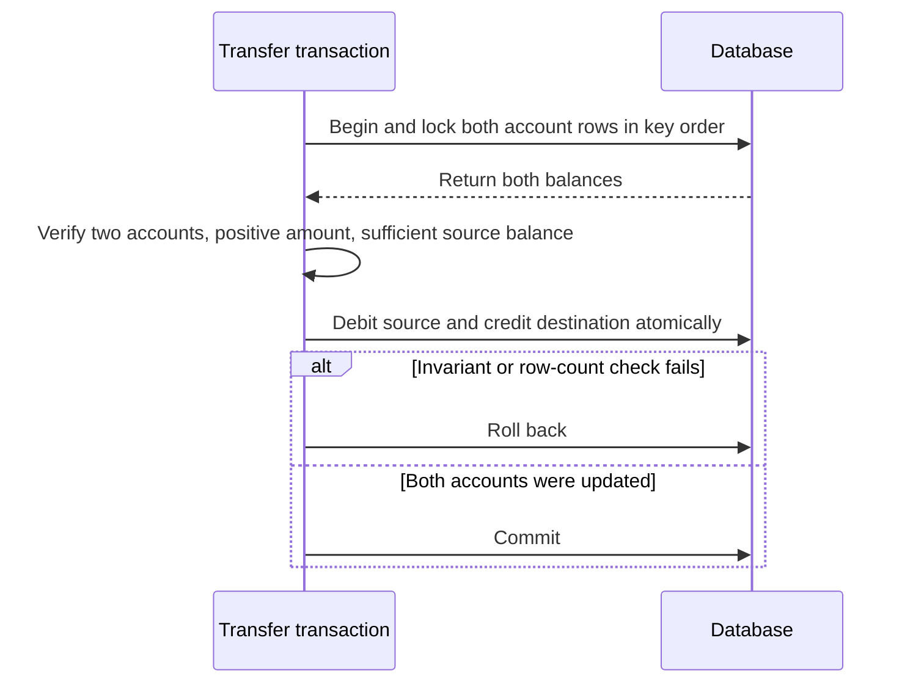

## What it is

ACID is the contract for a database transaction: atomicity commits all changes or none, consistency preserves declared constraints, isolation controls what concurrent transactions can observe, and durability preserves committed changes after a failure. Transaction isolation levels offer progressively stronger anomaly guarantees in exchange for coordination, retries, or lower concurrency.

## How it works

The database begins a transaction, reads and modifies rows, and records enough information to validate or undo the work at commit. Constraints and commit protocols enforce atomicity and durability; the isolation mechanism controls visibility. Under read committed, each statement sees a statement-level snapshot, so a second read can observe a committed change from another transaction. Under repeatable read, repeated reads in one transaction see the same row versions, though the exact treatment of new predicate matches is implementation-dependent. Serializable requires transactions to behave as if they ran in one serial order, often through strict two-phase locking or serializable snapshot validation.

PostgreSQL's MVCC keeps row versions so readers do not block ordinary writers and writers do not block readers. Serializable transactions still track dangerous dependencies and abort when validation cannot prove a serial order. The database can recover committed transactions from the WAL, while a replica or a later restore may be behind unless replication and recovery are configured explicitly.

A transfer must lock both account rows in a deterministic order, verify that both accounts exist, and verify that the amount is positive and no greater than the source balance. A non-negative `balance` constraint enforces the account invariant at the database boundary, and the transaction must roll back unless both updates affect exactly one row. Locking the destination as well as the source prevents another transaction from changing it between validation and commit.



The following SQL assumes the `accounts` table exists and adds the non-negative balance constraint before the transfer. The application checks the locked result set and affected-row count before committing.

```sql
ALTER TABLE accounts
  ADD CONSTRAINT accounts_balance_nonnegative CHECK (balance >= 0);

BEGIN;

SELECT account_id, balance
FROM accounts
WHERE account_id IN (1001, 1002)
ORDER BY account_id
FOR UPDATE;

UPDATE accounts
SET balance = balance + CASE account_id
  WHEN 1001 THEN -100
  WHEN 1002 THEN 100
END
WHERE account_id IN (1001, 1002)
  AND EXISTS (
    SELECT 1
    FROM accounts AS source
    WHERE source.account_id = 1001
      AND source.balance >= 100
  );

COMMIT;
```

```yaml
transaction_contract:
  atomicity: undo_or_redo_to_commit_boundary
  consistency: constraints_and_application_invariants
  durability: wal_flush_before_commit_ack
isolation:
  read_committed: statement_snapshot
  repeatable_read: transaction_snapshot_or_explicit_locks
  serializable: serial_order_or_abort_on_dependency
mvcc:
  readers: see_committed_versions
  writers: preserve_version_history
  cleanup: remove_versions_no_longer_visible
```

## Tradeoffs

| Property | Gain | Cost |
| --- | --- | --- |
| Read committed | High concurrency and short read lifetimes | Non-repeatable reads and predicate anomalies remain possible |
| Repeatable read | Stable row versions for ordinary reads | More retained versions and implementation-specific phantoms |
| Serializable | The strongest user-visible transaction ordering | More locks, validation work, deadlocks, or serialization failures |
| MVCC | Non-blocking reads and writes in many workloads | Version-chain storage and garbage-collection overhead |
| WAL durability | Commits survive process and machine failure | A storage flush can increase commit latency |
| Application retries | Handles serialization failures without hiding them | Retries must be idempotent and bounded |

## When to use

- You need serializable transactions for balances, inventory, or other cross-row invariants.
- Snapshot isolation fits analytical or mixed workloads where stable reads and high concurrency matter.
- Read committed fits common OLTP traffic whose business rules tolerate non-repeatable observations.
- The application can retry serialization failures and test the exact behavior of the selected database.

## Alternatives

- **Eventual consistency with quorum reads** — higher availability and write throughput, with explicit stale-read and conflict behavior.
- **Application sagas** — span independent services with compensating actions, without one database transaction enforcing the whole workflow.
- **Single-threaded or globally ordered transactions** — simplify reasoning at one node, with throughput bounded by the ordering coordinator.
- **Application-level locks** — protect a custom invariant, but lose database visibility into the conflict and can fail during a client crash.

## Related

- [Relational Data Modeling, Normalization, and Indexing Strategies (B-Tree, Hash, GIN, GiST)](01-relational-modeling.md)
- [Storage Engines: OLTP (Row-Oriented) vs OLAP (Columnar/Parquet/ClickHouse/Apache Arrow In-Memory Engine)](03-storage-engines.md)
- [The CAP Theorem, PACELC, and Architectural Trade-offs](../01-consensus/01-cap-pacelc.md)
- [Clocks & Ordering: Physical Clocks, NTP, Logical Clocks (Lamport), and Vector Clocks](../01-consensus/03-clocks-ordering.md)
