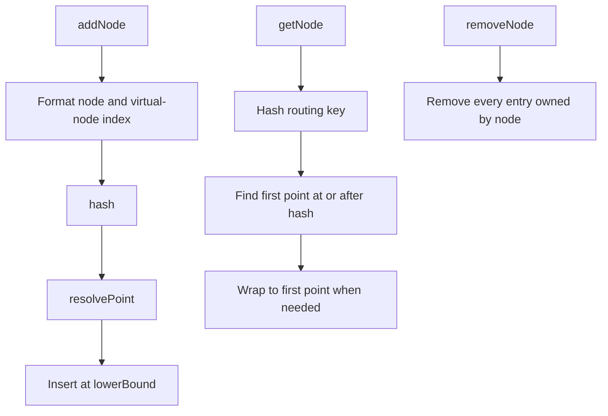

## What it is

Partitioning divides data into independently stored units, while sharding assigns those units across nodes so no single node owns the complete dataset or serves the complete workload. The partitioning strategy determines locality, balance, movement cost, and whether a request can be routed without a global search.

## How it works

Range sharding assigns contiguous key ranges to shards. A router can find a range with a directory or metadata service, and range scans remain efficient inside a shard, but a popular range can become hot. Hash sharding hashes the routing key and distributes keys across shards. It improves balance while removing useful ordering from the placement.

List sharding stores an explicit mapping from a logical key to a shard, which fits data whose membership changes independently of its value. Directory-based sharding keeps that mapping in a dedicated service, allowing rebalancing without rewriting every client, at the cost of another lookup and a directory availability or consistency concern.

For a hash ring, place each physical node at one or more positions in a fixed-size hash space. Hash a key and walk clockwise to the first node position, wrapping to the first position when the key falls past the end. If two virtual positions collide, each implementation advances deterministically to the next free position, wrapping at the end of the hash space. Adding or removing a node changes ownership only for the ring segments around that node. Virtual nodes spread one physical node's positions around the ring to reduce the variance caused by uneven partitions.

The following artifact describes the routing choices and the consistent-hash implementation used by each language example.

```yaml
partitioning:
  range:
    placement: contiguous_key_ranges
    strength: ordered_scans
    risk: hot_ranges
  hash:
    placement: hash(routing_key)
    strength: even_distribution
    cost: lost_locality
  list:
    placement: explicit_key_membership
    strength: independent_membership_changes
  directory:
    placement: directory_lookup
    strength: centralized_rebalancing
    cost: extra_lookup
consistent_hash:
  hash_space: unsigned_32_bit
  lookup: first_node_clockwise_at_or_after_key_hash
  virtual_nodes: spread_physical_nodes
  collision: deterministic_forward_probe_to_next_free_position
  rebalancing: affected_ring_segments_only
```



```java
import java.nio.charset.StandardCharsets;
import java.util.SortedMap;
import java.util.TreeMap;

public final class ConsistentHash {
    private final SortedMap<Long, String> ring = new TreeMap<>();
    private final int virtualNodes;

    public ConsistentHash(int virtualNodes) {
        this.virtualNodes = virtualNodes;
    }

    private static long hash(String key) {
        byte[] bytes = key.getBytes(StandardCharsets.UTF_8);
        long value = 2166136261L;
        for (byte current : bytes) {
            value ^= current & 0xff;
            value = (value * 16777619L) & 0xffffffffL;
        }
        return value;
    }

    private long resolvePoint(long point) {
        while (ring.containsKey(point)) {
            point = (point + 1) & 0xffffffffL;
        }
        return point;
    }

    public void addNode(String node) {
        for (int index = 0; index < virtualNodes; index++) {
            long point = resolvePoint(hash(node + "#" + index));
            ring.put(point, node);
        }
    }

    public void removeNode(String node) {
        ring.entrySet().removeIf(entry -> entry.getValue().equals(node));
    }

    public String getNode(String key) {
        if (ring.isEmpty()) {
            return null;
        }
        SortedMap<Long, String> tail = ring.tailMap(hash(key));
        Long point = tail.isEmpty() ? ring.firstKey() : tail.firstKey();
        return ring.get(point);
    }
}
```
```c
#include <stdint.h>
#include <stdio.h>
#include <stdlib.h>
#include <string.h>

typedef struct {
    uint32_t point;
    char *node;
} Slot;

typedef struct {
    Slot *ring;
    size_t length;
    size_t capacity;
    int virtual_nodes;
} ConsistentHash;

static uint32_t fnv1a(const char *key) {
    uint32_t hash = 2166136261u;
    while (*key) {
        hash ^= (unsigned char)*key++;
        hash *= 16777619u;
    }
    return hash;
}

static size_t lower_bound(const ConsistentHash *ring, uint32_t point) {
    size_t low = 0;
    size_t high = ring->length;
    while (low < high) {
        size_t middle = low + (high - low) / 2;
        if (ring->ring[middle].point < point) {
            low = middle + 1;
        } else {
            high = middle;
        }
    }
    return low;
}

static uint32_t resolve_point(const ConsistentHash *ring, uint32_t point) {
    size_t index = lower_bound(ring, point);
    while (index < ring->length && ring->ring[index].point == point) {
        point = point == UINT32_MAX ? 0 : point + 1;
        index = point == 0 ? lower_bound(ring, 0) : index + 1;
    }
    return point;
}

static int add_point(ConsistentHash *ring, uint32_t point, const char *node) {
    size_t node_length = strlen(node);
    char *copy = malloc(node_length + 1);
    if (copy == NULL) {
        return 0;
    }
    memcpy(copy, node, node_length + 1);

    if (ring->length == ring->capacity) {
        size_t capacity;
        if (ring->capacity == 0) {
            capacity = 16;
        } else {
            if (ring->capacity > SIZE_MAX / 2) {
                free(copy);
                return 0;
            }
            capacity = ring->capacity * 2;
        }
        if (capacity > SIZE_MAX / sizeof(Slot)) {
            free(copy);
            return 0;
        }
        Slot *resized = realloc(ring->ring, capacity * sizeof(Slot));
        if (resized == NULL) {
            free(copy);
            return 0;
        }
        ring->ring = resized;
        ring->capacity = capacity;
    }

    point = resolve_point(ring, point);
    size_t index = lower_bound(ring, point);
    for (size_t move = ring->length; move > index; move--) {
        ring->ring[move] = ring->ring[move - 1];
    }
    ring->ring[index].point = point;
    ring->ring[index].node = copy;
    ring->length++;
    return 1;
}

void ch_init(ConsistentHash *ring, int virtual_nodes) {
    ring->ring = NULL;
    ring->length = 0;
    ring->capacity = 0;
    ring->virtual_nodes = virtual_nodes;
}

int ch_add_node(ConsistentHash *ring, const char *node) {
    for (int index = 0; index < ring->virtual_nodes; index++) {
        size_t index_digits = 1;
        int value = index;
        while (value >= 10) {
            value /= 10;
            index_digits++;
        }
        size_t node_length = strlen(node);
        if (node_length > SIZE_MAX - index_digits - 2) {
            return 0;
        }
        size_t key_length = node_length + index_digits + 2;
        char *key = malloc(key_length);
        if (key == NULL) {
            return 0;
        }
        memcpy(key, node, node_length);
        key[node_length] = '#';
        key[node_length + 1] = '\0';
        int written = snprintf(key + node_length + 1, index_digits + 1, "%d", index);
        if (written < 0 || (size_t)written != index_digits) {
            free(key);
            return 0;
        }
        int added = add_point(ring, fnv1a(key), node);
        free(key);
        if (!added) {
            return 0;
        }
    }
    return 1;
}

void ch_remove_node(ConsistentHash *ring, const char *node) {
    size_t output = 0;
    for (size_t input = 0; input < ring->length; input++) {
        if (strcmp(ring->ring[input].node, node) == 0) {
            free(ring->ring[input].node);
        } else {
            ring->ring[output] = ring->ring[input];
            output++;
        }
    }
    for (size_t index = output; index < ring->length; index++) {
        ring->ring[index].node = NULL;
    }
    ring->length = output;
}

void ch_free(ConsistentHash *ring) {
    for (size_t index = 0; index < ring->length; index++) {
        free(ring->ring[index].node);
    }
    free(ring->ring);
    ring->ring = NULL;
    ring->length = 0;
    ring->capacity = 0;
}

const char *ch_get_node(ConsistentHash *ring, const char *key) {
    if (ring->length == 0) {
        return NULL;
    }
    size_t index = lower_bound(ring, fnv1a(key));
    return ring->ring[index == ring->length ? 0 : index].node;
}
```
```python
import bisect


class ConsistentHash:
    def __init__(self, virtual_nodes: int = 150):
        self.virtual_nodes = virtual_nodes
        self.ring: list[tuple[int, str]] = []

    def _hash(self, key: str) -> int:
        value = 2166136261
        for byte in key.encode("utf-8"):
            value ^= byte
            value = (value * 16777619) & 0xffffffff
        return value

    def _resolve_point(self, point: int) -> int:
        index = bisect.bisect_left(self.ring, (point, ""))
        while index < len(self.ring) and self.ring[index][0] == point:
            point = (point + 1) & 0xffffffff
            index = bisect.bisect_left(self.ring, (point, "")) if point == 0 else index + 1
        return point

    def add_node(self, node: str) -> None:
        for index in range(self.virtual_nodes):
            point = self._resolve_point(self._hash(f"{node}#{index}"))
            bisect.insort(self.ring, (point, node))

    def remove_node(self, node: str) -> None:
        self.ring = [entry for entry in self.ring if entry[1] != node]

    def get_node(self, key: str) -> str | None:
        if not self.ring:
            return None
        position = bisect.bisect_left(self.ring, (self._hash(key), ""))
        if position == len(self.ring):
            position = 0
        return self.ring[position][1]
```
```rust
use std::collections::BTreeMap;

pub struct ConsistentHash {
    ring: BTreeMap<u32, String>,
    virtual_nodes: usize,
}

fn hash(key: &str) -> u32 {
    key.bytes().fold(2166136261, |value, byte| {
        (value ^ u32::from(byte)).wrapping_mul(16777619)
    })
}

impl ConsistentHash {
    pub fn new(virtual_nodes: usize) -> Self {
        Self {
            ring: BTreeMap::new(),
            virtual_nodes,
        }
    }

    fn resolve_point(&self, mut point: u32) -> u32 {
        while self.ring.contains_key(&point) {
            point = point.wrapping_add(1);
        }
        point
    }

    pub fn add_node(&mut self, node: &str) {
        for index in 0..self.virtual_nodes {
            let point = self.resolve_point(hash(&format!("{node}#{index}")));
            self.ring.insert(point, node.to_string());
        }
    }

    pub fn remove_node(&mut self, node: &str) {
        self.ring.retain(|_, value| value != node);
    }

    pub fn get_node(&self, key: &str) -> Option<&str> {
        let point = hash(key);
        self.ring
            .range(point..)
            .next()
            .or_else(|| self.ring.iter().next())
            .map(|(_, node)| node.as_str())
    }
}
```
```typescript
interface RingEntry {
  point: number;
  node: string;
}

export class ConsistentHash {
  private ring: RingEntry[] = [];

  constructor(private virtualNodes = 150) {}

  private hash(key: string): number {
    let value = 2166136261;
    for (const byte of new TextEncoder().encode(key)) {
      value ^= byte;
      value = Math.imul(value, 16777619);
    }
    return value >>> 0;
  }

  private lowerBound(point: number): number {
    let low = 0;
    let high = this.ring.length;
    while (low < high) {
      const middle = low + Math.floor((high - low) / 2);
      if (this.ring[middle].point < point) {
        low = middle + 1;
      } else {
        high = middle;
      }
    }
    return low;
  }

  private resolvePoint(point: number): number {
    let index = this.lowerBound(point);
    while (index < this.ring.length && this.ring[index].point === point) {
      point = (point + 1) >>> 0;
      index = point === 0 ? this.lowerBound(0) : index + 1;
    }
    return point;
  }

  addNode(node: string): void {
    for (let index = 0; index < this.virtualNodes; index++) {
      const point = this.resolvePoint(this.hash(`${node}#${index}`));
      const insertAt = this.lowerBound(point);
      this.ring.splice(insertAt, 0, { point, node });
    }
  }

  removeNode(node: string): void {
    this.ring = this.ring.filter((entry) => entry.node !== node);
  }

  getNode(key: string): string | null {
    if (this.ring.length === 0) {
      return null;
    }
    const index = this.lowerBound(this.hash(key));
    return this.ring[index === this.ring.length ? 0 : index].node;
  }
}
```
```go
package main

import (
	"sort"
	"strconv"
)

type ConsistentHash struct {
	ring         []ringEntry
	virtualNodes int
}

type ringEntry struct {
	point uint32
	node  string
}

func NewConsistentHash(virtualNodes int) *ConsistentHash {
	return &ConsistentHash{virtualNodes: virtualNodes}
}

func (ring *ConsistentHash) hash(key string) uint32 {
	value := uint32(2166136261)
	for _, byte := range []byte(key) {
		value ^= uint32(byte)
		value *= 16777619
	}
	return value
}

func (ring *ConsistentHash) resolvePoint(point uint32) uint32 {
	index := sort.Search(len(ring.ring), func(index int) bool {
		return ring.ring[index].point >= point
	})
	for index < len(ring.ring) && ring.ring[index].point == point {
		point++
		if point == 0 {
			index = sort.Search(len(ring.ring), func(index int) bool {
				return ring.ring[index].point >= point
			})
		} else {
			index++
		}
	}
	return point
}

func (ring *ConsistentHash) AddNode(node string) {
	for index := 0; index < ring.virtualNodes; index++ {
		point := ring.resolvePoint(ring.hash(node + "#" + strconv.Itoa(index)))
		insertAt := sort.Search(len(ring.ring), func(index int) bool {
			return ring.ring[index].point >= point
		})
		ring.ring = append(ring.ring, ringEntry{})
		copy(ring.ring[insertAt+1:], ring.ring[insertAt:])
		ring.ring[insertAt] = ringEntry{point: point, node: node}
	}
}

func (ring *ConsistentHash) RemoveNode(node string) {
	output := ring.ring[:0]
	for _, entry := range ring.ring {
		if entry.node != node {
			output = append(output, entry)
		}
	}
	ring.ring = output
}

func (ring *ConsistentHash) GetNode(key string) string {
	if len(ring.ring) == 0 {
		return ""
	}
	point := ring.hash(key)
	index := sort.Search(len(ring.ring), func(index int) bool {
		return ring.ring[index].point >= point
	})
	if index == len(ring.ring) {
		index = 0
	}
	return ring.ring[index].node
}
```

## Complexity

Let `v` be the number of virtual nodes per physical node, `m = v * n` the number of ring positions, and `k` the key length.

| Operation | Time | Space |
| --- | --- | --- |
| Hash a key | O(k) | O(1) |
| `addNode` / `removeNode` | `addNode` is O(v log m) expected when collision runs are short; deterministic probing can cost O(v c log m) for a run of `c` occupied positions, with O(v m log m) worst case for tree-backed examples. Sorted-array maintenance is O(v m) across all placements. `removeNode` is O(m) for these examples | O(1) expected auxiliary for map/tree updates; sorted-array/filter removal can temporarily use O(m) |
| `getNode` after the ring is sorted | O(k + log m) | O(1) |
| Total ring storage | O(m) | O(m) |

The constants depend on the hash function, tree implementation, and rehash strategy. Deterministic probing makes collision handling equivalent across the examples, but a long occupied run can increase the work. Virtual nodes reduce placement variance; they do not make a hot key disappear.

## When to use

- The dataset or request rate exceeds the safe capacity of one node.
- Requests have a stable routing key, such as tenant ID, account ID, or user ID.
- You can route a request to a shard without needing a cross-shard join.
- You can plan data movement, backpressure, and hot-key mitigation as operational work.

## Alternatives

- **Range sharding** — preserves ordered range scans, but hot ranges and split planning need attention.
- **Hash sharding** — balances keys while removing useful locality and range order.
- **List sharding** — makes membership explicit, but requires maintaining the membership list.
- **Directory-based sharding** — centralizes placement and rebalancing, with an extra lookup and directory failure mode.
- **Replication without sharding** — simplifies full-data reads and failover, but does not increase the write or storage capacity of one node.

## Related

- [NoSQL Classifications: Key-Value, Document, Columnar (Cassandra), and Graph Databases (Neo4j)](02-nosql.md)
- [Database Replication & Data Synchronization: Leader-Follower, Multi-Leader, Leaderless (Dynamo-Style), Change Data Capture (CDC), Active-Active Multi-Region Sync, and Point-In-Time Recovery (PITR)](05-replication.md)
- [Distributed Query Execution, Global Secondary Indexes, and Point-In-Time Recovery (PITR)](07-distributed-query-pitr.md)
