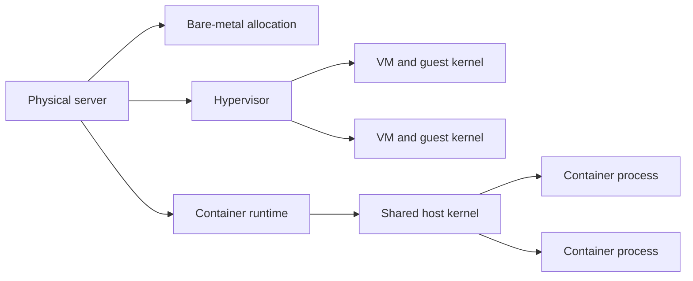

## What it is
Cloud compute is on-demand access to physical, virtualized, or managed processing capacity without owning the underlying hardware. **Bare metal** exposes a whole physical server, a **hypervisor** partitions that server into virtual machines, and a container runtime starts processes that share a host kernel. A cloud control plane automates allocation, images, scaling, and billing around these models.

## How it works
A compute service allocates capacity from a pool of physical hosts. The abstraction determines where the guest boundary and operating-system responsibility sit:



A type 1 hypervisor runs directly on the provider's hardware and manages virtual CPUs, memory, devices, and scheduling for multiple guests. A type 2 hypervisor runs over a host operating system. Managed cloud offerings hide the hypervisor and expose virtual devices, but their control planes still coordinate placement and fail over those guests. Bare-metal allocation omits the guest hypervisor from the workload path; the customer's operating system normally drives the server directly, although the provider still owns the facility, fabric, replacement, and power layers. Bare metal wins when a workload needs dedicated memory, predictable hardware paths, a particular accelerator, or guest-kernel-adjacent control, while a hypervisor wins when isolation and workload packing matter more.

Virtual machines run on a **hypervisor**, while containers run through a container runtime on a shared host. You choose an **instance type** that fixes the ratio of vCPU, memory, network bandwidth, and optional accelerators, then launch from a base image that carries the operating system and application. A control plane, such as the EC2 API and an Auto Scaling group, tracks desired capacity. A scaling policy launches or removes instances when its tracked metric crosses a target. The Terraform example below uses the Auto Scaling group's average CPU utilization as that trigger. Provisioning options include on-demand capacity, commitments such as Savings Plans or reserved capacity, and interruptible spot capacity whose discount varies by market and workload.

```hcl
resource "aws_launch_template" "web" {
  name_prefix   = "web-"
  image_id      = "ami-0123456789abcdef0"
  instance_type = "t3.micro"
}

resource "aws_autoscaling_group" "web" {
  desired_capacity = 3
  min_size         = 1
  max_size         = 10

  launch_template {
    id      = aws_launch_template.web.id
    version = "$Latest"
  }

  tag {
    key                 = "Name"
    value               = "web"
    propagate_at_launch = true
  }
}

resource "aws_autoscaling_policy" "cpu" {
  autoscaling_group_name = aws_autoscaling_group.web.name
  policy_type            = "TargetTrackingScaling"
  target_tracking_configuration {
    predefined_metric_specification {
      predefined_metric_type = "ASGAverageCPUUtilization"
    }
    target_value = 60
  }
}
```

Instance types trade off in a few dimensions: **general purpose** (balanced CPU and memory), **compute optimized** (high compute capacity per vCPU), **memory optimized** (large memory for in-memory databases), **storage optimized** (high local I/O), and **accelerated** (GPU or FPGA workloads). ARM-based instance families can reduce cost for compatible software. Containers can run on self-managed hosts or a managed service such as Fargate; Fargate removes node administration, but the tasks still run on provider-managed compute.

## Tradeoffs
- **Control vs. effort**: raw VMs give full control of the OS, kernel, and networking, but you own patching, hardening, and image maintenance; managed/serverless options trade control for zero host ops.
- **Pricing model**: on-demand is flexible but usually costs more per hour; reserved capacity and Savings Plans can reduce cost in exchange for a commitment; spot is cheaper when available but can be reclaimed with short notice.
- **Scaling latency**: VM-based autoscaling must boot and health-check an instance, while container and serverless platforms can start execution from managed images or runtimes; steady high-throughput workloads often prefer VMs for predictable steady-state capacity.
- **Over/under-provisioning**: fixed instance sizes mean you pay for unused headroom; right-sizing needs continuous tuning of type, size, and autoscaling thresholds.
- **Isolation**: VMs offer the strongest tenant isolation (dedicated kernel); containers share a kernel and are cheaper/denser but weaker isolation boundaries.

## When to use
- Running stateful, long-lived, or OS-sensitive workloads (databases, message brokers, legacy apps) that need a stable VM environment.
- Bursty or seasonal traffic that benefits from autoscaling groups that add and remove instances automatically.
- Workloads with predictable, committed usage where reserved capacity meaningfully cuts cost.

## Alternatives
- **Containers / Kubernetes**: denser, faster to start, and portable across clouds, but with a shared kernel and an orchestration layer to operate.
- **Serverless (Lambda)**: zero capacity management and per-invocation billing, but cold starts, short timeouts, and statelessness limit long-running or stateful jobs.
- **Bare metal**: full physical hardware with no hypervisor in the workload path, but a smaller set of configuration choices, slower provisioning in many providers, and greater responsibility for hardware lifecycle and support.

## Related
- [Storage Primitives](02-storage-primitives.md)
- [Serverless](04-serverless.md)
- [Container Internals: Docker, OCI Runtimes, Linux Namespaces, and cgroups](../02-containers-cicd/01-container-internals.md)
- [Chapter 11: References](06-references.md)
