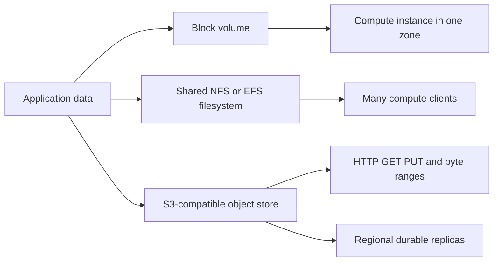

## What it is
Cloud storage primitives are managed data services that persist bytes across three fundamental access models: **block** (raw volumes mounted like a disk), **file** (shared filesystems with a directory hierarchy), and **object** (flat key–value blobs addressed over HTTP). Each model trades latency, sharing, and cost differently, and most platforms also layer **tiers** and **snapshots** on top.

## How it works
A storage client chooses a data path according to how the workload reads, writes, and shares bytes:



- **Block storage (EBS)** attaches a virtual disk to a compute instance in one availability zone. It provides low-latency random I/O at the block-device level and supports volume types from magnetic storage to high-IOPS NVMe SSD. Snapshots can capture changed blocks for backup and volume cloning.
- **File storage (EFS/NFS)** presents a shared filesystem that many instances can mount at once. It scales capacity and throughput with usage, provides strong consistency, and is billed for the storage and throughput consumed by the service. It fits shared directories, home directories, and applications that expect a filesystem.
- **Object storage (S3)** stores objects and their metadata in a flat namespace of buckets and keys, served over HTTP. Objects are replicated and protected with erasure coding, with S3 designed for 99.999999999% durability. A `PUT` creates or replaces a complete object, and multipart uploads assemble ordered parts into that object; it does not provide in-place byte edits. A `GET` can retrieve a complete object or a byte range, so read granularity is finer than write granularity. Access tiers trade retrieval cost for storage price.

```yaml
block:
  type: gp3 | io2 | st1 | sc1
  io: low-latency random read/write
  sharing: a compute instance in one availability zone
  persistence: independent of the instance lifecycle; snapshots provide copies

file:
  protocol: NFSv4
  sharing: many instances across availability zones
  scaling: capacity and throughput grow with usage
  cost: billed for storage and throughput

object:
  namespace: bucket / key
  durability: 99.999999999% design target via replication and erasure coding
  write_model: whole-object PUT; multipart uploads assemble ordered parts
  read_model: whole-object or byte-range GET
  tiers: standard, infrequent access, archive
```

Object storage **lifecycle tiers** move data automatically: *Standard* (frequent access, highest cost), *Infrequent Access* (cheaper storage, per-GB retrieval fee), *Archive/Glacier* (deeply cheap storage, minutes-to-hours retrieval), plus *Intelligent Tiering* that auto-migrates based on access patterns. Most services add **versioning**, **server-side encryption**, and **replication** across regions as first-class features.

## Tradeoffs
- **Latency vs. sharing**: block gives the lowest latency and highest IOPS but is normally attached to one instance/AZ; EBS Multi-Attach is an exception that supports eligible io1/io2 volumes across compatible Nitro instances in one AZ. File and object are shareable across many consumers but add network and protocol overhead.
- **Access granularity**: block and file support random byte-level edits (databases, apps). Object stores read byte ranges but replace or assemble whole objects on writes, which is effective for media and archives but awkward for hot databases.
- **Durability vs. cost**: object storage is optimized for durable, inexpensive bulk retention, but its access model is less convenient for a hot database; block storage offers low-latency I/O, while durability depends on the volume service and the replication design around it.
- **Capacity scaling**: block volumes have a defined size that you can resize; file and object services grow elastically but bill for the storage, requests, and retrieval they provide.
- **Consistency**: S3 provides strong consistency for object operations, while cross-region replication is asynchronous; block and file services also provide strong consistency for supported operations.

## When to use
- **Block (EBS)**: boot volumes, databases, and any hot workload needing low-latency random I/O on a single instance.
- **File (EFS)**: shared datasets, container persistence, home directories, and lift-and-shift apps that expect a POSIX filesystem.
- **Object (S3)**: media, backups, logs, data lakes, static assets, and anything served over HTTP at scale with tiered cost.

## Alternatives
- **Local instance store (NVMe)**: highest performance ephemeral storage colocated with the instance, but data is lost on stop/terminate and is not replicated.
- **Managed databases / data lakes**: query-ready storage with a real engine (SQL, analytics), but more cost and less raw flexibility than plain object storage.
- **Self-managed SAN/NAS on compute**: full control and potentially lower cost at large scale, but you own replication, durability, and operations.

## Related
- [Compute](01-compute.md)
- [Cloud Networking](03-cloud-networking.md)
- [High-Performance File Systems & Low-Level I/O](../03-operating-systems-kernel-mechanics/03-file-systems-low-level-io.md)
- [Chapter 11: References](06-references.md)
