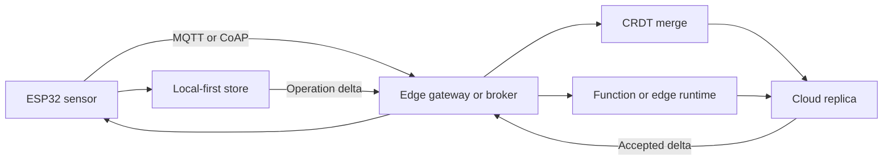

## What it is
Serverless is a compute model where the provider runs, scales, and bills code or containers by execution, while the customer does not manage servers. The physical servers still exist. Usage-based handlers usually have no continuously billed compute while idle, but the total bill can still include provisioned concurrency, minimum durations, storage, observability, networking, or an always-connected gateway, so serverless does not guarantee a zero total idle cost.

## How it works
Two dominant forms are **functions**, such as AWS Lambda, and **serverless containers**, such as Amazon ECS on Fargate. A function is a short-lived handler invoked by an event such as an HTTP request, queue message, object-upload notification, or schedule. The provider keeps a runtime and its dependencies in a warm execution environment; when one is unavailable, it initializes an environment before running the handler. Fargate accepts a container image and runs it on provider-managed compute without requiring you to operate nodes, billing for the vCPU and memory time used by running tasks. Edge functions such as Cloudflare Workers run JavaScript or WebAssembly in isolates near users, which reduces network distance for request handling but imposes runtime, API, and execution-time limits different from Lambda.

```yaml
Resources:
  UploadQueue:
    Type: AWS::SQS::Queue

  ProcessLogGroup:
    Type: AWS::Logs::LogGroup
    Properties:
      LogGroupName: /aws/lambda/process-upload

  ProcessRole:
    Type: AWS::IAM::Role
    Properties:
      AssumeRolePolicyDocument:
        Version: "2012-10-17"
        Statement:
          - Effect: Allow
            Principal:
              Service: lambda.amazonaws.com
            Action: sts:AssumeRole
      Policies:
        - PolicyName: process
          PolicyDocument:
            Version: "2012-10-17"
            Statement:
              - Effect: Allow
                Action: logs:CreateLogStream
                Resource: !GetAtt ProcessLogGroup.Arn
              - Effect: Allow
                Action: logs:PutLogEvents
                Resource: !GetAtt ProcessLogGroup.Arn
              - Effect: Allow
                Action:
                  - sqs:ReceiveMessage
                  - sqs:DeleteMessage
                  - sqs:GetQueueAttributes
                Resource: !GetAtt UploadQueue.Arn

  ProcessUpload:
    Type: AWS::Lambda::Function
    Properties:
      FunctionName: process-upload
      Runtime: python3.12
      Handler: index.handler
      Role: !GetAtt ProcessRole.Arn
      MemorySize: 512
      Timeout: 15
      Code:
        ZipFile: |
          def handler(event, context):
              return {"statusCode": 200}

  TriggerOnUpload:
    Type: AWS::Lambda::EventSourceMapping
    Properties:
      FunctionName: !Ref ProcessUpload
      EventSourceArn: !GetAtt UploadQueue.Arn
      BatchSize: 10
```

The execution role restricts log writes to `ProcessLogGroup` and queue actions to `UploadQueue`.

**Cold starts** are the defining operational detail: when no warm execution environment exists, the provider initializes the runtime and loads dependencies before the handler runs, adding latency. Larger runtimes and heavy imports generally increase that latency. Lambda concurrency is bounded by account and function limits, and each invocation runs in isolation. Scaling is automatic: the provider can create multiple execution environments for concurrent requests, up to the configured concurrency limit. A function that is never invoked normally incurs no execution charge, but a permanently connected MQTT, container-registry, or database client can keep an environment active. Provisioned concurrency, retained log storage, API Gateway, NAT, and egress are separate costs, and provider-specific minimum billing intervals can matter for very short requests.

Edge and IoT systems extend the same event-driven model across a much less reliable network. A microcontroller such as an **ESP32** or an ARM Cortex-M device can run a constrained application, sample sensors, and maintain local state, but it usually lacks the power, memory, and continuous network path of a server. **MQTT** is a brokered publish/subscribe protocol for higher-bandwidth links; devices publish retained messages to a topic, and consumers receive them asynchronously. **CoAP** uses compact request/response messages over UDP for constrained links and commonly depends on DTLS; it suits direct device endpoints more than broker fan-out.

A local-first design keeps the device usable while disconnected. Mutations can update local durable storage immediately and enqueue an operation log for synchronization. For independently added and removed data, a **conflict-free replicated data type (CRDT)** such as a grow-only set or last-writer-wins register can merge concurrent replicas without a coordinator, provided the application obeys the CRDT's merge rules. Synchronization sends compact deltas between peers or through a broker; server reconciliation is a repair mechanism, not a prerequisite for local operation. CRDTs do not by themselves preserve every business invariant, so deletes, counters, authorization, and schema changes need explicit semantics.



This path is resilient to intermittent links, but retained MQTT messages, broker storage, cellular or radio usage, device flash wear, clock assumptions, and CRDT metadata still require explicit limits and retention policies.

## Tradeoffs
- **Usage-based idle compute vs. unpredictable latency**: a dormant on-demand handler has no execution charge, but provisioned capacity and supporting services can still cost money, while cold starts add tail latency for sporadic or JVM-heavy functions.
- **Automatic scaling vs. control**: concurrency scales with load with no capacity planning, but you lose control over placement, instance type, and warm capacity (mitigated by provisioned concurrency, at a cost).
- **Simplicity vs. limits**: no servers to patch or size, but you hit fixed caps — timeout (15 min), payload size, `/tmp` disk, environment size, and per-account concurrency.
- **Event-driven fit vs. statefulness**: stateless, event-triggered functions compose cleanly, but stateful or long-lived connections (databases, websockets, streaming) need external state stores and careful design.
- **Vendor coupling**: deep integration with provider services speeds development but makes portability harder than container-based approaches.

## When to use
- Event-driven glue: reacting to uploads, queue messages, schedules, and API calls with small, stateless handlers.
- Spiky or sporadic traffic where paying per-invocation beats idle VM/container costs.
- Background jobs, cron tasks, and short data-processing pipelines that fit within the timeout and payload limits.

## Alternatives
- **Containers on Kubernetes/ECS**: more control and portability for long-running services or open connections, but you own capacity and scaling, and each service still has task-duration and platform limits.
- **VMs/EC2**: cheapest for steady, high-throughput, long-lived workloads, but slow to scale and you manage the OS.
- **Fargate vs. Lambda**: Fargate runs a container without code rewrites and supports longer-running tasks, but bills for task vCPU and memory time and can be less economical for steady utilization.

## Related
- [Compute](01-compute.md)
- [Cloud Networking](03-cloud-networking.md)
- [Observability Platforms & Low-Level Profiling](../02-containers-cicd/05-observability.md)
- [Chapter 11: References](06-references.md)
