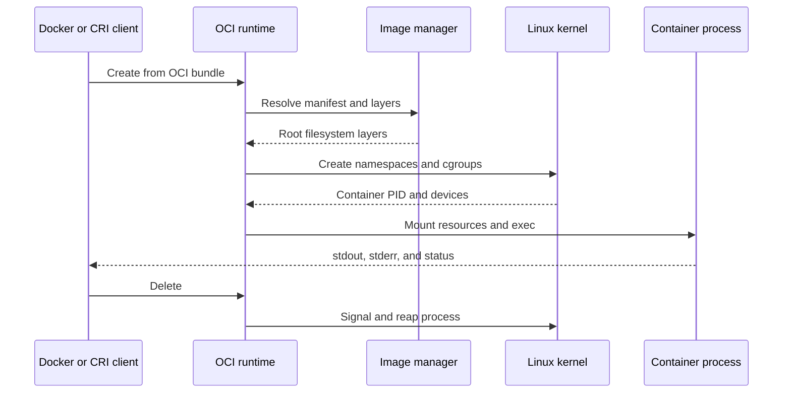

## What it is
A container is an isolated Linux process packaged with the user-space files it needs to run. Docker supplies the familiar build and management tools, while the Open Container Initiative (OCI) defines portable image and runtime formats; unlike a virtual machine, a container shares the host kernel and relies on Linux namespaces, cgroups, and security mechanisms to separate workloads.

## How it works
A container image is an ordered set of filesystem layers plus metadata. Docker and tools such as BuildKit build layers from a `Dockerfile`, store each layer by digest, and publish an OCI image manifest. Sharing matching layer digests lets hosts reuse data without copying identical content into every image.

A runtime such as `runc` or `crun` consumes an already-prepared OCI runtime bundle. It applies mounts and resource settings, creates a Linux **namespace** for each isolated system view, and starts the configured process. Image-layer extraction and root-filesystem preparation are normally handled by the image manager, such as `containerd` and its shims; CRI-O provides a Kubernetes Container Runtime Interface (CRI) endpoint for an OCI runtime.



```dockerfile
FROM debian:bookworm-slim
WORKDIR /app
COPY build/server /app/server
USER 10001:10001
EXPOSE 8080
ENTRYPOINT ["/app/server"]
```

```json
{
  "ociVersion": "1.2.0",
  "hostname": "app-1",
  "process": {
    "terminal": false,
    "user": { "uid": 10001, "gid": 10001 },
    "args": ["/app/server"],
    "cwd": "/app",
    "env": ["PORT=8080"]
  },
  "root": { "path": "rootfs", "readonly": true },
  "linux": {
    "namespaces": [
      { "type": "pid" },
      { "type": "mount" },
      { "type": "network" },
      { "type": "uts" },
      { "type": "ipc" },
      { "type": "user" }
    ],
    "resources": {
      "memory": { "limit": 536870912 },
      "cpu": { "quota": 100000, "period": 100000 }
    }
  }
}
```

Namespaces divide operating-system resources without creating another kernel:

| Namespace | Isolated view |
| --- | --- |
| PID | Process IDs and process signals |
| Mount | Mount points and filesystem propagation |
| Network | Network interfaces, routes, and ports |
| UTS | Hostname and domain name |
| IPC | System V IPC and POSIX message queues |
| User | User and group ID mappings |
| Cgroup | Cgroup hierarchy visible to the process |

The writable container filesystem is typically an overlay mount: reads combine lower image layers, while a write goes to the container's upper layer. **cgroups** then account for and limit kernel resources, but Linux exposes two different control interfaces:

| Control interface | Organization | Representative controls |
| --- | --- | --- |
| cgroups v1 | Each controller has a separate hierarchy; the effective hierarchy for a process combines mounts | `cpu.cfs_quota_us` and `cpu.cfs_period_us`, `memory.limit_in_bytes`, and per-device `blkio` files |
| cgroups v2 | One unified hierarchy; controllers are delegated to child cgroups through `cgroup.subtree_control` | `cpu.max`, `memory.max`, `io.max`, and `pids.max` |

A cgroups v1 host gives each container paths in the CPU, memory, and I/O hierarchies, and the runtime must keep those paths consistent with one container identity. A v2 host places the container in the unified hierarchy and enables only the controllers needed by its parent. A host normally uses one interface rather than requiring runtimes to manage both. OCI resource fields describe the portable intent; `runc`, `crun`, and the container manager translate them into the host's cgroup version. Controllers and support vary by kernel, so a manifest can run but receive a different enforceable resource boundary on an older host.

A secure configuration also drops unnecessary Linux capabilities and can apply seccomp, AppArmor or SELinux, and a read-only root filesystem. Namespaces organize resource isolation; they do not replace these additional security controls.

## Tradeoffs
- **Kernel sharing** — containers start without booting a guest kernel, but a compromised host kernel can affect every container on that host.
- **Filesystem efficiency** — image layers are shared and writes use copy-on-write, but writable layers consume node storage and require explicit persistence when containers are replaced.
- **Resource controls** — cgroups bound measurable CPU, memory, and I/O usage, but host-level contention and poorly chosen limits can still cause latency or throttling.
- **Configuration security** — capability dropping and mandatory access control reduce the process attack surface, but profiles and policies must be maintained with kernel and runtime changes.
- **Portability** — OCI formats standardize packaging, but native binaries and host-kernel interfaces can still require architecture-specific or platform-specific images.

## When to use
- You need to package a Linux service and its runtime dependencies into one immutable, portable artifact.
- You need many workloads on a shared Linux host without allocating a full guest OS to each one.
- You need repeatable builds, digest-addressed artifacts, and fast instance replacement.
- You can operate and patch the host kernel and enforce a container security policy.

## Alternatives
- **Virtual machines** — a hypervisor and guest kernel provide a stronger isolation boundary, at the cost of more disk use, memory, and startup time.
- **Firecracker microVMs** — lightweight virtual machines retain a guest kernel while supporting fast workloads, but require a specialized virtual machine monitor and more setup than ordinary containers.
- **Linux jails or zones** — FreeBSD jails and Solaris Zones provide operating-system-level isolation, but their APIs and packaging are not OCI-compatible.
- **WebAssembly components** — a runtime and capability model can isolate untrusted code, but they constrain access to operating-system interfaces and are not general container-image replacements.

## Related
- [Container Orchestration: Kubernetes Architecture (Control Plane, Worker Nodes, Pods, Services, Ingress)](02-kubernetes.md)
- [Cloud Compute Mechanics: Virtual Machines, Bare-Metal, Containers, and Hypervisors](../01-cloud-primitives/01-compute.md)
- [Processes & Threads](../03-operating-systems-kernel-mechanics/01-processes-threads.md)
- [Chapter 12: References](06-references.md)
