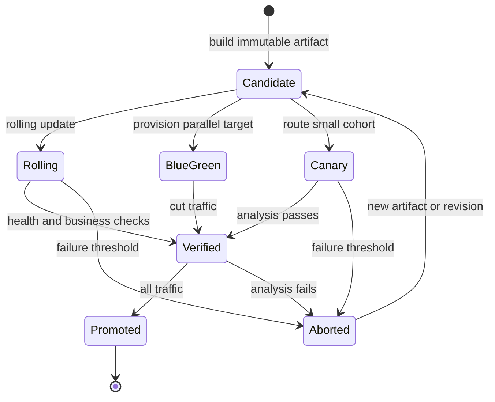

## What it is
A deployment strategy defines how production traffic and capacity move from one application version to another. Rolling updates, blue-green releases, canary releases, and shadow deployments differ in how much capacity they run at once, which users receive the new version, and how quickly an operator can reverse a release.

## How it works
A **rolling update** gradually adds new instances and removes old instances while the service remains available. Kubernetes Deployments perform this replacement through their ReplicaSets. It requires temporary capacity for mixed versions and compatible behavior during the transition.

A **blue-green release** runs stable and candidate versions at the same time, then changes the routing target after the candidate passes its release checks. Rollback restores the previous routing target, although the old environment must remain available. With Kubernetes, separate deployments can use different version labels and a Service selector can be changed to switch the active set.

A **canary release** sends a controlled fraction of requests to a candidate and increases that fraction as its health and business metrics remain acceptable. A service mesh or gateway can perform weighted routing without requiring the application to understand release traffic. **Shadow deployment** also sends a copy of live requests to a candidate, but it does not return the candidate's response to the user. A shadowed request can still cause side effects, so the candidate must isolate writes or use test data.

The following manifest implements one 90/10 canary release: both Deployments back the same Service, the DestinationRule names their version subsets, and the single VirtualService selects both subsets for the host.

```yaml
apiVersion: apps/v1
kind: Deployment
metadata:
  name: web-stable
  namespace: production
spec:
  replicas: 4
  strategy:
    type: RollingUpdate
    rollingUpdate:
      maxSurge: 1
      maxUnavailable: 0
  selector:
    matchLabels:
      app: web
      version: stable
  template:
    metadata:
      labels:
        app: web
        version: stable
    spec:
      containers:
        - name: web
          image: ghcr.io/example/web:1.4.0
---
apiVersion: v1
kind: Service
metadata:
  name: web
  namespace: production
spec:
  selector:
    app: web
  ports:
    - port: 80
      targetPort: 8080
---
apiVersion: apps/v1
kind: Deployment
metadata:
  name: web-canary
  namespace: production
spec:
  replicas: 1
  selector:
    matchLabels:
      app: web
      version: canary
  template:
    metadata:
      labels:
        app: web
        version: canary
    spec:
      containers:
        - name: web
          image: ghcr.io/example/web:1.5.0
---
apiVersion: networking.istio.io/v1beta1
kind: DestinationRule
metadata:
  name: web
  namespace: production
spec:
  host: web.production.svc.cluster.local
  subsets:
    - name: stable
      labels:
        version: stable
    - name: canary
      labels:
        version: canary
---
apiVersion: networking.istio.io/v1beta1
kind: VirtualService
metadata:
  name: web-canary
  namespace: production
spec:
  hosts:
    - web.production.svc.cluster.local
  http:
    - route:
        - destination:
            host: web.production.svc.cluster.local
            subset: stable
          weight: 90
        - destination:
            host: web.production.svc.cluster.local
            subset: canary
          weight: 10
```

A blue-green cutover would use one routing rule that selects either `version: blue` or `version: green`; it would not also use the weighted canary rule. A shadow deployment would mirror traffic to the candidate while keeping stable as the only response destination, and it would replace rather than combine with the weighted rule. Tools such as Argo Rollouts or Flagger can automate canary analysis, traffic weighting, and promotion from deployment controller configuration.

Feature flags provide a related but separate control. They keep deployment separate from the decision to expose behavior, so an operator can enable a feature for selected users without moving container traffic.



## Tradeoffs
- **Rolling update** — reuses existing rollout machinery and limits temporary capacity, but mixes versions and makes a broad rollback slower.
- **Blue-green** — changes the active version atomically and restores the prior route quickly, but keeps two complete environments ready and validates the candidate before a single cutover.
- **Canary** — limits the initial user impact and produces production evidence, but depends on weighted routing, representative traffic, and reliable release metrics.
- **Shadow** — exercises the candidate on live request shapes without returning its response, but duplicates traffic and can repeat side effects unless the environment is isolated.
- **Recreate** — avoids temporary version coexistence, but stops the old version before the new one starts and therefore introduces downtime.
- **Feature flags** — decouples deployment from exposure and supports gradual adoption, but temporary flags and their targeting rules require ownership and cleanup.

## When to use
- You need an uncomplicated default rollout for a stateless service that can run both versions briefly.
- You need an atomic route switch and retained rollback target for a release that passes validation before receiving production responses.
- You need a small production cohort to expose a release to real load before broad promotion.
- You need to test a candidate against representative requests without using its response or production writes.
- You need to release selected behavior over time independently from infrastructure rollout.

## Alternatives
- **Recreate deployment** — a brief maintenance window is acceptable and the service has no meaningful uptime requirement.
- **A/B testing** — you need a persistent experiment with control and treatment cohorts, not a temporary infrastructure rollout.
- **Feature flags** — you need application-level targeting or entitlement logic, but you do not need to compare two complete runtime versions.
- **In-place host updates** — the platform is VM-based and a host or virtual machine swap is simpler than maintaining parallel application environments.

## Related
- [Container Orchestration: Kubernetes Architecture (Control Plane, Worker Nodes, Pods, Services, Ingress)](02-kubernetes.md)
- [CI/CD Workflows, Automated Testing Pipelines, and GitOps Engines (ArgoCD, Flux)](04-cicd-gitops.md)
- [Observability Platforms & Low-Level Profiling](05-observability.md)
- [Chapter 12: References](06-references.md)
