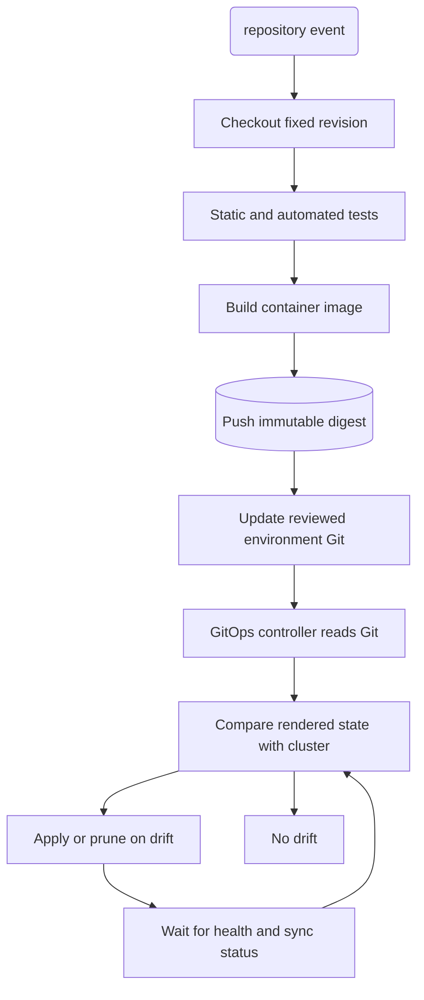

## What it is
CI/CD workflows automate the path from a source change to a running application: continuous integration (CI) builds and validates each change, while continuous delivery or deployment (CD) promotes the resulting artifact to an environment. GitOps extends declarative delivery by placing desired environment state in Git and using a reconciliation engine such as Argo CD or Flux to detect and correct drift.

## How it works
A CI workflow runs when a repository event occurs. It checks out a fixed source revision, restores dependencies, and runs automated checks at increasing scope: formatting and static analysis, unit tests, integration or contract tests, security scans, and an end-to-end suite. A passing build produces an immutable container image identified by content digest rather than a mutable tag alone. The pipeline pushes the artifact to a registry that CD can promote unchanged and signs its digest with Cosign.

```yaml
name: ci
on:
  pull_request:
  push:
    branches: [main]
permissions:
  contents: read
  packages: write
  id-token: write
jobs:
  verify:
    runs-on: ubuntu-latest
    steps:
      - uses: actions/checkout@v4
      - uses: docker/login-action@v3
        with:
          registry: ghcr.io
          username: ${{ github.actor }}
          password: ${{ secrets.GITHUB_TOKEN }}
      - uses: sigstore/cosign-installer@v3
      - uses: actions/setup-java@v4
        with:
          distribution: temurin
          java-version: "21"
      - run: ./gradlew test integrationTest
      - run: ./gradlew build
      - uses: docker/build-push-action@v6
        id: image
        with:
          push: ${{ github.event_name == 'push' }}
          tags: ghcr.io/example/web:${{ github.sha }}
      - if: github.event_name == 'push'
        run: cosign sign --yes ghcr.io/example/web@${{ steps.image.outputs.digest }}
```

CD then selects the tested image digest for a target environment. Deployment can be a push-based pipeline or a GitOps engine. Push-based delivery runs commands such as `kubectl apply` or `helm upgrade`, so its credentials can perform cluster writes. Pull-based GitOps gives an in-cluster controller read access to Git; the controller renders manifests, compares them with live resources, and applies missing changes. Argo CD represents this relationship with an `Application`, while Flux uses `GitRepository`, `Kustomization`, and related custom resources.

```yaml
apiVersion: argoproj.io/v1alpha1
kind: Application
metadata:
  name: web
  namespace: argocd
spec:
  project: default
  source:
    repoURL: https://github.com/example/platform.git
    path: environments/production/apps/web
    targetRevision: main
  destination:
    server: https://kubernetes.default.svc
    namespace: production
  syncPolicy:
    automated:
      prune: true
      selfHeal: true
    syncOptions:
      - CreateNamespace=true
      - PruneLast=true
---
apiVersion: kustomize.toolkit.fluxcd.io/v1
kind: Kustomization
metadata:
  name: web
  namespace: flux-system
spec:
  interval: 1m
  path: ./environments/production/apps/web
  prune: true
  selfHeal: true
  sourceRef:
    kind: GitRepository
    name: platform
  wait: true
```

Argo CD and Flux render the selected Git revision and compare the resulting desired manifests with live state, so their sync status can expose conflict and drift. Their configuration resources are separate controller artifacts, not interchangeable manifests. An Argo CD `Application` is interpreted by Argo CD; a Flux `Kustomization` is interpreted by Flux controllers together with a Flux `GitRepository`, `OCIRepository`, or Helm source. Do not apply both to the same Kubernetes resources, because two reconcilers can report the drift each other creates. Choose one engine as the owner of application delivery and keep the immutable image digest as the shared artifact promoted across environments. Flux image automation can update a Git reference when a new digest is observed, while Argo CD's GitOps reconciliation does not itself move an application to a new image; image promotion still requires a policy-controlled update to the declared revision or digest.



Git history provides audit context; it is not a second reconciliation input. A reviewed commit to a `main` environment repository can therefore both change a deployment and later revert that change. Secret values should not enter those commits; External Secrets, SOPS, or a cloud secret manager can deliver references or encrypted values separately.

## Tradeoffs
- **Immutable artifacts** — a content digest makes promotion and rollback unambiguous, but the pipeline and every environment must preserve and select the same digest.
- **Pull-based GitOps** — the cluster retrieves desired state and can self-heal drift without exposing broad write credentials to CI, but repository access and the in-cluster controller become critical control points.
- **Push-based CD** — a pipeline can call many deployment APIs directly, but its credentials are exposed to the job runner and the pipeline does not continuously correct later drift.
- **Automated synchronization** — convergence removes manual cluster edits, but an incorrect merge can propagate rapidly unless approvals, policy checks, and environment separation are in place.
- **Test depth** — broader tests catch more regressions before release, but they consume compute and can delay feedback when poorly isolated or ordered.
- **Operational model** — a declarative repository records intent and history, but teams also need identity management, secrets, policy, recovery, and rules for who may change production.

## When to use
- You need every proposed change to pass repeatable automated checks before a release artifact is published.
- You need the same tested image digest promoted through several environments without rebuilding it.
- You need reviewable environment state and a straightforward `git revert` for a failed production change.
- You need a controller to detect and correct unauthorized or accidental cluster drift.
- You can protect production repositories and separately manage secret delivery.

## Alternatives
- **Jenkins or another imperative CD server** — a direct push pipeline fits established build estates and custom steps, but it requires its own credential hardening and separate drift management.
- **Argo Rollouts or Flagger** — a progressive delivery controller is a focused choice when canary analysis and traffic promotion are the main problem, rather than full GitOps reconciliation.
- **Terraform or OpenTofu** — infrastructure as code is appropriate for cloud and cluster resources, but application rollout analysis and continuous runtime reconciliation usually require other controllers.
- **Manual deployment procedures** — a small stable service can use a short runbook, at the cost of inconsistent execution, limited auditability, and slower recovery.

## Related
- [Container Orchestration: Kubernetes Architecture (Control Plane, Worker Nodes, Pods, Services, Ingress)](02-kubernetes.md)
- [Deployment Strategies: Blue-Green, Canary Releases, Rolling Updates, and Shadow Deployments](03-deployment-strategies.md)
- [Infrastructure as Code (IaC): Declarative Provisioning with Terraform and OpenTofu](../01-cloud-primitives/05-infrastructure-as-code.md)
- [Chapter 12: References](06-references.md)
